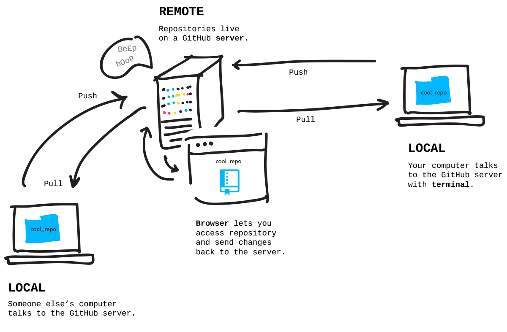
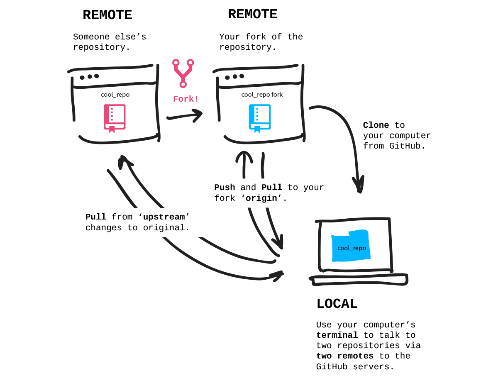
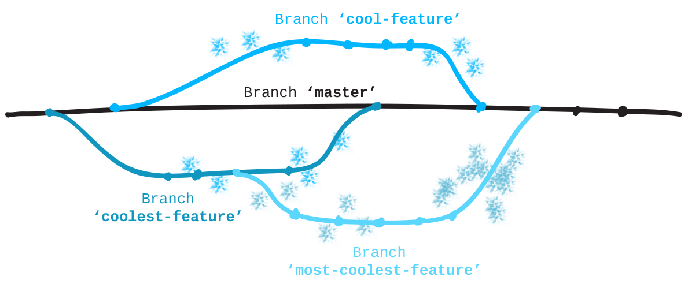

<head><link href="git.css" rel="stylesheet" type="text/css"></head>


`$git config --list`<br>
Could also add and modify configurations
```bash
user.name=Lucas
user.email=cekanlucas@example.com
color.status=auto
color.branch=auto
core.repositoryformatversion=0
core.filemode=true
core.bare=false
core.logallrefupdates=true
```
`$git init` -add or reinitialise repository

`$git clone [url]` -clone a repository for your own use 


# GIT fundamentals
git thinks of versioning as a series of snapshots each snapshots being a series of files at a certain point the act of saving a snapshot is referened to as a **commit**. 

## Remote Repository 



> `$ git remote add origin <URLFROMGITHUB>`

origin -- default name of remote repo 

URLFROMGITHUB -- copy http address from github.com

> `$ git push origin master`

``` Bash
# Add remote connections
    $ git remote add <REMOTENAME> <URL>
# Set a URL to a remote
    $ git remote set-url <REMOTENAME> <URL>
# Pull in changes
    $ git pull <REMOTENAME> <BRANCHNAME>
# View remote connections
    $ git remote -v
# Push changes
    $ git push <REMOTENAME> <BRANCH>
```
`$ git clone <URLFROMGITHUB>`


Show remote connections 

Note: Git gives origin the default name from repo you cloned 

Note: Use -v tag to see urls associated with remotes 
> $ git remote 

we can name the the remote connection anything but mostly people name it upstream


> $ git remote add upstream https://github.com/jlord/patchwork.git



```bash
# to see branch currently working on 
git status

# creating and naming branch 
git branch <branchName>

# similiar to cd need to checkout to change branch
git checkout <branchName>

# Rename a branch you're currently on:
git branch -m <NEWBRANCHNAME>

# List Branches 
git branch
```

### GitHub Pages
GitHub will automatically serve and host static website files in branches named **gh-pages**. Since the project you forked creates a website, its main branch is **gh-pages** instead of **master**. 

All sites like this can be found using this pattern for the URL:

http://githubusername.github.io/repositoryname

### Pull Requests 
When you make changes and improvements to a project you've forked, often you'll want to send those changes to the maintainer of the original and **request** that they **pull** the changes into the original so that everyone can benefit from the updates - that's a **pull request**.


### Merge 

``` bash
# First, move into the branch you want to merge into — in this case, branch 'gh-pages'.
$git checkout gh-pages
    Switched to branch 'gh-pages'
    Your branch is up-to-date with 'origin/gh-pages'.
# Now tell Git what branch you want to merge in — in this case, your feature branch that begins with "add-".
$git merge add-Dubi911
    Updating 8e794be..a01953d
    Fast-forward
    contributors/add-Dubi911.txt | 1 +
    1 file changed, 1 insertion(+)
    create mode 100644 contributors/add-Dubi911.txt
# Tidy up by deleting your feature branch now that it has been merged.
$git branch -d add-Dubi911
    Deleted branch add-Dubi911 (was a01953d).
# You can also delete the branch from your fork on GitHub:
$git push origin --delete add-Dubi911
    Username for 'https://github.com': Dubi911
    Password for 'https://Dubi911@github.com': 
    To https://github.com/Dubi911/patchwork.git
    - [deleted]         add-Dubi911
```


# Commits

`$git log` -when you make a commit git makes a commit object

Remember to write a git commit message especially for simple commits 

`$git commit -m "Yay First Commit"`

### For git files can be in two states
* **untracked**: Git doesnt know about the files existance and cent be included in a commit 

* **tracked**: git will thake this file into account when doing commit calculations

    * `modified` or `dirty`:
        
        * files has changed but git still hasn't calculated the file system 
    * `staged`

        * differces are calculated and new stucture of project can be saved 

    * `commited`

        * new version is saftely stored in repository 

    * use `$git add` command add modified file to staging area then use `$git commit` to add those file to the git repository 
# Branches

The killer feature of git 

Technically a branch is simply a pointer to a commit object

`$git branch` -to list all branches 

`$git branch my-branch` -to create new branch 

`$git branch -d my-branch` -to delete branch (use `-D` for force delete)

`$git branch -m new-my-branch` -to rename current branch 

**to change branch we can use `$git checkout my-branch`**

# Local Repository 
**Git** project made up of 3 main areas 
    
- **Working Tree**
    -
    - Place where all files exist always a single checkout of one project's version
- **Staging Area (also known as index)**
    -
    - place where you can decode what local changes are included in the commit
- **.git Directory**
    -
    - is the primary datastore where **Git** maintains the history of the project (all commit objects, tags, etc)

# Fetching a remote branch

If you are working on a remote branch and someone else updates remote branch you may need to sync up the update

thus you run `git fetch <remote>` which updates your local repository with any changes to remote. 

```bash
# to synchronise with origin which is the remote
$ git fetch origin
# to fetch all remotes
$ git fetch --all
```
**Note: Changes not automatically applied to local branch use `git merge` for that.** 

```bash
$ git branch 
    > experimental 
    > * master # * indicates branch checked-out 
    > NoDistractions 
# use -v to to see last commit on each branch
```
You can use `--merged` & `--no-merged` to list braches that fit those categories. 

`git pull` is actually the combines use of `git fetch` & `git merge`

**Example**
> git pull origin 

Note: use -a (append) to apend the origin's head to the new branch from **.git/FETCH_HEAD** file

## Rebasing 

`git rebase` is used to combine branches


# extra features

## git diff
Use `git diff` to see differences between the working tree compared to the **HEAD** (last commit on branch)

Use `git cherry-pick` to apply a commit of your choosing to a branch 

```bash
# you want to apply commit to master
$ git checkout master 
# specify commit id after command
git cherry-pick 512341jf
```

## git ignore 
**.gitignore** file list files and folders not under version control 

```bash
#inside .gitignore list files
/path/to/ignored/file.txt
#could use wildcards like * 
*.java 
#above ignore all files with .java extension
#folder and entire directories 
/dir/to/ignore/*
```
If file is already tracked you need to manually untrack it 
> git rm --cached myFile.java

## reflog
to get a record for a few months `git reflog`

## Squashing commits 
Say you want to combine 3 commits 
``` git 
git reset HEAD-3
git add .
git commit -am "Fix bug#14"
git push --force
```

the `--force` option is needed if you have already pushed