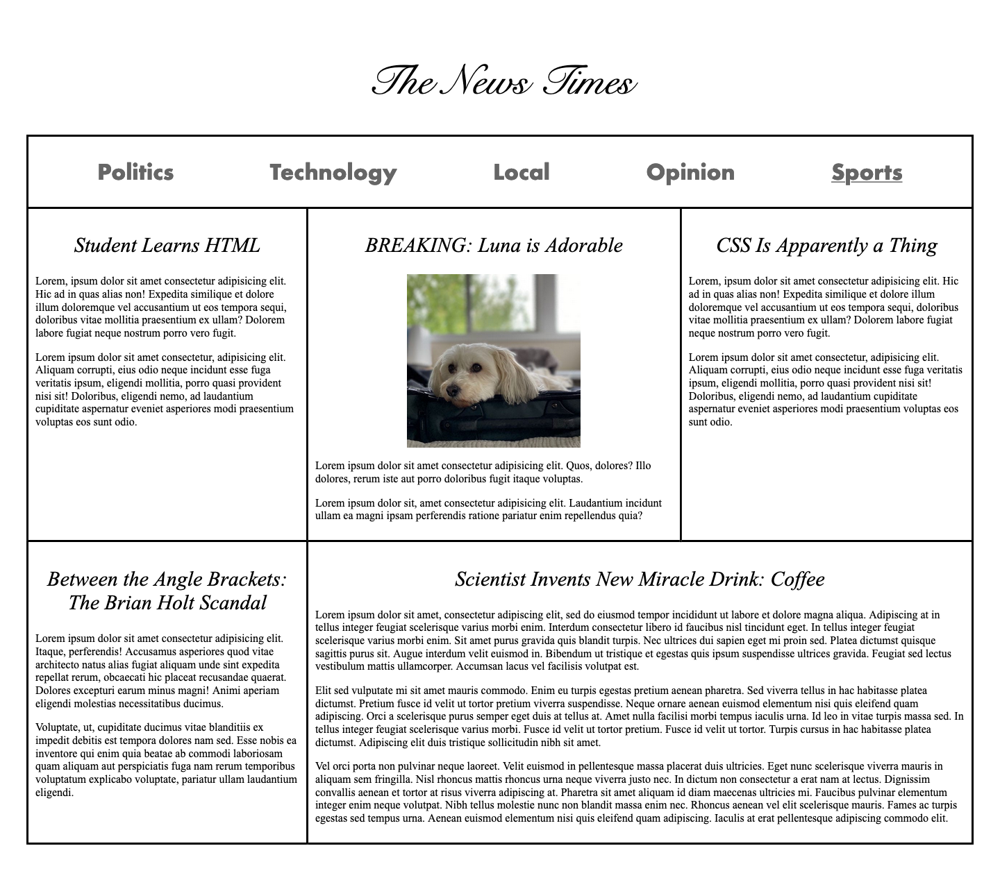
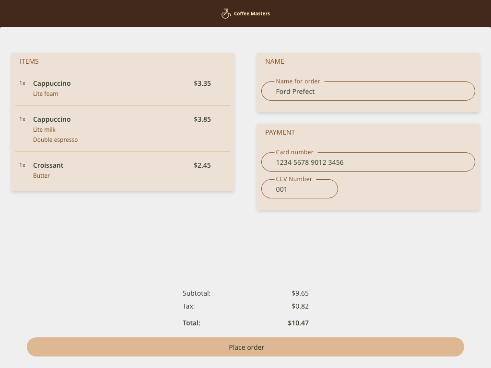

# Complete Intro to Web Dev V3 
#### by Brain Holt

 

[ Course Website ](https://btholt.github.io/complete-intro-to-web-dev-v3/)

[ Frontend Handbook ](https://frontendmasters.com/guides/front-end-handbook/2019/)

## Chapter Checklist

- [x] HTML 
- [x] CSS
  - [x] Project - make this design

- [x] Project - make this design

- [ ] Javascript
- [ ] Putting together
- [ ] Talking to Server
- [ ] Other
- [ ] Wrap Up

