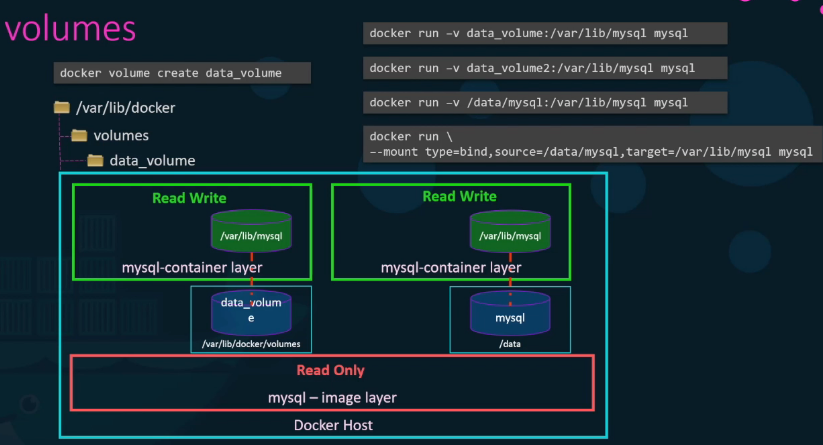

<head>
 
  <link 
    href="https://fonts.googleapis.com/css?family=Fira+Mono:500&display=swap" 
    rel="stylesheet">
    <script src="https://code.jquery.com/jquery-3.5.1.min.js" integrity="sha256-9/aliU8dGd2tb6OSsuzixeV4y/faTqgFtohetphbbj0=" crossorigin="anonymous"></script>
<style> 
#stack-container {
    position: fixed;
    height: 5em;
    display: flex;
    flex-direction: column-reverse;
    bottom:5vh;
    right: 5vw;
    width: 20vw
}
</style>
</head>    

<div id="stack-container">

<a href="https://make.wordpress.org/"></a>
</div>

# Docker

## Define a container with Dockerfile

`Dockerfiles` describe how to assemble a private filesystem for a container, and can also contain some metadata describing how to run a container based on this image.

``` dockerfile
==
# what we want to build the image from here we use node 12 LTS (long term support)
FROM node:12 
# create the working directory from within the image
WORKDIR /usr/src/app
# remember docker images come with npm and node already installed
# A wildcard is used to ensure both package.json AND package-lock.json are copied
# We copy just the package json files to take advantage of cached Docker layer
COPY package*.json ./ 
RUN npm install
# If you are building your code for production
# RUN npm ci --only=production
# Bundle app source : from source (.) to destination (.)
COPY . . 
# app binds to port 8080 so you'll have it mapped by the docker daemon
EXPOSE 8080
# define the command to run your app using CMD which defines your runtime
# here we use 'node server.js' to start server
CMD ["node", "server.js"]
```
## Build and test image

at the end it if build process is successful it should say

    Successfully tagged bulletinboard:1.0

You can see application at <u>localhost:8000</u>. You should see your bulletin board application up and running. At this step, you would normally do everything you could to ensure your container works the way you expected; now would be the time to run unit tests, for example.

Once you’re satisfied that your bulletin board container works correctly, you can delete it:

    docker rm --force bb
If you run a container in the background you can access the terminal with 

    docker logs <container name>
    Usage:  docker logs [OPTIONS] CONTAINER

    Fetch the logs of a container

    Options:
        --details        Show extra details provided to logs
    -f, --follow         Follow log output
        --since string   Show logs since timestamp (e.g. 2013-01-02T13:23:37Z) or relative (e.g. 42m for 42 minutes)
    -n, --tail string    Number of lines to show from the end of the logs (default "all")
    -t, --timestamps     Show timestamps
        --until string   Show logs before a timestamp (e.g. 2013-01-02T13:23:37Z) or relative (e.g. 42m for 42 minutes)
The `--force` option stops a running container, so it can be removed. If you stop the container running with docker stop `bb` first, then you do not need to use `--force` to remove it.

```bash
# -- PRINT OUTPUT OF APP --

# Get container ID
$ docker ps

# Print app output
$ docker logs <container id>

# Example
Running on http://localhost:8080
 
# Enter the container
$ docker exec -it <container id> /bin/bash
```
## Extra
``` bash
docker ps 

docker ps -a # to find id of even stopped containers 

docker stop <id>
docker start <id>
```
## Debugging Docker

``` docker 
# docker log
```

## Docker Network 
Allow containers to interact with each other 

TOODO: learn more about `Docker Network`

## Layered Architecture


## Pushing Images to DockerHub

    docker login --username=yourhubusername

then enter password 

## Docker Architecture

<b class="Cyan">Docker uses a client-server architecture</b> 
Docker *client* talks to the Docker *daemon* which does the heavy lifting of building, running and distributing the docker containers 

<span class="RoyalBlue">The Docker client and daemon can run on the same system, or you can connect a Docker client to a remote Docker daemon. The Docker client and daemon communicate using a REST API, over UNIX sockets or a network interface. Another Docker client is <b class="GoldenRod">Docker Compose</b>, that lets you work with applications consisting of a set of containers.</span>


<big class="SteelBlue">create and run a container based on image</big>

        docker run -it cekanlucas/ellerca
- if you dont have image locally Docker will pull from a configured registry as if you had run`docker pull cekan/lucas` manually
- docker creates a new container as if you ran  `docker container create` manually
- Docker allocates a read-write filesystem to the container, as its final layer. This allows a running container to create or modify files and directories in its local filesystem
- Docker creates a network interface to connect the container to the default network, since you did not specify any networking options. This includes assigning an IP address to the container. By default, containers can connect to external networks using the host machine’s network connection

## `Docker Container --help`

Manage containers

Commands: | Description
-- | -
  `attach`      | Attach local standard input, output, and error streams to a running container
  `commit`      | Create a new image from a container's changes
  `cp`          | Copy files/folders between a container and the local filesystem
  `create`      | Create a new container
  `diff`        | Inspect changes to files or directories on a container's filesystem
  `exec`        | Run a command in a running container
  `export`      | Export a container's filesystem as a tar archive
  `inspect`     | Display detailed information on one or more containers
  `kill`        | Kill one or more running containers
  `logs`        | Fetch the logs of a container
  `ls`          | List containers
  `pause`       | Pause all processes within one or more containers
  `port`        | List port mappings or a specific mapping for the container
  `prune`       | Remove all stopped containers
  `rename`      | Rename a container
  `restart`     | Restart one or more containers
  `rm`          | Remove one or more containers
  `run`         | Run a command in a new container
  `start`       | Start one or more stopped containers
  `stats`       | Display a live stream of container(s) resource usage statistics
  `stop`        | Stop one or more running containers
  `top`         | Display the running processes of a container
  `unpause`     | Unpause all processes within one or more containers
  `update`      | Update configuration of one or more containers
  `wait`        | Block until one or more containers stop, then print their exit codes

## `Docker image --help`

Manage images

Commands: | Description
-- | -
  `build`   | Build an image from a Dockerfile
  `history` | Show the history of an image
  `import`  | Import the contents from a tarball to create a filesystem image
  `inspect` | Display detailed information on one or more images
  `load`    | Load an image from a tar archive or STDIN
  `ls`      | List images
  `prune`   | Remove unused images
  `pull`    | Pull an image or a repository from a registry
  `push`    | Push an image or a repository to a registry
  `rm`      | Remove one or more images
  `save`    | Save one or more images to a tar archive (streamed to STDOUT by default)
  `tag`     | Create a tag TARGET_IMAGE that refers to SOURCE_IMAGE

## EntryPoint 
CMD 
- run command in container

ENTRYPOINT 
- append command

## Networking 

### Default Networks 

<big class="Salmon">Bridge</big> `docker run ubuntu`
<span class="Salmon">This is the private network that containers are part of from the docker host by default they all get a <b>internal ip</b> by which they can communicate with each other  </span>
<big class="Grey">None</big> `docker run ubuntu --network-none`
<big class="Bisque">Host</big> `docker run ubuntu --network-host`
<span class="Bisque">This is where container simply uses the host network you cant use multiple containers becuase the ports are now common mapped up to the hosts network</span>


Look at network setting with docker inspect


