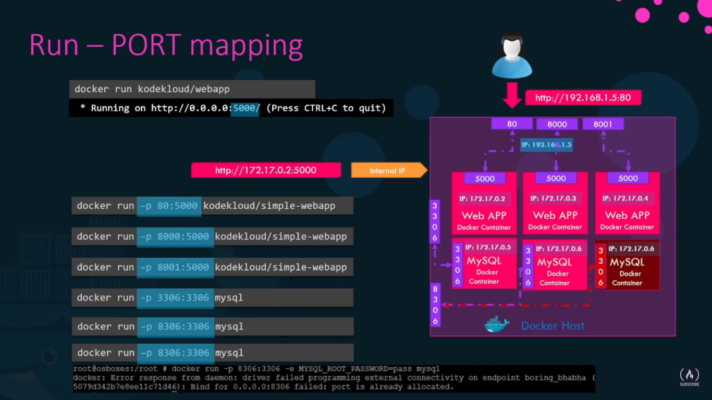
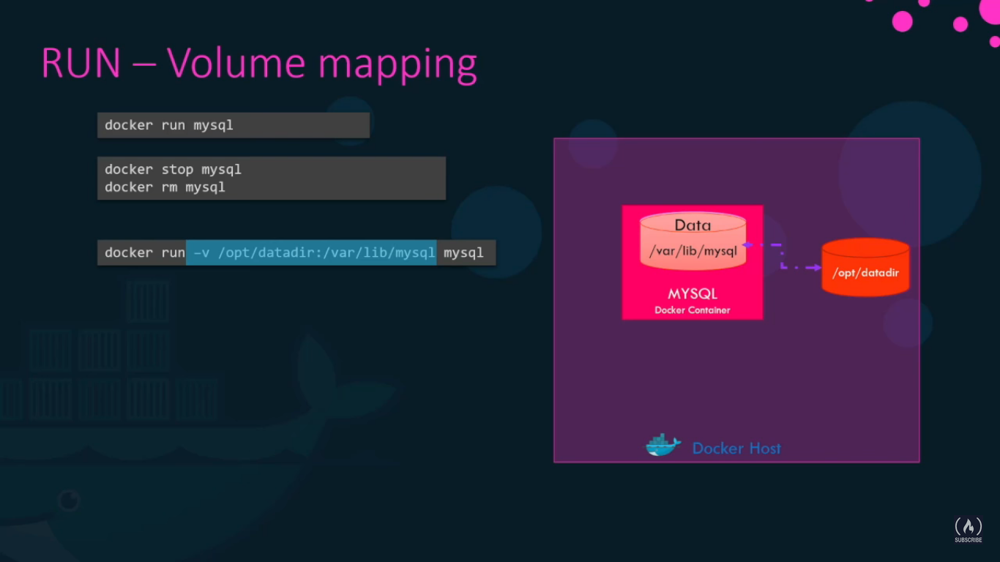
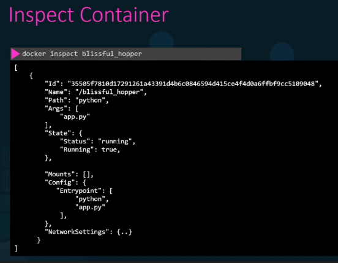
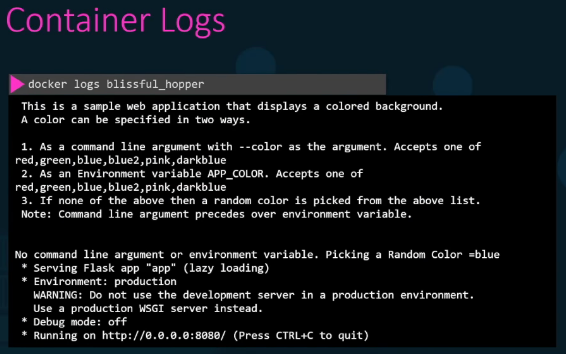

<head>
 
  <link 
    href="https://fonts.googleapis.com/css?family=Fira+Mono:500&display=swap" 
    rel="stylesheet">
    

</head>    

# `Docker run`

## Build and test image

at the end it if build process is successful it should say

    Successfully tagged bulletinboard:1.0

    Run the following command to start a container based on your new image:

<big class="SpringGreen">docker run --publish 8000:8080 --detach --name bb bulletinboard:1.0</big>

#### There are a couple of common flags here:
- `--publish -p` asks Docker to forward traffic incoming on the host’s port 8000 to the container’s port 8080. Containers have their own private set of ports, so if you want to reach one from the network, you have to forward traffic to it in this way. Otherwise, firewall rules will prevent all network traffic from reaching your container, as a default security posture
- `--detach -d` run this container in the background
- `--name` specifies a name with which you can refer to your container in subsequent commands, in this case `bb`
- `--tag -t` lets you tag to make it easier to find image

You can see application at <u>localhost:8000</u>. You should see your bulletin board application up and running. At this step, you would normally do everything you could to ensure your container works the way you expected; now would be the time to run unit tests, for example.

## `docker run --help`

Usage:  docker run [OPTIONS] IMAGE [COMMAND] [ARG...]

Run a command in a new container

Commands: | Description
-- | -
--add-host list | Add a custom host-to-IP mapping (host:ip)
-a, --attach list | Attach to STDIN, STDOUT or STDERR
--blkio-weight uint16 | Block IO (relative weight), between 10 and 1000, or 0 to disable (default 0)
--blkio-weight-device list | Block IO weight (relative device weight) (default [])
--cap-add list | Add Linux capabilities
--cap-drop list | Drop Linux capabilities
--cgroup-parent string | Optional parent cgroup for the container
--cgroupns string | Cgroup namespace to use (host|private)
\|------------------> | 'host':    Run the container in the Docker host's cgroup namespace
\|------------------> | 'private': Run the container in its own private cgroup namespace
\|------------------> | '':        Use the cgroup namespace as configured by the       default-cgroupns-mode option on the daemon (default)
--cidfile string | Write the container ID to the file
--cpu-period int | Limit CPU CFS (Completely Fair Scheduler) period
--cpu-quota int | Limit CPU CFS (Completely Fair Scheduler) quota
--cpu-rt-period int | Limit CPU real-time period in microseconds
--cpu-rt-runtime int | Limit CPU real-time runtime in microseconds
-c, --cpu-shares int | CPU shares (relative weight)
--cpus decimal | Number of CPUs
--cpuset-cpus string | CPUs in which to allow execution (0-3, 0,1)
--cpuset-mems string | MEMs in which to allow execution (0-3, 0,1)
`-d, --detach `| Run container in background and print container ID
--detach-keys string | Override the key sequence for detaching a container
--device list | Add a host device to the container
--device-cgroup-rule list | Add a rule to the cgroup allowed devices list
--device-read-bps list | Limit read rate (bytes per second) from a device (default [])
--device-read-iops list | Limit read rate (IO per second) from a device (default [])
--device-write-bps list | Limit write rate (bytes per second) to a device (default [])
--device-write-iops list | Limit write rate (IO per second) to a device (default [])
--disable-content-trust | Skip image verification (default true)
--dns list | Set custom DNS servers
--dns-option list | Set DNS options
--dns-search list | Set custom DNS search domains
--domainname string | Container NIS domain name
--entrypoint string | Overwrite the default ENTRYPOINT of the image
-e, --env list | Set environment variables
--env-file list | Read in a file of environment variables
--expose list | Expose a port or a range of ports
--gpus gpu-request | GPU devices to add to the container ('all' to pass all GPUs)
--group-add list | Add additional groups to join
--health-cmd string | Command to run to check health
--health-interval duration | Time between running the check (ms|s|m|h) (default 0s)
--health-retries int | Consecutive failures needed to report unhealthy
--health-start-period duration | Start period for the container to initialize before starting health-retries countdown (ms|s|m|h) (default 0s)
--health-timeout duration | Maximum time to allow one check to run (ms|s|m|h) (default 0s)
--help | Print usage
-h, --hostname string | Container host name
--init | Run an init inside the container that forwards signals and reaps processes
`-i, --interactive` | <spn class="HotPink">Keep STDIN open even if not attached</spn>
--ip string | IPv4 address (e.g., 172.30.100.104)
--ip6 string | IPv6 address (e.g., 2001:db8::33)
--ipc string | IPC mode to use
--isolation string | Container isolation technology
--kernel-memory bytes | Kernel memory limit
-l, --label list | Set meta data on a container
--label-file list | Read in a line delimited file of labels
--link list | Add link to another container
--link-local-ip list | Container IPv4/IPv6 link-local addresses
--log-driver string | Logging driver for the container
--log-opt list | Log driver options
--mac-address string | Container MAC address (e.g., 92:d0:c6:0a:29:33)
-m, --memory bytes | Memory limit
--memory-reservation bytes | Memory soft limit
--memory-swap bytes | Swap limit equal to memory plus swap: '-1' to enable unlimited swap
--memory-swappiness int | Tune container memory swappiness (0 to 100) (default -1)
--mount mount | Attach a filesystem mount to the container
`--name string` | Assign a name to the container
--network network | Connect a container to a network
--network-alias list | Add network-scoped alias for the container
--no-healthcheck | Disable any container-specified HEALTHCHECK
--oom-kill-disable | Disable OOM Killer
--oom-score-adj int | Tune host's OOM preferences (-1000 to 1000)
--pid string | PID namespace to use
--pids-limit int | Tune container pids limit (set -1 for unlimited)
--platform string | Set platform if server is multi-platform capable
--privileged | Give extended privileges to this container
-p, --publish list | Publish a container's port(s) to the host
-P, --publish-all | Publish all exposed ports to random ports
--pull string | Pull image before running ("always"|"missing"|"never") (default "missing")
--read-only | Mount the container's root filesystem as read only
--restart string | Restart policy to apply when a container exits (default "no")
--rm | Automatically remove the container when it exits
--runtime string | Runtime to use for this container
--security-opt list | Security Options
--shm-size bytes | Size of /dev/shm
--sig-proxy | Proxy received signals to the process (default true)
--stop-signal string | Signal to stop a container (default "SIGTERM")
--stop-timeout int | Timeout (in seconds) to stop a container
--storage-opt list | Storage driver options for the container
--sysctl map | Sysctl options (default map[])
--tmpfs list | Mount a tmpfs directory
`-t, --tty` | Allocate a pseudo-TTY
--ulimit ulimit | Ulimit options (default [])
-u, --user string | Username or UID (format: <name|uid>[:<group|gid>])
--userns string | User namespace to use
--uts string | UTS namespace to use
-v, --volume list | Bind mount a volume
--volume-driver string | Optional volume driver for the container
--volumes-from list | Mount volumes from the specified container(s)
-w, --workdir string | Working directory inside the container

 
 

### Env Variables in Docker
>`docker run -e APP_COLOR=blue simple-webapp-color`
<b class="SpringGreen">use `docker inpect` to see the enviromental variables set for container</b>
