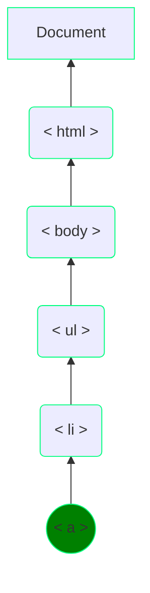
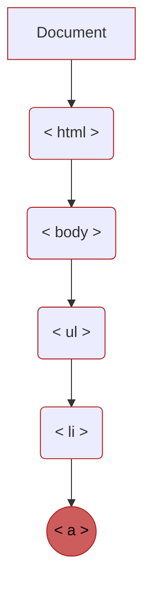

<script src="https://code.jquery.com/jquery-3.5.1.min.js" integrity="sha256-9/aliU8dGd2tb6OSsuzixeV4y/faTqgFtohetphbbj0=" crossorigin="anonymous"></script>

[Go to Excercises / Playground <i class="fas fa-external-link-alt"></i>](playground.md)

# <span class="Yellow">DOM munipulation</span><br><span class="Aqua">John Duckett Book</span>

The terms <span class="font-bold text-red-200">elements</span> and <span class="font-bold text-green-200">element nodes</span> are used interchangeably but when people say the DOM is working with an element, it is actually working with a node that <i class='Yellow'>represents</i> that element 

## Access Elements 

### Select Individual Element Node
```ts
Document.getElementById(elementId: string): HTMLElement

// by CSS selector
ParentNode.querySelector<Element>(selectors: string): Element
```
### Select Multiple Elements <i class="SpringGreen">NODELIST</i>
```ts
Document.getElementsByClassName(classNames: string): HTMLCollectionOf<Element>

Document.getElementsByTagName(TagName: string): HTMLCollectionOf<Element>

// by CSS selector
ParentNode.querySelectorAll<Element>(selectors: string): NodeListOf<Element>
```

> **Note:** A <i class="SpringGreen">NODELIST</i> is <i class="LightGrey">not</i> a array but instead is a <b class="SpringGreen">collection</b> so it has a `length` property and array like ordered index numbers

> **Note:** You can use the index number just like array <b class="RoyalBlue">[index : number]</b> the less prefered way is by using `.item(index: number)` method

#### <b class="Tomato">Live</b> vs <b class="SpringGreen">Static</b> Nodelists 
<b class="Tomato">Live NodeList</b> : when script updates the nodes they are reflected in the collection the methods beginning with *getElementBy** return <b class="Tomato">live nodelists</b> also typically faster

<b class="SpringGreen">Static NodeList</b> : script updates not reflected in the nodes methods beginning with *querySelector** return <b class="**SpringGreen**">static nodelists</b>

### Traversing Between Element Nodes

`parentNode` <code>previousSibling&nbsp;/&nbsp;nextSibling</code> <code>firstChild&nbsp;/&nbsp;last Child</code>
.

:::mermaid 
graph TB; 
ul{&lt; ul &gt;  }---1li(1st &lt; li &gt;)
1li==<code>parentNode</code>==>ul
1li==<code>nextSibling</code>==>2li
ul---2li(2nd &lt; li &gt;) 
ul---3li(3rd &lt; li &gt;) 
ul---4li(4th &lt; li &gt;)
ul==<code>lastChild</code>==>4li
:::

### WhiteSpace Nodes
Some browsers add text node whenever they come across whitespace between elements

*this is why libraries such as **Jquery** became popular to deal with this complication*

:::mermaid 
graph TB; 
ul---1ws[  ]
ul{&lt; ul &gt;  }---1li(1st &lt; li &gt;)
ul---2ws[  ]
ul---2li(2nd &lt; li &gt;)
ul---3ws[  ]
ul---3li(3rd &lt; li &gt;)
ul---4ws[  ]
ul---4li(4th &lt; li &gt;)
ul---5ws[  ]

classDef orange fill:#f96
class 1ws,2ws,3ws,4ws,5ws orange
:::

## Working with Elements 

:::mermaid 
graph TB; 
di{Element<hr>&lt; li &gt;  }-->os(text<hr><code>nodeValue</code><br><br>Properties to access text content<br><code>innerHTML</code><br><code>textContent</code><br><br> node munipulation<br><code>createElement</code><br><code>createTextNode</code><br><code>appendChild / removeChild</code>)

di-->a[attribute<hr><code>nodeValue</code><br><br><code>className / id</code> <br><code>hasAttribute</code> <br><code>getAttribute</code> <br><code>setAttribute</code> <br><code>removeAttribute</code>]
:::

[Go to Excercise <i class="fas fa-external-link-alt"></i>](Ducket/DOM.md)
# <span class="Yellow">Events</span><br><span class="Aqua">John Duckett Book</span>

| Event | Description |
| ----- | ----------- |
|       |

| UI         | Events                                                 |
| ---------- | ------------------------------------------------------ |
| **load**   | web page has finished loading                          |
| **unload** | web page is unloading                                  |
| **error**  | broser exncounters a js error or an asset doen't exist |
| **resize** | browser window has been resized                        |
| **scroll** | user has scrolled up or down the page                  |

| KeyBoard     | Events                                                         |
| ------------ | -------------------------------------------------------------- |
| **keydown**  | user first presses a key *repeats while a key is depressed*    |
| **keyup**    | user realeases a key                                           |
| **keypress** | character is being inserted *repeats while a key is depressed* |

| Mouse         | Events                                                         |
| ------------- | -------------------------------------------------------------- |
| **click**     | user presses and realeases abutton over the same element       |
| **dblclick**  | user presses and realease a button twice over the same element |
| **mousedown** | user presses a mouse button while over an element              |
| **mouseup**   | user releases a mouse button while over an element             |
| **mousemove** | user moves the mouse *not on a touchscreen*                    |
| **mouseover** | user moves the mouse over an element *not on a touchscreen*    |
| **mouseout**  | user moves the mouse off an element *not on a touchscreen*     |

| Focus                   | Events                 |
| ----------------------- | ---------------------- |
| **focus** / **focusin** | elements gains a focus |
| **blur** / **focusout** | element loses focus    |

| Form       | Events                                                                                                                  |
| ---------- | ----------------------------------------------------------------------------------------------------------------------- |
| **input**  | Value in any &lt;input&gt; or &lt;textarea&gt; elemtn has changed or any element with the **contenteditable** attribute |
| **change** | value in select box, checkbox, or radio button changes                                                                  |
| **submit** | user submits a form *using a button or a key*                                                                           |
| **reset**  | user clicks on a form's reset button *rarely used these days*                                                           |
| **cut**    | user cuts content from a form field                                                                                     |
| **copy**   | user coppies content from a form field                                                                                  |
| **paste**  | user pastes a content into a form field                                                                                 |
| **select** | user selects some text in a form field                                                                                  |

| Mutation                        | Events                                                   |
| ------------------------------- | -------------------------------------------------------- |
| **DOMSubtreeModified**          | Change has been made to document                         |
| **DOMNodeInserted**             | Node has been inserted as a direct child of another node |
| **DOMNodeRemoved**              | Node has been removed from a another node                |
| **DOMNodeInsertedIntoDocument** | Node has been inserted as a descendeant of another node  |
| **DOMNodeRemovedFromDocument**  | Node has been removed as a descended of another node     |

## Event Binding 

<p class="text-green-300">There are <b class="Crimson">3</b> major types of event handlers</p>

<div class="columns">
  <div class="column">
    <p class="font-bold text-yellow-600">HTML Event Handler</p>
<i class="Crimson">This is bad practice and out dated but may still arise in legacy code</i>

```html 
<a onclick="hide()">
```

This method is bad becuase it doesn't seperate javascript code from the html
</div>

  <div class="column">
    <p class="font-bold text-blue-400">Traditional Event Handler</p>
  
  Unlike with html we attach using only javascript

  <span class="font-mono"><i class="text-red-500">element</i>.<b class=" text-blue-600">onEvent</b> = <i class="text-purple-600">functionName</i></span>
  </div>
</div>

<p class="font-bold text-green-500">Event Listeners</p>

<span class="font-mono"><i class="text-red-500">element</i>.<b class=" text-blue-600">addEventListener</b>(<i class="text-purple-600">event</i></span>,<i class="text-purple-600">functionName</i></span> [, <i class="text-purple-600"> Boolean</i></span>]) 

#### example
<span class="font-mono"><i class="text-red-500">el</i>.<b class=" text-blue-600">addEventListener</b>(<i class="text-purple-600">'blur'</i></span>,<i class="text-purple-600"> checkUsername</i></span>, <i class="text-purple-600"> false</i></span> ) 

Bassically you get a **DOM node** and then attach a event listener to that node you have the event and attach one of the functions the third argument is called *capture* and is ussually set to `false`


```html
<input type="text" id="username" onblur="checkUsername()">
```

```ts
function fns(){
// function code to run when event is triggered 
}


// get element 
const el = document.getElementById('id')

// attach handler method 
el.onblur = fns // attach function 

// attach listener method
el.addListerer('blur', fns, false)
// we can use anonymous functions to pass function arguments
usernameInput.addEventListener('blur',  () => {
   checkUsername(3)
})
```
## Event Flow

<div class="columns">
  <div class="column">
    <b class="text-green-300">Event Bubbling</b>
    <i class="text-green-400">default</i>



  </div>
  <div class="column">
    <b class="text-red-400">Event Capturing</b>
    <i class="text-red-400">IE8</i>



  </div>
</div>

### Event Object

<p class="font-thin text-yellow-100">When an event occurs, the <span class="text-yellow-300 font-bold">event</span> tells you information about the event and the element it happened upon</p>

```ts
function checkUsername(e, minLength) {
  e.preventdefault() // prevent the default behaviour of going somewhere else
  e.stopPropagation() // prevent the bubble event propagation

  /* Properties of e */
  e.type // type of event being fired
  e.target // target of event (the element)
  e.cancelable // wherther you can cancel default behaviour of element
}

// this is where we get the event object "e"
el.addEventListener('blur', (e) => checkUsername(e, 5))
```

```Mermaid
graph TB;
  parent>get <code>&lt; ul &gt;</code> element for shopping list] --> addevent{is<br><code>addEventListener</code><br>supported}
  addevent -- Yes --> y[use <code>attachEventListener</code>]
  addevent -- No --> n[use <code>attachEvent</code>]
  y --> event(<b>Event <code>click</code> on any link in the list</b>)
  n --> event
  event --> a
  subgraph Function:<code>itemDone</code>Removes an item when completed
  a[<b>Create Variables:</b><br><code>target</code>: element that was clicked]--> b[Get element clicked Call <code>getTarget</code>]
  b-->e>remove <code>&lt; li &gt;</code> from <code>&lt; ul &gt;</code>]
  e-->f{is <code>preventDefault</code><br>Supported}
  f--Y-->preventDefault
  f--N-->returnValue
  end
```
```mermaid
graph TB
  subgraph Function:<code>getTarget</code>Get element that user clicked
  f{is there no<br><b>Event Object</b> }--Y-->a[Get target of event]
  f--N-->b[Get target of event]
  end
```
```ts
/* Event Scripts (of above diagram) */

const usernameInput = document.getElementById('username')
// usernameInput.onblur = checkUsername // traditional event handler
usernameInput.addEventListener('blur', () => {
  return checkUsername(3)
}) // event listener method

function checkUsername(maxlength) {
  const elMsg = document.getElementById('feedback')
  const elUsername = document.getElementById('username')
  // @ts-ignore // HTMLINPUT TYPE BREAKS CODE
  const userLength = elUsername.value.length
  elMsg.textContent =
    userLength < maxlength
      ? `Username must be ${maxlength} characters or more\nYou need ${
          maxlength - userLength
        } more`
      : ''
}

/** EVENT FLOW **/
// Set up event listeners to call itemDone() on click
const shoppingList = document.getElementById('shoppingList')
addClickEvent(shoppingList)

function addClickEvent(el) {
  el.addEventListener ? defaultAddListenerMethod(el) : oldAddListenerMethod(el)

  function defaultAddListenerMethod(el) {
    el.addEventListener('click',  (e) => {
      // e.stopPropagation() // note important to prevent bubbling causing link to go elsewhere
      itemDone(e)
    })
  }

  /** For Old IE method of calling itemDone */
  function oldAddListenerMethod(el) {
    el.attachEvent('onclick', (e) => itemDone(e))
  }
}

function getTarget(e) {
  // For old IE event object
  if (!e) e = window.event

  // Get the target of event
  return e.target || e.srcElement
}

function itemDone(e) {
  const target = getTarget(e)

  if (target.nodeName.toLowerCase() == 'a') {
    const elListItem = target.parentNode
    const elList = elListItem.parentNode
    elList.removeChild(elListItem)
  }
  if (target.nodeName.toLowerCase() == 'em') {
    const elListItem = target.parentNode.parentNode
    const elList = elListItem.parentNode
    elList.removeChild(elListItem)
  }
  /* Prevent the link from taking you elsewhere if preventDefault() works use preventDefault() otherwise Use old IE version similiar for stopping event propagation */
  e.stopPropagation ? e.stopPropagation() : (e.cancelBubble = true)
  e.preventDefault ? e.preventDefault() : (e.returnValue = false)
}
```
