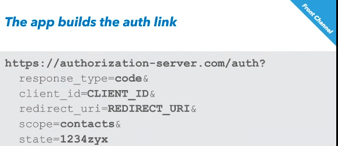

<head>
 
  <link 
    href="https://fonts.googleapis.com/css?family=Fira+Mono:500&display=swap" 
    rel="stylesheet">
    

</head>    

  

# OAuth

<small class="Yellow">Below the before times</small>

## Terminology 
<b class="RoyalBlue">Resource Owner</b> The everyday user 
<b class="RoyalBlue">Client</b> the application or service
<b class="RoyalBlue">Authentication Server </b> Google Facebook etc
<b class="RoyalBlue">Authorization Grant</b> When authorization is successful
<b class="RoyalBlue">Redirect URI</b> Becuase you authenticate somewhere else you need to redirect alot
<b class="RoyalBlue">Access Token</b> the key
<b class="RoyalBlue">Resource Server</b> the resource you need authorization for
<b class="RoyalBlue">flow</b> the methodology or workflow

### Types of Token
<b class="HotPink">Reference Tokens</b> just a random string that references a record in a database
<b class="HotPink">Self Encoded Tokens</b> case in point <b class="SpringGreen" title="JSON web tokens">JWT</b> which are encoded JSON

### Summary 
