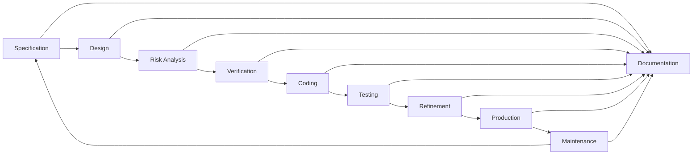

# Principles of Software Engineering

- Coding without a solution design increases debugging time

- A team of programmers is needed for a large software development project

- Teamwork requires:
  - An overall plan
  - Organization
  - Communication

- Software engineering
  - Provides techniques to facilitate the development of computer programs

**Problem Solving** - The process of taking the statment of a problem and developing a computer program that solves that problem

**Solution** - Consists of...
- **Algorithms** - A step by step specification of a method to solve a problem in a finite amount of time
- Ways to store data

## Life Cycle of Software

### Specification
**Aspect of the problem which must be specified**
- What is the input data?
- What data is valid and what data is invalid?
- Who will use the software, and what user interface should be used?
- What error detection and error messages are desirable?
- What assumptions are possible?
- Are there special cases?
- What is the form of the output?
- What documentation is necessary?
- What enhancements to the program are likely in the future?
#### Prototype Program
> A Program that simulates the behavior of portions of the desired software product

### Design
Includes
- Dividing programs into modules
- Specifying the purpose of each modules
- Specifying the data flow among modules

#### Modules 
*Self-contained units of code* 

Should be designed to be;
- Loosely coupled
- Highly cohesive

#### Interfaces
**Communication mechanisms among modules**

#### Specification of a method
- A contract between the method and the module that calls it
- Should not commit the method to a particular way of performing its task
- Include the method's **precondition** - A statement of the conditions at the end of the method

### Risk Analysis
**Building software entails risks**

> Techniques exist to identify, assess, and manage the risks of creating a software product

### Verification
> Formal methods can be used to prove that an algorithm is correct

**Assertion** A statement about a particular condition at a certain point in an algorithm

- Javas assert statement: `asserts` *booleanExpression*
  
#### Invariant
A condition that is always true at a particular point in the algorithm

### Loop Invariant
**A condition is true before and after each execution of an algorithm loop**\
Can be used to detect errors before coding is started

The invariant for a correct loop is true
- Initially after any initialization steps, but before the loop begins execution
- Before every iteration of the loop
- After every iteration of the loop
- After the loop terminates

### Coding
**Translating the design into a particular programming language**\
--> Removing syntax errors

### Testing
**Removing logical errors**

Test data should include
- valid data that leads to a known result
- invalid data
- random data
- actual data

### Refinement
**Refining the Solution**

Addition and refinements
- More sophisticated input and output routines
- Additional features
- More error checks

### Production
**Distribution to the intended users**\
Users use the program

### Maintenance
- Correcting user-detected errors
- adding more features
- modifying existing portions to suite the users better

## What is good Solution
**Total costs ocurred over life cycle is minimal**

Computer resources that the program consumes **Nowadays very cheap**\
Difficulties by those who use the program --> User Experience\
Consequences of a program that does not behave correctly --> people die ☠️

> Programmer's time is probably the biggest cost

## Object-Oriented Design

> A modular solution to a problem should specify what to do, not how to do it

### Abstraction
**Separates the purpose of a module from its implementation**

### Procedural Abstraction
**Separates the purpose of a method from its implementation**

### Abstract Data Type (A.D.T)
**A collection of data and a set of operations on the data**\
An ADT's operations can be used without knowing how the operations are implemented, if *the operations' specifications are known*

<big><strong>Data Structure</strong></big>
> A construct that can be defined within a programming language to store a collection of data

### Information Hiding
**Public view of a module**
- Described by its specifications
**Private view of a module**
- Consists of details which should not be described by the specifications
**Principle of information hiding**
- Hide details within a module
- Ensure that no other module can tamper with these hidden details

> Object-oriented approach to **modularity** produces a collection of objects that have behaviors 
>
> `Object` - *an instance of a class* - Combines data and operations on that data

### Principles of Object-Oriented Programming O.O.P

#### Encapsulation 
**Objects combine data and operations**
- A technique that hides inner details
- Methods encapsulate actions
- Objects encapsulate data as well as actions

#### Inheritance
**Classes can inherit properties from other classes**

#### Polymorphism
**Objects can determine appropriate operations at execution time**

### Functional Decomposition
- Produces modular solutions for problems in which the emphasis is on the algorithms
- Identifies actions by focusing on the verbs in the problem statement
- A task is addressed at successively lower levels of detail

Functional decomposition is a software development approach that involves *breaking down a complex problem or system into smaller, more manageable functions or modules*. It is a top-down approach where a large problem is divided into smaller sub-problems, and each sub-problem is further divided until the functions become simple and specific.

> The key idea behind functional decomposition is to simplify problem-solving by dividing it into smaller tasks that are easier to understand, implement, and maintain. Each function or module focuses on performing a specific task or solving a specific sub-problem, making the overall problem more manageable and easier to solve.

Here are some key aspects and benefits of functional decomposition:

- **Modularity**: Functional decomposition promotes modularity by organizing code into smaller, self-contained functions or modules. Each function performs a specific task, which enhances code reusability, maintainability, and readability

- **Abstraction**: Decomposing a problem into functions allows for abstraction, where the details of each function are encapsulated and hidden from other parts of the system. This promotes a clear separation of concerns and allows developers to focus on implementing and understanding individual functions without worrying about the entire system

- **Divide** and conquer: By breaking down a complex problem into smaller functions, functional decomposition enables a "divide and conquer" approach. Developers can tackle each sub-problem independently, making it easier to understand and solve the overall problem

- **Collaboration**: Functional decomposition facilitates collaboration among developers. Different team members can work on different functions simultaneously, and once integrated, the functions work together to achieve the desired outcome

- **Testability**: Smaller functions resulting from functional decomposition are typically easier to test. Each function can be tested individually, allowing for more targeted and effective testing of specific functionality

- **Scalability**: Functional decomposition provides a foundation for scalability. As the system grows, new functions can be added or existing functions can be modified or extended without affecting the entire system

Overall, functional decomposition helps manage complexity by breaking down a problem into smaller, well-defined functions or modules. It promotes modular design, code reuse, maintainability, and collaboration, ultimately leading to more efficient and effective software development

## Summary of Key Issues

- <big><strong><i>Modularity</i></strong></big>

- <big><strong><i>Modify-ability</i></strong></big>

- <big><strong><i>Ease of Use</i></strong></big>

- <big><strong><i>Fail-Safe Programming</i></strong></big>
- A program that will preform reasonably no matter how anyone uses it
- **Types of errors** Errors in *input data* or *program logic*

### Style 

Five Issues of Style
1. Extensive use of methods
2. Use of private data fields
3. Error handling
4. Readability
5. Documentation

### Debugging
**Programmer must systematically check a program's logic to determine where an error occurs**\

#### Tools of Debugging
- Watches
- Breakpoints
- `System.out.println` statement
- Dump methods
