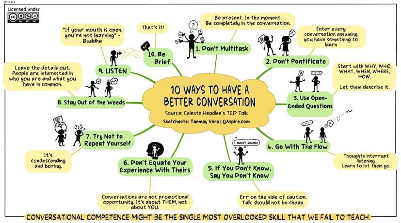
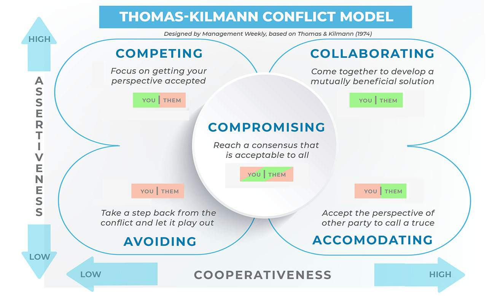
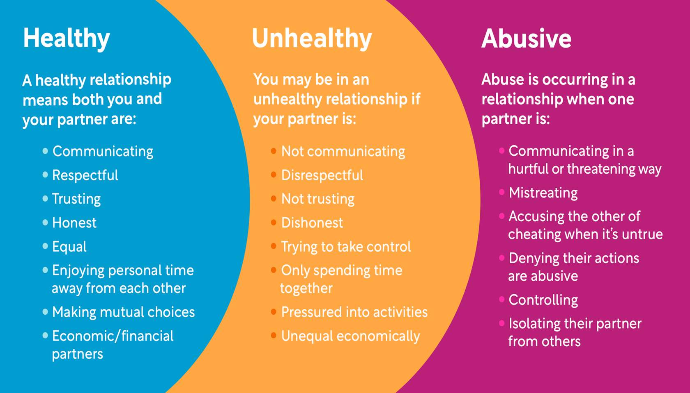
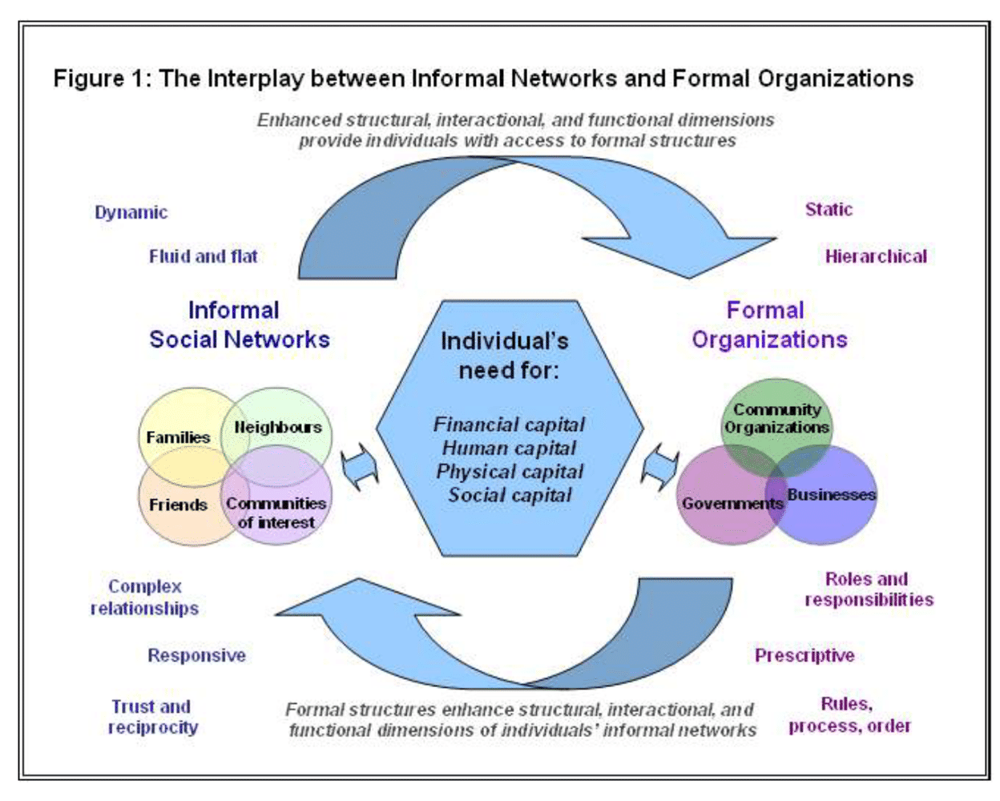
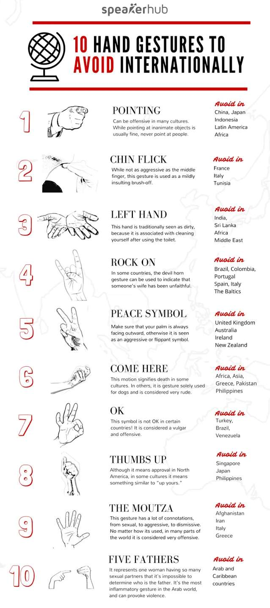

# Life Skills *Interpersonal Skills*

## Collaboration Skills

### Introduction to Collaboration

!!! danger <big>What are <u>collaboration skills</u> and why are they important?</big>{style=color:firebrick;font-weight:bolder}
    Collaboration involves working with another person
    <i>either with a partner or a group</i>
    to <b style="color:#ff0000">achieve</b>, <b style="color:#ff0055">develop</b>, or <b style="color:#ff0099">complete</b> something 
    <i>example: a project or a task</i> 

Whether it is at *home*, *school* or the *workplace* 
In <b>everyday lives</b> strong collaboration skills help:
&starf; build strong relationships
&starf; increase efficiency
&starf; see things from another point of view
&starf; learn new things

#### How do you effectively collaborate with others?
##### 1) <b>Communication</b>
Good communication is important when collaboration effectively with others
<i>It helps build trust, ensures comprehension, avoid misunderstandings, & identifies and solves challenges</i>
imagine trying to complete a task without communicating
**Communication is always needed when collaborating with others**

- **Non-Verbal Clues**
  Rely on physical expression to convey information such as head nodding, smiling & maintain eye contact
- **Verbal Clues**
  Based on <u>language</u> *both written & speech* for conveying information
  
  !!! tip Use  *I see* or *go on* or paraphrase to other person to provide **short affirmations**

- **Asking Questions**
  Clarify any possible misunderstandings

  !!! tip Ask **open-ended** questions that encourage the speaker to give more than one-word answers

- **Maintaining Your Emotions**
  Understand yourself and other's emotions so that you can remain professional & composed

##### 2) <b>Teamwork</b>

!!! cite Teamwork is a quality that will <br> **make it easier to work with others and is crucial when collaborating effectively**
    Teamwork promotes diversity and fosters unity among a group of people who come from different backgrounds

**Key Elements of Teamwork**{style=font-size:1.2em;font-weight:bold;color:orangered}

Hover over to get definition

<b title="Everyone is different – different way of doing things, different opinions, different strengths and weaknesses. Keeping an open mind will help you to see the perspectives of the people you are collaborating with. This can lead to a better understanding when assigning tasks to people or setting a common goal everyone can agree on.">Open-mindedness</b>
<b title="Showing respect is very important for good teamwork. This can include listening to each person until they are finished speaking, asking questions to avoid misunderstandings, and staying accountable. Owning up to your mistakes demonstrates respect to your partner or team, and builds trust among each other.">Respect</b>

##### 3) <b>Organization</b> 

Essential when meeting deadlines on time, staying on track when completing a project

!!! Tip **Tips**
    - create a to-do-list/set goals
    - schedule a task timeline  

### Working in Small or Large Groups

<table style="width:100%;"><tbody><tr><th colspan="1" rowspan="1" style="background-color: rgb(0, 55, 103); width: 25%; --darkreader-inline-bgcolor: var(--darkreader-background-003767, #00264b);" data-darkreader-inline-bgcolor=""><p><span style="color: rgb(255, 255, 255); text-decoration: inherit; --darkreader-inline-color: var(--darkreader-text-ffffff, #e1dfdc);" data-darkreader-inline-color=""><strong>Category</strong></span></p></th><th colspan="1" rowspan="1" style="background-color: rgb(0, 55, 103); width: 25%; --darkreader-inline-bgcolor: var(--darkreader-background-003767, #00264b);" data-darkreader-inline-bgcolor=""><p><span style="color: rgb(255, 255, 255); text-decoration: inherit; --darkreader-inline-color: var(--darkreader-text-ffffff, #e1dfdc);" data-darkreader-inline-color=""><strong>Work</strong></span></p></th><th colspan="1" rowspan="1" style="background-color: rgb(0, 55, 103); width: 25%; --darkreader-inline-bgcolor: var(--darkreader-background-003767, #00264b);" data-darkreader-inline-bgcolor=""><p><span style="color: rgb(255, 255, 255); text-decoration: inherit; --darkreader-inline-color: var(--darkreader-text-ffffff, #e1dfdc);" data-darkreader-inline-color=""><strong>School</strong></span></p></th><th colspan="1" rowspan="1" style="background-color: rgb(0, 55, 103); width: 25%; --darkreader-inline-bgcolor: var(--darkreader-background-003767, #00264b);" data-darkreader-inline-bgcolor=""><p><span style="color: rgb(255, 255, 255); text-decoration: inherit; --darkreader-inline-color: var(--darkreader-text-ffffff, #e1dfdc);" data-darkreader-inline-color=""><strong>Family/Peers</strong></span></p></th></tr><tr><td style="text-align:center;width:25%;" colspan="1" rowspan="1"><p><strong>Communication</strong></p></td><td style="text-align:left;width:25%;" colspan="1" rowspan="1"><ul><li><p style="text-align:left;">Update your teammates on your progress.&nbsp;</p></li><li><p>Ask questions or FOR help when needed .&nbsp;</p></li><li><p>Work together to solve problems before they develop into bigger ones.&nbsp;</p></li></ul></td><td style="text-align:left;width:25%;" colspan="1" rowspan="1"><ul><li><p style="text-align:left;">Update your classmates on your progress.&nbsp;</p></li><li><p>Ask questions or for help when needed .&nbsp;</p></li><li><p>Work together to solve problems before they develop into bigger ones.&nbsp;</p></li></ul></td><td style="text-align:left;width:25%;" colspan="1" rowspan="1"><ul><li><p style="text-align:left;">Update your family members or peers on your progress.&nbsp;</p></li><li><p>Ask questions or FOR help when needed .&nbsp;</p></li><li><p>Work together to solve problems before they develop into bigger ones.&nbsp;</p></li></ul></td></tr><tr><td style="text-align: center;   width: 25%; --darkreader-inline-bgcolor: var(--darkreader-background-efefef, #1b1e1f);" colspan="1" rowspan="1" data-darkreader-inline-bgcolor=""><p><strong>Participation</strong></p></td><td style="text-align: left;   width: 25%; --darkreader-inline-bgcolor: var(--darkreader-background-efefef, #1b1e1f);" colspan="1" rowspan="1" data-darkreader-inline-bgcolor=""><ul><li><p style="text-align:left;">Offer your own expertise, knowledge and experience to the project.&nbsp;</p></li><li><p>Build upon other skills your teammates bring to the table.</p></li></ul></td><td style="text-align: left;   width: 25%; --darkreader-inline-bgcolor: var(--darkreader-background-efefef, #1b1e1f);" colspan="1" rowspan="1" data-darkreader-inline-bgcolor=""><ul><li><p>Express what you are interested in.&nbsp;</p></li><li><p style="text-align:left;">Let your classmates know if you have any prior experience.&nbsp;</p></li><li><p>Build upon other skills your classmates bring to the table.</p></li></ul></td><td style="text-align: left;   width: 25%; --darkreader-inline-bgcolor: var(--darkreader-background-efefef, #1b1e1f);" colspan="1" rowspan="1" data-darkreader-inline-bgcolor=""><ul><li><p>Express what you are interested in.&nbsp;</p></li><li><p style="text-align:left;">Let your family or peers know if you have any prior experience.&nbsp;</p></li><li><p>Build upon other skills your family or peers bring to the table.</p></li></ul></td></tr><tr><td style="text-align:center;width:25%;" colspan="1" rowspan="1"><p><strong>Trust</strong></p></td><td style="text-align:left;width:25%;" colspan="1" rowspan="1"><ul><li><p style="text-align:left;">Get to know your teammates during the beginning stages of the project. This will help you feel comfortable with sharing ideas and opinions, and build trust among your colleagues.&nbsp;</p></li><li><p>Foster teamwork as opposed to competition.&nbsp;</p></li><li><p>Be honest when something is not working and give praise when something does.</p></li></ul></td><td style="text-align:left;width:25%;" colspan="1" rowspan="1"><ul><li><p style="text-align:left;">Get to know your classmates during the beginning stages of the project. This will help you feel comfortable with sharing ideas and opinions, and build trust among your school peers.&nbsp;</p></li><li><p>Foster teamwork as opposed to competition.&nbsp;</p></li><li><p>Be honest when something is not working and give praise when something does.</p></li></ul></td><td style="text-align:left;width:25%;" colspan="1" rowspan="1"><ul><li><p style="text-align:left;">Be honest when something is not working and give praise when something does.</p></li><li><p>Confide in your family or peers when you face an obstacle.</p></li></ul></td></tr><tr><td style="text-align: center;   width: 25%; --darkreader-inline-bgcolor: var(--darkreader-background-efefef, #1b1e1f);" colspan="1" rowspan="1" data-darkreader-inline-bgcolor=""><p><strong>Management</strong></p></td><td style="text-align: left;   width: 25%; --darkreader-inline-bgcolor: var(--darkreader-background-efefef, #1b1e1f);" colspan="1" rowspan="1" data-darkreader-inline-bgcolor=""><ul><li><p>Start a group chat or email thread.&nbsp;</p></li><li><p style="text-align:left;">Manage your time and offer your availability when you can.&nbsp;</p></li><li><p>If your task overlaps with another person’s responsibility, offer your help if you have time to spare.&nbsp;</p></li><li><p>If someone is assigned a task where you may have more experience in, politely let them know you are available to help or provide guidance.</p></li></ul></td><td style="text-align: left;   width: 25%; --darkreader-inline-bgcolor: var(--darkreader-background-efefef, #1b1e1f);" colspan="1" rowspan="1" data-darkreader-inline-bgcolor=""><ul><li><p>Start a group chat or email thread.&nbsp;</p></li><li><p>Manage your time and offer your availability when you can.&nbsp;</p></li><li><p style="text-align:left;">If your task overlaps with another person’s responsibility, offer your help if you have time to spare.&nbsp;</p></li><li><p>If someone is assigned a task where you may have more experience in, politely let them know you are available to help or provide guidance.</p></li></ul></td><td style="text-align: left;   width: 25%; --darkreader-inline-bgcolor: var(--darkreader-background-efefef, #1b1e1f);" colspan="1" rowspan="1" data-darkreader-inline-bgcolor=""><ul><li><p>Start a group chat or email thread.&nbsp;</p></li><li><p style="text-align:left;">Manage your time and offer your availability when you can.&nbsp;</p></li><li><p>Partner up or offer mentorship when someone is assigned a task where you may have more or equal experience in.</p></li></ul></td></tr></tbody></table>

Working in large groups{style=font-size:1.3em;font-weight:bold;color:orange}

Large groups consist of more than 10 people  When collaborating in a large group it is important to remember that you will need to work more people

**Tips**
- Set up a group chat or a joint email thread
- Schedule a weekly meeting
- Work with team leaders

#### **Strategies for Intercultural Group Work**
1) **Communication**
2) **Assigning Groups** assign groups to be diverse
3) **Collaborative Work** agree to well defined tasks, milestones, deliverables etc
4) **Assessing Groups** 3 approaches Self, Peer, Group evaluations

### Respecting Different Opinions & Ideas

**Ken Chapman’s**, *The Art of Respecting Others’ Opinions*, he talks about 4 things to consider when respecting other people’s opinions: 

<b>Restate the Message</b>
<b>Acknowledge the Reasoning</b>
<b>Asking for Information</b>
<b>Take a New Perspective</b> {style=text-align:center}

#### Why is it important to try new ideas? 
**Collaboration involves innovation** 

<b>Express any concerns or hesitations you may have</b> to help the other person guide through new idea
<b>stay open minded</b>
<b>give yourself credit</b> just showing willingness is nice even if your opinion in the end did not change

### Compromise

A major strategy to deal with collaboration is to **compromise** & **consensus built**

**Steps**
Introduce and clarify the issue
Voice the hope or need of the group *why are you engaging in the process*
Explore everyone’s ideas. Consider the pros and cons
Find areas of agreement and bring ideas together to form a proposal
Discuss and adjust the proposal to address concerns
State the proposal and check for agreement **block, stand asides, reservations, consensus**

### Flexibility

Sometime unforeseen changed happen!

## Communication Skills

!!! cite The process of sharing and understanding information between people

Learn to
<b>interpret</b> verbal and non-verbal communication and cues
<b>understand</b> what communication is and its importance in professional and personal setting
<b>implement</b> improved listening skills to increase effectiveness of communication
<b>apply</b> written or oral communication skills
<b>demonstrate</b> that you are listening intently

the three V's {style=display:flex;justify-content:space-evenly}
<div style="display:flex;justify-content:space-evenly">
    <b>&dash; Verbal </b>
    <b>&dash; Vocal </b>
    <b>&dash; Visual</b>
</div>

### Understanding Verbal & Non-verbal Cues
<b>Verbal</b> words and how you speak it *clarity, tone & confidence*
<b>Non-Verbal</b> what you don't say *posture, eye contact, facial expression, hand gestures, even shrug or smirk* can send messages
<b>Written & Visual</b> *emails, text, signs, and visual media* clear writing and visuals important

!!! tip Mind Culture
    **Thumbs up**? Positive in the U.S., offensive in parts of Greece and West Africa
    **“Come here” finger curl**? Okay in some countries, but not others like the Philippines
    **Eye contact**? It builds trust in some cultures but can be seen as rude in others

#### Clarification
Avoid unnecessary jargon or irrelevant information

### Listening skill
<u>Active listening</u> is a important skill
active listening is more than hearing words - *it's about understanding the speaker's thoughts, feelings & intentions*
its basically about **empathy**

!!! warning LIsten to <u>Understand</u>
    listen <u>mentally</u>

### Various forms of Communication
> **in-person, over the phone, or online** communication non-verbal cues could be lost in some of these

[Celeste Headlee YT video](https://youtu.be/R1vskiVDwl4)
There is no need to *show* you are **paying attention** if when if fact *you are* **paying attention**
Ask open ended questions
If you don't know ask for clarification
Don't equate your experience with they're 
We talk at $230\ words\ per\ minutes$ but listen at $500\ words\ per\ minutes$
Be interested in other people



### The Power of Language

Basically we want to be more **assertive**

#### 5 Language habits to ditch

<b>Weak</b> words *I think, maybe, perhaps*
&nbsp; don't use word <i>think</i> when you are <i>sure</i>
<b>Self Minimizing</b> words *Correct me if I'm wrong, this is probably a stupid thing to ask but...*
<b>Negative</b> words *I'm worried that... x is a problem*
&nbsp; avoid double negatives like <i>no problem</i>
<b>Jargon</b> words *operationalize, optimize, leverage*
<b>Unnecessary Apologies</b> words *Sorry to interrupt*

#### 3 words to eliminate
```
But     ⇒   silence or pause, And
    But shuts down a conversation whilst And opens up

Should  ⇒   I could, I will, we can

Just    ⇒   remove it altogether
    only use in terms of time 
    eg I just saw a celebrity
```
##### Better Language habits

<b>Strong Verbs</b> *I believe, I'm confident, I know*
<b>Positive, constructive words</b> 
&nbsp; *When we take action x we'll solve problem y* as suppose to *There's a problem with y*
<b>Conversational</b> *use* as suppose to *utilize, I or We*
<b>Confident</b> *My sense is...* as suppose to *I feel*
<b>Active voice</b> *I made an error* as suppose to *mistakes were made*

Strong Language, Simple Impact
**Simple, Clear Language** not using jargon using one syllable words
**Authentic Voice** heartfelt words with a clear vision, being direct but honest
**Purpose-Driven speech** 
&nbsp;&nbsp;&starf; phrases connecting a larger goal
&nbsp;&nbsp;&starf; a particular vision guiding word choice
**Use of Metaphor** as it can help engage motion & memory

#### Extra resources
[Entrepreneur](https://www.entrepreneur.com/leadership/your-words-have-impact-so-think-before-you-speak/251290)
[Full Focus](https://fullfocus.co/how-our-words-impact-others/)
[CopyBlogger](https://copyblogger.com/persuasive-copywriting-words/)

### Communicating With Professional Audiences
There is a lot of procedures and regulations with communicating within a workspace

**&bigcirc; Listening &bigcirc; Friendliness &bigcirc; Feedback &bigcirc; Non-verbal Communication &bigcirc; Confidence &bigcirc;**

### Communication Tips

To stand out in this social media platforms we use **visual communication**
<b>**Personal Branding, Marketing Messages, Enhancing clarity and Engagement**</b>

#### Visual Communication

> the use of <i>images</i>, <i>symbols</i> & <i>visual elements</i> to convey messages without relying solely on words
> helps people understand ideas <i>quickly</i> and <i>clearly</i> in a fast paced world like ours

#### Email tips
- Keep it professional
- Be clear & precise
- Proofread
- Use an appropriate tone
- Know when to use other tools
- use professional email address
- craft a clear subject line

#### Questions

!!! quote Judge a man by his questions not his answers - Voltaire

use open not closed questions long answers instead of a short answers
**Leading Question**
**Probing Question**
**Funnel Question**
**Rhetorical Question**

### Communicating Respectfully

!!! cite Britannica Dictionary
        A feeling or understanding that someone or something is important, serious, etc. 
        and should be treated in appropriate way

#### How to communicate respectfully

Let the other person speak without interruption

Ask clear question & speak openly

Give space when needed.
Listen and be patient with the other person

Admit when you make a mistake and apologize

**Miscommunication** can sometimes happen when we rush to express ourselves, get off topic or forget to respect the other person

[](https://www.youtube.com/watch?v=gCfzeONu3Mo)

## Leadership Skills

> Leadership skills are useful when coordinating people to reach a shared goal, idea, task, and/or project. Strong leaders are able to motivate people and help create strong relations among a group or team. They can take charge when the situation calls for it, engage people, find ways to overcome obstacles, and maintain a positive environment. As a result, leadership skills build the confidence required to successfully lead people and inspire them to reach their full potential. 

### Decision making in Leadership

**Identify the problem** and identify and evaluate factors leading up to the current situation
**Weigh out the options** and maybe create backup plans
**Making an informed decision** and inform everyone of it as well as any changes moving forward

### Diversity in a Group

Working with diversity means respecting all the differences that the group brings

According to *Jeff Meade founder and CEO of MEADE* when leading a diverse team consider strategies
1) **Start with self-assessment** consider your own biases to create a more inclusive environment
2) **Actively listen** asking clarifying questions and acknowledge differences in communication style
3) **Equity in opportunity** assess whether all members is given equal opportunities to succeed
   - how and wheat rewards are given to outstanding performance
   - how and what mentorship learning opportunities etc are available
   - holding other leaders accountable for inclusively

### Taking Charge of a Situation

1) **Define goals**
1) **establish resources** 
1) **identify the experts**
2) **Make a decision**

### Organization, Prioritize & Delegation

- **keep things minimal** & discard everything you don't need
- **Take breaks** allows you to focus on other things like socializing and family and allows you refocus
- **Plan a schedule** use a physical or digital planner
- **Organize tasks and deadlines** assign and delegate tasks & evaluate the progress

#### How to Prioritize Tasks

Write down a list of deadlines
Create a list of tasks the need to be completed by each deadlines
In detail, add in all the steps that each task will require
Assess what needs to be done first before moving onto the next step
Based on the deadlines & requirements, prioritize upcoming deadlines & tasks that need to be completed before next steps

#### How to Delegate

**Know people's strength & weaknesses**
**Know people's availability** some people don't start their tasks before someone else finishes their's task
**Stay flexible** 

### Lead by Example

> Working with **Integrity** means working with <b>honesty</b> and thus showing respect to the team
> 1) **Keep your promises and follow the rules**
> 2) **Be self-aware** your team can pick up on your energy, attitude & vibe
> 3) **Trust your team and work with them**

### Conclusion

!!! tip Leadership is more than just managing a team and giving orders 
    It involves <b>leading by example</b> to foster positivity and trust
    It involves <u>motivating</u> the team to inspire productivity, new ideas, and potential leaders
    A good leader *listens*, *asks questions*, 
    & *gets to know their team* to guide them in accomplishing the goal or task at hand in the best possible way

## Conflict Resolution

!!! quote Resolving disputes - think about your options (justice.gc.ca)
    Conflict is a fact of life. We face problems and disagreements all the time:
    at home, on the job & in our neighborhoods.
    Not all these disputes are serious & we may choose to ignore some without any consequences.

Because conflict is so prevalent in our lives it is important to have good conflict resolution skills 
<i>Conflict is neither good nor bad</i>. Some people avoid conflict some people are happy by conflict

#### Types of Conflicts

**Intrapersonal** Internal conflict within yourself *making a tough decision*
**Interpersonal** Between individuals
**Intergroup** between groups
**Systematic or Organizational** Shaped by Structural issues like policy or culture

[](https://www.youtube.com/watch?v=SorqWJUHbjM)

### Transforming Conflict

<b>Conflict because one of a party's needs are not met</b> It is a good idea to empathize with the other party
Here they talk about Maslow's hierarchy of needs 

#### Role of Power
> Every conflict has a power dynamic, whether its obvious or subtle

Power can take different forms such as:
**Power over** Dominance, coercion or control
**Power with** Collaborative and shared *stakeholder engagement, co-creative power*
**Powerlessness and dependence** leads to dependence and frustration
**Empowered & Independent**

#### Know Your Conflict Style


<cite>Source: [Thomas-Kilmann Conflict Model](https://managementweekly.org/thomas-kilmann-conflict-resolution-model/) (Mishra, 2021).</cite>

### Embracing Conflict

**Rethinking Conflict** by our favorite presenter *Elissa Lansdell, Founder of Rockstar Communications*
Conflict <u>should not</u> be avoided, because probably has to be dealt with on a daily basis
all your best performances probably have come from conflict
using the <i>right skills</i> can turn conflict into <i>opportunity</i>
Conflict = Any instance where there is a <u>disagreement</u>
Approach with <b>clarity</b>, <b>empathy</b> and <b>respect</b> helps turn tension into opportunity

3 good assumptions for approaching conflicts
&check; Look at conflict as a **OPPORTUNITY**
&check; Assume a **POSITIVE** outcome *this is where leaders get their <u>vision</u>*
&check; Always **LISTEN**

One technique from improv *Yes, and ...*
&nbsp; <i>Hello you are a Pirate</i> its better to say yes because if you say no than the scene just goes nowhere
&nbsp; <i>Yes, and I am looking for a crew</i> now the other person can take the scene somewhere

**<u>The Disarmament Technique</u>**
Stay calm and find common ground during conflict
&square;&nbsp; <b>Disarm</b> *you're right that... it's true that ...*
&square;&nbsp; <b>Empathize</b> *if I were you I'd probably feel that way*
&square;&nbsp; <b>Inquire / Support</b> *What is the biggest thing holding you back?*
&square;&nbsp; Move to YOUR message

<big><b>&bigcirc; Disarm &Rarr; Empathize &Rarr; Inquire &bigcirc; </b></big>

[Conflict Resolution Network ](https://www.crnhq.org/) for further resources

### Conflict Resolution Skills & Strategies

**Conflict resolution** - The informal or formal process that two or more parties use to a find a peaceful solution to their dispute

#### 7 Strategies
1) **Practice positive &open communication**
1) **Be Assertive when necessary**
1) **Be cautious of aggressive communication**
1) **Practice Active Listening**
1) **Be aware of your emotions** be self aware
2) **Be open to compromising & collaboration**
2) **Avoidance is okay** sometimes a party needs to step away respectively to process and regulate

#### Three ways to View, Approach and Resolve Conflict
[](https://www.youtube.com/watch?v=r4xPwhcnS-Q)
1) **Prepare** Set a meeting in the future so that in the meantime emotion can deflate
2) **Diffuse and move forward** Ask <u>neutral</u> questions, this can diffuse and validate
3) **Make a agreement** When the energy is neutral that is time to get a agreement

#### 10 Tools to Transform Conflict
1) **Self-Care & Mindfulness Practice**
2) **Listen to Learn** Appreciative, Comprehensive, Discerning, Evaluative, Empathic types of Listening
3) **Engage in Authentic Dialogue** think of the difference between *debate* vs *dialogue*
4) **Lean into Curiosity** *Get Curious Not Furious* what else can this mean? How might this be a good thing? <i>Go perspective shopping</i>
5) **Develop Common Ground** identify common interests, listen, acknowledge good
6) **Inclusive Process Design** consider the range of things
7) **Timing is Everything**
8) **Control** things I <u>can</u> control vs things I <u>can't</u> control
9) **Be aware of your biases** especially unconsciously
10) **Empathy is your Super Power**


!!! cite Create a culture where conflict is expected and recognized for the value it brings to results
    Marsick & Sauquet


### What is Emotional Regulation

<b>Emotional Regulation </b>is a skill that requires **emotional intelligence**, **self awareness** & **self-control**

#### Emotion Regulation Strategies

Categories:
**Mediation**

**Healthy Strategies** | **Unhealthy Strategies**
--|--
Meditation | Avoiding or withdrawing from difficult situations
Take care of yourself physically | Excessive use of social media
Exercising | Abusing alcohol or other substances
Paying attention to negative thoughts | self injury
Therapy | Physical or verbal aggression
Getting Adequate Sleep |
Talking with friends |
Notice when you need a break & taking it |
Writing a Journal |

## Negotiation Skill

!!! example Negotiation
    <b>Is a process through conversation where all parties work together to reach a shared solution </b>
    could be *<Strong>formal</Strong> signed contract* or *<Strong>informal</Strong> verbal agreements*
    agreement usually comes as a result of a **compromise**

### Understanding Compromise

!!! question When & how do you compromise?
    It is important to have **empathy** & **respect** for the other party. Finally, **gratitude** when someone makes a sacrifice for the middle

### Reaching an Agreement
#### The Process of Negotiation
<b><big>**1.** Preparation *&rArr;* **2.** Discussion *&rArr;* **3.** Negotiation *&rArr;* **4.** Agreement *&rArr;* **5.** Following through
</big></b> {style=text-align:center;}

!!! **1.** Preparation *Doing the research and gathering necessary information to prepare for negotiation*
    This can include:
    &starf; looking into past details <i>text messages, past event</i>
    &starf; speaking with the right people <i>a mutual connect, parents, teachers</i>
    &starf; constructing contingency plans <i>alternate situations and or offers</i>

!!! summary **2.** Discussion *Share any relevant information to all parties involved*
    Allows everyone to make a **initial case** & discuss **key points** of the topic at hand
    Asking questions is not negotiations but <i>asking questions</i> and <i>clarifications</i> as well as <i>clearly stating goals </i>is important here

!!! danger **3.** Negotiation *<u>back and forth dance</u> between dialogue*
    Here offers and counter offers are made based on previous information gathered
    Its easier when parties have similar interests
    Its good strategy to go for a big ask at least initially
    Remember **empathy, respect and gratitude**!

!!! check **4.** Agreement *happens when negotiations are successfully made*
    Usually an agreement happens as a result of compromise on low priority areas where parties will make concessions to reach deal

!!! warning **5.** Following Through *with the agreement reached it only worked when the agreement is implemented in practice*
    There needs to be **back-up plans** for when the parties do not follow the agreements 
    or for the potential for the plan to be re-negotiated in the future or changed


### Professional Negotiations

!!! question How do you negotiate professionally?
    There are various reasons to negotiate in the workplace. This can include:
    - evaluating a john offer
    - asking for a raise or promotion
    - making or a finalizing a sale
    
    - **speak politely** *avoiding slang*
    - **maintaining positive body language** *good posture*
    - **actively listening** *asking clarifying questions, not interrupting other person*
  
[](https://youtu.be/Z3HJCQJ2Lmo)
<cite>3 steps to getting what you want in a negotiation | Ted Talk</cite>

Negotiation is not about <i>domination</i> it is about a creating a **relationship**
Information gives you the edge so <u>Do your research</u>

## Presentation of Self

How to include a good *first impression* or to *sell yourself* in the professional world
Your appearance , attitude & demeanor is important in a person's impression & perception of you

!!! example Common Terms
<b>&bigcirc; **Professional** &bigcirc;</b> 
<b>&bigcirc; **Attitudes** &bigcirc; </b> 
<b>&bigcirc; **Impression** &bigcirc;</b> 
<b>&bigcirc; **Perceptions** &bigcirc;</b>
{style="display:flex;justify-content:space-around;color:yellow"}

### I'm Judging You

!!! Attention Self-Presentation
    How we present ourself, as well as our behaviors we in engage in to influence how others perceive us
    This is a skill that we can nurture so we can be attentional when we present ourself

Do you find yourself more talkative with one person and not another?

Do you find that you sit up straight and use more intentional, eloquent words to sound smarter when you're at work,
but use slang and slouch when you are out with friends?

Have you ever found yourself in a situation where you suddenly found yourself acting in a way that does not sound or feel like yourself to make someone else like you? 

<i>these are all examples of **self-presentation**</i>

!!! tip It takes 7 seconds to make a first impression *so make it count*

[](https://youtu.be/GWQRFMlvAVca) 
<cite>Vanessa shares eight strategies to make a lasting first impression</cite>

1) **Thin-Slicing** people could make accurate impression within the first second
   Researchers showed that within 1st second participants could determine which politician would win the election
2) **Self Evaluation** How did you come across, how would you like to come across
2) **Ideals First** always give your best foot forward
3) **Perfect handshake** remember non-verbal
4) **Stand in a <i>Launch</i> Stance** toes towards person, arms lose, shoulder down and back, chin neutral  
5) **Don't be in a depressed mood** people could pick up on your bad mood
6) **Think about your ornaments** jewelry, outfits
7) **Point toes toward someone**

### Attitudes

> A person's behavior can tell us how they are feeling through their attitude and demeanor

[](https://youtu.be/eWlV1A6tHow)
6 tips to have a positive attitude
1) **Being Present & Prepared** remove all other distraction
2) **Being Positive, Confident, Enthusiastic** otherwise maybe you shouldn't go to the event
3) **Courtesy and Respect** respect is a two way street
4) **Patience and Self Control**
5) **Use Positive Language**
6) **Speak Clearly** and cut down tag words *uhh, umm* and slow down pause more

### Looking your Best

Groom yourself keep your workplace tidy

### Knowing your Worth

We always have a <b>inner critique</b>, a <b>saboteur</b>
that person want's to help you and protect you, if you realize this then you can **thank it and then dismiss it**

<b>Let's start by setting a <big>big goal</big></b>

but there are 3 obstacles *this was a exercise*
 1  **Lack of skills**
 2  **Lack of confidence**
 3  **Lack of connection** 

We can now turn these obstacles into a <b>**Belief statement**</b>
 1  **I believe that I have a lack of skills**
 2  **I belief that I have a lack of confidence**
 3  **I believe that I have a lack of connection** 

 !!! Question **Question 1** Am I certain that this belief is <u>true</u>?
    Do I have evidence that the belief is undeniably true?
    
    If yes &rArr; explore why you believe this and what supports it <i>otherwise move to next question</i>
 !!! Question **Question 2** Is this a <u>limiting belief</u>? <br> Does this belief keep me from moving forward or reaching my goals? 
    A limiting belief is one that <i>holds you back</i>, <i>keeps you stuck</i> or <i>shrinks your confidence</i>
    
    If yes &rArr; <i>move to next question</i>
    If no &rArr; ask yourself *how this belief supports your growth or goals*

 !!! Question **Question 3** Am I willing to <u>let it go</u>?
    Doesn't mean pretending it is not there
    It means <b>not letting the belief constrain or define you moving forwards</b>
    
    !!! tip Tip
        If you'r not sure whether you're ready to let it go, <u>be curious</u>
        *What would be different if you did?*

!!! Warning Statement of Appreciation
    Write down your belief and then write a **Statement of Appreciation**
    by appreciating our <i>protector's</i> purpose we can <u>gently choose another path</u>

Instead of listening to a inner critic lets instead talk to our <big><b>inner advocate :loudspeaker:</b></big>

Your advocate is the part of you that sees your strength, believes in your abilities & reminds you of your worth <i>even when you doubt it</i>

> Look back at your beliefs and your Statement of Appreciation. Now, imagine what your inner Advocate—your cheerleader, coach, or wise mentor—might say in response to that belief. This is not about toxic positivity. Your Advocate speaks with honesty, compassion, and encouragement

After you have completed the exercise **Brag about yourself** this is not toxic these brag statements would help you a lot

### Networking

!!! quote Dale Carnegie <i>How to Win Friends and Influence People</i>
    You can make more friends in 2 months by becoming interested in other people 
    than you can in 2 years by trying to get other people interested in you

!!! tip Pro-Tips for IN-PERSON Networking
    &starf; **Be Genuine** most people like to help others, just be yourself
    &starf; **Ask for Advice, not a Job** focus on gathering insight and building rapport
    &starf; **Be Prepared** Give a few go-to questions ready to start conversations
    &starf; **Know your Value** Determine skills, experiences or perspectives that you bring
    &starf; **Be Good Listener & Respect People's Time** Be bright, be brief & be gone

### Building Your Social Media Identity

!!! danger It is all about **personal brand**

#### 📘 Building Your Identity on Social Media  
> “Your social media says a lot about who you are.”

---

#### 📝 Disclosure  
- Overview of module contents  
- Use whatever learning style works best  
- You can skip the slideshow if videos are enough  
> “Feel free to take notes or refer back… Every person has different learning styles…”

---

#### 🌐 Introduction  
- Every post/action does one of three things:  
  - **Builds** your character  
  - **Maintains** your character  
  - **Deteriorates** your character  
- You control how people see you online  
> “We decide how people see us…”

---

#### 🎨 Brand  
- Your brand = **your identity**  
- Reflects your *authentic* self  
- Ask: *What do I want people to think when they see me?*  
- Assume everything you post is public  
> “Your brand is who you are… assume everything that you post… will be seen by everyone.”

---

#### ⭐ Vision  
- Your **purpose** / your **why**  
- Acts as a guiding star  
- Should be simple + clear  
- Helps you realign when you drift  
> “Your vision is your purpose or your why…”

---

#### 👀 How Do You Want To Be Seen?  
- Imagine the ideal version of yourself  
- Think big  
- Ask yourself:  
  - Who do I want to be?  
  - What characteristics should describe me?  
> “Do not be afraid to think big.”

---

#### 🔍 How Are You Seen?  
- Review your profile objectively  
- Ask someone else for an outside perspective  
- Identify the image you currently project  
> “It will be helpful to get another person to also look at your profile…”

---

#### 🔧 Bridging the Gap  
- Identity-building is ongoing  
- Compare: **ideal self** vs **current online self**  
- Create action items to align your profile with your vision  
> “Building your identity… is an ongoing process of refinement and work.”

## Relationship Skills

#### Key Words

Relationship
: a connection, association, or involvement with an individual

Friend
: a person attached to another by feelings of affection or personal regard

Trust
: reliance on hte integrity, strength, ability, surety, and so on of a person or thing; confidence

toxic
: causing unpleasant feelings; harmful or malicious

Boundary
: something that indicates bounds or limits; a limiting or bounding line

Compromise
: a settlement of differences, an agreement

{style=width:auto;height:20em;}

If you find yourself in a toxic relationship the best strategy is to **talk to someone**
there are also many free resources you can use

### Relationship Building & Mending

**Ways to build & maintain Relationships**
- listen to others and making an effort to understand them
- getting to know that person's interests or at a deeper level, how life is for them
- for existing relations putting extra effort in when the person is in need, taking steps to work on your part
- communication must be present on every level

#### 7 Relationship Strategies

<big><b>1. </b></big> **Open Communication** 
&nbsp; &dash; listen to op perspective and try to communicate yours effectively
&nbsp; &dash; be transparent of your thoughts & feelings
&nbsp; &dash; approach conversations with an open mind & without judgement
<big><b>2. </b></big> **Apologize** & take responsibility when you recognize your faults
<big><b>3. </b></big> **Earn Trust** Give the other person the opportunity to earn your trust back
<big><b>4. </b></big> **Compromise** practice *give & take* go for main priorities by <i>meeting in the middle</i>
<big><b>5. </b></big> **Manage Expectations** adjust expectations to the other person, not set them high 
<big><b>6. </b></big> **Supportive** be supportive :pray:

*[op]: other person 

### The Importance of Trust

!!! tip Trust is one of the most parts of a healthy relationship
    Trust is <u>critical</u> to maintain relationships  
    It means you can believe the op would <i>have your back</i> & that your secrets and interests would be respected

### Building Trust

Trust is earned through <i>actions & words</i> 

!!! tip **Tips to Building Trust** [Craig, 2019](https://positivepsychology.com/build-trust/)
    - **Be true to your word** making & following through with commitments/promises
    - **Use effective communication** Communicate positively and effectivity <small>*see previous strategies*</small>
    - **Take your time** Trust builds slowly so do it in many small steps
    - **Carefully consider decisions/commitments** before making them, with an eye on your ability to follow through, rejecting otherwise
    - **Consistency is key** because we need time to build trust through frequent words & action trust should pile up
    - **Participation** active listening, being open to collaboration to negotiate and comprise *this is when trust is built*
    - **Honesty is the best policy** always tell the truth because each lie hampers trust
    - **Be open with your feelings & emotions** sharing feelings can significantly build trust
    - **Admit mistakes** this will demonstrate self-reflection
### Boundaries

<b>Healthy boundaries</b> look like:
**&cir;** advocating for ourselves
**&cir;** making time for our own needs
**&cir;** putting ourselves first
**&cir;** making choices that make us happy & feel fulfilled
**&cir;** protecting from abusive situations

### Building a Social Network

If you don't have a social network, you can have serious chronic health outcomes

You could look for social meeting, volunteering

#### Informal Social Networks

!!! quote Arshad, 2011
    Informal social network includes an individual's family including extended family members,
    friends, neighboring, wider community of interest
    including informal connections developed in work, education & neighborhood settings 
    as well as those increasingly formed on-line

##### Dimensions of Informal Social Networks

<cite>Eng and Young, 1992; Israel, 1985; Rice et al, 2001, as cited in Arshad, 2011)</cite>

1) **Structural** The size & density of connections
   *size* number of people in a network
   *density* how well individuals in the network know each other
2) **Interactional** Nature of relationships whether members have strong or weak ties
3) **Functional** Type of support
   *instrumental*: time, money; *emotional*, *information*, *appraisal*: esteem, feedback; or combination thereof

##### Importance of Informal Social Networks

{style=height:40em}
<cite>Arshad, 2011</cite>

**Table: Characteristics of Informal and Formal Structures**
<cite>(Adapted from: Wikipedia, 2009; Answers, 2010, as cited in Arshad, 2011)</cite>

Informal Structures | Formal Organization
-|-
Grassroots orientation | Top-down orientation
Spontaneously created | Deliberately created
Constantly evolving | Enduring *unless deliberately altered*
Dynamic & responsive |Static & prescriptive
Flat & fluid structure <br>*flexible & loose* | Hierarchical structure <br>*based on division of labour or specialization*
People as individuals | People as bearers of roles & responsibilities
Relations my be undefined | Relationship structured well-defined
Bound by trust & reciprocity |Bound by rules, process & order
Complex & hard to define |  Simple & easy to explained
**Adaptability** <br>Useful for rapidly changing <br> circumstances that are not <br> well understood | **Consistency** <br> Constant & well-known situations consistency <br> <br> &nbsp;

### Networking Strategies for Newcomers to Canada
Smile & Say Hello
Join Clubs & Activities
Attend Community Events
Join language classes
Volunteer
Use Social Media
Be a Good Listener
Keep in Touch
Be Patient, Persistent & Stay Positive
Network at Work or School

## Self-Advocacy Skills

> **Self-advocacy** is the skill to publicly speak up for yourself to get what you need or desire both professionally and personally
> <i>this involves understanding your *needs*, *rights* & *interests*</i> expressing them <b>clearly</b> & <b>assertively</b>

[](https://youtu.be/fCjwA67THIc)

### Standing up for Yourself 

1) **Identify your reasons for speaking up**
2) **Identify your needs**
3) **Know your rights**
4) **Plan your message**
5) **Negotiate**
6) **Follow-up**

### Articulating your needs Thoughtfully

<b>Determine if the timing is right</b> if you are emotional take time to simmer down. Make sure the audience is ready to take your message
<b>Start positively</b> say something positive of op or the situation then you can focus on your problems
<b>Focus on *your* feelings and *why*</b> 
<b>Use <b><u>I</u></b> statements</b>
<b>Listen</b>
<b>Show Gratitude</b> Thank op for time to listen to you & highlight anything that made you feel heard & valued

## Ask Questions & Help Confidently

**Asking questions is a great way to self-advocate**
You can gather information, get clarifications & follow up on status of your needs
When asking question makes sure you are <b>clear</b> & <b>polite</b>

!!! danger Asking for help can be hard
    However there is no shame in asking for help, everyone needs help sometimes in their lives

Remember to 
**Build confidence**, prep-talk, repeat positive affirmations, include positive body language & volume
**Be clear & concise** be clear with asking, avoid jargon, be concise
**Do not apologize** Avoid belittling your needs
**Follow-up** Be sure to thank the op, take time to update on how their help affected you

## Social Skills

[](https://youtu.be/ku_XltAHvjA)

I is important to **listen** to other when they are speaking
Use s<i>implement gestures like head nodding</i> to show op you are listening
<i>Restating what was just said</i>, & <i>asking questions</i> to clarify
or further the conversation will show you understand the topic being discussed

When you are speaking in a group & you are having to get a word in its better to 
avoid visibly showing agitation or frustration instead just go with the flow 
and the next opportunity to speak, speak with confidence and volume

Just like with other aspects of life **trust** is important in social settings

[](https://youtu.be/wtNOq1Bwtt4)

### What are Social Norms?

The unspoken rules within a given group and community define acceptable practice guiding human behavior

There are a lot of social norms but the foundational ones are things like *Please & Thank you* as well as apoligizing when a mistake is made

[](https://youtu.be/37wYKrjhBi8)

### How to Socialize in Professional Spaces

1) **Engage in Social Events**
   Could be nerveracking so try
    &dash; give yourself a pep talk
    &dash; try a relaxing activity
    &dash; remember that you are human

2) **Be Respectful & Positive**
   Avoid any inappropriate behaviors like gossip

3) **Listen and Ask Question**
   ask clarifying questions, it is okay

4) **Use Proper Body Language**

5) **Be Mindful while Online**

### Getting Involved with Your Local Community

Joining a community that shares in a interest will allow you to get opportunities, relationships & learn new skills 

Its a great way to further develop your <i>social skills</i>

- **participate in local events**
  such as *fairs, markets, shows & classes* you will be able to connect with neighbors & celebrate community culture

- **Volunteering**
  Build strong *connection* & give your time & energy for the benefit of the community

- **Donating**
  Gives a sense of purpose & gives back to the community

- **Support Local Businesses**
  Helps boost local economy & maintains the unique character of your community
  When you support your neighbors, your community will be stronger

- **Taking a Class**
  Great way to learn a new skill while meeting people from your community that share in your interests

- **Supporting Local Sports Teams & Activities**
  Cheering for local sports teams creates community spirit!

- **Help Organize an Event or Starting Your Own**
  Helps people come together, positive effect on the community & really develop your leadership and other skills

#### Getting Started
Use a search engine to look up opportunities online
Visit the front desk at your community center
Check your city or town's local website; newspaper or newsletter

### Key TakeAways

> Socializing can appear to have many rules, 
> but it is a <u>learning experience</u> and a skill that can be developed just like any other skill. 
> Through socializing with others, <i>you can learn more about yourself</i> and 
> acquire the social skills needed to maintain lasting relationships. 
> Social skills also provide you with the ability to communicate well and appropriately,
> ensure you are not only putting your best foot forward, but being respectful to those around you.

## Intercultural Communication

!!! question What is **Intercultural Communication**?
    <b style=color:#64dd17cc>Intercultural communication is communication between people with differing cultural identities</b>
    applies both to <i>domestic</i> and <i>international</i> cultural differences



[](https://youtu.be/0W9iLrfyq20)

High context cultures <i>yes can mean yes, no & maybe</i>

!!! summary Summary: *Importance of Intercultural Communication*
    In a word, <b>learning how to effectively communicate interculturally can help us become more competent cross-cultural communicators</b>
    through avoiding *misunderstandings and conflicts*, *building trust and relationships*, and *enhancing cultural awareness & sensitivity*

[](https://www.youtube.com/watch?v=sg_YIqqprB4)

### Benefits of Intercultural Communication

**Expands Horizons**
Exposes us to a wide range of perspectives, ways of thinking & ideas
Allows us to challenge our assumption & bias, leading to personal growth & world understanding
**Breaks Down Stereotypes & Communication Barriers**
Thus allowing us to recognize our shared humanity
**Encourage Open Dialogue & Collaboration**
Allows us to better work together
**Cultivates a Mindset of Curiosity, Respect & Empathy**
Cultural differences can sometimes lead to misunderstandings and conflicts

### How to Develop Intercultural Communication Skills?
[](https://youtu.be/JzJNA-3b6NA)

**Understanding the Importance of Cultural Sensitivity**
*The ability to recognize and respect the values, belief & traditions of differing cultures*
**Avoiding Stereotypes**
*Acknowledging diversity & treating each person as an individual*
**Active Listening & Empathy**
*By listening actively & being empathetic, a safe & inclusive environment can be created*
**Body Language & Nonverbal Cues**
*Different cultures interpret gestures, facial expressions & personal space differently*
**Adapting Communication Styles**
*individuals can adjust their communication styles to ensure their message is effectively conveyed*
**Building Cultural Knowledge**
*seeking to understanding different cultures*
**Building Relationships & Trust**
Developing genuine connections with individuals from different cultural backgrounds requires time, patience, and respect.
However, investing in building relationships based on mutual trust and understanding is worthwhile,
as this lays the foundation for open and honest communication.