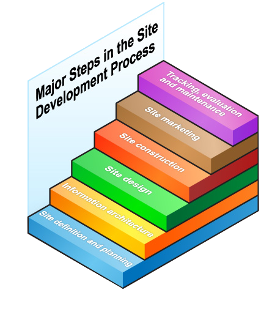

<head>
  <link 
    href="https://fonts.googleapis.com/css?family=Fira+Mono:500&display=swap" 
    rel="stylesheet">
  <script src="https://code.jquery.com/jquery-3.5.1.min.js" integrity="sha256-9/aliU8dGd2tb6OSsuzixeV4y/faTqgFtohetphbbj0=" crossorigin="anonymous"></script>
<style> 
body ::selection {
  /*highlighting*/
  background: transparent;
  text-shadow: 
    1px  0px 1px ,
    0px  1px 1px ,
    -1px  0px 1px ,
    0px -1px 1px ,
    0px  1px black ,
    1px  0px black ,
    -1px  0px black ,
    0px -1px black ;
  text-outline: black;  
}
img {
  text-align: center !important;
}
</style>
</head>    

# 6 P's of the Website Design Proccess

From <a href="https://www.johnnyflash.com/web-design-process/">Johnny Flash</a>

1. ## <big>Purpose</big> 
1. ## <big>Plan</big> 
1. ## <big>Prob for Resources</big> 
1. ## <big>Produce a Design</big> 
1. ## <big>Post the Pages</big> 
1. ## <big>Pile on Current Content</big> 

# Site Development Proccess



### Site Definition and Planning 
Of course we could talk about target audience, but thier is more to this step than this. You need to prepare a <span class="FireBrick">budget</span> and develope your <span class="BlueViolet">goals and objectives</span>

<b class="SkyBlue"><u>Common Questions</u></b>

* Who will it?
  - **Intranet** - for internal use
  - **Extranet** - sharing information with suppliers
  - **Internet** - communicate with the public

* Will it provide the opportunity for visitors to interact with the site through the use of forms, scripts, shopping carts, or transaction software?

* Where will you post the site?

* How will it be updated? By whom? How will it be evaluated? How often?

### <span title="This is actually called 'designing information architecture'">Information Architecture</span>
Look through existing content and prototype yet to exist content. This step is not about the pretty aspect of design but instead just the functional part of design.

### Site Design 
During this Stage
- Create page grid, page design and graphic design standards
- Create or add any photos, illustrationns or any other audiovisual elements
- Reseach assembling, content editing and organising and writing
- Programming, database design, data entry, and search engine design should be well under way at this point

### Site Construction 
Here create the bulk of pages, thier content and thier linking.Here you should begin beta testing before the site goes live

### Site Markeeting 

The next step is making your website an integral part of your overall marketing campaign. Use the URL in all corporate publications and media ads. List the website in the standard Web indexes like Google and Bing. Then identify ways to partner with other organizations to promote your site and your organization. Web entrepreneurs make good use of partnerships and affiliate programs. You'll want to investigate both.

### Tracking. Evaluation and Maintenance 
We can track visitors to get useful quantifiable data. Make arrangements for ongoing maintenance.

# Site Design Process <small class="BlueViolet">Information Design</small>

1. Information design <span class="Crimson">Requires **writing skills**</span>
1. Interaction design <span class="Lime">Requires **programming skills**</span>
    1. <b class="Green">Organization</b> concerns way information is positioned on the page  
    1. <b class="LightGreen">Navigation</b> concerns way people move around the site
    1. <b class="LimeGreen">Interactivity</b> concerns way that people interact with information from the site
1. Presentation design <span class="Orange">Requires **artistic skills**</span>


# Other Resources

<a href="https://www.w3.org/">World Wide Web Consortium </a>
<a href="https://www.intechnic.com/blog/best-examples-of-website-goals-and-objectives/">Best examples of Website Goals and Objectives</a>
<a href="http://www.htmlgoodies.com/">HTML Goodies</a> Tips and ideas on website design and coding
<a href="http://www.webpagesthatsuck.com/">Vincent Flanders's Web Pages That Suck</a>

<span class="SkyBlue">There are 4 main elementts to make your site user centric </span>
1. <b class="Violet">Usability</b> refers to how easily site visitors can use **navigation tools** to accomplish their goals and how satisfied they are with the process. Site **structure**, **flow**, and **navigation** are all important to usability. For example, how hard is it for visitors to a gourmet foods page to find the section on cured hams? Does the navigation make it easy to select the meats category and then find pork or is it hard to do so?
1. <b class="Yellow">Visualization</b> refers to the process of creating an interesting and attractive interface while avoiding potentially distracting or unnecessary objects like clipart and animation. Among the visualization considerations are screen design and layout, text, color, and images. To continue with our example, do we have pictures of the ham? Are they attractive? Do they take a long time to download or are they easy to access?
1. <b class="Orange">Functionality</b>  in a similar vein, refers to how useful site tools are to support a given task. Site maps, search engines, shopping carts, polls, simulations, and quizzes are among the many tools at your disposal. For example, is it easy for visitors to place items in their shopping carts or is it hard to do? Do quizzes load quickly, and are they easy to take? 
1. <b class="Khaki">Accessibility</b> is about making websites usable to the widest possible audience. This includes users with poor eyesight, dyslexia, arthritis, hearing impairment, advanced age disabilities, as well as users with older or text-based browsers. Tools that help users access your site in alternate formats (text, sound, images) improve accessibility.

For conventional design see the *Chicago Manual of Style* 

### User-Centered Design
1. **Use clear navigation aids** Use button bars and tabs on every page 
1. **Avoid dead-end pages** Always have a button that goes back to the home page 
1. **Provide Direct Access** group links into main categories in navigation menu
1. **Banwidth and Interaction Concerns** After 10 seconds many users will move to another site
1. **Simplicity and Consistency** Only the homepage should deviate from your sites conventions
1. **Design Integrity and Stability** Content should be accurate and reliable and interactive elements should function continuasly over time
1. **Feedback and Dialog** Respond to user comments. Note instead of *Web Master* for this role use *Web Manager*
1. **Be considerate of disabled users** Think visual and hearing impaired
1. **Consider Backward Compatibility** Allow users who hae a old browser to use your site

### Navigation
Three principles: <b class="Lime">Consistency</b> <b class="Yellow">Simplicity</b> <b class="RebeccaPurple">Context</b>
  <span class="Lime">
    - Show no more than necessary to achieve the desired user goal.
    - Require a minimum of input from the user.
    - Keep both the user and the task in focus.
    - Make important concepts clear.
    - Use visual representations with direct manipulation where possible.
  </span>

<blockquote class=Khaki>
  Provide Context: clues to where a link will lead, how much information it will provide, and how the information relates to the current page
  
  Allow users to go back and go to the previous page

  Consider button bars or tabs as usegul blocks

  Fixed vs relative links
</blockquote>

### Site Structure


The five basic steps involved in organizing information and four essential structures that you can use to build a website. Then you'll decide upon a structure for your site and create a flowchart for the pages you wish to include.

First consider the basic development process:

  <b class="Crimson">Plan the website</b> 

  talk with users or potential users
  generate ideas
  look for similar websites

  <b class="Crimson">Develop the Web architecture</b> 

  create flowcharts 
  create a Web hierarchy
  specify links

  <b class="Crimson">Gather content and create prototypes</b> 

  including 
    &nbsp; typography color
    &nbsp;  graphics
  
  <b class="Crimson">Test prototypes with users</b>
    people who will actually use the website and the owners <em class="Gold">the folks paying you</em>

  <b class="Crimson">Develop individual Web pages</b>

  <b class="Crimson">Deploy website</b>

  <b class="Crimson">Maintain and test website</b>

  <b class="Crimson">Promote the website</b> 
  word of mouth
  email messages
  search engines
  Work on next generation of website

  <b class="Yellow">Rinse and Repeat</b>

## Organizing Information
Follow five basic steps to help you organize information:

<b class="LightGreen">Divide your content into logical units </b> chunking information into segments that are no more than one or two printed pages or three or four screens

<b class="LightGreen">Establish a hierarchy of importance among the units</b> from the most important or general concepts down to the most specific or detailed topics

<b class="LightGreen">Use the hierarchy to structure relations among units</b> a logical site matches users' expectations and allows them to predict where to find things at the site

<b class="LightGreen">Build a site that closely follows your information structure</b>

<b class="LightGreen">Analyze the functional and aesthetic success of your system</b> the goal is to have a hierarchy of menus and pages that feels natural and doesn't mislead users or interfere with site usage

>>>>> To do this, you can create outlines, chunk your information into sections and subsections, think about how the sections relate to one another, and make a table of contents that can be used as a navigation tool at the site

#### Chunking Information

Let the nature of the content and the purpose of your site dictate how you'll subdivide and organize the content. When possible, create short Web documents. Of course, there are times when a long document makes sense. For example, when you believe the user will print the entire document or want to save it as one file, you might want a longer document. But there are other ways to handle this, such as providing a printer-friendly version of the page. This reminds me to tell you to look for the printer-friendly version of this lesson and either save it or print a copy to use after the course is over.

#### Hierarchy of Importance

The home page you created is the top level of your site hierarchy. Sachs and McClain, in their book, *Back to the User: Creating User-Focused Web sites*, view the home page as your "30-second window of opportunity." This home page is the most general page of your site, providing an overview of all the site has to offer. The home page has links to submenus and content menus that provide more specific information. Decide which chunks of information belong on the home page and each of the supporting documents.

When reading a newspaper, the information on the top half of the front page (above the fold) attracts the reader and, therefore, contains the most important information. Placing your information above the fold on a Web page means making the information visible on the screen without forcing a visitor to scroll vertically.

#### Structuring Relations

As you've already learned, a user-centered design is one that follows a structure that meets the visitor's expectations. It must be organized in a logical manner that allows the visitor to make successful predictions about where to find the information he or she wants. A consistent page design, for example, will allow the user to become more comfortable with your site while visiting additional pages.

#### Function


An efficient website design balances the relation between the home page and the individual content pages. While a shallow hierarchy may be suitable for a site that provides links to other sites about a particular topic, it can degenerate into a confusing list of links to unrelated information if you're not careful.


#### A shallow hierarchy with unrelated links

Other schemes can contain too many levels of supporting documents. It takes time to drill down through several layers. Your visitors may become frustrated and leave your site without finding what they wanted.


#### A deep hierarchy

It may seem logical to provide links to submenus on your home page and then to divide each of those submenus into more specific lists of links, but it may make no sense to your visitors. Your visitors want menus that allow them to access information quickly. Your task will be to balance the hierarchy of your site with quick access to content found on supporting pages.

Organizing your information is the most important step in planning your site. Earlier Web designers liked to point out that content is king. Although some Web 2.0 designers may disagree—more about this later in the course—you won't go wrong if you analyze the content you wish to offer.

Create outlines so that you can visualize the hierarchy of the content from general topics through specific material. Think about how the chunks of information relate to one another.

Create a table of contents to help you visualize relationships. This table of contents could be used to provide the user an overview of the organization of your site. A table of contents is most often seen as a list of links on the left side of your home page.

If your site is complex, a detailed version of the table of contents, called a site directory, may be provided as a separate page. The site directory may prove to be more useful to your visitors than a site map. Recently, the terms site map and site directory have been used interchangeably to describe this type of page.

## Site Structure

This describes the layout of the site which could be visualised as a diagram or flow chart

<span class="LimeGreen"><b>Sequences</b> simple and sequential</span>


<span class="LightGreen"><b>Grids</b> logical for experienced users when heirachy of importance is not that prominate</span>


<span class="SeaGreen"><b>Hierachies</b> for complex bodies of information
Organizational, corporate and institutional structures 
If your site revolves around a central node such as a home page
Most popular site structure
</span>


<span class="SpringGreen"><b>Webs</b> for non restricive flow of ideas
Could be confusing
Good for sites where users travel around alot becuase there are many linkages
</span>


# Site Design
<span class="CadetBlue"><b>Usability</b> 
Involve how users interact with the site, navigate through it, and obtain information from it
</span>
<span class="CadetBlue"><b>Content & Design</b> 
Involve issues regarding creating a intuative, logical and consistent system fr users to locate information
</span>

## Site Design Themes for Information Delivery
<span class="Coral"><b class="FireBrick">  Training</b><b class="Yellow"> Sequential</b> 
Training is a linear process from one concept to another with little room for deviations
</span>

<span class="Coral"><b class="FireBrick">Teaching</b><b class="Fuchsia"> Hierarchical</b> 
If you center information delivery around say lectures, then although a individual lecture is the main content inside there are links to other areas
</span>

<span class="Coral"><b class="FireBrick">Continuing Education </b><b class="SpringGreen"> Grid</b> 
Users when they are self directed, tend to jump around in a non-linear fashion. So when they find someting consume it and the move on when they have had thier fill
</span>

<span class="Coral"><b class="FireBrick">Reference </b><b class="SlateBlue"> Web-like</b> 
If there is alot of information or if your site might need a search engine
</span>

### Supplementary Sites
Free Web Design Tuts 
<a href="https://www.entheosweb.com/website_design/">entheosweb</a>

# Page Design 

- 4 factors to consider
  - Conciseness 
  - Objectivity
  - Scanability
  - Consistency

|   | <span class="Green">Pros</span> | <span class="Crimson">Cons</span>  |
| ------ | ------ | -----: |
|  **Fixed**  |  Allows whitespace <br> Limits width of text blocks to improve readability <br> Provides more control over the placement of images within the content areas | can provide too much whitespace <br> Takes away control from the user|
|  **Liquid**  |  Adapts to most screen resolutions and devices <br> Reduces vertical scrolling  |  A wide line of text is more difficult to read <br> Can result in lack of whitespace and crowded appearance <br> More challenging to accomplish |

### Rule of 3
Becuase of the <b class="Gold">golden ratio</b> 1.62 we can devide the website by thirds to get pleasing ratios in our grid layout

### Readability
- People can comfortably read 12 words on a line and return to the next line without losing their place.
- Consider using a narrow column on the left of your page not only to provide variations in page layout but also to narrow the line of text.
- Margins define the reading area of your page by providing much needed white space and by separating the main text from nontext elements, such as interface elements (navigation elements) and other unrelated graphics. Whatever you decide to do, do it consistently throughout the site.
- Print materials use gutters, or narrow columns of white space between columns, in order to give relief to the eye and prevent the columns from running into one another. Using gutters between columns is another way to add much needed white space to your page.

### Usability

- Your visitors should be presented with the home page in 10 seconds or less, so keep the file size at 50K or smaller.
- Place the logo in the upper left portion of the page, and use it as a link to the home page on other pages.
- Provide a search engine in the upper right section of the home page. A white box is preferred.
- Don't use a splash page unless you have a very good reason. And then provide a way for the visitor to skip it.
- Don't include auto-play music or video, especially on the home page.
- Stay with the default colors for links as much as possible. If the design calls for different colors, use different colors for visited and unvisited links and make the unvisited links the darkest.

### Development

- If still using tables, set the border attribute of the table tag to "0" so that the borders are not visible on the screen. Hint: Keep the borders visible while working on the page so that you understand how the tables are constructed. Turn them off once you've completed your work.
- Designers using Web authoring tools like DreamWeaver will find they can create a Web page in a graphics program, like PhotoShop, convert it to a JPG, GIF, or PNG, and import it into the program to use as a guide. This guide is called a tracing image. The designer then uses the tracing page to create the HTML page.
- Don't use frames unless you're prepared to take extra steps to be sure search engines can find every page of the website.

# Typography 

- **serif** come from roman stone carvings allow eyes to follow the letters good for bodies of text especially in print
- **sans-serif** sans means without these are good for screen fonts
- **handwritten** adds personality, *graphology* states that people handwriting can show thier personality
- **decorative** adds personality just like handwritten adds personallity and novelty use sparingly
- **fixed width** also known as monospace good for code 
- **dingbat** good for decoration and artistry

# CSS and Font Embedding

``` css 
@font-face
{
  font-family: name;
  src: url(filename);
}

/* To use font */
.myfont {
  font-family: name;
}
```

# CSS Positioning 
Combination of <b class="Orange">HTML</b> <b class="Cyan">CSS</b> and <b class="Yellow">Javascript</b> is known as <abbr title="Dynamic HTML" class="BlueViolet"><b>DHTML</b></abbr> 

When content goes beyond the edge of the page it is known as a <u class="Crimson">bleed</u>

# Errata

Which of the following navigation tools displays location information?
- Site Maps 

If you don't want a search engine to provide its own summary of your site in return for a search query, you can use which one of the following meta tags in the head section of your code?
- Description

Which of the following guidelines will improve readability on your home page?
- Use a narrow column on the left to provide variations in page layout and narrow the line of text

Who isn't considered a classic typographer?
- Worthington

What do Web designers choose for Web fonts?
- Sans serif fonts

130 K would be an appropriate file size for which type of Web page?
- Pages in a gaming or entertainment site

Which of the following tips reduces both traffic on the net and download time?
- Reusing your images