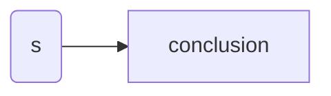

<head><link href="math.css" rel="stylesheet" type="text/css"></head>

<header>

<h1 class="Cream" id="brilliant">Brilliant</h1>
</header>

# LaTeX
[Documentation](https://en.wikibooks.org/wiki/LaTeX/Mathematics)

      $ ... $  -> inline
      $$ ... $$  -> block display
      $$ ... $$ (1)  -> display with equation number

### Resources
[Wondrium Course On Logic](https://www.wondrium.com/an-introduction-to-formal-logic)
[Brilliant Course on Logic](https://brilliant.org/courses/logical-languages/#chapter-introduction-31)

## Prepositional Logic
Propositional logic was derived for the rigorous exploration of both philosophy and mathematics and has been used to study logic since the 3rd century BC

Combination of philosophy and algebra

When translating a problem into formal logic, we give statements single-letter nicknames known as propositional variables. For example, we might refer to the statement **Penny is a knight** as $P$. 

the symbol $\equiv$ is called a **biconditional** which may be interpretted as if and only if that is $P\equiv Q$ means P is true if and only if Q is true So if we know that Q is false then we must conlude that P is false

$\neg P$ is the negation it is read as <b>Not </b> P

### Definitions 

<b class="text-yellow-300">Inductive arguments</b> are those that begin with observation and lead to broader generalised conclusions

<b class="text-yellow-300">Deductive arguments</b> An argument is deductive if the content of the conclusion is contained in the content of the premises

<b class="text-yellow-300">Non-amplitative</b> The conclusion is contained within the content of the premises

> Inductive reasoning only gives high propability *the sun has always risen and it would rise again* not absolute certainty

<b class="text-yellow-300">ethymeme</b> An argument with a suppreseed premise

$$\large ax^2+bx+c$$
$$\large \frac{-b\plusmn\sqrt{b^2-4ac}}{2a}$$

## Combinations <a href="https://simple.wikipedia.org/wiki/Combination_(mathematics)">link</a>

Looks at the number of possibilities to pick `k` objects from a set of `n`

$$_nC_k = \frac{!n}{!k!(n-k)}$$

## Permutations <a href="https://simple.wikipedia.org/wiki/Permutation">link</a>

Looks at the number of possibilities to pick `k` objects from a set of `n`

$$_nP_k = \binom{n}{k} = \frac{!n}{!(n-k)}$$

## Floor Functions

$$
⌊25.1⌋=25, ⌊−0.4⌋=−1, ⌊−9.9⌋=−10, ⌊7⌋=7.
$$