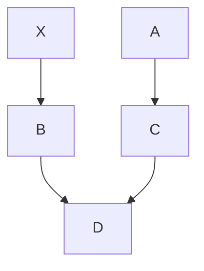
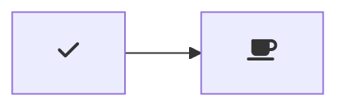
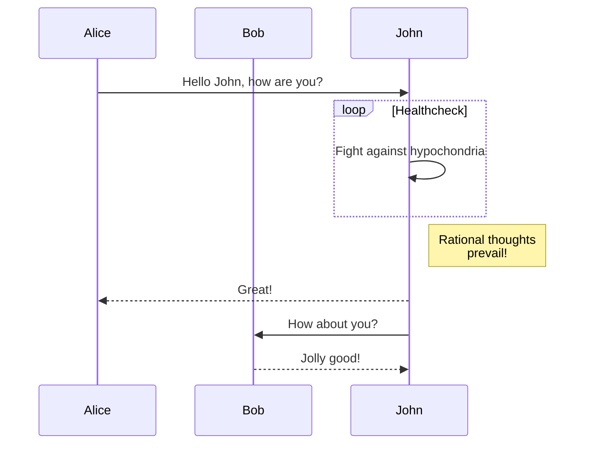
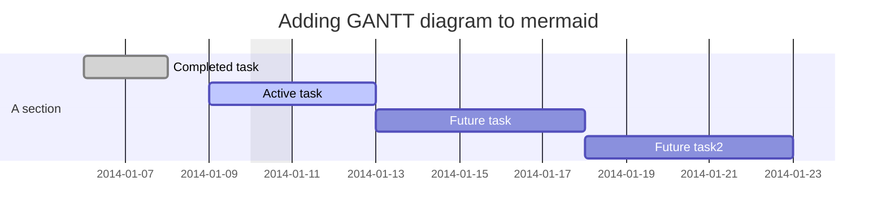
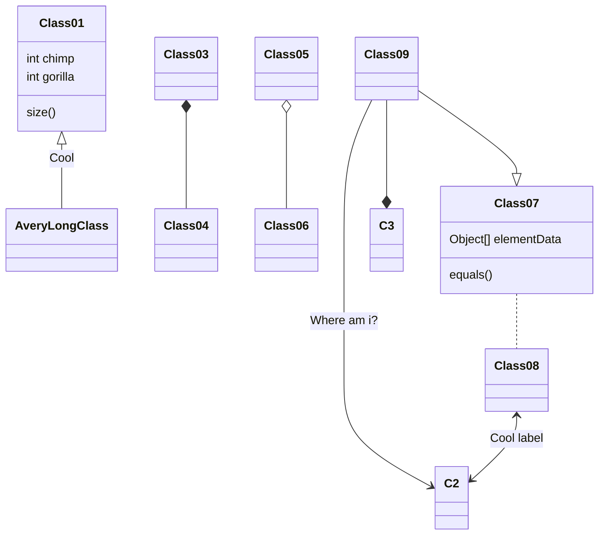
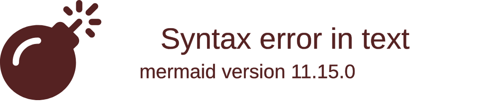
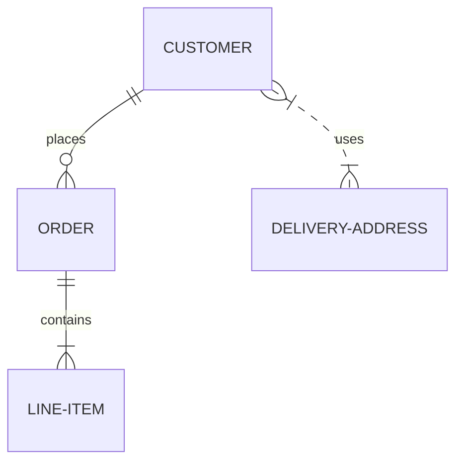
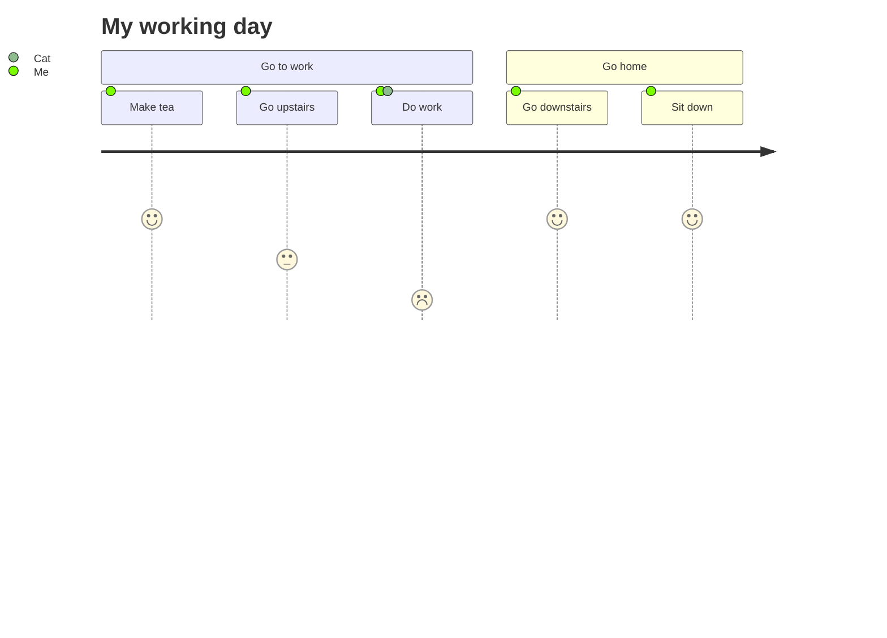
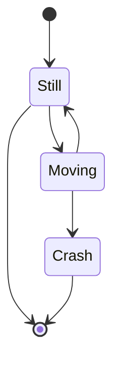
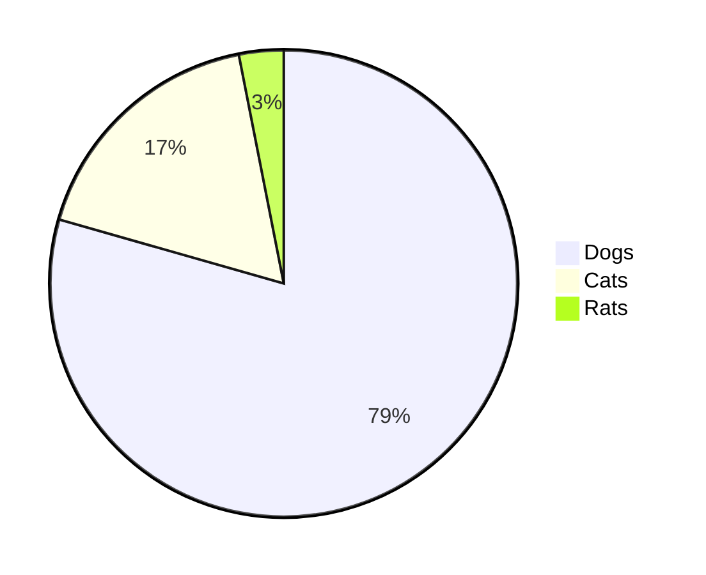

<head>
 
  <link 
    href="https://fonts.googleapis.com/css?family=Fira+Mono:500&display=swap" 
    rel="stylesheet">
    

</head>    

  

# Mermaid Flow Chart & Diagram

**<big class="Aqua">[Online Mermaid Editor](https://mermaid.live/)</big>**

**<big class="Aqua">[Online Mermaid Documentation](https://mermaid-js.github.io/mermaid/#/)</big>**

Git Graph :s

