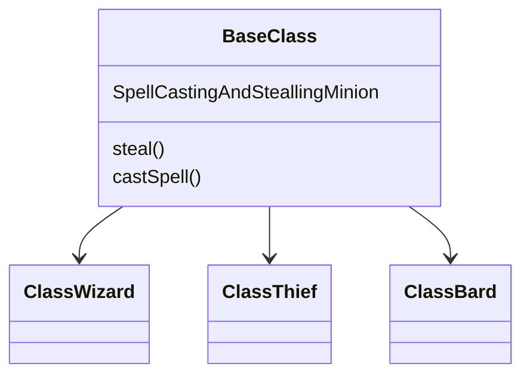
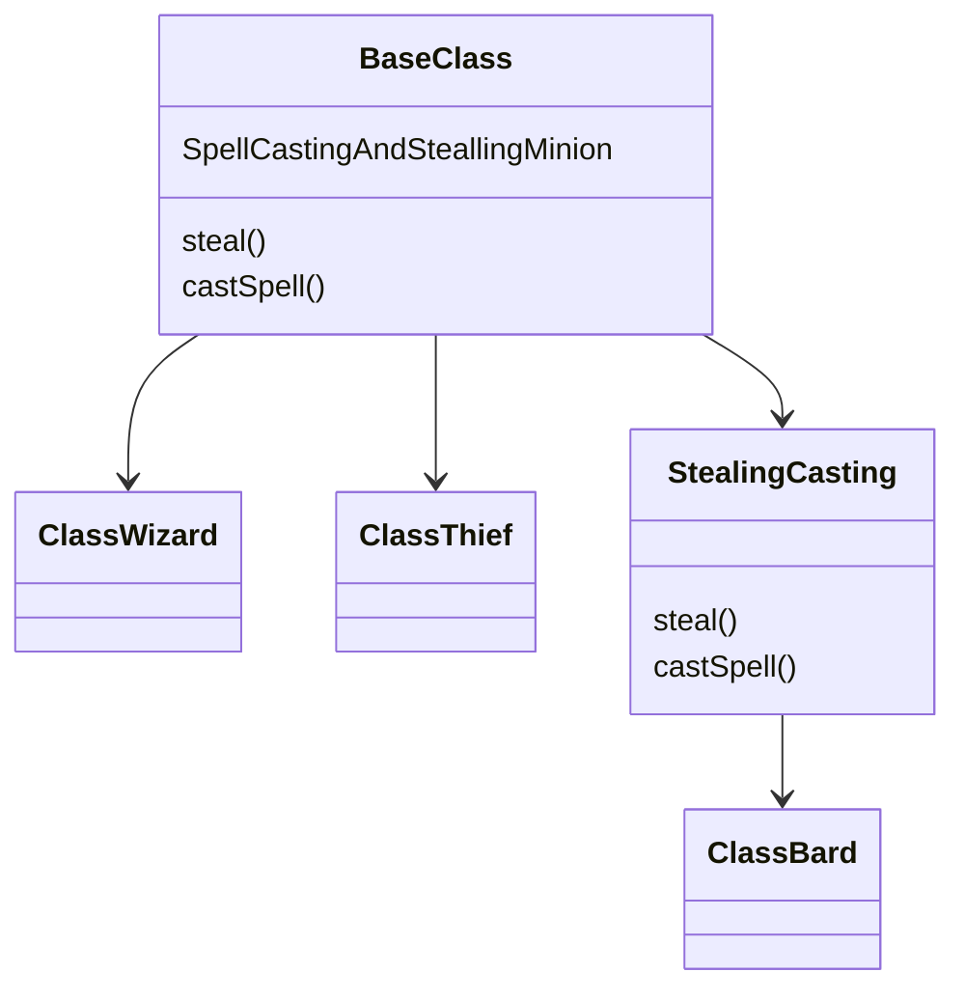
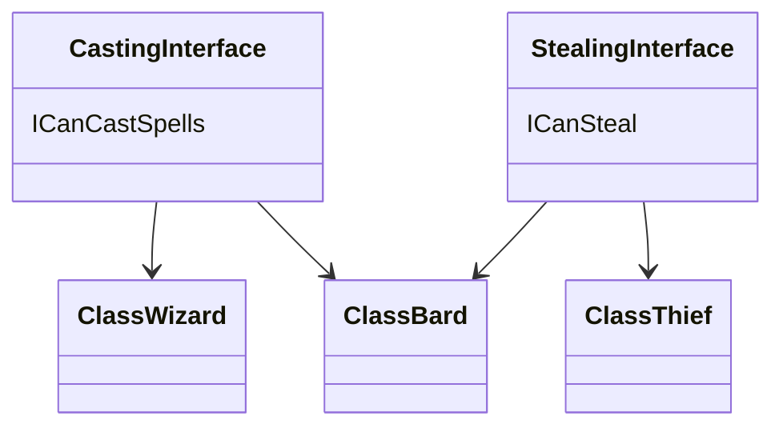
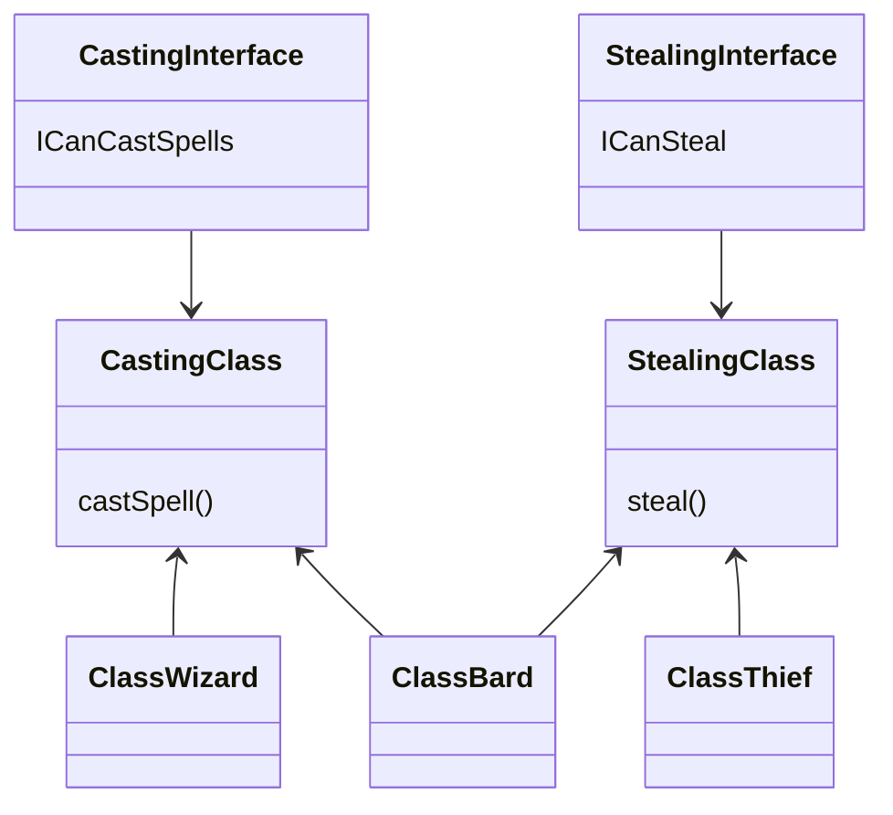

<head>
 
  <link 
    href="https://fonts.googleapis.com/css?family=Fira+Mono:500&display=swap" 
    rel="stylesheet">
    <script src="https://code.jquery.com/jquery-3.5.1.min.js" integrity="sha256-9/aliU8dGd2tb6OSsuzixeV4y/faTqgFtohetphbbj0=" crossorigin="anonymous"></script>
<style> 
body ::selection {
  /*highlighting*/
  background: transparent;
  text-shadow: 
    1px  0px 1px ,
    0px  1px 1px ,
    -1px  0px 1px ,
    0px -1px 1px ,
    0px  1px black ,
    1px  0px black ,
    -1px  0px black ,
    0px -1px black ;
  text-outline: black;  
}

</style>
</head>

# Mixins <span class="text-sm text-purple-300">Object Pattern</span>

Lets say you have two base classes `wizard` and `thief` but you want to   combine them into a class that can also play music a `bard` class. 

## <span class="is-danger has-text-danger">Wrong Solutions</span>

<div class="columns items-center">
  <div class="column">
Moving the <em>castSpell</em> and <em>steal</em> methods onto a <em>baseClass</em> that all the other classes can inherit. 

Methods that don't work will cause and be handled by exception <span class="text-red-600" title="The Liskov substitution principle is one of the SOLID principles of object oriented design. This means that derived classes must be substitutable for their base classes. Here the exception breaks the expectations of the base class so no substitutability">goodbye Liskov principle</span>

  </div>
  <div class="column items-center">


  </div>
</div>

<div class="columns items-center">
  <div class="column">


  </div>
  <div class="column">
Duplicates the <em>castSpell</em> and <em>steal</em> methods to be inherited by the <em>bard class</em> that all the other classes can inherit. 

The duplication would cause additional maintenance

  </div>

</div>

<div class="columns items-center">
  <div class="column">
We define interfaces <em>ICanSteal</em> and <em>ICanCastSpells</em> and make the classes implement these interfaces

  </div>
  <div class="column">


  </div>
</div>

<div class="columns items-center">
  <div class="column">
  

  </div>
  <div class="column">
Same as before but delegate implementation of stealing and casting to another class that could be reused by all the classes
  </div>
</div>

None of these solutions are particularly attractive <b class="text-green-500">but there is a solution</b>

## <span class="text-green-400">Solution</span>

We break down all these behaviors and encapsulate them inside separate objects
`canCastSpells` `canSteal` `canPlayMusic`

```js
const canCastSpells = {
  castsSpell(spells, target) {
    ...
  }
};

const canSteal = {
  steals(target, item) {
    ...
  }
};

const canPlayMusic = {
  playsMusic() {
    ...
  }
};

// create objects by composing behaviors together
function TheWizard(element, mana, name, hp){
  const wizard = {element, mana, name, hp}
  Object.assign(wizard, canCastSpells)
  return wizard
}
function TheThief(name, hp){
  const thief = {name, hp}
  Object.assign(thief, canSteal)
  return thief
}
function TheBard(instrument, mana, name, hp){
  const bard = {instrument, mana, name, hp}
  Object.assign(bard, canCastSpells, canSteal, canPlayMusic)
  return bard
}
```
`Object.assign()` lets you extend an object with other objects 
> this is known as ***concatenative prototypical inheritance*** ^
> This objects are usually called ***mixins***
> *In Javascript this is just a object you compose with other objects to provide additional behaviors or states*

### Object Composition with Classes

```js
class ClassyBard extends ClassyMinion{
  constructor(instrument, mana, name, hp){
    super(name, hp)
    this.instrument = instrument
    this.mana = mana
  }
}

Object.assign(ClassyBard.prototype, canSteal, CanCastSpells, canPlayMusic)
```

This is an example of <span class="text-yellow-500 font-bold">delegation-based prototypical inheritance</span> this means that methods like *steals* or *castsSpell* delegated to a single <u class="bg-indigo-500">prototype object</u>