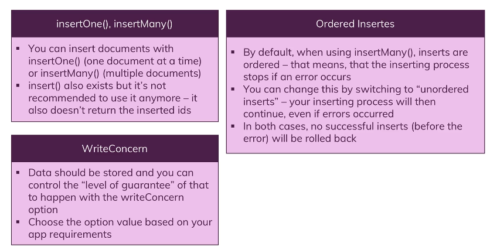
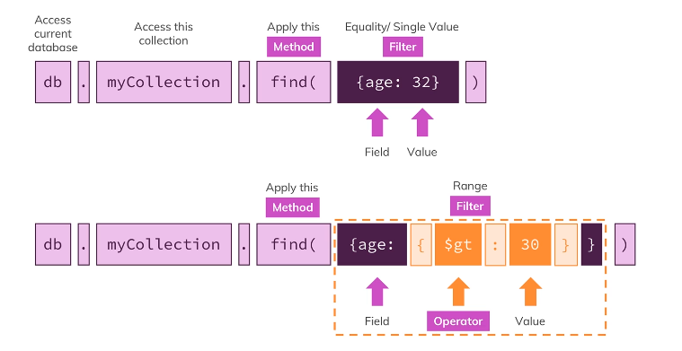

<head>
 
  <link 
    href="https://fonts.googleapis.com/css?family=Fira+Mono:500&display=swap" 
    rel="stylesheet">
    <script src="https://code.jquery.com/jquery-3.5.1.min.js" integrity="sha256-9/aliU8dGd2tb6OSsuzixeV4y/faTqgFtohetphbbj0=" crossorigin="anonymous"></script>
<style> 
body ::selection {
  /*highlighting*/
  background: transparent;
  text-shadow: 
    1px  0px 1px ,
    0px  1px 1px ,
    -1px  0px 1px ,
    0px -1px 1px ,
    0px  1px black ,
    1px  0px black ,
    -1px  0px black ,
    0px -1px black ;
  text-outline: black;  
}
.mongo{
  font-weight: bold;
  color: lightgreen;
  font-family: arial;
  font-size: large;
}
</style>
</head>    
<div id="stack-container">
  <a href="https://docs.mongodb.com/"></a>
</div>

#  <small class="SpringGreen">MongoDB</small>

<span class="mongo">mongo</span> 

Database

Collection

Documents - these could have different shaped <b class="HotPink">schemaless </b>

```json
{
  "key": "value",
  "embedded-document": {
    "field1" : "value",
    "field2" : 2,
    "field3" : true,
  }
}
```
### Mongo Server 

In terminal

    sudo systemctl [command] mongod

<p class="SkyBlue">Commands</p>

- `status` get status
- `enable` start mongo on system reboot
- `start` 
- `stop` 

<span class="SkyBlue">to start the mongo shell `mongo` below is a list of shell commands</span>
- `show dbs` display current databases
- `cls` clear screen 
- `use [db name]` start using database, you can even if it doesn't exist yet

      > use shop
      switched to db shop
      > db.products.insertOne({name: "A book", price: 12.99})
``` json
{
        "acknowledged" : true,
        "insertedId" : ObjectId("60612791e353098bacfb4e9c")
}

> db.products.find()

{ "_id" : ObjectId("60612791e353098bacfb4e9c"), "name" : "A book", "price" : 12.99 }

> db.products.find().pretty() // for pretty print

{
        "_id" : ObjectId("60612791e353098bacfb4e9c"),
        "name" : "A book",
        "price" : 12.99
}
```
### Find returns a cursor 

By default you only get the first 20 documents 
use toArray to not use this behaviour

    db.passengers.find().toArray()

## Reseting Database
Use a database that doesn't yet exists creates that database

    use databaseName
    db.dropDatabase()

similiarly you can drop a collection 

    db.myCollection.drop()

Number Types 

Integer (32) eg 55 NumberLong (int64) 1x10 <sup>34</sup> NumberDecimal 12.99

ObjectId

ISO Date 


`new Timestamp()`
`new Date()`

### Setting Fields 
<b class="FireBrick">{ <b class="Lime">$set:</b> { key : Pair } }</b>


## Data Structure 

<big class="Orange">Embedded</big>
<big class="RebeccaPurple">By reference</big>

## Get Help
``` bash
help                    # top level
db.help()               # help with database
db.col.help()           # help with collection
db.col.find().help()    # help with collection operation
show dbs                # show databases
show collections        # show collections
```
## Update and delete documents 
    db.collections.updateOne(filter, $set or $rename field)
    db.collections.updateMany(filter, $set or $rename field)

## Lookup 
> bassically joining but for mongo

``` js
db.collection.agregate(
  [{$lookup: 
    {
      from: "other collection" 
      localField: "local field where references are",
      foreignField: "_id",
      as: "alias for what to call the new object"
    }
   }]
)
```

## Validation 
### Validation Schema

## ObjectId
Mongo db could automatically generate a unique value to index collection

<big class="DarkKhaki">"_id" : ObjectId("60614759e451dbc5c0988fb9")</big>

- A 4-byte value that represent the seconds since the Unix epoch
- A 5-byte value that represents a random value
- A 3-byte value that represents a counter, which start from a random value

```js
// Object id contain creation dates 
ObjectId(
  "60614759e451dbc5c0988fb9"
).getTimestamp();

// Output 
ISODate("2021-01-07T13:39:27Z")
```

## <b class="Red">C</b>REATE Documents 

db.collection.<b class="Orange">insertOne ( </b><span class="ForestGreen"> { field: "value" } </span><span class="Orange">)</span>

db.collection.<b class="Orange">insertMany (</b><span class="ForestGreen"> [<br>&nbsp;&nbsp;&nbsp;&nbsp;&nbsp; { field: "value" },<br>&nbsp;&nbsp;&nbsp;&nbsp;&nbsp;{ field: "value" }<br>]</span><span class="Orange"> ) </span>

> When we are inserting the function returns mongo generated id which could be useful

## Mongo Import

You can use `mongoimport` to import a local file into your database 

    mongoimport ~/Desktop/dbcourse/tv-shows.json -d movieData -c movies --jsonArray --drop
  
Result 

    021-04-23T19:40:12.129-0400    
    connected to: mongodb://localhost/
    2021-04-23T19:40:12.130-0400    
    dropping: movieData.movies
    2021-04-23T19:40:12.328-0400    
    240 document(s) imported successfully.
    0 document(s) failed to import.

<span class="SpringGreen">Here we used mongo import to import a JSON from specified path and inserted documents into database movieDate into collection movies, since default is to assume only one document we specify that we have multiple documents with jsonArray. If database already exists we want to drop rather than append to already existing set</span>



## <b class="Red">R</b>EAD Documents 
### Contents
Methods filters & Operators 

Query Selectors (<b class="Red">R</b>EAD)
- comparisons
  - `$gt` `$lt` `$gte` `$lte` 
  - `$eq` `$neq` - not equal
  - using `$in` `$nin` specify a array of possible values eg <b class="Pink">{ runtime: { $in : [30, 42] } }</b>
- logical <i class="Gold">use logical operator for a array of conditions</i>
  - `$and` documents meet both conditions
  > this is important because you Json cant have the same key so `{genres: "Drama", genres: "Horror"}` will be equavalent to `{genres: "Horror"}`
  - `$not` opposite of querry expression

        db.movies.find({ 
          $or: [
            {"rating.average": {$lt: 5}}, 
            {"rating.average": {$gte: 9.4}},
        ]})

  - `$or` returns documents that that match at least one of the clauses 
  - `$nor` returns documents that fail to match both clauses 
- array
  - when you query normally you are searching for a element in the array
  - to do exact search use brackets eg.  `["Drama"]`
  - `$all` arrays match if they have all elements in specified array
  - `$elemMatch` if all elemMatch conditions are met <span class="LimeGreen">this is becuase array have a specific order </span>
  - `$size` selects documents with array of specified size
- element
  - `$exists` matches documents that have the specified field
  - `$type` selects documents if a field is of the specified type <span class="Yellow">remember JS quirks such as all numbers are double</span>
- evaluation
  - `$regex` selects documents where values match a specified regular expression <span class="Crimson">not very performant use</span> `$text`
  - `$expr` Allow use of aggregation expressions within the query language
  ``` js 
  // find documents where volume is greater than target
  { $expre: { $gt : [ "$volume", "$target"] } }
  ```
  - `$jsonSchema` validates documents against the gien JSON schema 
  - `$mod` performs a modulo operation on the value of a field and selects documents with a specified result
  - `$text` performs a text search
  - `$where` matches documents that satisfy a Javascript expression
- comments
- geospatial <span class="Crimson">covered in separate module</span>

Projection Operators (<b class="Red">R</b>EAD)
- `$` `$elemMatch` `$meta` `$slice`



`findOne()`

If no argument or {} then it will return first matching document

`find()`

unlike above this returns a cursor that limits all documents to the first 20 

`findMany()`