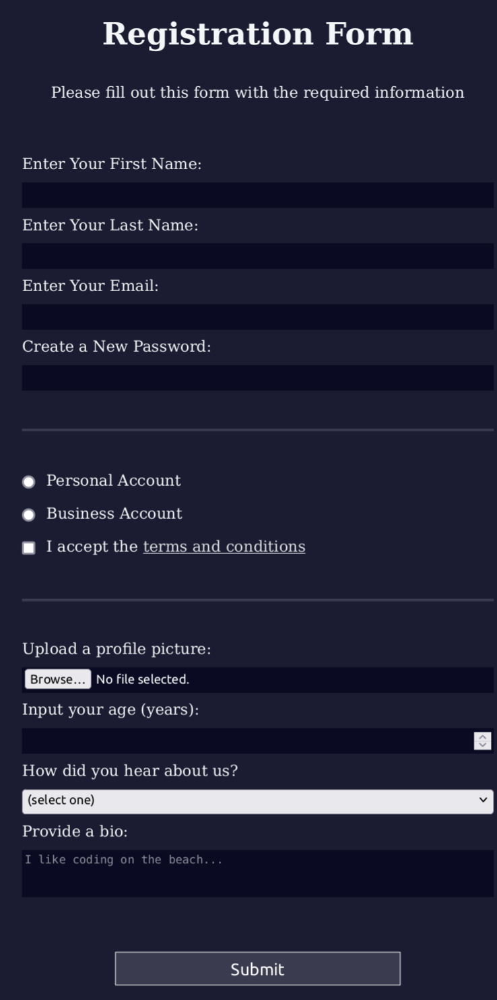

# The Goal

The page should look like this

<section id="description">

<strong>Objective:</strong> Build an app that is functionally similar to <a href="https://survey-form.freecodecamp.rocks" target="_blank" rel="noopener noreferrer nofollow">https://survey-form.freecodecamp.rocks</a>

<strong>User Stories:</strong>

<ol>
<li>You should have a page title in an <code>h1</code> element with an <code>id</code> of <code>title</code></li>
<li>You should have a short explanation in a <code>p</code> element with an <code>id</code> of <code>description</code></li>
<li>You should have a <code>form</code> element with an <code>id</code> of <code>survey-form</code></li>
<li>Inside the form element, you are <strong>required</strong> to enter your name in an <code>input</code> field that has an <code>id</code> of <code>name</code> and a <code>type</code> of <code>text</code></li>
<li>Inside the form element, you are <strong>required</strong> to enter your email in an <code>input</code> field that has an <code>id</code> of <code>email</code></li>
<li>If you enter an email that is not formatted correctly, you will see an HTML5 validation error</li>
<li>Inside the form, you can enter a number in an <code>input</code> field that has an <code>id</code> of <code>number</code></li>
<li>If you enter non-numbers in the number input, you will see an HTML5 validation error</li>
<li>If you enter numbers outside the range of the number input, which are defined by the <code>min</code> and <code>max</code> attributes, you will see an HTML5 validation error</li>
<li>For the name, email, and number input fields, you can see corresponding <code>label</code> elements in the form, that describe the purpose of each field with the following ids: <code>id="name-label"</code>, <code>id="email-label"</code>, and <code>id="number-label"</code></li>
<li>For the name, email, and number input fields, you can see placeholder text that gives a description or instructions for each field</li>
<li>Inside the form element, you should have a <code>select</code> dropdown element with an <code>id</code> of <code>dropdown</code> and at least two options to choose from</li>
<li>Inside the form element, you can select an option from a group of at least two radio buttons that are grouped using the <code>name</code> attribute</li>
<li>Inside the form element, you can select several fields from a series of checkboxes, each of which must have a <code>value</code> attribute</li>
<li>Inside the form element, you are presented with a <code>textarea</code> for additional comments</li>
<li>Inside the form element, you are presented with a button with <code>id</code> of <code>submit</code> to submit all the inputs</li>
</ol>

Fulfill the user stories and pass all the tests below to complete this project. Give it your own personal style. Happy Coding!

<strong>Note:</strong> Be sure to add <code>&lt;link rel="stylesheet" href="styles.css"&gt;</code> in your HTML to link your stylesheet and apply your CSS

</section>

