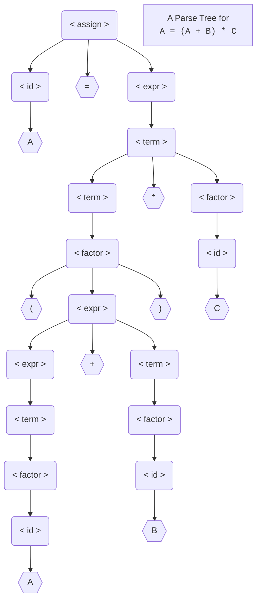
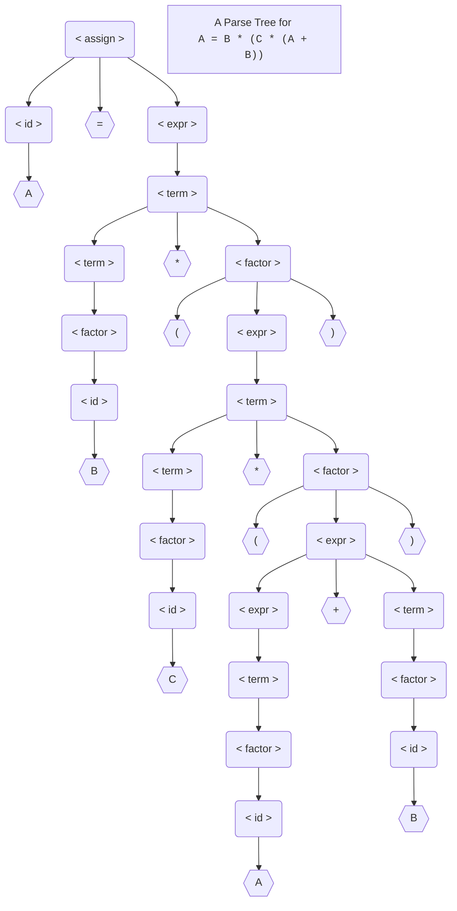
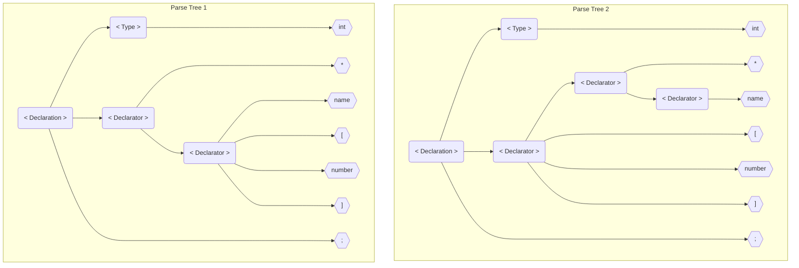

# Assignment 1 - Module 1 

Please watch the assignment instruction video before working on the assignment.  You can write your assignment by hand on paper and then scan it, or just prepare your assignment as a WORD document.

1. (20 points) Do problem 7(a)(d) on page 157.  


    ```bnf
    EXAMPLE 3.4
    An Unambiguous Grammar for Expressions
    <assign>  -> <id> = <expr>
    <id>      -> A | B | C
    <expr>    -> <expr> + <term>
        | <term>
    <term>    -> <term> * <factor>
        | <factor>
    <factor>  -> ( <expr> )
        | <id>
    ```

    7. Using the grammar in Example 3.4, show a parse tree and a leftmost
    derivation for each of the following statements:

<div class="columns">
  <div class="column">
      <b>a. A = (A + B) * C</b>

$$
\begin{aligned}
\textsf{<assign>}&\rArr \textsf{<id> = <expr>} \\
&\rArr \textsf{A = <expr>}\\
&\rArr \textsf{A = <term>}\\
&\rArr \textsf{A = <term> * <factor>}\\
&\rArr \textsf{A = <factor> * <factor>}\\
&\rArr \textsf{A = ( <expr> ) * <factor>}\\
&\rArr \textsf{A = ( <expr> + <term> ) * <factor>}\\
&\rArr \textsf{A = ( <term> + <term> ) * <factor>}\\
&\rArr \textsf{A = ( <factor> + <term> ) * <factor>}\\
&\rArr \textsf{A = ( <id> + <term> ) * <factor>}\\
&\rArr \textsf{A = ( A + <term> ) * <factor>}\\
&\rArr \textsf{A = ( A + <factor> ) * <factor>}\\
&\rArr \textsf{A = ( A + <id> ) * <factor>}\\
&\rArr \textsf{A = ( A + B ) * <id>}\\
&\rArr \textsf{A = ( A + B ) * C} \quad \checkmark\\
\end{aligned}
$$
  
  </div>
  <div class="column">
  


  </div>
</div>

<div class="columns">
  <div class="column">
      <b>d. A = B * (C * (A + B))</b>

$$
\begin{aligned}
\textsf{<assign>}&\rArr \textsf{<id> = <expr>} \\
&\rArr \textsf{A = <expr>}\\
&\rArr \textsf{A = <term>}\\
&\rArr \textsf{A = <term> * <factor>}\\
&\rArr \textsf{A = <factor> * <factor>}\\
&\rArr \textsf{A = <id> * <factor>}\\
&\rArr \textsf{A = B * <factor>}\\
&\rArr \textsf{A = B * ( <expr> )}\\
&\rArr \textsf{A = B * ( <term> )}\\
&\rArr \textsf{A = B * ( <term> * <factor> )}\\
&\rArr \textsf{A = B * ( <factor> * <factor> )}\\
&\rArr \textsf{A = B * ( <id> * <factor> )}\\
&\rArr \textsf{A = B * ( C * <factor> )}\\
&\rArr \textsf{A = B * ( C * ( <expr> ) )}\\
&\rArr \textsf{A = B * ( C * ( <expr> + <term> ) )}\\
&\rArr \textsf{A = B * ( C * ( <term> + <term> ) )}\\
&\rArr \textsf{A = B * ( C * ( <factor> + <term> ) )}\\
&\rArr \textsf{A = B * ( C * ( <id> + <term> ) )}\\
&\rArr \textsf{A = B * ( C * ( A + <term> ) )}\\
&\rArr \textsf{A = B * ( C * ( A + <factor> ) )}\\
&\rArr \textsf{A = B * ( C * ( A + <id> ) )}\\
&\rArr \textsf{A = B * ( C * ( A + B ) )}
\quad \checkmark\\
\end{aligned}
$$
  </div>
  <div class="column">
  

  </div>
</div>

  Note that you need to build a parse tree AND do a leftmost derivation for each one of the two statements. 
  **When doing derivation *only* expand *one* term at a time**
  **Leftmost derivation means *only* expand *leftmost* term at a time**

2. (10 points) The following is a BNF description of the C/C++ pointer and array declarations:

> When working on this problem don't forget the semicolon `;` its a terminal symbol

``` bnf
<Declaration> -> <Type> <Declarator>;
<Type> -> int | char
<Declarator> -> * <Declarator>
            | <Declarator> [ number ]
            | name
```
```{admonition} Examples that fit the grammar
:class: note

$\textbf{int * name;}$
$\textbf{int name[number];}$

the derivations of the above examples grammars are not going to be ambiguous
you will only create one parse tree for each example, 
you would have to create a example that *is* ambiguous 
```


Prove that this grammar is **ambiguous**.

```{hint}
Find a sentence that can be generated using two different parse trees.  Write down the sentence and then draw the two trees that generate this sentence.
```

<big style="color:yellow;font-weight:bold">ANSWER:</big>




3. (10 points) Do problem 12 on page 158.
      ```{note}
      **\<S>** is the start symbol in this grammar. 
      ```

      1.   Consider the following grammar:
      ```bnf
      <S> -> a <S> c <B> | <A> | b
      <A> -> c <A> | c
      <B> -> d | <A>
      ```
      **Which of the following sentences are in the language generated by this grammar?**

```bnf
a. abcd ✅

      <S>
  a <S> c <B>  
     b     d

b. acccbd ❌ "bd" in that order can't be derived 

          <S>
  a  <S>  c <B>
     <A>     d
    c <A>
      c <A>

c. acccbcc ❌ to get "b" we need to terminate <S> but that would lead to ab

      <S>
  a <S> c <B>
    <A>   <A>
    c <A>

d. acd ❌ "cant reduce <S>"

      <S>
  a <S> c <B>
           d

e. accc ✅

      <S>
  a <S> c <B>
    <A>   <A>
     c     c
```