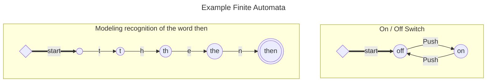

# Theory of Computing
## Automata Theory

**1930s** : Automata theory is the study of abstract computing devices, or *machines* 
The word automata comes from automation or machine

### The Central Concepts of Automata Theory

**The fundamental question in computer science** What different models of machines can do and cannot do
--->  **The theory of computation**

**Computability vs Complexity** We can compute but it is too complex

**Alphabet** is a set of symbols, from the set a lists of these symbols is a known as **strings** and the set of these strings can be termed a **language**

#### Alphabet

An alphabet is a finite, <u>nonempty</u> set of symbols

```{tip}
By convention we use the symbol $\Sigma$ for an alphabet
```
```{admonition} Example Alphabet
1. $\Sigma\ =\ \Set{0,1}$ the *binary* alphabet
2. $\Sigma\ =\ \Set{a,b,\cdots,z}$ the set of all *lowercase letters* 
3. The set of all ASCII characters or set of all printable ASCII characters
4. Alphanumeric: $\qquad\Sigma\ =\ \Set{a-z, A-Z, 0-9}$
5. DNA molecules: $\ \ \quad\Sigma\ =\ \Set{a,c,g,t}$
```
#### Strings
##### Empty String
This string, denoted $\epsilon$ 
##### Length of a String
Standard notation for length of a string $w\quad is\quad | w |\quad eg\ |011|=3\ and\ |\epsilon|=0$
##### Powers of an Alphabet
We can express the <b><u>set of all strings of a certain length</b></u>

*eg* $\displaystyle\quad\Sigma^1=\Set{0,1}\quad\Sigma^2=\Set{00,01,10,11}\quad\Sigma^3=\Set{000,001,010,011,100,101,110,111} $

```{admonition} Type Convention for Symbols and Strings
We use *lower-case* letters at the **beginning** of the alphabet to denote symbols
and *lower-case* letters at the **end** *eg* $w,x,y\ and\ z$ to denote strings
```

The set of all strings over an alphabet is denoted $\Sigma^*$
*eg* $\quad\Set{0,1}^* = \Set{\epsilon,0,1,00,01,10,11,000,\cdots}$
*another way* $\quad\displaystyle\Sigma^*=\Sigma^0\cup\Sigma^1\cup\Sigma^2\cup\cdots$


When we *exclude the empty* set then the notation becomes $\Sigma^+$
$\Sigma^+ = \Set{\Sigma^0\cup\Sigma^1\cup\Sigma^2\cup\cdots}$
$\Sigma^* = \Sigma^+ \cup  \Set{\epsilon}$

##### Concatenation of Strings
Let $x$ and $y$ be strings
Then $xy$ denotes the *concatenation* of $x$ and $y$

#### Languages

A set of strings chosen from some $\Sigma^*$ where $\Sigma$ being a particular alphabet is called a ***language***

>The only real constraint is that all alphabets are finite, thus a language can only draw from a finite alphabet 

#### Problems

> In automata theory, a ***problem*** is the question of deciding whether a given string is a member of some particular language 


### Summary 
<span style="color:violet"><b>AUTOMATA</b> The Methods and the Madness</span>

<ul style="list-style-type:'💠&nbsp;&nbsp;&nbsp;';padding-left:1em">
  <li><h4>Finite Automata</h4> involves states and transitions among states in response to inputs  <br><br>They useful for building several different kinds of software such as ...
    <ul>
      <li> Lexical analysis component of a compiler </li>
      <li> Systems for verifying the correctness of circuits or protocols </li>
    </ul>
  </li>
  <li><h4>Regular Expressions</h4> a structural notation for describing the same patterns that be represented by finite automata
  <br><br>They are used in many types of software including ...
    <ul>
      <li>tools and search for patterns in text or in file names</li>
    </ul>  
  </li>
  <li><h4>Contest-Free Grammars</h4> Used for describing the structure of programming languages and related sets of strings;<br> they are used to build the parser component of a compiler</li>
  <li><h4>Turing Machines</h4>These are automata that model the power of real computers <br> allowing us to study <em>decidability</em> the question of what can or can not be by a computer <br> also allow us to distinguish <em>tractable problems</em> those that can be solved in polynomial time and those that cannot</li>
  <li><h4>Deductive Proofs</h4> The basic method proceeds by listing statements that either true or that follow logically from some previous statement</li>
  <li><h4>Proving If-Then Statements</h4> statement(s) following if are <strong>hypothesis</strong> and what follows then is the <strong>conclusion</strong> <blockquote>We begin with the hypothesis, continuing with logically follow through statements until the conclusion is proved as on of the statements</blockquote></li>
  <li><h4>Proving If-And-Only-If Statements</h4> These are proved in <em>both</em> directions</li>
  <li><h4>Proving the Contrapositive</h4> statement <em>if H then C</em> is equivalent and can be proved by the statement <em>if not C then not H</em></li>
  <li><h4>Proving the Contradiction</h4> statement <em>if H then C</em> is equivalent and can be proved by the statement <em>if H and not C</em></li>
  <li><h4>Counterexamples</h4> Finding one counterexample can be the quickest way to determine truthiness something</li>
  <li><h4>Inductive Proofs</h4> Proof the <em>base case - n</em>  and then you prove the <em>inductive step - n + 1</em> this proves the statement by induction  </li>
  <li><h4>Structural Inductions</h4> We can especially use induction for recursive structure, such as trees, this is a special type of induction</li>
  <li><h4>Alphabets</h4> An alphabet is a <em>finite</em> sequence of symbols</li>
  <li><h4>Strings</h4> A string is a finite-length sequence of symbols</li>
  <li><h4>Languages and Problems</h4> A language is a <em>possible infinite set of strings</em> all of which choose their symbols from some one alphabet <br>
  When the strings if a language are to be interpreted in some way the question of whether a string is in the language is sometimes called a <strong>problem</strong> 
 </li>
</ul>

## Finite Automata

> A **finite automaton** has a set of states and it's *control* moves from state to state in response to external *inputs* 


### Examples

The circles are known as **states** and the links define **actions**
Double circle is the **end state**
There is a thick arrow that represents the **start state**




### Deterministic vs NonDeterministic

#### Deterministic Finite Automata

Control is 
**deterministic *DFA*** meaning that the automaton cannot be in more than one state at any one time 
or **nondeterministic *NFA*** meaning that it may be in several states at once

##### Key Components of DFAs'

$\tt{Q}_{\phantom{0}} \Rrightarrow \color{yellow}\text{a finite set of states}$
$\tt\Sigma_{\phantom{0}} \Rrightarrow  \color{yellow}\text{a finite set of input symbols (\color{darkkhaki}{alphabet}})$
$\tt{q}_0 \Rrightarrow  \color{yellow}\text{a start state}$
$\tt{F}_{\phantom{0}} \Rrightarrow  \color{yellow}\text{a set of final or accepting states}$
$\displaystyle \tt{\delta}_{\phantom{0}} \Rrightarrow  \color{yellow}\text{a transition function which is mapping between}
\quad \color{lightsteelblue} \delta:  Q \times \Sigma \rightarrow Q$

$\displaystyle\color{Orange}\text{If q is a state, and a is a input symbol then }\delta(q,a)\\
\text{is that state p such that there is an arc labeled a from q to p}$


A **DFA** is defined by a *5 tuple* $\color{skyblue}{\sf\qquad\Set{Q,\Sigma,F, q_0, \delta}}$

###### How a DFA Processes Strings

A DFA needs to decide wether to <font color="lime"><b>accept</b></font> or <font color="red"><b>reject</b></font> a given set of inputs 

$\tt{a_1a_2\cdots a_n} \Rrightarrow \color{yellow}\text{a sequence of input symbols}$
$\tt{\delta(q_0,a_1) = q_1} \Rrightarrow \color{yellow}\text{We begin at the start state and given the first input symbol we transition to the next state}$
$\tt{\delta(q_1,a_2) = q_2} \Rrightarrow \color{yellow}\text{Next the next input symbol using the transition function we move to the next state}$
$\tt{q_0q_1\cdots q_n} \Rrightarrow \color{yellow}\text{a sequence states that are traversed with the transition functions}$
$\tt{\delta(q_{i-1},a_i) = q_i} \Rrightarrow \color{yellow}\text{In general we keep finding states given this transition functions}$

$\displaystyle\color{Orange}\text{If the last state is the final state, accept or reject if it is not}$


<div class="columns">
  <div class="column">


  </div>
  <div class="column">

$\tt{M}_1 = (Q, \Sigma, \delta, q_1, F)$
$\tt Q_{\phantom{0}} =  \Set{q_1, q_2, q_3}$
$\tt \Sigma_{\phantom{0}} =  \Set{0,1}$
$\tt F_{\phantom{0}} =  \Set{q_3}$

  </div>
  <div class="column">

 $\delta =$ | 0 | 1
--: | :--: | :--:
 $q_1$ | $q_1$ | $q_2$  
 $q_2$ | $q_1$ | $q_3$  
 $q_3$ | $q_3$ | $q_3$  
  </div>
</div>


> We can either use a **transition diagram** or a **transition table** to show the automaton

#### Non-Deterministic Finite Automatons
These have the power to be in **several states at once**

They are really useful for searching in a string\
and they are more terse than their DFA counterparts\
they can be converted to and back easily to DFAs

$L = \Set{w\mid w \text{ contains all the strings that end with }00}$

{width=600px height=400px}

Convert the following NFA into a NFA 
$* \text{ means accepting state}$

&nbsp; | 0 | 1
--: | :--: | :--:
$\rightarrow p$ | $\Set{p,q}$ | $\Set{p}$
$q$ | $\Set{r}$ | $\Set{r}$
$r$ | $\Set{s}$ | $\emptyset$
$*s$ | $\Set{s}$ | $\Set{s}$

define all the subsets $Q_D =\text{ all subsets }Q_n$

&nbsp; | 0 | 1
--: | :--: | :--:
 $\Set{p}$ | $\Set{p,q}$ | $\Set{p}$
 $\Set{p,q}$ | $\Set{p, q, r}$ | $\Set{p, r}$
 $\Set{p,r}$ | $\Set{p,q, s}$ | $\Set{p}$
 $\Set{p,q,r}$ | $\Set{p, q, r, s}$ | $\Set{p, r}$
 $\Set{p,q,s}$ | $\Set{p, q, r, s}$ | $\Set{p, r, s}$
 $\ddots$ |  $\vdots$ | $\vdots$


**Important distinctions between DFAs and NFAs**
The machine never really terminates
*It is always waiting for the next input symbol or making transitions*

The machine decides when to <u>consume</u> the next symbol from the input and when to <u>ignore</u> it
*but the machine can <u>never skip</u> a symbol* 

A single transition *cannot* consume more that one (non-$\epsilon$) symbol

#### FA with $\epsilon$-Transitions
• We can allow explicit $\epsilon$-transitions in finite automata
• i.e., a transition from one state to another state without consuming any
additional input symbol
• Explicit $\epsilon$-transitions between different states introduce non-determinism
• Makes it easier sometimes to construct NFAs

> **Definition** $\epsilon$-NFAs are those NFAs with at least one explicit $\epsilon$-transition defind

• $\epsilon$-NFAs have one more column in their transition table

##### Examples of an $\epsilon$-NFA

$L=\Set{w\mid w \text{ is empty, or if non-empty will end in }01}$


 $\delta_E$ | 0 | 1 | $\epsilon$-closure
--: | :--: | :--: | :--:
 $\rightarrow *q'_0$ | $\emptyset$ | $\emptyset$ | $\Set{q'_0, q_0}$
 $q_0$ | $\Set{q_0, q_1}$ | $\Set{q_0}$ | $\Set{q_0}$ 
 $q_1$ | $\emptyset$ | $\Set{q_2}$ | $\Set{q_1}$ 
 $*q_2$ | $\emptyset$ | $\emptyset$| $\Set{q_2}$ 

ε-closures of a state q, <font color="royalblue">ECLOSE(q)</font> is the set of all states (including itself) 
that can be reached from q by repeatedly making an arbitraty number of ε-transitions 


 $\delta_E$ | 0 | 1
--: | :--: | :--: | :--:
 $\rightarrow *\Set{q'_0,q_0}$ | $\Set{q_0, q_1}$ | $\Set{q_0}$
 $\Set{q_0, q_1}$ | $\Set{q_0, q_1}$ | $\Set{q_0, q_2}$
 $\Set{q_0}$ | $\Set{q_0, q_1}$ | $\Set{q_0}$  
 $*\Set{q_0, q_2}$ | $\Set{q_0, q_1}$ | $\Set{q_0}$ 

### Summary
<span style="color:violet"><b> FINITE AUTOMATA</b> </span>

<ul style="list-style-type:'💠&nbsp;&nbsp;&nbsp;';padding-left:1em">
  <li><h4>Deterministic Finite Automata</h4> A <strong><em>DFA</em></strong> has a set of states and a finite set of input symbols <br>and zero or more states are <em>accepting states</em><br>
  A <strong>transition function</strong> determines how the state changes each time an input symbol is processed
  </li>
  <li><h4>Transition Diagrams</h4> Used for describing the structure of programming languages and related sets of strings;<br> they are used to build the parser component of a compiler</li>
  <li><h4>Language of an Automaton</h4>These are automata that model the power of real computers <br> allowing us to study <em>decidability</em> the question of what can or can not be by a computer <br> also allow us to distinguish <em>tractable problems</em> those that can be solved in polynomial time and those that cannot</li>
  <li><h4>Nondeterministic Finite Automata</h4> The basic method proceeds by listing statements that either true or that follow logically from some previous statement</li>
  <li><h4>The Subset Construction</h4> statement(s) following if are <strong>hypothesis</strong> and what follows then is the <strong>conclusion</strong> <blockquote>We begin with the hypothesis, continuing with logically follow through statements until the conclusion is proved as on of the statements</blockquote></li>
  <li><h4> ϵ - Transitions</h4> These are proved in <em>both</em> directions</li>
  <li><h4>Text-Searching Applications</h4> statement <em>if H then C</em> is equivalent and can be proved by the statement <em>if not C then not H</em></li>
</ul>

## Regular Expressions and Languages

*Regular Expressions* are a type of <u>language-defining notation</u>

### Operators of Regular Expression

> **example** $01^*+10^*$ denotes the language consisting of all strings that are either $0$ or $1$ followed by any number of $0\mid 1$s

1) **The union of two languages**\
   $L$ and $M$, denoted $L\cup M$, is the set of strings that are in either $L$ or $M$, or both


2) **The concatenation of languages**\
   $L$ and $M$, is the set of strings that can be formed by taking any string in $L$ and concatenating it with any string in $M$
$$
\color{lightsteelblue}{\textbf{Example}}\\
\begin{aligned}
L=&\Set{001, 10, 111}\\
M=&\Set{\epsilon, 001}\\
L\cup M =&\Set{\epsilon, 10, 001, 111}\\
L\cdot M\ or\ LM =&\Set{10, 001, 111, 001001, 10001, 111001}
\end{aligned}
$$

3) ***Closure or Star, or Kleene Closure***\
   $L$, denoted $L^*$ and represents the set of those strings that can be formed by taking any number of strings from $L$ possibly with repetitions and concatenating all of them
   *eg* $\qquad \color{violet} L=\Set{0,11}$ then $L^*$ consists of those strings where $0$s and $1$s come in pairs
   $\color{lightgreen} 001, 11110$ but not $\color{indianred} 01011, 101$ $LL\cdots L$ concatenation of i copies of L

#### Building Regular Expressions

We will use the three operators <font color="violet">union</font>, <font color="palegreen">dot</font> and <font color="brown">star</font>

1. The constants $\epsilon$ and $\theta$ are regular expressions, denoting the languages $\Set{\epsilon}$ and $\theta$, respectively 
That is $L(\epsilon)=\Set{\epsilon}$, and $L(\theta)=\theta$

2. If $a$ is any symbol, then $a$ is a regular expression
This expression denotes the language $\Set{a}$ That is, $L(\mathbf{a})=\Set{a}$ 
**Note** boldface font denote an expression corresponding to a symbol

3. A variable usually capitalized and italic such as $\mathit{L}$ is a variable representing any language


