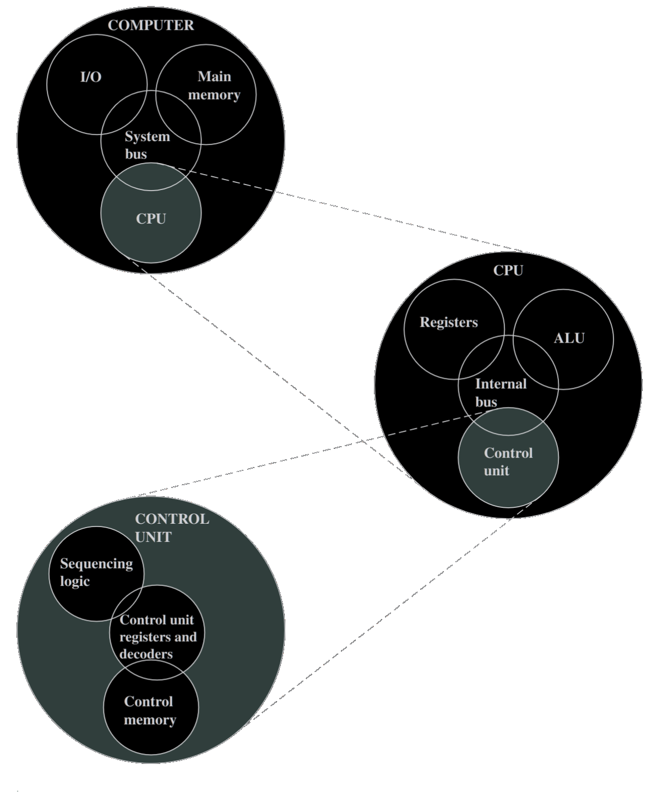

# Computer Organization

Computer architecture
: refers to those attributes of a system visible to a programmer
: those attributes that have a impact on the logical execution of a program

instruction set architecture (ISA)
: defines instruction formats, instruction opcodes, registers, instruction and data memory;
the effect of executed instructions on the registers and memory; 
and an algorithm for controlling instruction execution
*often interchangeable with **computer architecture***

computer organization
: refers to the operational units and their interconnection that realize the architectural specifications

- <b>examples of <em>architectural attributes</em></b>
  - instruction set
  - number of bits used to represent various data types
    - eg numbers, characters etc
  - I/O mechanisms
  - techniques for addressing memory 

- <b>examples of <em>organizational attributes</em></b>
  hardware details transparent to programmer
  - control signals
    - interfaces between the computer and peripherals
  - memory technology used 

For example, it is an <b>architectural design issue</b> whether a computer will have a <i>multiply instruction</i>

It is an <b>organizational issue</b> whether that instruction will be implemented by a special multiply unit or by a mechanism that makes repeated use of the add unit of the system

The <b>organizational decision</b> may be based on 
&starf; the anticipated frequency of use of the multiply instruction
&starf; the relative speed of the two approaches
&starf; the cost and physical size of a special multiply unit

## Structure and Function

**Structure** the way in which components are interrelated
**Function** the operation of each individual component as part of the structure

When it comes to *top-down* or *bottom-up* it is better to be *bottom-up*

### Function

**4 basic functions that a computer can perform**
- **Data Processing** 
- **Data Storage** 
- **Data Movement** 
- **Control**

#### Structure

{ width=50% }

## Computer Arithmetic