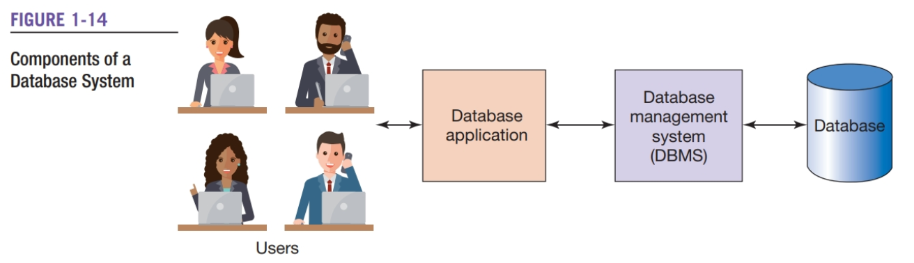
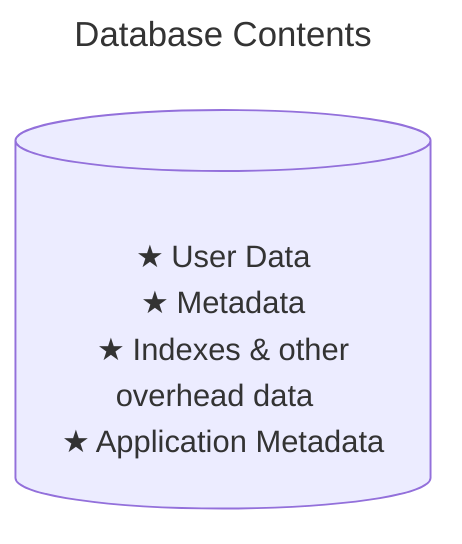
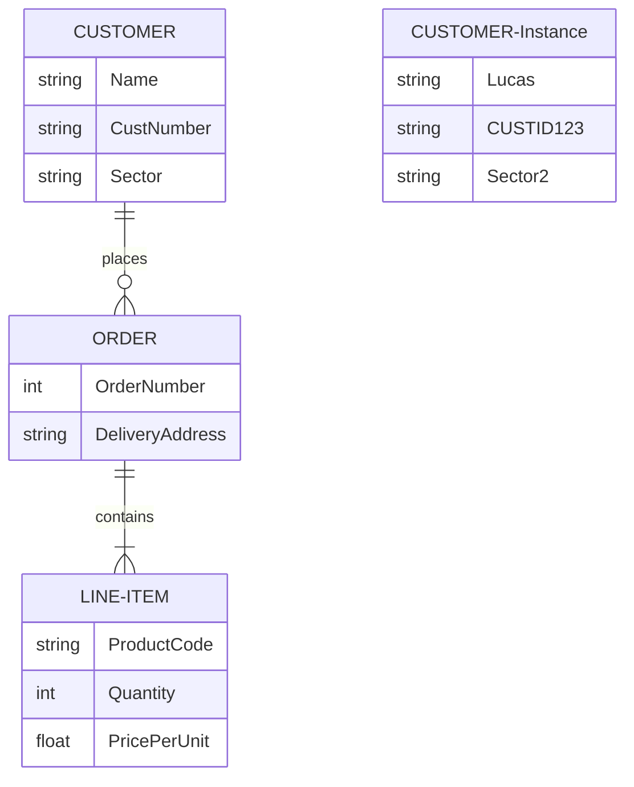

[[TOC]]

# Database Programming

  Stanford DB Course  
  
  
  Database Tutorial for Beginners
  Database Fundamentals Full Course
  

## Getting Started
!!! Tip Case rules
    tables are in all uppercase letters 
    column names have initial capitals
    and when column names have more than one word words are capitalized

        STUDENT, ADVISOR                <-- example tables names
        LastName, AdvisorEmail, Phone   

  

    Table = File = Relation
  

  

    Row = Record = Tuple
  

  

    Column = Field = Attribute
  

### Basic Operations

**`insert`, `update`, `delete`**

### SQL

*[SQL]: Structured Query Language

> The leading technique for data definition & manipulation 

*SQL is an international standard for creating, processing, and querying databases and their tables*

Using SQL you can:
&rect; Reconstruct lists from their underlying tables
&rect; Query for specific data conditions
&rect; Perform calculations on data in tables
&rect; Insert, update, and delete data

### Database System

{width=500}

Database
: Collection of related tables and other structures

*[DBMS]: Database Management System

DBMS
: Computer program used to create, process & administer the database

Database Application
: A set of one or more computer programs that serves as an intermediary
between the user and the DBMS

Users
: Employ a database application to keep track of things
they use forms to read, enter & query data, as well as producing reports

#### Database

*A **database** is a <u>self-describing</u> collection of related tables*
&dash; <b>Self-describing</b> means a description of the structure of the database is contained with the database itself
&dash; <b>Metadata</b> is data about the structure of the database

#### DBMS

The purpose of a DBMS is to create, process and administer databases

Examples of DBMS products include:
&bull; Microsoft Access
&bull; Microsoft SQL Server
&bull; Oracle Corporation’s MySQL
&bull; Oracle Corporation’s Oracle Database
&bull; IBM’s DB2

**Referential integrity constraints** are rules enforced by the  DBMS to ensure values of a column in one table are valid when compared to values in another table

> For example, in the Art Course database what would happen if a user mistakenly entered 9 for CustomerNumber in the ENROLLMENT table?
>  Since 9 does not exist in that table it would cause errors and not execute.
> To prevent this situation, the DBMS enforces the rule that if a CustomerNumber is entered in the ENROLLMENT table, must also exist in the CUSTOMER table.

##### Functions of a DBMS

    ○ Create database
    ○ Create tables
    ○ Create supporting structures (eg indexes)
    ○ Modify (insert, update, or delete) database data
    ○ Read database data
    ○ Maintain database structures
    ○ Enforce rules
    ○ Control concurrency
    ○ Perform backup & recovery

#### Application Programs

##### Basic Function of APplication Programs
    ○ Create & process forms
    ○ Process user queries 
    ○ Create & process reports
    ○ Execute application logic
    ○ Control the application itself

### Personal vs Enterprise-Class Database Systems

A **personal database system** is used by only one person and would include *few tables* with just *one computer*

A **enterprise database system** is used by international organizations
with thousands of concurrent users in use 234/7 with hundreds of tables with millions of rows and data

## The Relational Model

entity
: is a thing of importance to the user that needs to be represented in a database

### Relation

relation
: a 2-dimensional table consisting of rows & columns 

We represent a relation in the following format, with example

    RELATION_NAME(Column01, Column02, ... , LastColumn )
    EMPLOYEE (EmployeeNumber, Name, Department, EmailAddress, Phone)

!!! Terminology
    In the database world people use `table` & `relation` *interchangeably*

database schema
: the design on which a database and its associated applications are built.

#### Characteristics of a Relation
    ○ Rows contain data about an entity
    ○ Columns contain data about attributes of the entities
    ○ All entries in a column are of the same kind
    ○ Each column has a unique name
    ○ Cells of the table hold a single value
    ○ The order of the columns or rows is unimportant
    ○ No two rows may be identical

### Keys

key
: one or more columns of a relation that are used to identify a row or set of rows

A key can be **unique** or **non-unique** depending on whether single or a set of rows are needed

#### Composite Keys

A <b>combination of two or more columns</b> that uniquely identifies a row or set of rows within a relational database

#### Candidate & Primary Keys

Keys that *uniquely* identify each row in a relation
can be single-column or composite keys

The **primary key** is the candidate key that is chosen as the key
that the DBMS will use to uniquely identify each row in a relation

#### Surrogate Keys

**surrogate key** is a column with a unique,
DBMS-assigned identifier that has been added to a table to be the primary key

The ideal surrogate key is *short*, *numeric*, and *never changes*

#### Foreign Keys

A primary key of <u>another</u> relation that has been placed in current relation
*to represent a relationship between two tables*

A **referential integrity constraint** states that every value of a foreign key
must match a value of an existing primary key

### Null values

> A missing value in a cell in a relation

The **problem**{style=color:crimson} with null values is that it is **ambiguous**{style=color:violet}
&oplus; Is it that <i>no value appropriate</i>
&oplus; Is it <i>known, but not entered</i>
&oplus; Is it <i>unknown, thus not entered</i>

### Functional Dependencies

functional dependency
: occurs when a candidate key determines all the other attributes in a relation
in other words *all the attributes in a relation is <u>functionally dependent</u> on the candidate key*  
A dependency is shown with the determinant on the left and
then an arrow showing the attribute(s) that depend on it
    
      CustomerNumber -> (CustomerLastName, CustomerFirstName, Phone)

### Normalization
The process or set of steps for breaking a table or relation with more than one theme
into a set of tables such that each has only one theme{class=font-normal} 

Relational design principles for a well-formed relation:
&dash; Every determinate must be a candidate key
&dash; Any relation that is not well formed should be broken into two or more relations that are well formed

A relation is in first normal form (1NF) if it:
&bull; Has characteristics listed in Figure 2.1 (Slide 4).
&bull; Has a defined primary key.
&bull; No repeating groups.

#### Normalization Steps

1. Identify all the candidate keys of the relation
1. Identify all the functional dependencies in the relation
1. Examine the determinants of the functional dependencies
   If any determinant is not a candidate key, the relation is not well formed  
   
   <b>In this case:</b>
`a` Place the columns of the functional dependency in a new relation of their own. 
`b` Make the determinant of the functional dependency the primary key of the new relation. 
`c` Leave a copy of the determinant as a foreign key in the original relation. 
`d` Create a referential integrity constraint between the original and the new relation

1. Repeat Step 3 until every determinant of every relation is a candidate key

## Structured query Language

## System Development

### Entity-Relationship Data Model

Entities Attributes Identifiers Relationships

#### Entities
entity
: something the users want to track
*eg customers, purchases, products, etx*

A **entity class** of a given type are a *collection of entities*  such as `EMPLOYEE` <i>notice all caps</i>
and **entity instance** of an entity class is the occurrence of a particular entity *eg* `CUSTOMER 12345`

#### Attributes

Entities have **attributes** which describe the entity's <u>characteristics</u>

– Examples include `EmployeeName`, `DateOfHire`, and `JobSkillCode`
– Attributes are shown with the first letter of each word <i>capitalized</i> as shown above.
– An attribute has a data type *character, numeric, date, currency, etc.*

#### Identifiers
Entity instances have **identifiers** which are attribute that name or identify these instances

<i>Identifiers may be unique or non-uniques</i> eg `ItemId` unique whilst `Name` is non-unique

#### Relationships
Entities are associated with each other in **relationships**

The number of entity classes in the relationship is known as a the **degree** of the relationship
&dash; degree $2$ is known as a <b>binary relationship</b>
&dash; degree $3$ is known as a <b>ternary relationship</b>

