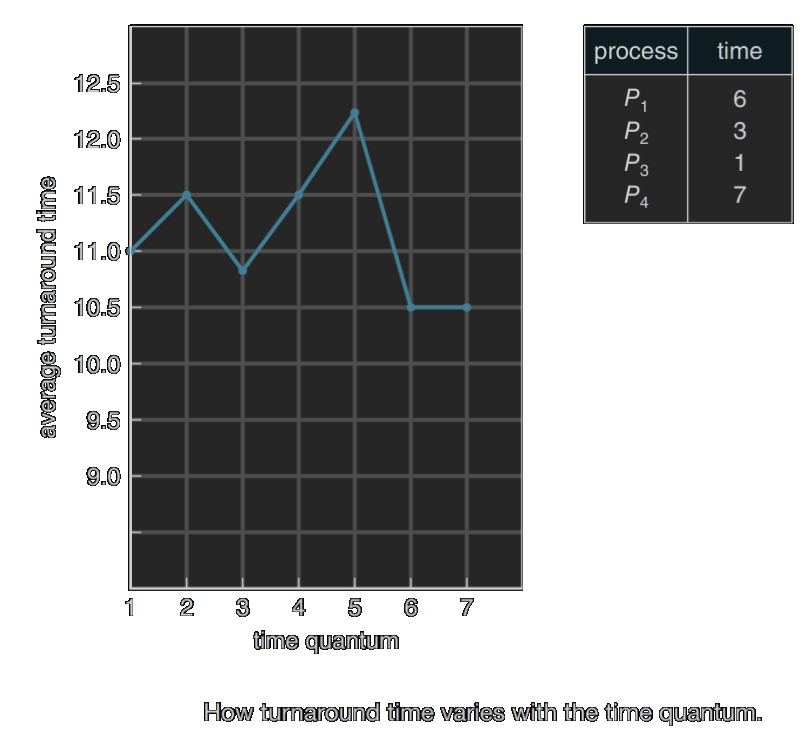
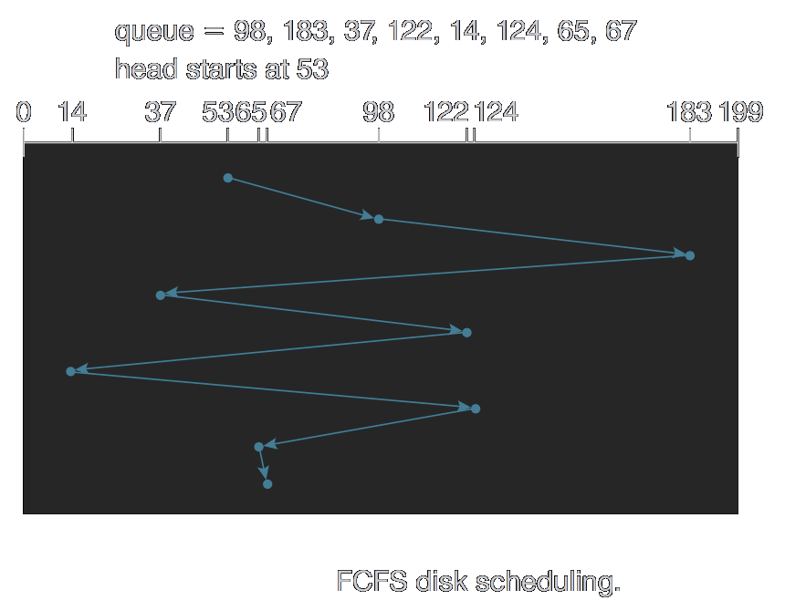

# Operating Systems

[[TOC]]

<style>
	rect:not([stroke="none"]) {
		/* show rect having white border */
		stroke:rgb(255, 255, 255) !important;
		/* render all backgrounds completely transparent */
		fill-opacity: 0;
	}
	svg div {
		color: rgb(255, 255, 255) !important;
	}
	path {
		stroke: rgb(255, 255, 255) !important;
	}

</style>


{style=filter:invert(0)}

## Introduction

operating system
: A program that acts as a intermediary
between a user of a computer and the computer's hardware

**Goals of an operating system**
- execute user programs and make solving user problems easier
- make the computer system convenient to use
- use the computer hardware in an efficient manner

### Components of a Computer System

**4 discrete components of a computer system**{style=font-size:1.5em;}

{style=float:right width=500}

1. #### Hardware
    The Physical pieces of a computer system that provides computing resources
    eg *CPU*, *Memory*, and *I/O devices*

2. #### Operating Systems
    Controls and coordinates the use of hardware among various applications and users

3. #### Application Programs
    An application program defines the ways in which system resources are used in order to solve a user&rsquo;s problem or provide a service

    *Eg* <b>word processors, compilers, browsers, database systems & video games</b>

4. #### Users
    At the end of the day computer systems are there to serve end users
    While much of the time these are human beings interacting with these systems,
    sometimes this could be a computer system interacting with another system, 
    making one of the systems behave as a *&ldquo;user&rdquo;*

It is common that there are chains of systems where one system is a user of another,
until it hits the most person facing system, which is usually interacted with by a human being

### System view

From the computers hardware's point of view 
The OS acts as a **resource allocator** 
Where the resources in question are
&nbsp;&squarf; CPU time
&nbsp;&squarf; Memory Storage
&nbsp;&squarf; Storage Space
&nbsp;&squarf; I/O devices
&nbsp;&squarf; so on...

An OS also acts a **control program** which manages the execution of programs 
avoiding as much errors as possible

#### Defining a OS

*[OS]: Operating System

The boundaries between system programs of a OS and application programs is not so well defined
**Simple viewpoint:** <mark>Everything that ships with the OS is defined as part of the OS</mark>

A operating system is <i>always running</i>
There is <i>only program that runs all the time</i> the **kernel**
then there is a layer of **system programs**
and then there are the **application programs**

### Computer-System Organization

> {style=float:right width=500}
>A modern general-purpose computer system consists of 
>\- one or more CPU's
>\- a bunch of device controllers
>Connected though a common **bus**
>\- <b>provides access between components and shared memory</b>
> <br>
> Each <b>device controller</b> is in charge of its specific device type
> &nbsp; &spades; multiple devices can be attached to a single device controller
> &nbsp; &spades; maintains its own special-purpose registers and local buffer storages
> &nbsp; &spades; tasked with moving data between peripheral devices and its local buffer storage
> 
> There are many buses in a computer but the **system bus** is the main communication path between major components


### Interrupts in Operating Systems

#### IO Operation Example

1) Device driver loads the appropriate registers in the device controller
2) Device controller examines appropriate registers to determine what actions to take
<i>- *eg* read a character from a keyboard</i>
3) Controller starts the transfer of data from device to its local buffer
4) Device driver gives control to other parts of the OS, either
    1. <i>returning data or pointer to data read</i>
    2. <i>return status information *eg write completed successfully or device busy* </i>

<b>Controller inform device driver that operation has finished through **interrupts**</b>

##### Overview

Hardware triggers interrupt by sending signal to CPU
\- usually by way of system bus
<u>CPU stops what it is doing</u>
transfers execution to a location that contains
&nbsp; &clubs; starting address where the service routine for the interrupt is located
The interrupt service routine executes;
On completion CPU resumes interrupted task or computation

> Interrupts a integral part of computer architecture
> Each computer has its distinct interrupt mechanism
> but with commonalities


<b class="text-xl">Basically a way for a controller to tell a device diver that a operation is finished</b>

<i>Interrupts must be handled quickly as they occur frequently</i>
A <u>table of pointers</u> to interrupt routines can be used to achieve this
\- stored in low memory ~ first 100 locations
\- store the location of the addresses of the interrupt service routines for devices
this table or array is called the **interrupt vector**
\- indexed by unique id to provide the address of the **interrupt service routine**

Interrupt architecture saves state information of whatever is interrupted
so that it can be restored for later

After interrupt services
saved return address is loaded into program counter
and interrupted computation is resumed

interrupt-request line
: The wire that CPU request line has that it senses after executing every instruction

When the CPU detects that a controller has asserted a signal on the interrupt-request line, it reads the interrupt number and jumps to the **interrupt-handler routine** by using that interrupt number as an index into the interrupt vector
\~ then starts execution at the index location

The interrupt handler 
&nbsp;&nbsp;&nbsp; saves <u>any</u> state it will be changing during its operation, 
&nbsp;&nbsp;&nbsp; determines the cause of the interrupt, 
&nbsp;&nbsp;&nbsp; performs the necessary processing,
&nbsp;&nbsp;&nbsp; performs a state restore,
&nbsp;&nbsp;&nbsp; & executes a return from interrupt instruction
to return the CPU to the execution state prior to the interrupt

!!! example We say
    {height=600 style=float:right}
    Device controller **raises** an interrupt by use of interrupt request line
    CPU **catches** the interrupt
    and **dispatches** it into the interrupt handler
    handler **clears** the interrupt by servicing the device

    **CPUs usually have 2 interrupt request lines**
    <center>

    ***maskable* & *non-maskable***</center>

    **Maskable** for unrecoverable memory errors
    **Un-Maskable** could be turned off by CPU before execution
    *of critical instruction that <u>must not be interrupted</u>*
    {width=700 style=float:left}
    


If *there are more devices than in interrupt vector*
then use of **interrupt chaining**  
each element in the interrupt vector points to the head of a list of interrupt handlers
When an interrupt is raised,
the handlers on the corresponding list are called one by one,
until one is found that can service the request
This structure is a compromise between the overhead of a huge interrupt table
and the inefficiency of dispatching to a single interrupt handler
{width=400 style=float:right}

Below is the design of the interrupt vector for Intel processors
The events from $0$ to $31$, which are *non-maskable*, 
<i>are used to signal various error conditions</i>
The events from $32$ to $255$, which are *maskable*,
<i>are used for purposes such as device-generated interrupts</i>

A **trap** or **exception** 
is a software-generated interrupt caused either by an error or a user request

Operating systems are interrupt driven; <i>Why</i>?
Most I/O devices are slower than the processor
Processors have to pause to wait for the device
It would be wasteful for the system to sit idle doing nothing while waiting for an I/O device

###### How to handle Interruptions
> The operating system preserves the state of the CPU by storing registers and the program counter

<b>Determines which type of interrupt has occurred</b>:

polling
~ where CPU steadily checks whether the device needs attention
*Hey are you done yet! Hey are you done yet!*
<font color="hotpink">not as good as interrupts, because we waste CPU cycles on each poll</font>

vectored interrupt system 
~ where the interrupting device directs the processor to the appropriate interrupt service routine

*[ISR]: Interupt Service Routine

ISR
~ is a software routine that hardware invokes in response to an interrupt
ISR examines an interrupt and determines how to handle it executes the handling,
& then returns a logical interrupt value
If no further handling is required the ISR notifies the kernel with a return value

Separate segments of code determine what action should be taken for each type of interrupt

#### Components

##### 1. Interrupt Request (IRQ)
   - <b>Definition</b> Signal sent by a hardware device to request CPU attention
   - <b>Example</b> Keyboard sending an interrupt when a key is pressed

##### 2. Interrupt Service Routine (ISR)
   - <b>Definition</b> Code executed by the OS in response to an interrupt
   - <b>Example</b> Updating system clock in response to a timer interrupt

##### 3. Interrupt Vector Table (IVT)
   - <b>Definition</b> Data structure containing addresses of ISR routines
   - <b>Example</b> CPU consults IVT to find and execute the appropriate ISR

#### Importance
Interrupts enable efficient multitasking and allow the OS to manage various tasks by responding to external events.

### IO Structure

#### Technique 1
After I/O starts, <i>control returns to user program</i>
<u>only upon I/O completion</u>
&diamond; `Wait` instruction idles the CPU until the next interrupt
&diamond; `Wait` loop *contention for memory access*
&diamond; <b>No simultaneous I/O process</b> at most <u>only one</u> IO request is outstanding at a time

#### Technique 2
After I/O starts, <i>control returns to user program</i>
<u>without waiting for I/O completion</u>

system call
: request to the OS to allow user to wait for I/O completion

&blacksquare; <b>Device status table</b> of each device &nbsp;&nbsp;&nbsp; contains its *type*, *address*, *state*

&blacksquare; OS indexes into I/O device table to determine device status & <i>to modify table entry to include interrupt</i>

### Storage Structure


<div class="flex">
  <div class="flex-1">
  
  #### Memory Sizes
  bit
  : The basic storage unit of computer storage
  *contains either $0$ or $1$*

  byte
  : Convenient chunk of storage
  *Made up of 8 bits*

  word
  : Made up of one or more bytes
  <u>A computer's architecture native unit of data</u>
  *Eg 64-bit registers are made up of 8 bytes words*
  </div>
  <div class="flex-1">
  
| Name         | Abbreviation | Size            |
| ------------ | :----------: | --------------- |
| **Kilobyte** |      KB      | $1,024$ bytes   |
| **Megabyte** |      MB      | $1,024^2$ bytes |
| **Gigabyte** |      GB      | $1,024^3$ bytes |
| **Terabyte** |      TB      | $1,024^4$ bytes |
| **Petabyte** |      PB      | $1,024^5$ bytes |

!!! Note Note
      Computer manufactures often round off these numbers
  </div>
</div>
  
#### Memory Structure

{width=600 style=float:right}

main memory
: only large storage media that the CPU can access directly
: these are *random access* & *volatile* <i class=text-red-100>looses its states when powered off</i>
: **RAM** is often what we mean my main memory

secondary storage
: extension of main memory that provides *large non-volatile* storage capacity

hard disks
: rigid metal or glass platters covered with magnetic recording material
divided into *tracks*, which sub-divide into *sectors*
*disk controller* handles the interaction of device and computer

*[SSD]: Solid-State Disks

SSD
: faster than hard disks, non-volatile
Made up of various technology which are increasing in size down in price

##### Caching
A important principle performed on many levels of the computer *hardware, operating system, software*
Information in use copied <u>from slower to faster storage <i>temporarily</i></u>
● Faster storage (cache) checked first to determine if information is there
&nbsp; ○ If it is, information used directly from the cache *fast* <i>cache hit</i>
&nbsp; ○ If not, data copied to cache and used there 
● Cache smaller than storage being cached
&nbsp; ○ Cache management important design problem 
&nbsp; ○ Cache size and replacement policy 

### How Modern Computers Work

Using **Von Neumann Architecture** 


### Direct Memory Access
● Used for <i>high-speed I/O devices</i> able to transmit information at close to memory speeds
● Device controller transfers blocks of data from buffer storage directly to main memory without CPU intervention
● Only <i>one interrupt is generated per block</i>, *rather than the one interrupt per byte*
● With modern Graphics cards and NVME storage drives being on the same PCIe bus,
future graphic card technologies are opting to read directly from the hard disk to the GPU memory,
skipping the CPU entirely, which bypasses one of the slowest operations currently dealt with in GPU processing, 
that is `memcopy` from main memory to GPU memory


#### Computer System Architecture

core
~ The component that executes instructions & registers for storing data locally
    
    !!! tip Multi-core on the same chip
        Its better to have multiple cores on a single chip rather than mutiple chips when single cores because speed is faster when they are not separated and are in close proximity on the same chip

Usually systems employ a *single general-purpose processor*
but a lot of of systems employ *special-purpose processors* to help the CPU
<i>Example a microprocessor in the keyboard to convert the keystrokes into codes to be sent to the CPU</i>

**Multiprocessor systems** are becoming more widespread
also known as *parallel* or *tightly-coupled* systems

<b class="text-green-400 text-lg">Advantages</b>
&nbsp;&squarf; Increased throughput
&nbsp;&squarf; Economy of scale
&nbsp;&squarf; Increased Reliability

!!! Warning Note
    The speed up factor of having $n$ multiple processors is not $n$ its less because of the overhead of having them work together

**2 types**
<b>Asymmetric Multiprocessing</b> each processor assigned a *specified* task 
<b>Symmetric Multiprocessing</b> each processor performs *all* tasks

##### Definitions for Computer System Components
Make sure you can distinguish between these definitions

> Although virtually all systems are now multicore, we use the general term <b>CPU</b> when referring to a single computational unit of a computer system and <b>core</b> as well as <b>multicore</b> when specifically referring to one more cores on a CPU {style=float:right;width:60% }


CPU
: The hardware that executes instructions

Processor
: A physical chip that contains <i>one or more</i> CPUs

core
: The basic computation unit of the CPU

Multicore
: Including multiple computing cores on teh CPU

Multiprocessor
: Including multiple processors

##### Non-Uniform Memory Access (NUMA)

We can keep adding cpu to a multiprocessor system *but this does not scale well* as the system bus becomes overloaded
<b class="text-green-300">Solution</b> Provide each CPU or group of CPUs with its own local that is accessed using its own fast local bus
The CPUs are connected by a **shared system interconnect** thus CPUs share one physical address space
this is the approach known as **NUMA**

*[NUMA]: Non-Uniform Memory Access

##### Clustered System
Just like with processors you can also utilize <u>multiple</u> <i>systems</i> working together

{width=500 style=float:right}

*[SAN]: Storage-Area Network

- Commonly with a SAN
- Allows service to be more available and able to withstand failures

**Asymmetric clustering** one machine in hot-standby mode
**Symmetric clustering** multiple nodes running applications and monitoring each other

*[HPC]: High-Performance Computing

Clusters can be used for HPC with applications having to be written with the use of parallelization

*[DLM]: Distributed Lock Manager

DLM to avoid conflicting operations

### Operating-System Structure

#### Multiprogramming and Multitasking

##### Multiprogramming or Batch Systems
!!! example In multiprogramming system, a program in execution is termed a **process** {style=float:right}
Single user cannot Keep CPU and IO devices busy at all time
organizes jobs so CPU always has one to execute
subset of total jobs in system is kept in memory
when it has to wait, OS switches to another job
thus <i>CPU is never idle</i>

<div class="float-right" style="width:30%">
<small>We have 512MB stick of RAM, OS schedules and allocates amount of memory to be used by each job</small>

{height=300 style=float:right}
</div>


##### Timesharing or Multitasking 
> When CPU so fast it can switch to the point that users can seamlessly switch tasks at a whim,
>  creating *<span class="text-xl">interactive computing</span>* {style=width:60%}

Ideally response time \< 1 second
Each user has at least one program executing in memory &rArr; process
Several jobs running at the same time &rArr; CPU scheduling
If processes don't fit in memory &rArr; swapping moves them in and out
Virtual memory allows execution of processes not completely in memory

virtual memory 
~ a *technique* whereby the entire program is not taken out of memory but a part taken
the advantage is that it enables users to run programs that are larger than actual physical memory

#### Interrupt Driven

**Hardware** interrupt by one of the devices

**Software** interrupt (*exception* or *trap*)
- software error *eg division by zero*
- request of operating system service
- Other process problems include infinite loops &
  processes modifying each other or the operating system

#### Dual Mode Operations

{width=600 style=float:right}

**User** and **Kernel** *also called supervisor, system or privileged* mode
**Mode bit** provided by hardware <i>kernel &rrarr; </i> $0$ <i>user &rrarr; </i> $1$
&dash; So now we can distinguish when system is running in user or kernel mode
&dash; Some instruction are *privileged*, only executed in kernel mode
&dash; System call changes mode to kernel, return from call resets it to user

`syscall` is the function to call in a this instruction

<i>Multi-mode support is becoming more prevalent</i>

A **timer** is used to prevent infinite loop or process hanging hogging of resources
the period can be fixed eg 1/60 second 

### Process Management
> A process is a program in execution
> > A unit of work with the system {style=width:30%;float:left;margin-right:2em}

A <b>program</b> is an *passive entity*
A <b>process</b> is an *active entity*

Processes needs resources to accomplish its task
&bullet; CPU, memory, I/O, files
&bullet; Initialization of data

*Process termination* should reclaim any reusable resources

---

*Single-threaded process* has one program counter specifying location of next instruction
executing instructions <i>sequentially</i> until completion

*Multi-threaded process* has one program counter per thread

Typically system has many processes some user, some operating system
as you can see with your task manager
running concurrently on one or more CPU
**Concurrency or Multiplexing** the CPU's among the processes or threads

**OS responsibilities**
- Creating and deleting both user and system processes
- Suspending and resuming processes
- Providing mechanisms for process synchronization
- Providing mechanisms for process communication
- Providing mechanisms for deadlock handling

### Memory Management

To execute a program the instruction must be in memory

Memory management determines what is in memory and when
in order to optimize CPU utilization and computer response to users

**Memory management activities**
&starf; Keeping track of which parts of memory are currently being used and by whom
&starf; Deciding which processes (or parts thereof) and data to move into and out of memory
&starf; Allocating and deallocating memory space as needed

#### Memory Storage Management

The OS provides uniform, logical view of information storage

Abstracts physical properties to logical storage unit  - file

Each medium is controlled by device (i.e., disk drive, tape drive)
Varying properties include access speed, capacity, data-transfer rate, access method (sequential or random)

**File-System management**
- Files usually organized into directories
- Access control on most systems to determine who can access what
- **OS activities include**
  - Creating and deleting files and directories
  - Primitives to manipulate files and directories
  - Mapping files onto secondary storage
  - Backup files onto stable (non-volatile) storage media

##### Migration of Data

Hard Disk &rArr; Main Memory &rArr; Cache &rArr; Hardware Register

#### I/O Subsystem

One of the many jobs of the OS is to hide peculiarities of hardware devices from the user

It does this though the I/O subsystem

<b>The I/O subsystem is responsible for</b>

Memory management of I/O including buffering
(storing data temporarily while it is being transferred),
<i>caching</i> storing parts of data in faster storage for performance,
<i>spooling</i> the overlapping of output of one job with input of other jobs

General device-driver interface

Drivers for specific hardware devices

### Protection and Security

**Protection** any mechanism for controlling access of processes or users to resources defined by the OS

**Security** defense of the system against internal and external attacks
Huge range, including denial-of-service, worms, viruses, identity theft, theft of service

Systems generally first distinguish among users, to determine who can do what
- User identities (user IDs, security IDs) 
  include name and associated number, one per user
- User ID then associated with all files,
  processes of that user to determine access control
- Group identifier (group ID) allows set of users to be defined and controls managed,
  then also associated with each process, file
- Privilege escalation allows user to change to effective ID with more rights

## Operating System Structures

### Operating System Services

> Operating systems provide an environment for the **execution**
> of *programs* and *services* to programs and users


#### User Interface 
*[UI]: User Interface
*[CLI]: Command Line Interface
*[GUI]: Graphical User Interface

Nearly all OSs have a UI
This can be either a CLI *or command interpreter* or GUI

#### Program Execution

System must able to load a program into memory and run the program
Program ends eventually sometimes abnormally indicating a error

#### IO Operations

OS must provide a way to do I/O

#### File System Manipulation

Programs need to read and write files and directories

They also need to 
&hearts; create and delete them by name
&hearts; search for a given file
&hearts; list file information

Some operating systems include **permissions management**
to allow or deny access to files or directories based on file ownership

#### Communications
<b>Processes can exchange information on the same computer or between computers over a network</b>
Communication may be via <i>shared memory</i> or through <i>message passing</i> *packets moved by the OS*

#### Error Detection
<b>OSes need to be aware of possible errors, constantly</b>
&squf; May occur in the CPU and memory hardware, in I/O devices, in user program
&squf; For each type of error, OS should take the appropriate action to ensure correct and consistent computing
&squf; Debugging facilities can greatly enhance the user’s and programmer’s abilities to efficiently use the system

<b class="text-indigo-300">These next set of OS functions ensure the efficient operation of the system itself via resource sharing</b>

#### Resource Allocation
When  multiple users or multiple jobs running concurrently,
resources *CPU cycle, main memory, file storage, I/O devices* must be allocated to each of them

#### Protection and Security

The owners of information stored in a multiuser or networked computer system may want to control use of that information, concurrent processes should not interfere with each other

<b>Protection</b> involves ensuring that all access to system resources is controlled

<b>Security</b> of the system from outsiders requires user authentication, extends to defending external I/O devices from invalid access attempts

#### Accounting
To keep track of which users use how much and what kinds of computer resources

> ### System Calls
> Provide a interface to the services made available by an operating system
> Usually written in **C** or **C++**
> <i>certain low-level tasks such as to access hardware can be done in assembly</i>
> #### Application Programming Interface 
> these Mostly accessed by programs via a high-level API rather than direct system call use
Three most common APIs are <b>Win32 API</b> for Windows, <b>POSIX API</b> for POSIX-based systems
 *virtually all versions of UNIX, Linux, and Mac MacOS*, and <b>Java API</b> for the <i>Java virtual machine (JVM)</i>
> <br>
> In this course we are going to be focusing mainly on generic system calls, 
> however it is worth noting that some OSes have OS specific system calls

##### System Call Parameter Passing

Three general methods used to pass parameters to the OS
1. Pass the parameters in registers
   <i>the simplest</i>
2. Parameters stored in a block, or table, in memory,
   and address of block passed as a parameter in a register
   <i>approach taken by Linux and Solaris</i>
3. Parameters are <i>placed</i> or **pushed** onto the stack by the program
   and **popped** off the stack by the operating system

Block and stack methods do not limit number or length of parameters being passed

##### Types of System Calls
With unix examples

###### Process Control
&starf; create process `fork()`, terminate process
&starf; end `exit()`, abort
&starf; load, execute
&starf; get process attributes, set process attributes
&starf; wait for time
&starf; wait event `wait()`, signal event
&starf; allocate and free memory
&starf; dump memory if error
&starf; debugger for determining bugs, *single step execution*
&starf; locks for managing access to shared data between processes

###### File Management
&starf; create file, delete file
&starf; open `open()`, close file `close()`
&starf; read `read()`, write `write()`, reposition
&starf; get & set file attributes

###### Device Management
&starf; request device, release device
&starf; read, write, reposition
&starf; get device attributes, set device attributes
&starf; logically attach or detach devices

<b>set console mode</b> `ioctl()`
<b>read console</b> `read()`
<b>write console</b> `write()`

###### Information Maintenance
&starf; get time or date, set time or date
&starf; get system data, set system data
&starf; get & set process, file, or device attributes

<b>set set timer</b> `alarm()`
<b>sleep</b> `sleep()`
<b>get pid</b> `getpid()`

###### Communications
&starf; create, delete communications connections
&starf; send, receive messages if message passing model to *host name* or *process name*
&star; or from *client* to *server*

<b>create pipe</b> `pipe()`
<b>create file mapping</b> `shm_open()`
<b>map view of file</b> `mmap()`

###### Shared-Memory Model
&starf; create & gain access to memory regions
&starf; transfer status information
&starf; attach and detach remote devices

###### Protection 
&starf; Control Access to resources
&starf; get & set permissions
&starf; allow & deny user access

<b>set file security</b> `chmod()`
<b>initialize security descriptor</b> `umask()`
<b>set security descriptor group</b> `chown()`

### System Services

**System services** also known as **system utilities** provide a convenient environment for program development and execution 

<b class="text-xl">Divided into categories</b>

<b>File management</b> 
These programs create, delete, copy, rename, print, list, and generally access and manipulate files and directories

<b>Status Information</b>
Some programs simply ask the system for the date, time, amount of available memory or disk space, number of users, or similar status information
Others are more complex, providing detailed performance, logging, and debugging information
Typically, these programs format and print the output to the terminal or other output devices or files or display it in a window of the GUI. 
Some systems also support a <i>registry</i>, which is used to store and retrieve configuration information

<b>File modifications</b> 
Several text editors may be available to create and mod ify the content of files stored on disk or other storage devices
There may also be special commands to search contents of files or perform transformations of the text

<b>Programming-language support</b>
 Compilers, assemblers, debuggers, and
interpreters for common programming languages (such as C, C++, Java,
and Python) are often provided with the operating system or available as
a separate download.

<b>Program loading and execution</b>
Once a program is assembled or com piled, it must be loaded into memory to be executed
The system may provide absolute loaders, relocatable loaders, linkage editors, and overlay
loaders
Debugging systems for either higher-level languages or machine language are needed as well

<b>Communications</b>
These programs provide the mechanism for creating
virtual connections among processes, users, and computer systems
They allow users to send messages to one another’s screens, to browse web pages, 
to send e-mail messages, to log in remotely, or to transfer files from one machine to another

<b>Background services</b>
launch at boot time but some for system startup, then terminate and then others from system boot to shutdown
Some of these processes terminate after completing their tasks, while others continue to run until the system is halted
Run in user context not kernel context
Constantly running system-program processes are known as <i>services</i>, <i>subsystems</i>, or <i>daemons</i>

<b>Application programs</b>
Don’t pertain to system
Run by users
Not typically considered part of OS
Launched by command line, mouse click, finger poke


### Design & Implementation of Operating Systems

<b>User goals</b> operating system should be convenient to use, easy to learn, reliable, safe & fast
<b>System goals</b> operating system should be easy to design, implement & maintain
as well as flexible, reliable, error-free & efficient

Important principles to separate
<b>Policy</b>   What will be done? 
<b>Mechanism</b>  How to do it?

Mechanisms determine how to do something, policies decide what will be done
The separation of policy from mechanism is a very important principle,
it allows maximum flexibility if policy decisions are to be changed later 

### Operating System Structure

#### Simple structure 
!!! Example MS-DOS
    Written to provide the most functionality in the least space
    Not divided into modules
    MS-DOS has some structure, but its interfaces and levels of functionality are not well separated
#### Complex monolith
!!! Example UNIX
    The simplest structure for organizing an operating system is no structure at all
    **tightly coupled** changes in one area might have effects on another area <i>difficult to extend</i>
{width=50%} {width=20%}

#### Layered 
!!! Example Microsoft Windows NT
    The operating system is divided into a number of layers (*levels*), 
    each built on top of lower layers.
    The bottom layer (*layer 0*), is the <i>hardware</i>;
    the highest (*layer N*) is the <i>user interface</i>
    With modularity, layers are selected such that each uses functions (*operations*) and services of only lower-level layers
    **loosely coupled** opposite to monolith, <i>easier to debug</i> debug from first to last layer sequentially , error could only be on a layer
    Performance does take a hit from constantly needing to traverse the layers
#### Microkernel 
!!! Example Mach
    <b>Move as much functionality from the kernel into the user space as possible</b>
    <b class="text-indigo-500 text-xl">Minimum kernel</b>
    <b class="text-green-300">Benefits</b>:
    Easier to extend a microkernel
    Easier to port the operating system to new architectures
    More reliable (less code is running in kernel mode)
    More secure
    <b class="text-red-500">Detriments</b>:
    Performance overhead of user space to kernel space communication

#### Modules
Many modern operating systems implement loadable kernel modules
&cir; Uses object-oriented approach
&cir; Each core component is separate
&cir; Each talks to the others over known interfaces
&cir; Each is loadable as needed within the kernel
<i>Overall, similar to layers but with more flexible</i>
Linux, Solaris, etc

#### Hybrid Systems

Most modern operating systems are actually not one pure model
Hybrid combines multiple approaches to address performance, security, usability needs
Linux and Solaris kernels in kernel address space, so monolithic, plus modular for dynamic loading of functionality
Windows mostly monolithic, plus microkernel for different subsystem personalities
Apple MacOS hybrid, layered, Aqua UI plus Cocoa programming environment
is kernel consisting of Mach microkernel and BSD Unix parts,
plus I/O kit and dynamically loadable modules (called kernel extensions)


##### MacOS Structure
{width=500}

### Booting OSs
When power initialized on system, execution starts at a fixed memory location
Firmware ROM used to hold initial boot code

Operating system must be made available to hardware so hardware can start it

Small piece of code – **bootstrap loader**, stored in <i>ROM</i> or <i>EEPROM</i> locates the kernel, loads it into memory, and starts it

Sometimes two-step process where boot block at fixed location loaded by ROM code, 
which loads bootstrap loader from disk

Common bootstrap loader, GRUB, allows selection of kernel from multiple disks, versions, kernel options
Kernel loads and system is then <i>running</i>

### OS Debugging

**Debugging** is finding and fixing errors, or <i>bugs</i>
OS generate <i>log files</i> containing error information
Failure of an application can generate <i>core dump</i> file capturing memory of the process
Operating system failure can generate <i>crash dump</i> file containing kernel memory

Beyond crashes, performance tuning can optimize system performance
&rect; Sometimes using trace listings of activities, recorded for analysis
&rect; Profiling is periodic sampling of instruction pointer to look for statistical trends

<b>Kernighan’s Law</b>: “Debugging is twice as hard as writing the code in the first place. Therefore, if you write the code as cleverly as possible, you are, by definition, not smart enough to debug it.

!!! quote Kernighan’s Law
    “Debugging is twice as hard as writing the code in the first place. 
    Therefore, if you write the code as cleverly as possible, 
    you are, by definition, not smart enough to debug it."

## Processes
!!! Note Note
    Terms like **job** or **tasks** often are interchangeable {style=width:50%;float:right}

An operating system executes a variety of programs
- Batch systems - **jobs**
- Time-shared systems - **user programs** or **tasks**


process
: A program in execution;
process execution must progress in <u>sequential fashion</u>

A process is made up of multiple parts
&starf; Program code called **text section**
&starf; Current activity including **program counter**, **processor registers**
&starf; **Stack** containing temporary data
&nbsp;&nbsp;&nbsp; - Function parameters, return addresses, local variables
&starf; **Data section** containing global variables
&starf; **Heap** containing memory dynamically allocated during run time

A **program** is a <span class="text-red-500">passive entity</span>
A **process** is a <span class="text-red-400">active entity</span>
*A program becomes a process when executable file loaded into memory*
One program can become multiple processes 
eg multiple browsing windows

```
max |-----------|
    | Stack     | Temporary Data Storage when
    |-----------| invoking functions
    |     ↓     |
    |           | Stack and heap grow towards each other
    | ↑         |
    |-----------| Memory that is dynamically
    | Heap      | allocated during runtime 
    |-----------|
    | Data      | Includes global variables
    |-----------|
    | Text      | The executable code      
  0 |___________|                 
```

It is the OS responsibility that the Stack and heap do not overlap
If memory is not cleared *aka memory leaks* it can lead to stack/heap overflows 

### Process States
As a process executes, it can traverse through the following states

!!! Check New
    The process is being created
!!! warning Running
    Instructions are being executed
!!! Example Waiting
    The process is waiting for some event to occur
!!! Tip Ready
    The process is waiting to be assigned to a processor
!!! Error Terminated
    The process has finished execution


### Process Control Blocks

*[PCB]: Process Control Block

!!! Some systems also refer to PCB as a **task control block (TCB)**

<div class="flex flex-col items-stretch">

<div class="p-3 m-0.5 rounded-2xl bg-red-100 text-red-500 text-center">
  <b>Process ID</b>
  <p>Process Identifier &rrarr; <b>pid</b></p>
</div>
<div class="p-3 m-0.5 rounded-2xl bg-yellow-100 text-yellow-600 text-center">
  <b>Process State</b>
  <p>running, waiting, etc</p>
</div>
<div class="p-3 m-0.5 rounded-2xl bg-green-100 text-green-600 text-center">
  <b>Program Counter</b>
  <p>location of instruction to next execute</p>
</div>
<div class="p-3 m-0.5 rounded-2xl bg-blue-100 text-blue-500 text-center">
  <b>Register Information</b>
  <p>contents of all process-centric registers</p>
</div>
<div class="p-3 m-0.5 rounded-2xl bg-pink-100 text-pink-600 text-center">
  <b>Scheduling Information</b>
  <p>priorities, scheduling queue pointers</p>
</div>
<div class="p-3 m-0.5 rounded-2xl bg-purple-100 text-purple-500 text-center">
  <b>Memory Related Information</b>
  <p>memory allocated to the process</p>
</div>
<div class="p-3 m-0.5 rounded-2xl bg-red-100 text-red-500 text-center">
  <b>Accounting Information</b>
  <p>CPU used, clock time elapsed since start, time limits</p>
</div>
<div class="p-3 m-0.5 rounded-2xl bg-blue-100 text-blue-700 text-center">
  <b>Status Information Relating to I/O </b>
  <p>I/O devices allocated to process, list of open files</p>
</div>

</div>

#### Threads
So far, process has a single thread of execution
Consider having multiple program counters per process
Multiple locations can execute at once
Multiple threads of control -> threads
Must then have storage for thread details, multiple program counters in PCB
We will be going over threading in more detail in the next chapter

### Process Scheduling

The goal of process scheduling is to maximize CPU use, quickly switch processes onto CPU for time sharing
Process scheduler selects among available processes for next execution on CPU

Maintains scheduling queues of processes
<b>Job queue </b> set of all processes in the system
<b>Ready queue </b> set of all processes residing in main memory, ready and waiting to execute
<b>Device queues </b> set of processes waiting for an I/O device
Processes migrate among the various queues

#### Schedulers
{style=float:right}

**Short-term scheduler** or **CPU scheduler** 
Selects which process should be executed next and allocates CPU
&cir; Sometimes the only scheduler in a system 
&cir; Invoked frequently *milliseconds* <i>must be fast!</i>

**Long-term scheduler** or **Job scheduler** 
Selects which process should be brought into ready queue
&cir; Controls the degree of multiprogramming
&cir; Invoked in-frequently *seconds* <i>may be slow</i>


**I/O bound process** spends more time doing I/O than computations, *many short bursts*
**CPU bound process** spends more time doing computations, *very few long bursts*

> Long term processors strive for a good **process mix**
> some that are I/O bound and some that are CPU bound

Let’s say you have a some processes that are I/O intensive and some that are CPU intensive
While the I/O job is happening, the CPU would just be <u>sitting idle</u>,
waiting for the interrupt from the I/O job to say “*hey i’m done*”
If you had all the I/O jobs lined up together, the CPU would be constantly waiting for the I/O tasks to complete,
while what it could have been working on a CPU bound task until it got interrupted by the I/O task

{width=500 style=float:right}
#### Medium-Term Scheduling
can be added if degree of multiple programming needs to decrease
Remove process from memory, store on disk, bring back in from disk to continue execution: **swapping**


### Multitasking in Mobile OSes
Some mobile systems (e.g., early version of iOS)  allow only one process to run, others suspended
Due to screen real estate, user interface limits iOS provides for a 
Single <b>foreground</b> process- controlled via user interface
Multiple <b>background</b> processes– in memory, running, but not on the display, and with limits
Limits include single, short task, receiving notification of events, specific long-running tasks like audio playback
Android runs foreground and background, with fewer limits
&nbsp;&nbsp; Background process uses a service to perform tasks
&nbsp;&nbsp; Service can keep running even if background process is suspended
&nbsp;&nbsp; Service has no user interface, small memory use

{width=500 style=float:right}
### Context Switch

When CPU switches to another process, the system must save the state of the old process and load the saved state for the new process via a **context switch**
Context of a process represented in the PCB
Context-switch time is <i>overhead</i>; the system does no useful work while switching
The more complex the OS and the PCB &Rarr; the longer the context switch
Time dependent on hardware support
Some hardware provides multiple sets of registers per CPU &Rarr; multiple contexts loaded at once


### Operations on Processes
Operating Systems must provide mechanisms for:
&starf; Process creation
&starf; System initialization
&starf; Execution of a process creation system call by a running process
&starf; Batch job initialization
&starf; Process termination

The main two we want to look at in this course however are creation and termination

{width=500 style=float:right}
#### Process Creation

During the course of execution, a process may create several new processes
Creating process is called a **parent process**, and the new processes are **children** of that process
This can lead to a process tree similar to one below


When a process creates a new process, two possibilities for execution exist:
1. The parent continues to execute concurrently with its children.
2. The parent waits until some or all of its children have terminated.

This can also have address space implications, for example, 
1. The child process is a duplicate of the parent process (it has the same program and data as the parent). 
2. The child process has a new program loaded into it.

In the unix world
`fork()` system call creates new process
`exec() `system call used after a fork() to replace the process’ memory space with a new program

##### Fork Example

```c
#include <stdio.h> 
#include <sys/types.h> 
#include <unistd.h> 
int main() 
{ 
	// make two process which run same 
	// program after this instruction 
	fork(); 
	printf("Hello world!\n"); 
	return 0; 
} 
```

<b>Output</b>

      Hello world!
      Hello world!


### Zombie Processes
On Unix operating systems, a zombie process or defunct process is a process that has completed execution (via the exit system call) but still has an entry in the process table. This can happen when a parent process kicks off a child process and doesn’t wait to receive the response that the child process has completed.  
Normally what happens is the parent waits for the child and when the child is done, it ‘reaps’ the child, removing it from the process table
So the parent doesn’t reap the child, and it finishes and is ‘done’ so the process table now has a zombie entry, no parent will ever clean it from the process table, therefore it is a zombie, dead but still sort of alive

Despite the name zombie’s aren't too harmful
Mainly take up process ids in the process table
Usually don’t take up too much ram or system resources
The problem comes when you have tasks that kick of many children and don’t clean them up, you can end up with many zombies quickly
Killing a zombie isn’t actually too hard
Locate the zombie: `ps aux | grep 'Z'`


Find the parent PID
`ps -o ppid= -p <child_id>`
In this case 4092
Kill the zombie: kill PID 
(in this case `kill 4091`)

#### Make Zombie Code

```c
#include <stdio.h>
#include <unistd.h>
int main() {
   int x = fork(); //create child process
   if (x > 0) //if x is non zero, then it is parent process
      printf("Inside Parent - PID is : %d\n", getpid());
   else if (x == 0) { //for child process x will be 0
      sleep(5); //wait for some times
      x = fork();
      if (x > 0) {
         printf("Inside Child - PID :%d and PID of parent : %d\n", getpid(), getppid());
         while(1)
            sleep(1);
         printf("Inside Child - PID of parent : %d\n", getppid());
      }else if (x == 0)
      printf("Inside grandchild process - PID of parent : %d\n", getppid());
   }
   return 0;
}
```

{width=500 style=float:right}
### Inter-process Communication

Processes within a system may be *independent* or *cooperating*

Cooperating process can affect or be affected by other processes, including sharing data

Reasons for cooperating processes:
&starf; Information sharing
&starf; Computation speedup
&starf; Modularity
&starf; Convenience

*[IPC]: Inter-Process Communication : A way for processes to communicate with each other
Cooperating processes need **inter-process communication (IPC)**
<ol class="flex justify-around">

**Two models of IPC**
  <li>Shared memory (a)</li>
  <li>Message passing (b)</li>
</ol>

#### Producer-Consumer Problem

Paradigm for cooperating processes, producer process produces information that is consumed by a consumer process
*eg a compiler may produce assembly that is consumed by the assembler which then produces object code consumed by loader and so on*
<b>unbounded-buffer </b>places no practical limit on the size of the buffer
<b>bounded-buffer </b>assumes that there is a fixed buffer size

#### IPC - Shared Memory
An area of memory shared among the processes that wish to communicate
The communication is under the control of the users processes not the operating system
Major issues is to provide mechanism that will allow the user processes to synchronize their actions when they access shared memory.
How we go about that synchronization will be covered later in this lecture, and in further detail later in the course.

#### IPC - Message Passing
Mechanism for processes to communicate and to synchronize their actions

Message system – processes communicate with each other without resorting to shared variables

IPC facility provides two operations:
`send(message)`
`receive(message)`

The message size is either fixed or variable

If processes P and Q wish to communicate, they need to:
Establish a communication link between them
Exchange messages via send/receive
Some of the Implementation issues include:
How are links established?
Can a link be associated with more than two processes?
How many links can there be between every pair of communicating processes?
What is the capacity of a link?
Is the size of a message that the link can accommodate fixed or variable?
Is a link unidirectional or bi-directional?

Implementation of communication link
Physical: 
&square; Shared memory
&square; Hardware bus
&square; Network
Logical:
 &square; Direct or indirect
 &square; Synchronous or asynchronous
 &square; Automatic or explicit buffering

#### Direct Communication
Processes must name each other explicitly:
send (P, message) – send a message to process P
receive(Q, message) – receive a message from process Q
Properties of communication link
Links are established automatically
A link is associated with exactly one pair of communicating processes
Between each pair there exists exactly one link
The link may be unidirectional, but is usually bi-directional

#### Indirect Communication

Messages are directed and received from ports (sometimes referred to as mailboxes)
Each mailbox has a unique id
Processes can communicate only if they share a mailbox
Properties of communication link
Link established only if processes share a common mailbox
A link may be associated with many processes
Each pair of processes may share several communication links
Link may be unidirectional or bi-directional

Operations
create a new port (mailbox)
send and receive messages through port
destroy a port
Primitives are defined as:
send(A, message) – send a message to port A
receive(A, message) – receive a message from port A

### Synchronization  
Message passing may be either <b>blocking</b> or <b>non-blocking</b>
Blocking is considered <i>synchronous</i>
<b>Blocking send </b> the sender is blocked until the message is received
<b>Blocking receive </b> the receiver is  blocked until a message is available
Non-blocking is considered <i>asynchronous</i>
<b>Non-blocking send </b> the sender sends the message and continue
<b>Non-blocking receive </b> the receiver receives:
&nbsp;&nbsp; A valid message,  or 
&nbsp;&nbsp; Null message
Different protocols can mix and match synchronization methods. 
One noteworthy example is the rendezvous synchronization,
when dealing with blocking send and receive (see [Rendezvous](https://en.wikipedia.org/wiki/Rendezvous_problem) problem )
Analogous to a telephone line, the connection between the send and receive must first be established before communication can occur 

### Buffering

Queue of messages attached to the link
implemented in one of three ways
1.	<b class="text-purple-400">Zero capacity</b> – no messages are queued on a link.
Sender must wait for receiver (rendezvous)
2.	<b class="text-purple-400">Bounded capacity</b> – finite length of n messages
Sender must wait if link full
3.	<b class="text-purple-400">Unbounded capacity</b> – infinite length 
Sender never waits


### Assignment2 

1) In your own words, describe the actions which a kernel will perform to context switch between processes as we have discussed them in this course and along with your explanation you must include a diagram to assist in your explanation.

A context switch happens when a kernel is switching between processes. A process has a number of state information and these need to be saved somewhere when we stop a process. Of course we also need to load the state information from a different process into the CPU registers and memory to start the new process. The states are basically what we term as the "context" and the two tasks mentioned earlier is how we perform a "context switch."

The above paragraph is context switching in my own words so lets go into detail about what state information we are talking about specifically.

From the lecture slides (Pagnotta, 2023)

Information is stored in the Process Control Blocks (PCB)
Comprise of
   1. Process ID (PID)
   2. Process State
       - New
       - Running
       - Waiting
       - Ready
       - Terminated
   3. Program Counter (PC) - next instruction address to execute
   4. CPU registers - contented of all process-centric registers
   5. CPU Scheduling information
      - priorities
      - scheduling queue pointers
   6. Memory-management Information 
       - memory allocated to the process
   7. Accounting Information
       - CPU used
       - Clock time elapsed since start
       - Time limits
   8. I/O status information 
       - I/O devices allocated to process
       - list of open files 

A more detailed steps in context switching

   1. As with most things in terms of OSs we start with a interrupt.
   2. The current state information or context is saved into a PCB
      - especially the current program counter and stack pointer
   3. The PCB of the next process is loaded for program execution
  - the program counter points in the memory where execution was stopped before so being loading the program counter the new process can resume execution

  There are also a number of other tasks like memory allocation, scheduling that the OS has to also consider and manage whilst context switching, making this a very complicated set of tasks.

2) What are some of the problems that can occur from performing too many context switches? Provide a example of when too many context switches could lead to an undesirable situation. What are some ways which you can prevent this from happening
(please list and explain the ways)

Context switching can be viewed very directly as overhead. Whilst loading and saving the context information for switching between processes the CPU is idle, this point can start to be more significant when we are context switching more regularly.

I use VSCode as my IDE and I notice so many processes have to run at the same time, there are in built terminals, in-built browsers, servers that are built reloaded and so on. This is especially bad for me as I use a lot of "live-reload" features. For example, when I am editing html or javascript code there are processes running for automatically checking my code, compiling, loading it into a browser, rendering the scene and then doing all this again the next word I type. You can imagine that even though my computer is very performant with a single resource intensive video game it lags with all the processes that have to run due to my VSCode IDE even though on their own these processes are really small in terms of computing resources but its the context switching that leads to problems.

A good way to deal with context-switching is by providing more hardware specifically I give attention to more registers as to context switch you just need to pointer in a register somewhere else but if you switch a lot eventually you need to access the main memory more often.

Other ways to reduce overhead
- optimize scheduling algorithm
- utilize multithreading
- optimize CPU cache resources

3) Give an example of a situation in which ordinary pipes are more suitable than named pipes and a example of a situation in which named pipes are more suitable than ordinary pipes

"A pipe acts as a conduit allowing two processes to communicate" (Silberschatz, et al, 2018)

Apparently the shell is a separate process from whatever command it is executing so, if you close the shell the command the process is executing (say I am downloading a apt package) is also closed. This is good we want the process to close if the shell closes and we want the pipe to be automatically closed as well. So, a ordinary pipe is perfect for this task.

A named pipe does not close with the processes. So say you have a server that you have multiple programs or more specifically processes that need to communicate with it. Then a process could use a named pipe and when it is done it can terminate and give access of the pipe to another process without deleting the pipe in the middle of execution.


4) Compare and contrast the benefits and the disadvantages of each of the following. 
   Your results should be in tabular form and consider both the system level and the programmer level

   Your answer should include advantages and disadvantages at each level

  **a) Fixed sized and variable-sized**

<b><i>Fixed-Size</i></b>
<b>Advantage Fixed-Sized</b>
Much more straightforwards in terms of the system level
the system does not need to implement memory reallocation
<b>Disadvantage Fixed-Sized</b>
Much less straightforward on the programmers level
The programmer needs to take into account the size

<b><i>Variable-Sized</i></b> Its the converse of Fixed-sized
<b>Advantage Variable-Sized</b>
Much less straightforwards in terms of the system level
The system has to recalculate variable sizes

<b>Disadvantage Variable-Sized</b>
Sync

  **b) Synchronous and asynchronous communication**
<b><i>Synchronous</i></b>
<b>Advantage Synchronous</b>
Much more straightforwards in terms of the system level
the system execution is simple and usually ends up with less lag

<b>Disadvantage Synchronous-Sized</b>
Annoying on the programmers level
The programmer must constantly deal with blocking
I have experience with how annoying this can be

<b><i>Asynchronous</i></b>
<b>Advantage Asynchronous-Sized</b>
On the system level without blocking, 
multiple processes can be handled better.
A programmer will appreciate that a task is not going to be blocked

<b>Disadvantage Asynchronous-Sized</b>
Sometimes a programmer will find that asynchronous programming can be very challenging
Again I have experience here.
On the system level it is more complicated as the system has to handle the complexities of non-sequential execution.


  **c) Send by copy and send by reference**

<b><i>Send-by-Copy</i></b>
<b>Advantage Send-by-Copy</b>
The system will have a clearer memory ownership of a piece of data 
The programmer will appreciate that data is not being mutated.

<b>Disadvantage Send-by-Copy</b>
The system will need to allocate memory instead of pointers.
The programer will find his code may not be affecting the object he wants


<b><i>Send-by-Reference</i></b>
<b>Advantage Send-by-Reference</b>
The system will have less memory needs, 
A programmer will appreciate that code can affect a object despite the scope

<b>Disadvantage Send-by-Reference</b>
Copies of message or object as it's history harder to implement for both the system and the programmer 


  **d) automatic and explicit buffering**

<b><i>Automatic Buffering</i></b>
<b>Advantage Automatic Buffering</b>
The system will be more faster and performant
The programmer will appreciate that buffering is being handled so that he or she can focus on other programming tasks.

<b>Disadvantage Automatic Buffering</b>
Both system and programmer will find the possibility of infinite messages which could grow to quickly be excessive


<b><i>Explicit Buffering</i></b>
<b>Advantage Explicit Buffering</b>
The system will have less memory needs for a buffer, 
A programmer will have better control and thus could optimize

<b>Disadvantage Explicit Buffering</b>
The system will be slower due to explicit management
The programmer will have to focus on this task rather than the others


Write a program that adds and removes random integers between 1 and 2024 to a singularly linked list using producer and consumer threads. 

Your code should do the following
a) Have a producer thread that handles adding items to a linked list
b) Have a consumer thread that handles removing items from a linked list
c) A class that contains a and initializes a linked list. The linked list should be of size of the last 3 digits of you student ID (640 in my case), which should be hard coded
d) a main class that should call both the producer and consumer threads (assume they will run forever)
e) make sure your code handles the cases where the linked list is full (producer can't add to the linked list) and when the linked list empty (consumer can't pull form the linked list)


## Threads & Concurrency

Thread 
: A basic unit of CPU utilization;
comprising of a 
  - thread *ID*
  - program counter *PC*
  - register set
  
  - stack
  
### What is a Thread?
A thread is the smallest sequence of programmed instructions that can be managed independently by a scheduler,
which is typically a part of the operating system
Threads are sometimes called *lightweight processes* and are components of a process
Multiple threads can exist within the same process and share resources such as memory,
while different processes do not share these resources

### Benefits of Multithreading
- #### Responsiveness
  Multithreaded applications can remain responsive to input even when part of the application is performing intensive operations
- #### Resource Sharing 
  Threads within the same process share memory and resources, making communication between them more efficient than between processes
  <i>in other words more efficient than message passing or shared memory</i>

- #### Economy
  &bull; Cheaper than process creation &bull; Thread switching lower overhead than context switching
- #### Scalability
  &bull; process can take advantage of multicore architecture

{width=600 style=float:right}
### Parallelism vs Concurrency

- **Concurrency** This is when two or more tasks can start, run, 
  and complete in overlapping time periods
  *It doesn’t necessarily mean they’ll ever both be running at the same instant*
  For example, multitasking on a single-core machine
- **Parallelism** This implies that two or more tasks are executed simultaneously
  Parallelism takes advantage of multi-core processors,
  where each core can execute a separate thread simultaneously

{width=300 style=float:right}
#### Data Parallelism vs Task Parallelism
- **Data Parallelism**: This divides the data into segments and processes each segment simultaneously in parallel
  *For example, applying a filter to different parts of an image at the same time*
- **Task Parallelism**: This involves breaking down a task into functions or subtasks
  and each thread performing unique operation
  *For example, in a web server, handling multiple web requests at the same time*

### Amdahl’s Law and Calculating Speedup
Amdahl’s Law states that the speedup of a program using multiple processors in parallel computing is limited by the sequential portion of the program
*eg*, <i>if only **50%** of a program can be parallelized, the maximum speedup using multiple processors will never be more than $2\times$, 
regardless of the number of processors used</i>

The formula for calculating <u>speedup</u> $S$ is $\qquad S \leqslant \displaystyle \frac{1}{P + \frac{(1-P)}{N}}$ 

where $P$ is the proportion of the program that can be parallelized, and $N$ is the number of processors $1-P$ is portion that is serialized

### User Threads vs Kernel Threads
- **User Threads** These are managed by a user-level library, are not known to the kernel,
  and are <u>faster</u> to create and manage since they do not require system calls
- **Kernel Threads** These are managed directly by the operating system,
  and every thread creation or scheduling operation goes through the kernel,
  making them slower but more powerful due to direct kernel-level support

### Multithreading Models
There are mainly three multithreading models:
- **Many-to-One** Many user threads map to one kernel thread. A single user-level thread library handles thread management in user space.
- **One-to-One** Each user thread maps to a kernel thread. Provides more concurrency than many-to-one 
  *used by Windows and Linux*
- **Many-to-Many** Many user threads map to many kernel threads. This model multiplexes user threads to a smaller or equal number of kernel threads.
- **2-Level** many-to-many plus allows one-to-one

<div class="flex">

{width=600 style=float:}

{width=600 style=float:}

{width=600 style=float:}

{width=600 style=float:}{height=96%}
</div>


### Implicit Threading
> Implicit threading is a method where the system takes responsibility for generating and managing threads <i>automatically</i>,
rather than the programmer creating and managing threads manually

### Thread Pools
A thread pool is a collection of threads that are created and managed by the program to perform tasks
without creating and destroying threads each time a new task needs to be executed
<i>Thread pools are used for better resource and task management since they reuse a limited number of threads to execute tasks</i>

### Threading Issues
- **`Fork` vs `Exec`** Forking creates a new process that is a copy of the parent,
  while `exec` replaces the process's memory space with a new program
  Threading issues with `fork` can arise because when a threaded process forks,
  the new process will usually only have a single thread
- **Signals** Signals are notifications sent to a process or thread to notify it of an event like an interrupt or exception
  Handling signals in multithreaded environments is complex because it’s not always clear which thread should handle the signal
- **Thread Cancellation** This is the process of terminating a thread before it has completed
  Thread cancellation is used to clean up threads that are no longer needed or that have been waiting too long

### Upcalls
An upcall is a mechanism used by the kernel to defer operations to user space
When a kernel needs a service that user space provides, it performs an upcall,
which is essentially a callback into user space from kernel space
Upcalls are used in scenarios where kernel space code needs to trigger execution of code in user space

## CPU Scheduling

### Basic Concepts


<div class="flex justify-between">
  <div class="flex-1">

Maximum CPU utilization obtained with **multiprogramming**
*always making sure the CPU is executing <u>no waiting</u>*

CPU–I/O Burst Cycle
: Process execution consists of a <b>cycle</b> of CPU execution and I/O wait
CPU burst followed by I/O burst
CPU burst distribution is of main concern
*need to be optimized*

CPU burst
: Scheduling process state in which the process executes on CPU

I/O burst
: Scheduling process state in which the CPU performs I/O
  </div>
  <div class="">


  </div>

<caption>a histogram of CPU-burst times</caption>

</div>
<div class="flex justify-between">
  <div class="flex-1">


  </div>
  <div class="flex-1">

The curve is characterized as
<i>exponential</i> or <i>hyper-exponential</i> 

A <b>Large</b> number of <b>short</b> bursts
A <b>Small</b> number of <b>long</b> bursts
  </div>
</div>

<i>
  The CPU scheduler selects from among the processes in ready queue,<br>
  and allocates a CPU core to one of them
</i>

○ Queue may be ordered in various ways

<i>CPU scheduling decisions may take place when a process</i>

○ Switches from **running** to **waiting** state
&nbsp;&nbsp; *eg. I/O request or an invocation of `wait()` for the termination of a child process*
○ Switches from **running** to **ready** state
&nbsp;&nbsp; *eg. when a interrupt occurs*
○ Switches from **waiting** to **ready**
&nbsp;&nbsp; *eg. at completion of I/O*
○ **Terminates**

● For situations 1 and 4, <i>there is no choice in terms of scheduling</i>
&nbsp;&nbsp; A new process *if one exists in the ready queue* must be selected for execution
&nbsp;&nbsp; we say this scheduling scheme is **non-preemptive** or **cooperative** where a process must voluntarily relinquish control of the CPU
● For situations 2 and 3, however, <i>there is a choice</i>
&nbsp;&nbsp; we say this scheduling scheme is **preemptive** where the CPU can be taken away from a process
&nbsp;&nbsp; *almost all OSs are preemptive*

preemption
: is the act of temporarily interrupting a task being carried out by a computer system
● *without requiring its cooperation* &
● with the *intention of resuming the task at a later time*

**Virtually all modern OSs use preemptive algorithms**
<b>Windows</b>, <b>MacOS</b>, <b>Linux</b>, <b>Unix</b>

[[From **ChatGPT**]]

**Preemptive scheduling** is a CPU scheduling strategy
where the operating system can interrupt the execution of a running process
to allocate the CPU to another process

This interruption, known as **preemption**,
allows the operating system to enforce *priority-based* scheduling policies,
improve system responsiveness, and ensure fairness among processes
While preemptive scheduling offers several advantages, such as better responsiveness and fairness,
it also introduces challenges, including the potential for race conditions

A **race condition** occurs in preemptive scheduling when the outcome of a process execution
depends on the <u>timing or interleaving of operations</u>
between multiple concurrently executing processes
This can lead to unpredictable behavior and incorrect results,
as processes may interfere with each other's execution
& access shared resources in an inconsistent or conflicting manner

One common scenario where race conditions can occur in preemptive scheduling
is when multiple processes access *shared resources*,
such as <i>memory</i>, <i>files</i>, or <i>hardware devices</i>, concurrently.
*eg*, consider two processes attempting to update the same variable in memory simultaneously
Depending on the order of execution and timing of preemption,
one process may read the variable's value before the other process updates it,
leading to inconsistencies and erroneous results

To mitigate race conditions in preemptive scheduling,
operating systems often employ synchronization mechanisms,
such as locks, semaphores, and mutual exclusion algorithms
These mechanisms ensure that only one process can access a shared resource at a time,
preventing concurrent access and potential conflicts
However, improper use or insufficient synchronization can still result in race conditions
and lead to issues such as data corruption, deadlock, or livelock

In preemptive scheduling, the risk of race conditions highlights the importance of careful design
and implementation of concurrent algorithms and synchronization mechanisms
Developers must consider the timing and interleaving of process execution,
as well as the potential for shared resource access,
to prevent race conditions and ensure the correctness and reliability of preemptive scheduling systems
By addressing race conditions effectively, preemptive scheduling can harness the benefits of concurrency
and multitasking while maintaining system integrity and consistency

#### Dispatcher


<div class="flex justify-between">
  <div class="flex-1">
  
dispatcher
: the module that gives control of the CPU's core to the process selected by the CPU scheduler
&dash; switching context from one process to another
&dash; switching to user mode
&dash; jumping to the proper location in the user program to resume that program
*should be as fast as possible*
time that dispatcher takes to stop one and start another process **&Rarr; dispatch latency**
  </div>
  <div>
  
{height=250}
  </div>
</div>

!!! tip command to see the *number of context switches*
    on Linux systems

        vmstat 1 3

### Scheduling Criteria

THe choice of a scheduling algorithm can have a effect on which categories of processes are favoured over another

- | --
<b>CPU Utilization</b>| Keep the CPU as busy as possible <p class="text-xs">Usually 40% for lightly loaded systems to 90% for heavily loaded system</p>
<b>Throughput</b> | Number of processes that complete their execution per time unit <p class="text-xs">Number of processes completed per time unit <br> Usually 1 process over several seconds for a long process and 10 per second for short processes</p>
<b>Turnaround Time</b> | Amount of time to execute a particular process<p class="text-xs">The sum of the periods spend waiting in the ready queue, executing on the CPU & doing I/O <br> <i>From the perspective of a single process</i></p>
<b>Waiting Time</b>| Amount of time a process has been waiting in the ready queue
<b>Response Time</b>| Amount of time it takes from when a request was submitted <br> until the first response is produced<p class="text-xs"><u>Not time to complete the entire request</u> but the time it takes to get any response</p>

### Scheduling Algorithm

#### Optimization Criteria

<div class="flex justify-between">
  <i class="text-indigo-300 font-normal">Max CPU utilization</i>

  <i class="text-indigo-300 font-normal">Max throughput</i>
  
  <i class="text-indigo-300 font-normal">Min turnaround time</i>
  
  <i class="text-indigo-300 font-normal">Min waiting time</i>
  
  <i class="text-indigo-300 font-normal">Min response time</i>
</div>

#### Types

##### First-Come, First-Served (FCFS)

> The process that requests the CPU first is allocated the CPU first
> <i>implemented with a FIFO queue</i>
> non-preemptive


<style>
.algorithmGantt {
  /* border: 1px solid white; */
  padding: 0 0 1em 0;
  margin: 0;
  display: flex;
  flex: 1 1 1 auto;
  justify-content: stretch;
}
.process {
  border: 1px solid white;
  padding: 1em;
  margin: 0;
  position: relative;
  display: flex;
  justify-content: center;
  align-items: center;
}

.process-1 {
  flex-grow:8;
}

.time {
    position: absolute;
    bottom: -1.2em;
    right: 0.5ex;
    font-size: 0.6em;
    font-weight: bold;
    color: antiquewhite;
}
</style>

<div class="algorithmGantt">
  <div class="process process-1">P1 <span class="time">24</span></div>
  <div class="process process-2">P2 <span class="time">27</span></div>
  <div class="process process-3">P3 <span class="time">30</span></div>
</div>

above is a gantt chart showing one long process after which 2 smaller processes are scheduled
$average\ waiting\ time\ = (0 + 24 + 27)/3 = 17\ milliseconds$

<div class="algorithmGantt">
  <div class="process process-2">P2 <span class="time">3</span></div>
  <div class="process process-3">P3 <span class="time">6</span></div>
  <div class="process process-1">P1 <span class="time">30</span></div>
</div>

**If we reorder**
$average\ waiting\ time\ = (0 + 3 + 6)/3 = 3\ milliseconds$

**convoy effect** - short process behind long process :truck::car::car::car:

**Note** FCFS because processes are scheduled as they come - it is *non-preemptive*

##### Shortest-Job-First (SJF)

In the discussion above we come to the strategy of having shorter jobs come first to decrease significantly the wait times
<i>Preemptive version</i> called **shortest-remaining-time-first**

However <i>we don't know the length of the next CPU burst</i>

So we use **exponential moving average** to estimate the length of the next burst using data from the previous bursts

$$
\text{let } t_n \text{ be the length of the }\textit{n}\text{th CPU burst}\\
\text{let } \tau_{n+1}\text{ be our predicted value for the next CPU burst}\\
\text{then, for }\alpha, 0 \le\alpha\le 1\\[2em]


\tau_{n+1}=\alpha t_n + (1-\alpha)\tau_n\\[2em]

\begin{align*}
\tau_{n+1}=\alpha t_n + (1-\alpha)&\underbrace{\tau_n}\\
&=\alpha t_{-1} + (1-\alpha)&\underbrace{\tau_{n-1}}\\
&&&&=\alpha t_{-2} + (1-\alpha)\underbrace{\tau_{n-2}}\\
&&\vdots
\end{align*}\\[2em]

\tau_{n+1}=\alpha t_n + (1-\alpha)\tau_{n-1}+\cdots +(1-\alpha)^j\alpha t_{n-j}+\cdots +(1-\alpha)^{n+1}\tau_0\\
$$

$\alpha$ commonely set to <i>&frac12;</i>


<i class="text-xs">

Exponential Average with $\alpha = 1/2$ and $\tau_0=10$
</i>


##### Round Robin (RR)

Basically the first-come-first-served with <u>preemption</u> *meaning that the cpu can switch between processes in the middle of processing*
<span class="text-purple-400 font-normal">based on small unit of time <b>time quantum</b> or <b>time slice</b></span> generally between $10-100\quad milliseconds$

here we have a time slice of $4$ each time we then move to the next process in queue <i>think of the queue as circular here</i> at $4\ ms$ time slices
$P_1=24\qquad P_2=3\qquad P_3=3\qquad$ burst times & in order


<div class="algorithmGantt">
  <div class="process" style="flex-grow:4">P1 <span class="time">4</span></div>
  <div class="process" style="flex-grow:3">P2 <span class="time">7</span></div>
  <div class="process" style="flex-grow:3">P3 <span class="time">10</span></div>
  <div class="process" style="flex-grow:4">P1 <span class="time">14</span></div>
  <div class="process" style="flex-grow:4">P1 <span class="time">18</span></div>
  <div class="process" style="flex-grow:4">P1 <span class="time">22</span></div>
  <div class="process" style="flex-grow:4">P1 <span class="time">26</span></div>
  <div class="process" style="flex-grow:4">P1 <span class="time">30</span></div>
</div>

<font color="orangered">Usually longer waiting times</font> Performance dependant on <b>size of of time quanta</b> you don't want too much context switching
Rule of thumb $80\%$ of CPU bursts should be shorter than the time quantum

{width=500 style=float:right}


| Process | Burst Time | Priority |
| ------- | :--------: | :------: |
| $P_1$   |     10     |    3     |
| $P_2$   |     1      |    1     |
| $P_3$   |     2      |    4     |
| $P_4$   |     1      |    5     |
| $P_5$   |     5      |    2     | {style=float:right} |

##### Priority Scheduling
Here we assume <i>low numbers</i> means <i>high priority</i>

Priorities can be defined either <i>internally or externally</i>
<b>Internally defined priorities</b> use some measurable quantity or quantities to compute the priority
of a process 
For example
&rect; <i>time limits</i>
&rect; <i>memory requirements</i>
&rect; <i>the number of open files</i>
&rect; <i>ratio of average I/O burst to average CPU burst</i>
<b>Externally defined priorities</b> for example
&rect; <i>of funds being paid for computer use</i>
&rect; <i>the department sponsoring the work</i>
&rect; <i>other, often political, factors</i>

*Priority scheduling could be preemptive or non-preemptive*

<div class="algorithmGantt">
  <div class="process" style="flex-grow:1">P2 <span class="time">1</span></div>
  <div class="process" style="flex-grow:5">P5 <span class="time">6</span></div>
  <div class="process" style="flex-grow:10">P1 <span class="time">16</span></div>
  <div class="process" style="flex-grow:2">P3 <span class="time">18</span></div>
  <div class="process" style="flex-grow:1">P4 <span class="time">19</span></div>
</div>

Major problem <b class="text-red-500"><u>starvation</u> or indefinite blocking</b> this is when low priority processes are blocked from the CPU
like in IBM when a process in 1973 was submitted in 1967 but was never run

solution <b class="text-green-500">aging</b> where as time goes by the priority increasing


### Thread Scheduling
Distinction between *user-level* and *kernel-level* threads

When threads supported, threads scheduled, <u>not processes</u>

Many-to-one and many-to-many models,
thread library schedules user-level threads to run on LWP
Known as process-contention scope (PCS) since scheduling competition is within the process
Typically done via priority set by programmer
Kernel thread scheduled onto available CPU is **system-contention scope (SCS**) – competition among all threads in system

### Multi-Processor Scheduling
{width=500 style=float:right}
*[SMP]: Symmetric multiprocessing is where each processor is self scheduling
<b>SMP</b> is where each processor is self scheduling.
All threads may be in a common ready queue (a)
Each processor may have its own private queue of threads (b)

Recent trend to place multiple processor cores on same physical chip
Faster and consumes less power
Multiple threads per core also growing
Takes advantage of **memory stall**

Memory stall
: the time during which processor is stalled waiting for a memory access
This allows the cpu to make progress on another thread while memory retrieve happens

#### Load Balancing

SMP, need to keep all CPUs loaded for efficiency
**Load balancing** attempts to <i>keep workload evenly distributed</i>

Push migration 
~ periodic task checks load on each processor, and if found pushes task from overloaded CPU to other CPUs

Pull migration 
~ idle processors pulls waiting task from busy processor

#### Processor Affinity

When a thread has been running on one processor,
the cache contents of that processor stores the memory accesses by that thread

We refer to this as a thread having *affinity for a processor (i.e., “processor affinity”)*

> Load balancing may affect processor affinity as a thread may be moved from one processor to another to balance loads, yet that thread loses the contents of what it had in the cache of the processor it was moved off of

<b>Soft affinity </b> the operating system attempts to keep a thread running on the same processor, but no guarantees.
<b>Hard affinity</b>  allows a process to specify a set of processors it may run on.

{width=500 style=float:right}
### NUMA and CPU Scheduling
Non-Uniform Memory Access (NUMA) is a computer memory design used in multiprocessing,
where the memory access time depends on the memory location relative to the processor
If the OS is NUMA-aware, it will assign memory closes to the CPU the thread is running on

This is actually has performance implications at the high performance compute level
as how many nodes will affect performance! $\quad fewer\ =\ better$

### Real-Time CPU Scheduling

Can present obvious challenges

Soft real-time systems
~ Critical real-time tasks have the highest priority, but no guarantee as to when tasks will be scheduled

Hard real-time systems
~ task must be serviced by its deadline

<b>Event latency</b> – the amount of time that elapses from when an event occurs to when it is serviced.
Two types of latencies affect performance
 <b>Interrupt latency </b>– time from arrival of interrupt to start of routine that services interrupt
 <b>Dispatch latency </b>– time for schedule to take current process off CPU and switch to another

{width=500} {width=500}

Conflict phase of dispatch latency:
Preemption of any process running in kernel mode
Release by low-priority process of resources needed by high-priority processes

{width=500}

#### Priority-Based Scheduling

For real-time scheduling, scheduler must support preemptive, priority-based scheduling
But only guarantees soft real-time
For hard real-time must also provide ability to meet deadlines
Processes have new characteristics: periodic ones require CPU at constant intervals
Has processing time $t$, deadline $d$, period $p$
$0 ≤ t ≤ d ≤ p$
Rate of periodic task is $1/p$


#### Rate-Monotonic Scheduling

A priority is assigned based on the inverse of its period
Shorter periods = higher priority;
Longer periods = lower priority
P1 is assigned a higher priority than P2.


##### Missed Deadline
Here is what happens if we miss a deadline with rate monotonic scheduling


#### Earliest Deadline First Scheduling EDF
Priorities are assigned according to deadlines:
The earlier the deadline, the higher the priority
The later the deadline, the lower the priority


#### Proportional Share Scheduling
$T$ shares are allocated among all processes in the system
An application receives $N$ shares of time where $N < T$
This ensures each application will receive $N / T$ of the total processor time

### Algorithm Evaluations

#### Little's Formula
$\tt n\quad =\quad$  average queue length
$\tt W\quad =\quad$  average waiting time in queue
$\tt λ\quad =\quad$  average arrival rate into queue
**Little’s law** in steady state, processes leaving queue must equal processes arriving, thus:
      $n = λ \times W$
Valid for any scheduling algorithm and arrival distribution
For example, if on average $7$ processes arrive per second, and normally $14$ processes in queue, then average wait time per process $= 2$ seconds

{style=float:right}
#### Simulations

Queueing models limited
Simulations more accurate

Programmed model of computer system
Clock is a variable
Gather statistics  indicating algorithm performance

Data to drive simulation gathered via
&cir; Random number generator according to probabilities
&cir; Distributions defined mathematically or empirically
&cir; Trace tapes record sequences of real events in real systems


Even simulations have limited accuracy
Just implement new scheduler and test in real systems
&cir; High cost, high risk
&cir; Environments vary
Most flexible schedulers can be modified per-site or per-system
Or APIs to modify priorities
But again environments vary


## Synchronization Tools

### Concurrent Access to Variables and Data Consistency/Inconsistency

When multiple threads or processes access and modify the same variable concurrently without synchronization mechanisms in place, it can lead to unexpected behavior or data inconsistency. For example, if two threads are incrementing the same counter variable without proper locks, they may read the same initial value and write back an incremented value that reflects only one of the increments, thus losing the update from the other thread.

cooperating process
: a process that can affect or be affected by other processes executing in the system
can either directly share a logical address space *that is both code data*
or be allowed to share data only through shared memory or message passing

```C

// The code for the producer process can be modified

while (true) {
  /* produce an item in next_produced */

  while (count == BUFFER_SIZE)
    ; /* do nothing */

  buffer[in] = next_produced;
  in = (in + 1) % BUFFER_SIZE;
  count++;
}

// The code for the consumer process can be modified

while (true) {
  while (count == 0)
  ; /* do nothing */

  next_consumed = buffer[out];
  out = (out + 1) % BUFFER_SIZE;
  count--;

  /* consume the item in next_consumed */
}
```

Although the producer and consumer routines shown above are correct separately, they may not function correctly when executed concurrently. As an illustration, suppose that the value of the variable count is currently 5 and that the producer and consumer processes concurrently execute the statements “count++” and “count--”. Following the execution of these two statements, the value of the variable count may be 4, 5, or 6! The only correct result, though, is count == 5, which is generated correctly if the producer and consumer execute separately.

Processes can execute concurrently
May be interrupted at any time, partially completing execution
Concurrent access to shared data may result in data inconsistency
Maintaining data consistency requires mechanisms to ensure the orderly execution of cooperating processes
Illustration of the problem:
Suppose that we wanted to provide a solution to the consumer-producer problem that fills all the buffers. We can do so by having an integer counter that keeps track of the number of full buffers.  Initially, counter is set to 0. It is incremented by the producer after it produces a new buffer and is decremented by the consumer after it consumes a buffer.

this is called a **race condition**
### Critical Section Problem

Consider a system consisting of $n$ processes $\Set{P_0,P_1,\cdots ,P_{n-1}}$
Each process has a segment of code, called a **critical section**
that the processes may be <b class="text-yellow-700">accessing and or updating</b> data that is shared between processes currently

> <b>The *critical-section* problem is to design a <u>protocol</u> that the processes can use</b>
> <b>to synchronize their activity so as to cooperatively share data </b>

#### General Structure of a Typical Process

<span class="font-bold text-purple-300 ">Each process must request permission to enter the critical section</span>
&dash; section of code implementing this request is the **entry section**{style=color:violet}
&dash; the critical section may be followed by an **exit section**{style=color:violet}
&dash; the remaining code is the **remainder section**{style=color:violet}

    while (true) {
&nbsp;&nbsp;&nbsp;&nbsp;&nbsp;&nbsp; [[entry section]]
&nbsp;&nbsp;&nbsp;&nbsp;&nbsp;&nbsp;&nbsp;&nbsp;&nbsp;&nbsp;&nbsp;&nbsp; critical section
&nbsp;&nbsp;&nbsp;&nbsp;&nbsp;&nbsp; [[entry section]]
&nbsp;&nbsp;&nbsp;&nbsp;&nbsp;&nbsp;&nbsp;&nbsp;&nbsp;&nbsp;&nbsp;&nbsp; remainder section

    }


### Critical-Section Requirement

1. **Mutual Exclusion** If process $P_i$ is executing in its critical section,
   then no other processes can be executing in their critical sections
2. **Progress** If no process is executing in its critical section and some processes wish to enter their critical sections,
   then only those processes that are not executing in their remainder sections can participate in deciding which will enter its critical section next, and this selection cannot be postponed indefinitely
3. **Bounded Waiting** There exists a bound, or limit, on the number of times
that other processes are allowed to enter their critical sections 
after a process has made a request to enter its critical section and before that request is granted
&bull; Assume that each process executes at a nonzero speed 
&bull; No assumption concerning <i>relative speed</i> of the $n$ processes

### Critical Section Handling in OS Systems

Two general approaches to handle critical sections in operating systems
&squf; <b>preemptive kernels </b>*allows a process to be pre-emptied while it is running in kernel mode*
&squf; <b>non-preemptive kernels </b>*doesn't allow a process to be pre-emptied while it is running in kernel mode*
&nbsp;&nbsp;&nbsp; a kernel-mode process will run until
&nbsp;&nbsp;&nbsp;&nbsp;&nbsp;&nbsp; <i>it exits kernel mode</i>
&nbsp;&nbsp;&nbsp;&nbsp;&nbsp;&nbsp; <i>blocks or voluntarily yields control of the CPU</i>
&nbsp;&nbsp;&nbsp; Essentially free from race conditions in kernel mode

### Peterson's Solution

> Classic software-based solution ot teh critical-section problem

We Have two processes that alternate execution between their critical sections and remainder sections $P_1$ & $P_2$

```C
// Peterson's solution requires the two processes to share two data items
int turn;
boolean flag[2];

while(true) {
  flag[i] = true;
  turn = j;

  while(flag[j] && turn == j) {
    /* critical section */
    flag[i] = false;
    /* remainder section */
  }
}

```

if `turn` is `i`, then process $P_i$ is allowed to execute in its critical section
The flag array is used to indicate if a process is ready to enter its critical section

#### Problems

Peterson’s solution is not guaranteed to work on modern computer architectures for the primary reason that, to improve system performance, processors and/or compilers may reorder read and write operations that have no dependencies. 
For a singlethreaded application, this reordering is immaterial as far as program correctness is concerned, as the final values are consistent with what is expected. 
But for a multithreaded application with shared data, the reordering of instructions may render inconsistent or unexpected results.

### Synchronization Hardware

Peterson's solution is a software based solution
Many systems provide hardware support for implementing the critical section code

All solutions below based on idea of **locking**
Protecting critical regions via locks

**Uniprocessors** – could disable interrupts

Currently running code would execute without preemption
Generally too inefficient on multiprocessor systems

Operating systems using this not broadly scalable
Modern machines provide special atomic hardware instructions
**Atomic** = *non-interruptible*
Either test memory word and set value
Or swap contents of two memory words

      do {

&nbsp;&nbsp;&nbsp;&nbsp;&nbsp;&nbsp;&nbsp; [[acquire lock]]
&nbsp;&nbsp;&nbsp;&nbsp;&nbsp;&nbsp;&nbsp;&nbsp;&nbsp;&nbsp;&nbsp;&nbsp;&nbsp;&nbsp; critical section
&nbsp;&nbsp;&nbsp;&nbsp;&nbsp;&nbsp;&nbsp; [[release lock]]
&nbsp;&nbsp;&nbsp;&nbsp;&nbsp;&nbsp;&nbsp;&nbsp;&nbsp;&nbsp;&nbsp;&nbsp;&nbsp;&nbsp; remainder section

      } while (TRUE)

```C++
boolean test_and_set(boolean *target) {
  boolean rv = *target;
  *target = TRUE;
  return rv;
}

// SOLUTION using test_and_set()

do {
  while (test_and_set(&lock))
    ; /* do nothing */
      /* citical section */
    lock = false;
      /* remainder section */
} while true


// compare_and_swap Instruction
/* 
1. Executes atomically
2. Returns the original value of passed parameter "value"
3. Set the variable "value" the value of the passed parameter "new_value"
   but only if "value" === "expected"
   That is the swap takes place only under this condition

 */

int compare_and_swap(int *value, int expected, int new_value) {
  int temp = *value;

  if(*value == expected)
    *value = new_value;

  return temp
}

// Solution using compare_and_swap
// Shared integer "lock" initialized to 0;

do {
  while (compare_and_swap(&lock, 0, 1) !=0 )
    ; /* do nothing */
  /* critical section */
  lock = 0
  /* remainder section */
} while (true);

// Bounded-waiting Mutual Exclusion with test_and_set

do {
   waiting[i] = true;
   key = true;
   while (waiting[i] && key) 
      key = test_and_set(&lock); 
   waiting[i] = false; 
   /* critical section */ 
   j = (i + 1) % n; 
   while ((j != i) && !waiting[j]) 
      j = (j + 1) % n; 
   if (j == i) 
      lock = false; 
   else 
      waiting[j] = false; 
   /* remainder section */ 
} while (true); 
```  

### 3 Ways to Resolve the Critical Section Problem

1. <b>Locks (Mutual Exclusion)</b>: Use locks to ensure that only one thread can enter its critical section at a time.
1. <b>Semaphores</b>: A semaphore is a signaling mechanism and a thread that is waiting on a semaphore can be signaled by another thread to proceed.
1. <b>Monitors</b>: A higher-level abstraction that provides a locking mechanism and condition variables for threads to wait for certain conditions within the monitor.

### Difference Between Preemptive and Non-Preemptive Scheduling

In preemptive scheduling, the operating system can force a running process to relinquish the CPU, allowing another process to run. In non-preemptive scheduling, the running process keeps the CPU until it releases it either by terminating or by switching to a waiting state

###  Mutual Exclusion

Mutual exclusion is a property of concurrency control, which is instituted for the purpose of preventing race conditions; it is the requirement that one thread of execution never enters its critical section at the same time that another concurrent thread of execution enters its own critical section.

### Semaphore

A semaphore is a synchronization tool that is used to manage concurrent access to a common resource
It uses two atomic operations, `wait` (often termed $P$) and `signal` (termed $V$), for process synchronization

#### Binary Semaphore vs Counting Semaphore

<b>A binary semaphore</b> (also called a <b>mutex</b>) can have only two values $0$ or $1$
It's used to implement mutual exclusion and lock access to the resource

A <b>counting semaphore</b> can have an unrestricted value and is used to control access to a resource that has a limited number of instances.

### Deadlock and Starvation

Deadlock
: a situation where a set of processes are blocked because each process is holding a resource
and waiting for another resource acquired by some other process

Starvation
: happens when a process is perpetually denied necessary resources to process its work
Starvation may lead to deadlock but can also occur independently

### Monitor

A monitor is a synchronization construct *a ADT* that allows threads to have both mutual exclusion and the ability to wait (block) for a certain condition to become true.
Monitors also have a mechanism that allows a blocked thread to be woken up by another thread

## Main & Virtual Memory

### Main Memory

#### Objectives

- Provide a detailed description of various ways of *organizing memory hardware*
- To discuss various *memory-management techniques*, including <b>paging</b> and <b>segmentation</b>
- To provide a detailed description of the *Intel Pentium*, which supports <u>both</u> pure segmentation and segmentation with paging

#### Background

Programs are brought (from disk) into memory & placed within a process for it to run
<i>Main memory & registers are only storage CPU can access directly</i>
Memory unit only sees a stream of addresses + read requests or address + data and write requests

Register access in one CPU clock *or less*

Main memory can take many cycles, causing a **stall**

stall
: A CPU state occurring when the CPU is waiting for data from main memory and must delay execution

<small class="text-yellow-300">In <b>Multithreaded</b> cores if one hardware thread stalls it can switch to another for way better performance</small>

Because main memory access can be frequent and not performant
the solution is to put fast memory between main memory and registers, a <i>buffer</i> if you will
thus **Cache** sits between main memory & CPU registers

Protection of memory required to ensure correct operation
that is we can't have user processes accessing system processes and each other
the memory needs to only be accessed with correct access

<i>We discuss one way of achieving this now</i> by separating memory space and defining *legal jurisdictions*

<div class="flex">

<div class="flex-1">

A pair of **base** and **limit registers** defined the logical address space   

<i>CPU must check every memory access generated in user mode to be sure it is between base and limit for that use</i>

The **base register** holds the smallest legal physical memory address 
The **limit register** specifies the size of the range 

If `base` holds $300040$ and `limit` is $120900$
than the program can legally access call addresses from
$300040$ to $420939$ (<i>inclusive</i>)


</div>


<div class="flex-1">


</div>

</div>

##### Address Binding

Programs on disk, ready to be brought into memory to execute *from a <u>input queue</u>*

Most systems allow a user process to reside in any part of the physical memory

<div class="flex">

{width=400}

<div>

A compiler <u>binds</u> these generally <i>symbolic addresses</i>
from the source program to <i>relocatable addresses</i>
*eg 14 bytes from the beginning of this module*
the linker or loader in turns binds the relocatable addresses
to absolute addresses *eg 74014*
<br>
<div class="text-xs">

  <i>Address binding of instructions and data to memory addresses
  can happen at three different stages</i>

  <b>Compile time</b> If memory location known a priori,
  absolute code can be generated; must recompile code if starting location changes

  <b>Load time</b> Must generate relocatable code if memory location is not known at compile time

  <b>Execution time</b> Binding delayed until run time if the process can be moved
  during its execution from one memory segment to another
  Need hardware support for address maps <i>e.g., base and limit registers</i>
</div> </div> </div>

##### Logical vs Physical Address Space

{class=float-right width=500}

An address generated by the CPU is commonly
referred to as a **logical address** also referred as **virtual address**

conversely an address seen by memory unit,
that is one loaded into the **memory-address-register** of the memory
is commonly referred to as a **physical address**

Logical and physical addresses are the same in compile-time and load-time address-binding schemes; logical (virtual) and physical addresses differ in execution-time address-binding scheme

<b>Logical address space </b>is the set of all logical addresses generated by a program
<b>Physical address space </b>is the set of all physical addresses generated by a program

##### Memory-Management Unit

*[MMU]: Memory Management Unit

*Hardware device that at run time maps virtual to physical address*

*Many methods to the mapping possible, covered in the rest of this chapter*

Consider simple scheme where the value in the relocation register
is added to every address generated by a user process at the time it is sent to memory
&bull; Base register now called **relocation register**
&bull; MS-DOS on Intel 80x86 used 4 relocation registers

The user program deals with logical addresses; it never sees the real physical addresses
&bull; Execution-time binding occurs when reference is made to location in memory
&bull; Logical address bound to physical addresses

{width=500 class=float-right}

The base register is now called a **relocation register**
The value in the relocation register is added to every
address generated by a user process at the time the address is sent to memory
*eg* if the base is at 14000, then an attempt by the user to address location 0 
is dynamically relocated to location 14000; an access
to location 346 is mapped to location 14346

##### Dynamic Loading
To obtain better memory-space utilization, we can use **dynamic loading**
<b>A routine is not loaded until called</b>

In traditional memory management, the entire program and its data need to be loaded into physical memory before execution

!!! tip Packing for a trip
    Imagine you are doing a trip, you can pack everything at once in the car that you would need for the trip <i>this is the traditional approach</i>

    Or you can buy everything you need when you need it from the various stores on your trip *now you do not need to pack so much* this is the <i>dynamic loading approach</i> the only problem is that trips to the store is inefficient so there is a balancing act

    **In a memory context**
    The car or RAM is very limited so you can't pack everything at once
    But accessing the store is inefficient from disk to RAM

#### Dynamic Linking & Shared Libraries
**Static linking** system libraries and program code combined by the loader into the binary program image
**Dynamic linking** linking postponed until execution time

> Without dynamic linking every program must come with its own version of shared libraries such as the C standard library which would be very inefficient instead all program should have access to these common libraries which is what dynamic linking is all about

With dynamic loading each process is separated from another so they need to work with the OS which gives them access to the shared libraries without allowing the processes to interact with each other

Small piece of code called the <b>stub</b>, used to locate the appropriate memory-resident library routine
Stub replaces itself with the address of the routine, and executes the routine
Operating system checks if routine is in processes’ memory address
If not in address space, add to address space

Dynamic linking is particularly useful for system libraries also known as shared libraries

Dynamic linking facilitates system maintenance, such as patching system libraries
Versioning mechanisms may be employed to manage updates and ensure compatibility between different versions of shared libraries

#### Swapping
A process can be **swapped** temporarily out of memory to a backing store,
and then brought back into memory for continued execution
<i>this is because total physical memory space of processes can exceed physical memory</i>

Backing store
: fast disk large enough to accommodate copies of all memory images for all users;
must provide direct access to these memory images

Roll out, roll in
: swapping variant used for priority-based scheduling algorithms;
lower-priority process is swapped out so higher-priority process can be loaded and executed

Major part of swap time is <u>transfer time</u>; total transfer time is directly proportional to the amount of memory swapped

System maintains a <b>ready queue</b> of ready-to-run processes which have memory images on disk
Does the swapped out process need to swap back in to same physical addresses?
Depends on address binding method
Plus consider pending I/O to / from process memory space

Modified versions of swapping are found on many systems (i.e., UNIX, Linux, and Windows)
&bull; Swapping normally disabled
&bull; Started if more than threshold amount of memory allocated
&bull; Disabled again once memory demand reduced below threshold

##### Context Switch Time including Swapping

If next processes to be put on CPU is not in memory, need to swap out a process and swap in target process
Context switch time can then be very high

100MB process swapping to hard disk with transfer rate of 50MB/sec
Swap out time of 2000 ms
Plus swap in of same sized process
Total context switch swapping component time of 4000ms (4 seconds)

Can reduce if reduce size of memory swapped – by knowing how much memory really being used
System calls to inform OS of memory use via `request_memory()` and `release_memory()`

Other constraints as well on swapping
Pending I/O – can’t swap out as I/O would occur to wrong process
Or always transfer I/O to kernel space, then to I/O device
Known as double buffering, adds overhead
Standard swapping not used in modern operating systems
But modified version common
Swap only when free memory extremely low

##### Swapping on Mobile Systems

Not typically supported
Flash memory based
Small amount of space
Limited number of write cycles
Poor throughput between flash memory and CPU on mobile platform

Instead use other methods to free memory if low
iOS asks apps to voluntarily relinquish allocated memory
Read-only data thrown out and reloaded from flash if needed
Failure to free can result in termination

Android terminates apps if low free memory, but first writes application state to flash for fast restart

Both OSes support paging as discussed below

#### Contiguous Allocation
Main memory must support both OS and user processes
Limited resource, must allocate efficiently
Contiguous allocation is one early method
Main memory usually into two partitions:
Resident operating system, usually held in low memory with interrupt vector
User processes then held in high memory
Each process contained in single contiguous section of memory
Relocation registers used to protect user processes from each other, and from changing operating-system code and data
Base register contains value of smallest physical address
Limit register contains range of logical addresses – each logical address must be less than the limit register 
MMU maps logical address dynamically
Can then allow actions such as kernel code being transient and kernel changing size

##### Variable Partition
Multiple-partition allocation
Degree of multiprogramming limited by number of partitions
Variable-partition sizes for efficiency (sized to a given process’ needs)
Hole – block of available memory; holes of various size are scattered throughout memory
When a process arrives, it is allocated memory from a hole large enough to accommodate it
Process exiting frees its partition, adjacent free partitions combined
Operating system maintains information about:
a) allocated partitions    b) free partitions (hole)

#### Dynamic Storage-Allocation Problem
How to satisfy a request of size n from a list of free holes?

First-fit:  Allocate the first hole that is big enough
Best-fit:  Allocate the smallest hole that is big enough; must search entire list, unless ordered by size  
Produces the smallest leftover hole
Worst-fit:  Allocate the largest hole; must also search entire list  
Produces the largest leftover hole

First-fit and best-fit better than worst-fit in terms of speed and storage utilization

#### Fragmentation

<b>External Fragmentation</b> total memory space exists to satisfy a request, but it is not contiguous
<b>Internal Fragmentation </b> allocated memory may be slightly larger than requested memory; this size difference is memory internal to a partition, but not being used
Statistical analysis of first fit shows that even with some optimization,
given $N$ allocated blocks another $0.5\ N$ blocks will be lost to fragmentation.
That is, one-third of memory may be unusable! 
This property is known as the <i>50-percent rule</i>

Reduce external fragmentation by compaction
Shuffle memory contents to place all free memory together in one large block
Compaction is possible only if relocation is dynamic, and is done at execution time
I/O problem
Latch job in memory while it is involved in I/O
Do I/O only into OS buffers
Now consider that backing store has same fragmentation problems (eg hdd)

#### Paging
Physical address space of a process can be noncontiguous; process is allocated physical memory whenever the latter is available
Avoids external fragmentation
Avoids problem of varying sized memory chunks
Divide physical memory into fixed-sized blocks called frames
Size is power of 2, between 512 bytes and 16 Mbytes
Divide logical memory into blocks of same size called pages
Keep track of all free frames
To run a program of size N pages, need to find N free frames and load program
Set up a page table to translate logical to physical addresses
Backing store likewise split into pages
But you can still have Internal fragmentation

##### Basic Method
We break the physical memory space into fixed sized blocks called **frames**
and break logical memory into <u>blocks of the same size</u> called **pages**

Every address generated by the CPU *logical address* is divided in two
$p$ - **page number** the physical address version of this is $f$
$d$ - **page offset**

{width=800}
{width=800}
> exactly like our discussion with physical and logical memory spaces,
> ***paging** is just that concept but with fixed sized blocks or enclosures of pages and frames*


#### Address Translation Scheme
Address generated by CPU is divided into:
Page number (p) – used as an index into a page table which contains base address of each page in physical memory
Page offset (d) – combined with base address to define the physical memory address that is sent to the memory unit

For given logical address space 2m and page size 2n

1

## Virtual Memory

Virtual memory is a memory management capability of an OS that uses hardware and software to allow a computer to compensate for physical memory shortages, temporarily transferring data from RAM to disk storage.
Benefits of Virtual Memory:

    It allows for more efficient use of memory by running programs larger than physical memory.
    It provides isolation between processes, improving security.
    It allows for easier memory allocation for programs.

### Lazy Swapping

Lazy swapping, or lazy allocation, is a strategy where swapped-out pages are only actually swapped back into physical memory when they are accessed, not as soon as the process is scheduled.
Explain a Page Fault

A page fault occurs when a program tries to access data or code that is not in physical memory. The OS must then load the required page into memory, which causes a delay.
Page Replacement

When the memory is full, and a new page needs to be loaded, the page replacement algorithm decides which page to evict. Common algorithms include FIFO (First-In-First-Out), LRU (Least Recently Used), and optimal page replacement.
FIFO Replacement:

FIFO page replacement algorithm replaces the oldest page in memory. Calculate page faults by tracking page order.
LRU Replacement:

LRU replaces the page that has not been used for the longest time. Calculate page faults by tracking page access times.

Thrashing
: occurs when a system spends more time swapping


Consider the following page reference string <span class="text-2xl font-bold">1, 2, 2, 3, 4, 7, 4, 5, 6, 1, 2, 3, 3, 6, 3, 2, 1, 2, 3, 6</span>

Pick a number between 3 and 6. This is how many frames you have. How many page faults would occur for the following replacement algorithms: LRU, FIFO and optimal replacement

Be sure to illustrate LRU, FIFO and optimal page replacements for the number of frames you chose
remember that all frames are initially empty, so your first unique pages will cost one fault each

<div class="flex justify-around">
  <div class="flex-1">

#### Least Recently Used
| &nbsp; |     |     |     | Page Faults |
| ------ | --- | --- | --- | ----------: |
| 1      | 2   | 3   | 4   |           4 |
| 7      | 2   | 3   | 4   |           5 |
| 5      | 2   | 3   | 4   |           6 |
| 6      | 2   | 5   | 4   |           7 |
| 1      | 2   | 5   | 4   |           8 |
| 1      | 2   | 3   | 4   |           9 |
| 6      | 2   | 3   | 4   |          10 |
| 1      | 2   | 3   | 4   |          11 |
| 1      | 2   | 3   | 6   |      [[12]] |
  
  </div>
  <div class="flex-1">

#### First-In-First-Out
| &nbsp; |     |     |     | Page Faults |
| ------ | --- | --- | --- | ----------: |
| 1      | 2   | 3   | 4   |           4 |
| 7      | 2   | 3   | 4   |           5 |
| 7      | 5   | 3   | 4   |           6 |
| 7      | 5   | 3   | 4   |           7 |
| 7      | 5   | 6   | 4   |           8 |
| 7      | 5   | 6   | 1   |           9 |
| 2      | 5   | 6   | 1   |          10 |
| 2      | 3   | 6   | 1   |          11 |
| 2      | 3   | 6   | 1   |      [[12]] |
  
  </div>
  <div class="flex-1">

#### Optimal Replacement
| &nbsp; |     |     |     | Page Faults |
| ------ | --- | --- | --- | ----------: |
| 1      | 2   | 3   | 4   |           4 |
| 1      | 2   | 7   | 4   |           5 |
| 1      | 2   | 5   | 4   |           6 |
| 1      | 2   | 6   | 4   |           7 |
| 1      | 2   | 6   | 3   |       [[8]] |
  
  </div>
</div>


<div class="flex justify-around">
  <div class="flex-1">

#### Least Recently Used
| &nbsp; |     |     |     | Page Faults |
| ------ | --- | --- | --- | ----------: |
| 7      | 3   | 1   | 2   |           4 |
| 5      | 3   | 1   | 2   |           5 |
| 5      | 3   | 1   | 6   |           6 |
| 5      | 3   | 1   | 7   |           7 |
| 6      | 3   | 1   | 7   |           8 |
| 4      | 3   | 1   | 7   |           9 |
| 5      | 3   | 1   | 7   |          10 |
| 5      | 4   | 1   | 7   |          11 |
| 5      | 6   | 1   | 7   |          12 |
| 5      | 6   | 1   | 2   |          13 |
| 5      | 6   | 1   | 3   |          14 |
| 0      | 6   | 1   | 3   |      [[15]] |

  
  </div>
  <div class="flex-1">

#### First-In-First-Out
| &nbsp; |     |     |     | Page Faults |
| ------ | --- | --- | --- | ----------: |
| 7      | 3   | 1   | 2   |           4 |
| 5      | 3   | 1   | 2   |           5 |
| 5      | 6   | 1   | 2   |           6 |
| 5      | 6   | 7   | 2   |           7 |
| 5      | 6   | 7   | 1   |           8 |
| 4      | 6   | 7   | 1   |           9 |
| 4      | 5   | 7   | 1   |          10 |
| 4      | 5   | 6   | 1   |          11 |
| 4      | 5   | 6   | 2   |          12 |
| 3      | 5   | 6   | 2   |          13 |
| 3      | 0   | 6   | 2   |          14 |
| 3      | 0   | 1   | 2   |      [[15]] |
 
  
  </div>
  <div class="flex-1">

#### Optimal Replacement
| &nbsp; |     |     |     | Page Faults |
| ------ | --- | --- | --- | ----------: |
| 7      | 3   | 1   | 2   |           4 |
| 7      | 6   | 1   | 5   |           5 |
| 4      | 6   | 1   | 5   |           6 |
| 2      | 6   | 1   | 5   |           7 |
| 3      | 6   | 1   | 5   |           8 |
| 0      | 6   | 1   | 5   |       [[9]] |

  
  </div>
</div>

## Deadlocks

Deadlock
: every process in a set of processes is waiting for an event that can be caused only by another process in the set

You know if a train sees another train then they must wait until they pass if both trains follow this they are <i>deadlocked</i>

Deadlocks are a fundamental concept in concurrent computing where multiple processes are prevented from continuing because each is waiting for resources held by the others. To understand deadlocks in detail, let's look at the conditions that must hold for a deadlock and other related concepts:

### 4 Conditions for Deadlock
1. **Mutual Exclusion**: At least one resource must be held in a non-shareable mode; that is, only one process can use the resource at any given time.
2. **Hold and Wait**: Processes must be holding at least one resource and waiting to acquire additional resources that are currently being held by other processes.
3. **No Preemption**: Resources cannot be forcibly removed from the processes that are holding them; the resources can only be released voluntarily by the process.
4. **Circular Wait**: A closed chain of processes exists, where each process holds at least one resource needed by the next process in the chain.

#### Explanation
Consider a scenario where four processes (P1, P2, P3, P4) are running, and each process holds one resource and waits for another. Imagine these resources are four pens required for signing documents. Each process has a pen but needs another one to continue its work. They end up waiting for each other to release a pen, creating a circular chain of waiting, which leads to a deadlock.

### Livelock
A livelock is a situation similar to a deadlock, where two or more processes continually change their state in response to changes in the other processes without making any progress. Think of two people trying to pass each other in a corridor, and they both move sideways back and forth, mirroring each other's moves, but not allowing each other to pass.

### Resource Allocation Graph (RAG) and Deadlock
A RAG is a graphical representation of resource allocation where processes are represented as nodes, and edges signify the resources held or requested by the processes. To determine if a deadlock is possible, you would look for cycles in the graph. If there's a cycle and each involved resource has only one instance, then the system is in a deadlock.

### A Priori in the Context of Deadlocks
"A priori" information about processes and their resource needs is known in advance. In deadlock prevention, this can be used to ensure that systems never enter an unsafe state where a deadlock could occur.

### Safe State
A safe state is a state where there is a sequence of actions that can be taken to ensure that every process can finish its task without leading to a deadlock.

### Banker’s Algorithm
The Banker's Algorithm is a resource allocation and deadlock avoidance algorithm that tests for safety by simulating the allocation for predetermined maximum possible amounts of all resources, then makes an "s-state" check to test for possible activities before deciding whether allocation should be allowed to proceed.

### Deadlock Detection Algorithm
This algorithm looks at the current state of the system to determine if a deadlock has occurred. If a cycle is detected in the RAG and the system does not have multiple instances of a resource, a deadlock exists.

### Recovery from Deadlock
1. **Process Termination**: One way to resolve a deadlock is to terminate some or all processes involved in the deadlock.
2. **Victim Selection**: This involves choosing a process to terminate based on certain criteria, like least CPU usage or least progress made, to break the deadlock.
3. **Starvation**: This occurs if the same process is repeatedly chosen as a victim; the system must ensure that this does not happen indefinitely.
4. **Rollback**: If possible, rolling back processes to a safe state and restarting them can be another way to break a deadlock.

Understanding these concepts is crucial for designing systems that either prevent deadlocks or can recover from them. This involves careful resource management, monitoring, and sometimes sacrificing progress to maintain the overall health of the system.


## Mass Storage Structure

Mass storage the <u>non-volatile</u> storage  system
classified as *secondary storage* main types: **HDD**, **NVM**
the other more slower and larger tertiary storage *magnetic tap*, *optical disks* & *cloud storage*

We consider scheduling algorithms, which schedules I/O to maximize performance
then *device formatting*, *management of boot-blocks*, *damaged blocks* & *swap space* 
finally *RAID systems*

We talk about NVS or colloquially or talk about storage <i>drives</i> 

*[NVS]: Non-Volatile Storage
*[HDD]: Hard Disk Drive
*[NVM]: Non-Volatile Memory

### Overview of Mass-Storage Structure
{width=500 style=float:right}

Storage mostly provided by HDDs and NVM devices

Common platter diameters 1.8 - 3.5 inches

circular **tracks** further subdivided into **sectors**, set of tracks  make up a **cyclinder** of which there may be <i>thousands</i> on a disk drive each track might have <i>thousands</i> of sectors, sector size commonly $512-2010\ bytes$ right now we are at $4kb$ sectors total storage size measures in gigabytes and terabytes

A disk head <i>flies</i> above on thin cushion of gas of air or another gas like helium if it comes in contact with the disk surface we get a **head crash** which typically can't be repaired and data is lost

*[RPM]: Rotations Per Minute
Most disk drive spin at 40-250 per second or 5,400 - 15,000 RPM
> #### Performance Metrics
> The **transfer rate** is the rate at which data flow between drive and the computer
> **positioning time** or **random-access time** *consists of two parts*
> 1) the time for arm to move to desired cylinder **seek time** 
> 2) time to rotate to desired sector **rotational latency**
> 
> typical disks can transfer tens to hundreds of MB of data per second
> increase performance by having DRAM buffers in the drive controller


#### Nonvolatile Memory Devices

These are <u>electrical</u> rather than mechanical
composed of a <i>controller</i> & <i>flash</i> <i>NAND die semiconductor chips</i>

In disk-like form &Rarr; **Solid-State Disk** SSD
the other form &Rarr; **USB drive** *also known as thumb or flash drive*
or a **DRAM stick**

NVM or more reliable than HDD because of <u>no moving parts</u>
they are more <i>expensive per megabyte</i> and have <i>less capacity</i> despite <i>consuming less power</i>
Busses can be a bottleneck &rarr; connect directly to PCI for example

<i class="text-yellow-300">Over time these are getting better than traditional drives in terms of technology with prices falling</i>

NAND semiconductors read & write in a *page* increment <i>similar to a sector</i>
but data cannot be overwritten rather they have to be erased first 
in several page increments called **blocks**
erasure is a slower operation that read or write
they deteriorate with every erase cycle measured in **Drive Writes Per Day ( DWPD )**
*eg* $\text{1}$ TB NAND Drive with a $5$ DWPD rating is expected to have $5$ TB per day

##### NAND Flash Controller Algorithms

*[FTL]: Flash Translation Layer

Because data cannot be overwritten, pages usually contain invalid data
To track which logical blocks contain valid data, controller maintains a FTL 
which is a table that maos which physical pages contain currently valid logical blocks 
and if a block has only invalid pages it could be erased
if no space is available in terms of block **garbage collection** and invalid and valid or reorganized

**over-provisioning**
: device sets aside a number of pages <i>frequently 20%</i> as an area available to write to

over-provisioning helps with **wear leveling** 
that is preventing some blocks from being destroyed by constant erasing 
so all blocks wear out at a <u>more constant rate</u> 

##### Volatile Memory
When DRAM us used as mass-storage it is termed **RAM drives**
Computers already use lots of buffering and caching 
so why use another volatile DRAM for temporary storage?

Well caches / buffers allocated managed by programmer, OS, hardware
<i>RAM drives are under user control</i>
Linux `/dev/ram`
macOS `diskutil` to create them
Linux `/tmp` of file system type `tmpfs`

Program could thus share bulk data 

##### Magnetic Tape

Used as a early form od secondary storage medium
It is nonvolatile, hold large amount of data 
but slower compared to main memory and drives
random access thousand time slower than random access to HDDs 
random access hundred thousand time slower than random access to SDDs
<i>so not very good at secondary storage used instead for <u>backup</u></i>,
<i><u>infrequently used information</u> & <u>transferring data from one system to another</u></i>

A tape is kept in a spool and is wound or rewound past a read–write head
Moving to the correct spot on a tape can take minutes,
but once positioned, tape drives can read and write data at speeds comparable to HDDs

Tape capacities vary greatly, depending on the particular kind of tape drive,
with current capacities exceeding several terabytes
Some tapes have built-in compression that can more than double the effective storage
Tapes and their drivers are usually categorized by width,
including $4$, $8$, and $19\ millimeters$ and $1/4$ and $1/2\ inch$

##### Secondary Storage Connection Methods

A secondary storage device is attached to a computer by the **system bus** or an **I/O bus**

<b class="text-indigo-300 text-xl underline">Kinds of buses</b>
<div class="flex">

  <b class="text-red-400 filter hue-rotate-0">Advanced Technology Attachment <b class="text-red-400 filter brightness-75">ATA</b></b>
  <b class="text-red-400 filter hue-rotate-15">Serial ATA <b class="text-red-400 filter brightness-75">SATA</b></b><i class="text-red-600"> most common</i>
  <b class="text-red-400 filter hue-rotate-30"><b class="text-red-400 filter brightness-75">eSATA</b></b>
  <b class="text-red-400 filter hue-rotate-60">Serial Attached SCSI <b class="text-red-400 filter brightness-75">SAS</b></b>
  <b class="text-red-400 filter hue-rotate-90">Universal Serial Bus <b class="text-red-400 filter brightness-75">USB</b></b>
  <b class="text-red-400 filter hue-rotate-180">Fibr Channel <b class="text-red-400 filter brightness-75">FC</b></b>

</div>


because NVM are faster than most things the industry created a special, fast interface for NVM called **NVM express NVMe** connecting directly to PCI bus

Data transfers on a bus carried out by <i>special electronic processors</i>
called **controllers** *or <b>host-bus adapters</b> <b>HBAs</b>*
**Host controller** is the controller at the computer end of the bus 
A **device controller** is built into <u>each storage device</u>
To perform a mass storage I/O operation, 
the computer places a command into the host controller, 
typically using memory-mapped I/O ports 
The host controller then sends the command via messages to the device controller,
and the controller operates the drive hardware to carry out the command

Device controllers usually have a <i>built-in cache</i>
Data transfer at the drive happens between the cache and the storage media, 
& data transfer to the host, at fast electronic speeds,
occurs between the cache host DRAM via DMA

##### Address Mapping
{width=300 style=filter:invert();float:right}

Disk drives are addressed as large 1-dimensional arrays of **logical blocks**
where the logical block is the smallest unit of transfer
&cir; Low-level formatting creates logical blocks on physical media

The 1-dimensional array of logical blocks is mapped into the sectors of the disk sequentially&dash; 
Sector 0 is the first sector of the first track on the outermost cylinder
Mapping proceeds in order through that track, then the rest of the tracks in that cylinder, and then through the rest of the cylinders from outermost to innermost
Logical to physical address should be easy
&dash; Except for bad sectors
&dash; Non-constant # of sectors per track via constant angular velocity

### HDD Scheduling

The device **bandwidth** is the 
*total number of bytes transferred* &div; 
*by the total time between the first request for service and the completion of the last transfer*

Whenever a process needs I/O to or from the drive, it issues a system call to the OS
<span class="text-blue-500">&bull;</span> Whether this operation is input or output
<span class="text-blue-500">&bull;</span> The open file handle indicating the file to operate on
<span class="text-blue-500">&bull;</span> What the memory address for the transfer is
<span class="text-blue-500">&bull;</span> The amount of data to transfer
if the desired drive & controller are available <i>they can be serviced immediately</i>
if the desired drive & controller is busy <i>any new request for service will be placed in a queue</i>

#### FCFS Scheduling

consider a disk queue with requests for I/O to block on cylinders
$$
98, 183, 37, 122, 14, 124, 65, 67
$$
As you can see going back and forth from low cylinder to high cylinder is inefficient

#### SCAN Scheduling
The **SCAN algorithm** acts as a *elevator* services requests as it moves up and down

#### C-Scan Scheduling
*[C-Scan]: Circular Scan

C-Scan scheduling is a variant of SCAN designed to provide a more uniform wait time

Like SCAN, C-SCAN moves the head from one end of the disk to the other, servicing requests along the way

When the head reaches the other end,
it immediately returns to the beginning of the disk without servicing any requests on the return trip

<span class="font-normal">The C-SCAN scheduling algorithm essentially treats the cylinders as a circular list that wraps around from the final cylinder to the first one</span>

#### Selection of Disk-Scheduling Algorithm

<div class="flex">
  <div class="flex-1">
  
  
  </div>
  <div class="flex-1">
  
  
  </div>
  <div class="flex-1">
  
  
  </div>
</div>

#### Linux Disk-Scheduling Algorithms

Linux offers multiple disk-scheduling algorithms, allowing the system to choose the best one based on the current workload and performance requirements. The key algorithms include:

##### 1. **Completely Fair Queuing (CFQ)**
- **Purpose**: Designed for general-purpose systems.
- **Functionality**: Allocates time slices for each process, aiming to provide a balanced I/O performance.
- **Advantages**: Fair to all processes, good for desktop systems where user responsiveness is critical.

##### 2. **Deadline Scheduler**
- **Purpose**: Minimizes I/O latency.
- **Functionality**: Prioritizes I/O requests based on their "deadline" to prevent starvation.
- **Advantages**: Useful for databases and real-time applications where timely data retrieval is crucial.

##### 3. **NOOP Scheduler**
- **Purpose**: Simple FIFO (First In, First Out) approach.
- **Functionality**: Minimal reordering of I/O requests, best for devices with their own scheduling mechanism, like SSDs.
- **Advantages**: Low overhead, simple and effective for certain hardware configurations.

##### 4. **Anticipatory Scheduler (Deprecated)**
- **Purpose**: Improved upon NOOP with added anticipation for read operations.
- **Functionality**: Pauses briefly after read operations anticipating further reads.
- **Advantages**: Was beneficial for reducing seek times on spinning disks but less relevant with modern hardware and hence deprecated.

##### 5. **Budget Fair Queuing (BFQ)**
- **Purpose**: Focuses on delivering low latency for interactive applications.
- **Functionality**: Similar to CFQ but with a different approach to assigning budgets for process I/O operations.
- **Advantages**: Ensures smooth performance for interactive applications, beneficial for audio and video applications.

###### Choosing a Scheduler

- **Configurable**: Linux allows changing the scheduler at runtime based on system workload and performance requirements.
- **Command**: Use `echo {scheduler_name} > /sys/block/{device}/queue/scheduler` to change the scheduler for a specific device.
- **Considerations**: The choice depends on the specific needs of the system, such as responsiveness, throughput, or real-time requirements.

###### Conclusion

Linux's flexible approach to disk scheduling allows it to adapt to a wide range of applications, from desktops to servers, ensuring optimal performance across different hardware and use cases.

Let's go through these topics in the order they're presented.


### Swap Space
Swap space is a designated area of a disk that an operating system uses as virtual memory when the physical RAM is fully utilized. When the system runs out of physical memory, less frequently accessed pages are moved to swap space to make room for active processes in RAM.

### RAID and Disk Striping
*[RAID]: Redundant Array of Inexpensive disks

> Multiple disk drives provides reliability via redundancy
RAID (Redundant Array of Independent Disks) is a way of storing the same data in different places on multiple hard disks to protect data in the case of a drive failure.

- **Disk Striping (RAID 0)**: Involves dividing data into blocks and spreading it evenly across two or more disks, improving read/write performance but offering no redundancy.
  
- **RAID Levels**:
  - **RAID 1**: Mirroring data across all disks; provides redundancy but no performance increase in write operations.
  - **RAID 4**: Uses block-level striping and dedicates one disk for parity; somewhat outdated.
  - **RAID 5**: Distributes parity along with data and requires all drives but one to be present to operate; provides good balance between performance and redundancy.
  - **RAID 6**: Like RAID 5 but with two parity blocks, allowing it to survive the loss of two disks.


### Object Storage vs Traditional File Storage
Object storage manages data as objects, as opposed to traditional file systems that manage data as a file hierarchy. Each object in object storage exists in a flat address space (called a storage pool) and is identified by a unique ID rather than by its path in a directory tree.

## I/O Systems 

A computer 2 main jobs are <u><b>I/O</b></u> and computing

device drivers
: provides a uniform device access interface to the I/O subsystem

### I/O Hardware

Computers operate a great many kinds of devices

A device communicates through a connection point or **port**
if devices share a common set of wires, the connection is called a **bus**

{width=500 style=float:right}

daisy chain
: A &rarr; B &rarr; C &RightArrow; PORT &Rightarrow; Computer
usually operates as a bus


**PCIe bus** the common PC system bus connects the processor - memory subsystem to fast devices and a **expansion bus** connects relatively slow devices such as <i>keyboard, serial & usb ports</i>

*[SAS]: Serial-Attached SCSI

Four disks are connected to a **Serial-attached SCSI (SAS)** bus plugged into an SAS controller

PCIe sends data over one or more *lanes* which is composed of two signalling pairs one pair for receiving data and other for transmitting <i>so 4 wires</i>

#### Controller

**Controller or host adapter** electronics that operate port, bus, device
sometimes integrated sometimes separate circuit board ~ *host adapter*
Contains processor, microcode, private memory, bus controller, etc.
Some talk to per-device controller with bus controller, microcode, memory, etc

**Fibre channel (FC)** is complex controller, *faster light*
usually separate circuit board (host-bus adapter, HBA) plugging into bus I/O instructions control devices

Devices usually have registers where device driver places 
commands, addresses, and data to write, or read data from registers after command execution
Data-in register, data-out register, status register, control register
Typically 1-4 bytes, or FIFO buffer

### Memory-Mapped I/O

The processor can communicate with the controller because the controller has one or more registers

Devices have addresses, used by 
Direct I/O instructions
Memory-mapped I/O
Device data and command registers mapped to processor address space
Especially for large address spaces (graphics)

### Polling

> Polling is a method where the CPU or controller checks the status of an I/O device at regular intervals to see if it needs attention. This is a straightforward but potentially inefficient method as it uses CPU time even when devices do not need service.

Interaction between host and controller is done via a <u>handshaking protocol</u>

This can be best explained through an example 
where the host writes output through a port, coordinating with the controller by handshaking:{style=color:cyan;font-weight:normal}
1. Read busy bit from status register until 0
1. Host sets read or write bit and if write copies data into data-out register
1. Host sets command-ready bit
1. Controller sets busy bit, executes transfer
1. Controller clears busy bit, error bit, command-ready bit when transfer done

Step 1 is **busy-wait** cycle to wait for I/O from device
Reasonable if device is fast but can be inefficient if device slow
CPU can switch to other tasks
But if miss a cycle data overwritten / lost

### Interrupts

> An interrupt is a signal sent to the processor that temporarily halts the current processes, saving its state, and executes a function called an interrupt handler or ISR (Interrupt Service Routine). It allows a device to notify the CPU that it needs its attention, which can improve efficiency compared to polling.

Polling can happen in 3 instruction cycles <b>Read, status, logical</b> and to extract status bit, branch if not zero
How to be more efficient if non-zero infrequently?

CPU **Interrupt-request line** triggered by I/O device Checked by processor after each instruction

**Interrupt handler** receives interrupts

!!! tip Most CPUs have two interrupt request lines
    1. the <i>non-maskable</i> interrupt, which is reserved for events such as unrecoverable memory errors
    
    2. <i>maskable</i>: can be turned off by the CPU before the execution of critical instruction sequences
    used by device controllers to request service
Interrupt vector
: is an operating-system data structure indexed by interrupt address and pointing to the interrupt handlers
 It is used to dispatch interrupt to correct handler
Context switch at start and end based on priority Some non-maskable
Interrupt chaining if more than one device at same interrupt number

## I/O SyStems 

### PCI / PCIe Bus
PCI (Peripheral Component Interconnect) is a hardware bus used for adding internal components to a desktop computer. PCIe (PCI Express) is a standard type of PCI that provides faster data transfer rates and has largely replaced the older PCI and AGP (Accelerated Graphics Port) standards.

### DMA (Direct Memory Access)
DMA is a feature that allows certain subsystems within the computer, like the hard drive or graphics card, to access the main system memory (RAM) directly, bypassing the CPU to speed up memory operations.

### Blocking vs Nonblocking I/O
- **Blocking I/O**: The I/O operation causes the requesting process to be blocked until the operation is completed.
- **Nonblocking I/O**: The I/O operation is initiated, and the process continues its execution without waiting for the I/O operation to complete.

### Caching
Caching is a technique where frequently accessed data is stored in a fast access hardware or software layer (the cache), making future requests for that data faster.

### Spooling
Spooling is the process where data is temporarily held to be used and executed by a device, program, or system. Print spooling, where documents are lined up for printing, is a common example.

---

### Security Topics

### Types of Security Threats
Security threats can range from malware, spyware, and viruses to phishing, social engineering, and DDoS attacks. Each type of threat poses a unique risk to systems and data integrity.

### Security Violations
Security violations are any breaches that lead to unauthorized access or damage to systems or data. They can result from actions like hacking, unauthorized access, data theft, and data leakage.

### Security Model Layers
The security model can have multiple layers including physical security, network security, host security, application security, and data security. Each layer addresses different aspects and vectors of potential compromise.

### Cryptography Terms
Cryptography is the study of secure communication techniques that allow only the sender and intended recipient of a message to view its contents. Terms include encryption (converting plain text to cipher text), decryption (reversing encryption), and hashing (creating a fixed-size bit string from data).

### Multifactor Authentication
Multifactor authentication is a security system that requires more than one method of authentication from independent categories of credentials to verify the user's identity for a login or other transaction.

### Firewalls
A firewall is a network security device that monitors incoming and outgoing network traffic and permits or blocks data packets based on a set of security rules. Its purpose is to establish a barrier between your internal network and incoming traffic from external sources to block malicious traffic like viruses and hackers.

### Virtual Memory and Its Benefits
Virtual memory is a memory management capability of an OS that uses hardware and software to allow a computer to compensate for physical

 memory shortages, temporarily transferring data from random access memory (RAM) to disk storage. Benefits include more efficient use of RAM and the ability to run large applications with less physical memory.

### Lazy Swapping
Lazy swapping, also known as demand paging, is a strategy where pages are only loaded into RAM when they are required for execution, rather than preloading all the pages a process might need. It saves RAM and can improve system responsiveness.

### Page Fault and Page Replacement
- **Page Fault**: Occurs when a program tries to access a page that is not currently mapped to physical memory.
- **Page Replacement**: Is the process of swapping out a page from physical memory to make space for a new page. Strategies include FIFO (First-In-First-Out) and LRU (Least Recently Used).

### Deadlocks and Threading Issues
- **Deadlock**: Occurs when two or more processes are waiting indefinitely for an event that can only be caused by one of the waiting processes.
- **Threading Issues**: Include race conditions, where two threads compete for resources without proper synchronization, and deadlocks, where threads are waiting indefinitely for locks held by each other.

This overview addresses a wide range of fundamental concepts in operating systems and computer security. Each topic can be significantly expanded upon with more detailed examples and explanations.


