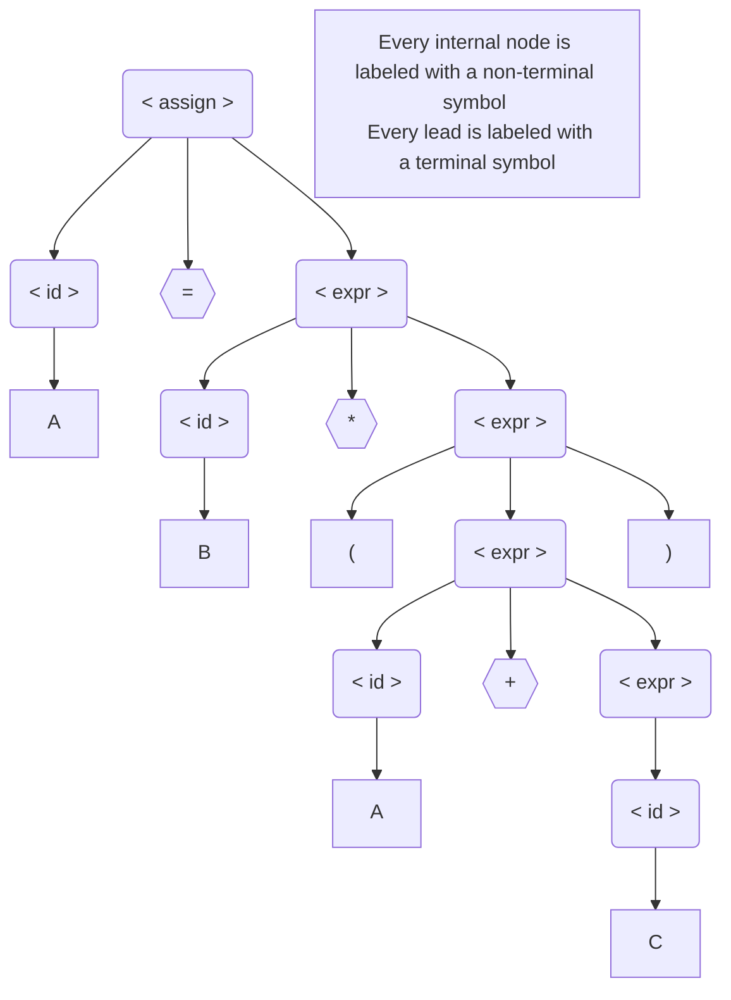
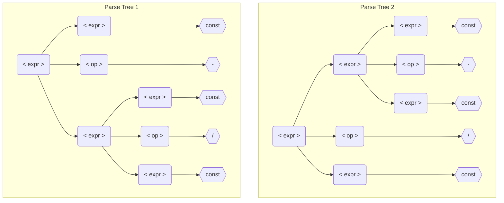
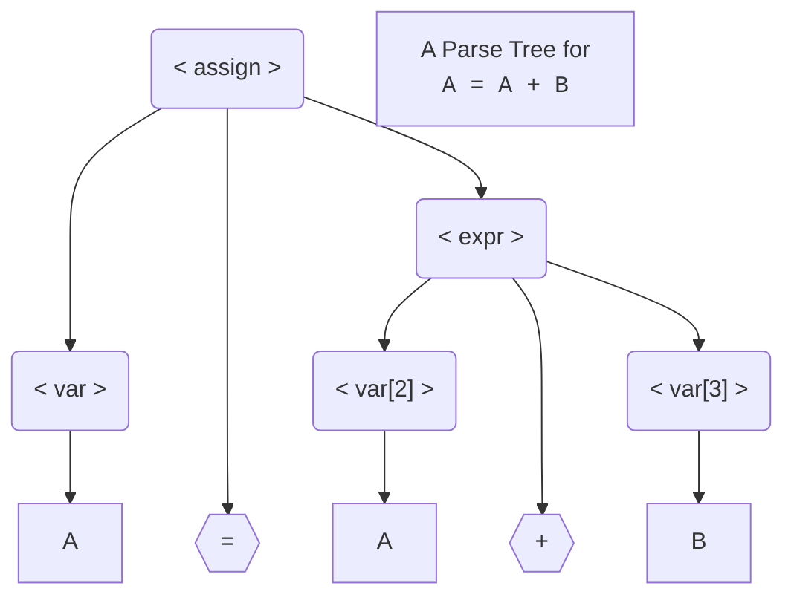
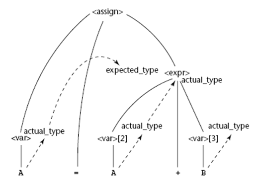
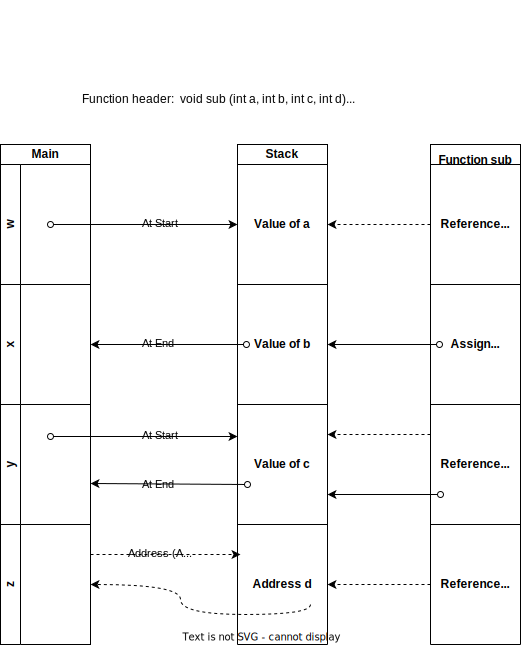

# Programming Languages

- [Programming Languages](#programming-languages)
  - [Preliminaries](#preliminaries)
    - [Reasons for Study](#reasons-for-study)
    - [Programming Domains](#programming-domains)
      - [Scientific Applications](#scientific-applications)
      - [Business Applications](#business-applications)
      - [Artificial Intelligence](#artificial-intelligence)
      - [Web Software](#web-software)
    - [Language Evaluation Criteria](#language-evaluation-criteria)
      - [Readability](#readability)
        - [Simplicity](#simplicity)
        - [Orthogonality](#orthogonality)
        - [Data Types](#data-types)
        - [Syntax Design](#syntax-design)
        - [`Grep`](#grep)
      - [WriteAbility](#writeability)
        - [Expressivity](#expressivity)
      - [Reliability](#reliability)
        - [Type Checking](#type-checking)
        - [Exception Handling](#exception-handling)
        - [Restricted Aliasing](#restricted-aliasing)
      - [Cost](#cost)
    - [Influence on Language Design](#influence-on-language-design)
      - [Computer Architecture](#computer-architecture)
      - [Programming Design Methodology](#programming-design-methodology)
    - [Language Categories](#language-categories)
    - [Language Design Trade-Offs](#language-design-trade-offs)
    - [Implementation Methods](#implementation-methods)
      - [Pre-processors](#pre-processors)
    - [Programming Environments](#programming-environments)
      - [LISP](#lisp)
  - [Describing Syntax and Semantics](#describing-syntax-and-semantics)
    - [Language Recognizers](#language-recognizers)
    - [Formal Methods of Describing Syntax](#formal-methods-of-describing-syntax)
      - [Context-Free Grammars](#context-free-grammars)
      - [Origins of Backus-Naur Form](#origins-of-backus-naur-form)
      - [Fundamentals](#fundamentals)
      - [Leftmost Derivation](#leftmost-derivation)
      - [Parse Trees](#parse-trees)
      - [Ambiguity](#ambiguity)
      - [Describing Lists](#describing-lists)
      - [Extended BNF](#extended-bnf)
        - [EBNF Example](#ebnf-example)
    - [Attribute Grammars](#attribute-grammars)
    - [Static Semantics](#static-semantics)
      - [Static semantics examples:](#static-semantics-examples)
        - [Type compatibility](#type-compatibility)
        - [Variables must be declared before they are used.](#variables-must-be-declared-before-they-are-used)
          - [Attribute Grammar Example](#attribute-grammar-example)
        - [Attribute Grammar Example](#attribute-grammar-example-1)
    - [Semantics](#semantics)
  - [Lexical and Syntax Analysis](#lexical-and-syntax-analysis)
    - [Lexical Analysis](#lexical-analysis)
      - [Example](#example)
      - [State Transition Diagram](#state-transition-diagram)
    - [Parsing Problem](#parsing-problem)
      - [Top-Down Parsers](#top-down-parsers)
  - [Names, Bindings and Scopes](#names-bindings-and-scopes)
    - [Variables](#variables)
      - [Alias Creation](#alias-creation)
    - [Binding](#binding)
      - [Type Binding](#type-binding)
        - [Static Type Binding](#static-type-binding)
        - [Dynamic Type Binding](#dynamic-type-binding)
    - [Storage Bindings and Lifetime](#storage-bindings-and-lifetime)
    - [Scope](#scope)
      - [Static Scope](#static-scope)
        - [Blocks](#blocks)
        - [Evaluation of Static Scoping](#evaluation-of-static-scoping)
      - [Global Scope](#global-scope)
      - [Dynamic Scope or Temporal Scope](#dynamic-scope-or-temporal-scope)
        - [Evaluation of Dynamic Scoping](#evaluation-of-dynamic-scoping)
        - [Scope and Lifetime](#scope-and-lifetime)
    - [Referencing Environments](#referencing-environments)
    - [Named Constants](#named-constants)
    - [Variable type Summary](#variable-type-summary)
      - [Static Variables](#static-variables)
      - [Stack-Dynamic variables](#stack-dynamic-variables)
    - [Explicit Heap-Dynamic](#explicit-heap-dynamic)
    - [Implicit Heap-Dynamic](#implicit-heap-dynamic)
  - [Data Types](#data-types-1)
    - [Primitive Data Types](#primitive-data-types)
      - [Integer](#integer)
      - [Floating Point](#floating-point)
        - [IEEE Floating Point Formats](#ieee-floating-point-formats)
      - [Complex](#complex)
      - [Decimal](#decimal)
      - [Boolean](#boolean)
      - [Character](#character)
        - [Unicode](#unicode)
      - [Character Strings Types](#character-strings-types)
        - [String length options](#string-length-options)
          - [Implementation](#implementation)
    - [Non-primitive types](#non-primitive-types)
      - [Enumeration Types](#enumeration-types)
      - [Arrays](#arrays)
        - [Categories of arrays](#categories-of-arrays)
        - [Array Initialization](#array-initialization)
        - [Array Operations](#array-operations)
        - [Array Slice](#array-slice)
        - [Array Access Function](#array-access-function)
    - [Memory Cells](#memory-cells)
      - [Row Major](#row-major)
          - [Compile-Time Descriptors](#compile-time-descriptors)
        - [Associative Arrays](#associative-arrays)
      - [Records](#records)
        - [Record Field References](#record-field-references)
        - [Compile-time descriptor of a record](#compile-time-descriptor-of-a-record)
      - [Unions](#unions)
    - [Pointers](#pointers)
      - [Pointer Operations](#pointer-operations)
      - [C and C++ Pointers](#c-and-c-pointers)
      - [Java References](#java-references)
      - [Problems with Pointers](#problems-with-pointers)
    - [Heap Management](#heap-management)
    - [Type Checking](#type-checking-1)
      - [Strong Typing](#strong-typing)
      - [Type Compatibility](#type-compatibility-1)
  - [Expressions and Assignment Statements](#expressions-and-assignment-statements)
    - [Arithmetic Expressions](#arithmetic-expressions)
      - [Operators](#operators)
        - [Conditional Expressions](#conditional-expressions)
        - [Operator Precedence](#operator-precedence)
      - [Operands](#operands)
    - [Overloaded Operators](#overloaded-operators)
    - [Type Conversions](#type-conversions)
      - [Mixed Mode](#mixed-mode)
      - [Explicit Type Conversions](#explicit-type-conversions)
    - [Relational and Boolean Expressions](#relational-and-boolean-expressions)
    - [Short-Circuit Evaluation](#short-circuit-evaluation)
    - [Assignment Statements](#assignment-statements)
    - [Mixed-Mode Assignment](#mixed-mode-assignment)
  - [Statement-Level Control Structures](#statement-level-control-structures)
    - [Selection Statements](#selection-statements)
    - [Iterative Statements](#iterative-statements)
      - [Counter-controlled loops](#counter-controlled-loops)
      - [Logically-controlled loop](#logically-controlled-loop)
      - [User-Located Loop Control](#user-located-loop-control)
    - [Unconditional Branching](#unconditional-branching)
  - [SubPrograms](#subprograms)
    - [Fundamentals of Subprograms](#fundamentals-of-subprograms)
      - [Categories of subprograms](#categories-of-subprograms)
      - [Definitions](#definitions)
        - [Example](#example-1)
      - [Actual/Formal Parameter Correspondence](#actualformal-parameter-correspondence)
        - [Positional](#positional)
        - [Keyword](#keyword)
    - [Parameter Passing Methods](#parameter-passing-methods)
      - [Pass-by-value](#pass-by-value)
      - [Pass-by-result](#pass-by-result)
      - [Pass-by-value-result](#pass-by-value-result)
      - [Pass-by-reference](#pass-by-reference)
      - [Pass-by-name](#pass-by-name)
      - [Parameter Passing Methods for Various Languages](#parameter-passing-methods-for-various-languages)
    - [Multidimensional Arrays as Parameters](#multidimensional-arrays-as-parameters)
    - [Subprograms as Parameters](#subprograms-as-parameters)
      - [Shallow binding](#shallow-binding)
      - [Deep binding](#deep-binding)
    - [Overloaded Subprograms](#overloaded-subprograms)
    - [Generic Subprograms](#generic-subprograms)
      - [Ada example](#ada-example)
      - [C++ example](#c-example)
      - [Java 5.0+ example](#java-50-example)
    - [Design Issues for Functions](#design-issues-for-functions)
    - [User-Defined Overloaded Operators](#user-defined-overloaded-operators)
      - [Ada Example](#ada-example-1)
    - [Coroutines](#coroutines)
    - [Summary](#summary)


[textbook companion site](https://media.pearsoncmg.com/ph/esm/ecs_sebesta_concepts_12/cw/)
[python grammar](https://docs.python.org/3/reference/grammar.html)

## Preliminaries

### Reasons for Study

Language Popularity [T.I.O.B.E Index](https://www.tiobe.com/tiobe-index/)

- Increased capacity to express ideas
- Improved background for choosing appropriate languages
- Increased ability to learn new languages
- Better understanding of the significance of implementation
- Better use of languages that are already known
- Overall advancement of computing

### Programming Domains

#### Scientific Applications

- First digital computers, which appeared in the late 1940s and early 1950s,
  were invented and used for scientific applications
- Typically, the scientific applications of that time used relatively simple data structures,
  but required large numbers of floating-point arithmetic computations
- The most common data structures were arrays and matrices;
  - the most common control structures were counting loops and selections
- The early high-level programming languages invented for scientific applications were designed to provide for those needs
- Their competition was assembly language, so efficiency was a primary concern
- The first language for scientific applications was `Fortran`
- `ALGOL 60` and most of its descendants were also intended to be used in this area, although they were
  designed to be used in related areas as well
- For some scientific applications where efficiency is the primary concern, such as those that were common in the
  1950s and 1960s, no subsequent language is significantly better than Fortran, which explains why Fortran is still used

#### Business Applications

- The use of computers for business applications began in the 1950s
- Special computers were developed for this purpose, along with special languages
- The first successful high-level language for business was `COBOL` (ISO/IEC, 2002), the initial version of which appeared in 1960
- It probably still is the most commonly used language for these applications
- Business languages are characterized by facilities for producing elaborate reports, precise ways of describing and storing decimal numbers and character data, and the ability to specify decimal arithmetic operations
- There have been few developments in business application languages outside the development and evolution of COBOL
- Therefore, this book includes only limited discussions of the structures in COBOL

#### Artificial Intelligence

This broad area of computer applications are characterized by the use of _symbolic_ rather than _numeric_ computations

The first widely used programming language developed for AI applications was the functional language `Lisp` _McCarthy et al., 1965_, which appeared in 1959
Most AI applications developed prior to 1990 were written in `Lisp` or one of its close relatives
During the early 1970s, however, an alternative approach to some of these applications appeared **<u>logic programming</u>** using the **Prolog** _Clocksin and Mellish, 2013_ language
More recently, some AI applications have been written in systems languages such as **Python** _Lutz, 2013_
`Scheme` _Dybvig, 2011_, a dialect of `Lisp`, and `Prolog`

#### Web Software

The **World Wide Web** is supported by an eclectic collection of languages, ranging from markup languages, such as `HTML`, which is not a programming language, to general-purpose programming languages, such as `Java`. Because of the pervasive need for dynamic Web content, some computation capability is often included in the technology of content presentation. This functionality can be provided by embedding programming code in an HTML document. Such code is often in the form of a scripting language, such as **JavaScript** _Flanagan, 2011_ or **PHP** _Tatroe et al., 2013_. There are also some markup-like languages that have been extended to include constructs that control document processing

### Language Evaluation Criteria

In this section we will discuss strategies and methods to improve **readability**, **write-ability** and **reliability**

#### Readability

##### Simplicity

> This improves all three characteristics **readability**, **write-ability** and **reliability**

**Feature multiplicity** there usually is a multiple ways of doing something for example
**Operator overloading** the `+` operator could be used for addition or string concatenation

```Java
count = count + 1
count += 1
count++
++count
"str1" + "str2"
```

##### Orthogonality

> **Orthogonality**
> means that a relatively small set of primitive constructs can be combined
> in a relatively small number of ways to build the control and data structures of the language

##### Data Types

```java
timeout = 1    // in order languages
timeout = true // better syntax in new languages
```

##### Syntax Design

> **Special Words** each language has keywords that represent program instructions

> **Form and Meaning** statements need to be designed in a way so purpose is obvious

##### `Grep`

For this unix command appearance does not necessarily imply function
To understand this keyword one may need familiarity with the editor `ed`
_In ed command `/regular_expression/` searches for a substring that matches the regular expression_
Preceding with `g` makes this a global command
Following command with `p` specifies that the lines with matching substring are to be printing

<style>
  .grep{
    color:darkkhaki;
    font-weight:bold;
    text-align: center;
  }
  .grep-letter {
    color:orangered;
    margin: 0 4px;
  }
</style>

<p style="text-align: center">
  <big class="grep">
    <span class="grep-letter">g</span> /
    <span class="grep-letter">r</span>egular_
    <span class="grep-letter">e</span>xpression /
    <span class="grep-letter">p</span>
  </big>
</p>

#### WriteAbility

Write-ability can also be improved with _simplicity_, _orthogonality_

##### Expressivity

The `count++` is more expressive way of expressing incrementing

#### Reliability

##### Type Checking

Type errors are important in language reliability
By doing type checking type errors can be greatly reduced

##### Exception Handling

Not all languages have exception handling for example C

##### Restricted Aliasing

**Aliasing** is having two or more distinct names in a program, that can be used to access the same memory cell
It is now generally accepted that aliasing is a dangerous feature in a programming language

#### Cost

Optimizing for compilation may not be necessary for students for example because programs have to be re-compiled multiple times

### Influence on Language Design

#### Computer Architecture

- **von Neumann architecture** is the basis of computer architecture
- The language that took advantage of early computer architecture are called **imperative** languages
- **Fetch-Execute Cycle**

initialize the program counter
**repeat** forever

    fetch the instruction pointed to by the program counter
    increment the program counter to point at the next instruction
    decode the instruction
    execute the instruction

end **repeat**

#### Programming Design Methodology

- In the 1970s were called _top-down design_ and _step-wise refinement_
  - These had a incompleteness of type checking and inadequacy of control statements
  - Requiring extensive use of `goto`s
- In the late 1970s, a shift from _procedure-oriented_ to _data-oriented_ ­program design methodologies began
  - data-oriented methods emphasize data design, focusing on the use of abstract data types to solve problems
- In early 1980's _object-oriented design_
  - data abstraction, which encapsulates processing with data objects and controls access to data, and adds inheritance and dynamic method binding
  - Inheritance is a powerful concept that greatly enhances the potential reuse of existing software, thereby providing the possibility of significant increases in software development productivity
  - This is an important factor in the increase in popularity of object-oriented languages
  - Dynamic (run-time) method binding allows more flexible use of inheritance

### Language Categories

four categories

- #### imperative
- #### functional
- #### logic
- #### object oriented

### Language Design Trade-Offs

- cost vs reliability of execution
- Java does index checking whilst C doesn't therefore Java trades cost for reliability

### Implementation Methods

#### Pre-processors

> A program that processes a program just before the program is compiled
> Pre-processor instructions are embedded in programs

### Programming Environments

`1945` _Conrad Zuse_ first programming language _Plankalkül_
`1950s` Fortran first high level programming language
`mid 1950s` Interest in AI began so use of functional language `lisp`

#### LISP

List are denoted by parentheses, elements are called **atoms**

```scheme
(A B C D)
(A (B C) D (E (F G))) ; nested list
```

> All computation in a purely functional program is accomplished by applying functions to arguments
> Neither the assignment statements nor the variables that abound in imperative language programs are necessary in functional language programs

    (A B C D)

Interpreted as function called `A` to the three parameters `B`, `C` and `D`

```lisp
; Lisp Example function
; The following code defines a Lisp predicate function
; that takes two lists as arguments and returns True
; if the two lists are equal, and NIL (false) otherwise
(DEFUN equal_lists (lis1 lis2)
  (COND
    ((ATOM lis1) (EQ lis1 lis2))
    ((ATOM lis2) NIL)
    ((equal_lists (CAR lis1) (CAR lis2))
      (equal_lists (CDR lis1) (CDR lis2)))
    (T NIL)
  )
)
```

```basic
REM Basic Example Program
REM Input:  An integer, listlen, where listlen is less
REM         than 100, followed by listlen-integer values
REM Output: The number of input values that are greater
REM         than the average of all input values
  DIM intlist(99)
  result = 0
  sum = 0
  INPUT listlen
  IF listlen > 0 AND listlen < 100 THEN
REM Read input into an array and compute the sum
  FOR counter = 1 TO listlen
    INPUT intlist(counter)
    sum = sum + intlist(counter)
  NEXT counter
REM Compute the average
  average = sum / listlen
REM Count the number of input values that are > average
  FOR counter = 1 TO listlen
    IF intlist(counter) > average
      THEN result = result + 1
  NEXT counter
REM Print the result
  PRINT "The number of values that are > average is:";
        result
  ELSE
    PRINT "Error-input list length is not legal"
  END IF
END
```

## Describing Syntax and Semantics
**Syntax**:
The _form_ of its expressions, statements and program units
- A **sentence** is a string og characters over some alphabet
- A **language** is a set of sentences
- A **lexeme** is the lowest level syntactic unit of a language
  - *eg, `*`, `sum`, `begin` etc*  
- A **token** is a category of lexemes 
  - *eg, `identifier` etc*  

**Semantics**:
The _meaning_ of those expressions, statements and program units
```{caution}
Harder to describe formally so we would not go too in depth here
```


**Context-free grammars** _also known as Backus-Naur Form_
A common method of describing syntax

3 formal methods of describing semantics

1. Operational semantics
2. Axiomatic semantics
3. Denotational semantics


- **Lexemes** the the lowest-level syntactic-units
  - So you can think of languages as a series of lexemes rather than characters
  - lexemes can be classified into groups
    - include numeric literals, operators and special words, among others
    - names of variables, methods, classes are called **identifiers**
- Each lexeme category is represented by a token

Consider

```java
index = 2 * count + 17;
```

| Lexemes | Tokens      |
| :-----: | ----------- |
| `index` | identifier  |
| `=`     | equal_sign  |
| `2`     | int_literal |
| `*`     | mult_op     |
| `count` | identifier  |
| `+`     | plus_op     |
| `17`    | int_literal |
| `;`     | semicolon   |

### Language Recognizers
In general languages can be described in two ways

1. #### **Recognition**
> Suppose we have language $L$ that uses an alphabet of $\sum$ of characters
> We need to construct a mechanism $R$ called a **recognition device** that reads the string of characters from characters $\sum$
> $R$ would determine wether a given string was or was not in $L$
> This is as if $R$ is a filter, determining legal sentences
> The syntax analysis part of a compiler is a recognizer for the language the compiler translates
> The syntax analyzer or **parsers** determines whether the given programs are syntactically correct

2. #### **Generation**
> A **language generator** is a device that can be used to generate the sentences of a language
> One can determine if the syntax of a particular sentence is syntactically correct by comparing it to the structure of the generator


### Formal Methods of Describing Syntax

Here we describe **language-generation mechanism** also usually called **grammars** 

```{note}
`middle to late 1950s`, two men, **Noam Chomsky** and **John Backus**, in unrelated research efforts, 
developed the same syntax description formalism, 
which subsequently became the most widely used method for programming language syntax
```
#### Context-Free Grammars
Noam Chomsky described four classes of generative devices or grammars that define four classes of languages

- Below are the two grammars that can be applied to programming languages
  1. ##### Context-free
  2. ##### Regular

#### Origins of Backus-Naur Form

Shortly after Chomsky’s work on language classes, the ACM-GAMM group began designing ALGOL 58 
A landmark paper describing ALGOL 58 was presented by <u>John Backus</u>,
a prominent member of the ACM-GAMM group, at an international conference in 1959 *Backus, 1959* 

This paper introduced a new formal notation for specifying programming language syntax
The new notation was later modified slightly by <u>Peter Naur</u> for the description of ALGOL 60 *Naur, 1960*. 

This revised method of syntax description became known as Backus-Naur Form, or simply **BNF**
BNF is a natural notation for describing syntax

In fact, something similar to BNF was used by Panini to describe the syntax of Sanskrit several hundred years before Christ *Ingerman, 1967*

Although the use of BNF in the ALGOL 60 report was not immediately accepted by computer users, 
it soon became and is still the most popular method of concisely describing programming language syntax

It is remarkable that BNF is nearly identical to Chomsky’s generative devices for context-free languages, called context-free grammars
In the remain der of the chapter, we refer to context-free grammars simply as grammars.
Furthermore, the terms BNF and grammar are used interchangeably

#### Fundamentals

A **metalanguage** is a language that use used to describe another language
BNF is a metalanguage for programming languages

*tokens are also abstractions*

`<Pointed Bracket are often used to Delimit Names of Abstraction>`

> The actual definition *called a **rule** or **production*** of the abstraction assign is given below 
``` ebnf
<assign> -> <var> = <expression>
```

`left of arrow` the abstraction being defined
`right of arrow` Mixtures of tokens, lexemes and references to other abstraction

> The abstractions in a BNF description, or grammar, are often called **non-terminal** symbols, or simply **non-terminals**, and the lexemes and tokens of the rules are called **terminal symbols**, or simply **terminals**
> A BNF description, or **grammar**, is a collection of rules

A **grammar** is a generative device for defining languages

The sentences of the language are generated through a sequence of applications of the rules,
beginning with a special non-terminal of the grammar called the **start symbol**
This sequence of rule applications is called a **derivation**

In a grammar for a complete programming language, the start symbol represents a complete program and is often named `<program>`

```ebnf
<program> -> begin <stmt_list> end
<stmt_list> -> <stmt>
    | <stmt> ; <stmt_list>
<stmt> -> <var> = <expression>
<var> -> A | B | C
<expression> -> <var> + <var>
    | <var> - <var>
    | <var>
```

`=>` symbol reads as **derives**
Each successive string the sequence is derived from the previous string by replacing one of the non-terminals with on of that non-terminal's definitions

Each of the strings in the derivation, including `<program>`, is called a **sentential form**

> The Derivation keeps going until the sentential form contains no non-terminals
> only containing containing terminals, or lexemes

```bnf
<program> => begin <stmt_list> end
          => begin <stmt> ; <stmt_list> end
          => begin <var> = <expression> ; <stmt_list> end
          => begin A = <expression> ; <stmt_list> end
          => begin A = <var> + <var> ; <stmt_list> end
          => begin A = B + <var> ; <stmt_list> end
          => begin A = B + C ; <stmt_list> end
          => begin A = B + ; <stmt> end
          => begin A = B + C ; <var> = <expression> end
          => begin A = B + C ; B = <expression> end
          => begin A = B + C ; B = <var> end
          => begin A = B + C ; B = C end
```

<div class="columns">
  <div class="column">
  
#### Leftmost Derivation

The statement 

    A = B * ( A + C )

is generated by the leftmost derivation:
```bnf
<assign>  => <id> = <expr>
          => A = <expr>
          => A = <id> * <expr>
          => A = B * <expr>
          => A = B * ( <expr> )
          => A = B * ( <id> + <expr> )
          => A = B * ( A + <expr> )
          => A = B * ( A + <id> )
          => A = B * ( A + C )
          
```
  </div>
  <div class="column">
  
#### Parse Trees


  </div>
</div>

#### Ambiguity
A grammar that generates a sentential form for which there are two or more distinct parse trees is said to be **ambiguous**

```bnf
<expr> -> <expr><op> | const 
<op>   -> / | -
```
> Below we can get two distinct parse trees to generate the same sentence 




#### Describing Lists

We use recursive so we can easily define the **ellipses** *...* in standard list definitions

```bnf
<ident_list> -> identifier 
              | identifier, <ident_list>
```

#### Extended BNF 
<big style="color:orangered;">EBNF increases readability and writeability</big>
Optional parts are placed in brackets `[optional parts]`

```bnf
<if_stmt> -> if (<expr>) then <stmt> [ else <stmt> ]
```
Alternative parts of RHSs are placed inside parentheses and separated via vertical bars `[optional parts]`
```bnf
<term> -> <term> ( + | - ) const
```
Repetitions *0 or more* are inside braces `{repitions}`
```bnf
<ident> -> letter {letter | digit}
```

##### EBNF Example
```bnf
<expr> -> <term> {(+ | -) <term>}
<term> -> <factor> {(* | /) <factor>}
```

### Attribute Grammars

> Used to describe both the syntax and status semantics of programming languages

<big style="color:seagreen;">This is a device that can better describe the structure of a programming language than context-free grammar</big>

### Static Semantics 
Include rules related to restrictions on the structure of programs
*not* directly related to the meaning of programs

#### Static semantics examples:
##### Type compatibility
> Can be specified in BNF, but too cumbersome

##### Variables must be declared before they are used.
> Can not be specified in BNF

```{admonition} Definition of **Attribute Grammar**
Has the following additions

  - For each grammar symbol `x` there is a *set* `A(x)`
  of attribute values ( *synthesized* and *inherited* )
  - Each rule has a set of functions that define certain attributes of the non-terminals in the rule
  - Each rule has a ( *possibly empty* ) set of predicates to check for attribute consistency  

```

###### Attribute Grammar Example
Syntax of simple assignment statements: *here we have the grammar*

``` bnf
 <assign> -> <var>  =  <expr>
 <expr>   -> <var>  +  <var>  
 <var>    -> A | B | C
```
Static semantics:
- Variables can be either int or real
- Variables in a statement must be the same type

Attributes:
- `actual_type` - synthesized for \<var> and \<expr> 
- `expected_type` - inherited for \<expr>  


##### Attribute Grammar Example

The `.` symbol is a way to get the *attribute* of the non-terminal
in this case `<expr>`  

```bnf
1.  Syntax rule:    <assign> -> <var> = <expr>
    Semantic rule:  <expr>.expected_type <- <var>.actual_type
    "So we expect the expected type of expr to be the actual_type of var"

2.  Syntax rule:    <expr> -> <var>[2] + <var>[3] 
    "2 and 3 are there to distinguish type"
    Semantic rule:  <expr>.actual_type <- <var>[2].actual_type
    Predicates: "conditions that must be followed"
                    <var>[2].actual_type == <var>[3].actual_type
                    <expr>.expected_type == <expr>.actual_type

3.  Syntax rule:    <var> -> A | B | C
    Semantic rule:  <var>.actual_type <- lookup (<var>.string)
```




### Semantics
> There is no single widely acceptable notation or formalism for describing semantics
> These three methods are *really complicated* so we are not going to cover these this course

Three methods of describing semantics:
1. #### Operational
Describes the meaning of a program by executing its statements on a machine, either simulated or actual
The change in the state of the machine (memory, registers, etc.) defines the meaning of the program

2. #### Axiomatic
Based on formal logic

3. #### Denotational 
Based on recursive function theory

## Lexical and Syntax Analysis

Compilers that compile programs into machine language for execution by the computer are actually tools which incorporate the grammars

In order to compile a program, a compiler must perform a *lexical and syntax analysis* of the program to determine whether there are any syntax errors in the program

Here we will discuss how to create a **lexical analyzer** and build a *recursive-descent parser*


<font color="lightskyblue">To analyze syntax there are two types</font>
1) **lexical analyzer** - the low-level part
1) **syntax analyzer** - the high-level part

### Lexical Analysis

This is essentially a pattern matcher

**A lexical analyses is the front end of a syntax analyzer**
<font color="springgreen">A input program appears as a <b>single string of characters</b> to a compiler</font>
We need to split this string into parts and grouping called **lexemes**
Lexemes are recognized by matching strings against string patterns
These lexemes are grouped and categorized by internal codes named **tokens**
So the process is to split a string into lexemes and produce corresponding token 

#### Example

Take this string

    result = oldsum - value / 100;

Token | Lexeme
:--: | :--:
IDENT | result
ASSIGN_OP | =
IDENT | oldsum
SUB_OP | -
IDENT | value
DIV_OP | /
INT_LIT | 100
SEMICOLON | ;

```{important}
Each call of a lexical analyzer returns a <u>single</u> `lexeme` and its associated `token` code

Lexical analyzers also have the job of detecting syntactic errors and reporting these back to the user

For user defined naming and identifiers a lexical analyzer inserts these into a **symbol table** for the next step in a compiler
```

**Note** Part of lexical analysis is the ignoring of comments and whitespace

<font color="lightskyblue">There are three approaches for building a lexical analyzer:</font>
1. <i>Write a formal description of the token patterns of the language using a descriptive language related to regular expressions</i>
These descriptions are used as input to a software tool that automatically generates a lexical analyzer.
There are many such tools available for this. The oldest of these, named *lex*, is commonly included as part of UNIX systems

1. Design a <i>state transition diagram</i> that describes the token patterns of the language and 
   write a program that implements the diagram

2. Design a <i>state transition diagram</i> that describes the token patterns of the language and 
   hand-construct a table-driven implementation of the state diagram

#### State Transition Diagram

> Also called **state diagram**

This is a directed graph
Nodes are labeled with state names
The arcs are labeled with the input characters that cause the transitions among the states
The arc could include actions the lexical analyzer must perform when the transitions are taken

State diagrams are part of **finite automata**


<img style="background-color:white" src="data:image/png;base64,iVBORw0KGgoAAAANSUhEUgAAAsMAAAIfCAYAAACVcNEWAAAAAXNSR0IArs4c6QAAIABJREFUeF7snQeY1FQXhr/ZXXqTIkUREcSGoPKLvRdExQaKiP23N+y9/nZRsWHvYsWGWEEQuygKIgICUhXpICwddud/vnCjIWRmMrNTks13nmeeLUlu7n1vNvvl5NxzYpCJgAiIgAiIgAiIgAiIQEQJxCI6bg1bBERABERABERABERABCAxrItABERABERABERABEQgsgQkhiM79Rq4CIiACIiACIiACIiAxLCuAREQAREQAREQAREQgcgSkBiO7NRr4CIgAiIgAiIgAiIgAhLDugZEQAREQAREQAREQAQiS0BiOLJTr4GLgAiIgAiIgAiIgAhIDOsaEAEREAEREAEREAERiCwBieHITr0GLgIiIAIiIAIiIAIiIDGsa0AEREAEREAEREAERCCyBCSGIzv1GrgIiIAIiIAIiIAIiIDEsK4BERABERABERABERCByBKQGI7s1GvgIiACIiACIiACIiACEsO6BkRABERABERABERABCJLQGI4slOvgYuACIiACIiACIiACEgM6xoQAREQAREQAREQARGILAGJ4chOvQYuAiIgAiIgAiIgAiIgMaxrQAREQAREQAREQAREILIEJIYjO/UauAiIgAiIgAiIgAiIgMSwrgEREAEREAEREAEREIHIEpAYjuzUa+AiIAIiIAIiIAIiIAISw7oGREAEREAEREAEREAEIktAYjiyU6+Bi4AIiIAIiIAIiIAISAzrGhABERABERABERABEYgsAYnhyE69Bi4CIiACIiACIiACIiAxrGtABERABERABERABEQgsgQkhiM79Rq4CIiACIiACIiACIiAxLCuAREQAREQAREQAREQgcgSkBiO7NRr4CIgAiIgAiIgAiIgAhLDugZEQAREQAREQAREQAQiS0BiOLJTr4GLgAiIgAiIgAiIgAhIDOsaEAEREAEREAEREAERiCwBieHITr0GLgIiIAIiIAIiIAIiIDGsa0AEREAEREAEREAERCCyBCSGIzv1GrgIiEAICOwKYBKAhSHoq7ooAiIgAqEkIDEcymlTp0VABCJCYACA+wB8HZHxapgiIAIikHcCEsN5R64TioAIiIBvAu8CuF9i2Dcv7SgCIiACaROQGE4bmQ4QAREQgbwReAdAH4nhvPHWiURABCJIQGI4gpOuIYuACISGwNsAHpAYDs18qaMiIAIhJCAxHMJJU5dFQAT+IWDH0zK2Nlt2BIB5AIa7GtwaABe0vZStE/loJyhiOBETH0PQLiIgAiIQbAISw8GeH/VOBEQgOYFvAVAwMq42W/Y6gKkArnU1eC6AUwHsnq0T+WjnLQAPJvEMbwWAoRSzALQDUBtAuck+8T2AJwAMA1AVwCgAR5vsFMlOvROA5wDwq22JmPgYgnYRAREQgWATkBgO9vyodyIgAskJMMvCmwAeyiIoCr9SAGd5iOHLAbTJ4rlSNWWPLVE2iW0AjAdwEQAK5zkAeF9vDuAYADcBuBfA3alOlGJ7IiYVbFaHi4AIiEDhCUgMF34O1AMREIHMCXwJ4A0Aj6bRRBMAbQHMBDDB4zgKv9UATvEQw9cBaOFxTJHxpNYCMBLAUrNPS+NJfs1xTCMjqDcCMCVBH+zd+wN4OIln2BbD2wL4zaNfHc2xmwCgF/lPAH/4YHUUgE8ArDL7JmLioyntIgIiIALBJiAxHOz5Ue9EQASSE/gCwKsAnvQBqroRlicBoIguM2EF/wUwGUBT0wZDC+oD6G3CC+iVLTbimGK4BwC2xZji2QD2M2EFcQAMTdjO9InHc9tgABsD2B/ANSac4S8AjQF8B6Bzkr5XVAyz6WkAjgNArzYF7guO89UBcDGAnQEw5IQx2Ayz4Lh2A7AyAZOBhp8P7NpFBERABIJNQGI42POj3omACCQnQKH6PIBnfYBizl6GP1wKYIHZ/xwA5wHY0Qi/EgD08rLi22gjepcBOMCEH/AwxuBWA3CZ2Zftng5gkGmT8bmsGkeROQbA70ZobgngBgD9zLmqANjUiNVE3afX+5EKeIbpBWf88+amHYpvO6SEnuIhpm1+pVDn+W40YvgQI+69mOwjMezjitMuIiACoSAgMRyKaVInRUAEEhCgd/ZxAC+mIETv68cAfjGLzej9bGhEMH/PhWW2Mc52LwCdXG1SAFI0UuzaxvMzy8TPAJYbkUyR2QzAHuZ89K7ON5koGBaRjjE8oW+GYpj3dy6uoxf6AgBsaxyAWwFsZtq82eEpvgtABwAUwfQMdzcedPY3EZN0xqJ9RUAERCCQBCSGAzkt6pQIiIBPAvTeMhzhlRT7UzCfCeA2AJ+bUICaxkNLb+kax/H0+HYx3mBnsxSKPxpvMH9PrytF4wizQI2is4YRyxONR5b7MU0b+3eJzzE5d2OsMeOhUy2gc8cMM4zjKQCMT+ZCOsb+UgwzXvhKAAxzYJtkR2tgPOEcA9PHcVxnAPjQbE/EJIMh6RAREAERCBYBieFgzYd6IwIikB4Bxvoyjpev95MZMy1Q/B7msdMuZtHbWrONYpF5dekJdhoXo/1g4ofpWd7ehEFQPPL3TmPMMWOQmemBC+qY/u2O9IZm7Z2JGN7XhEJQ8P7PEc5AMczwD7Kit3kH81DQ2niQufiPDwUU1hTDvQAwZpmWiEkGQ9IhIiACIhAsAhLDwZoP9UYERCA9AszawDAHhikwHIEeUH6c3zODAgUrK7kxPnio8eoyDrinEX4UybYYvgoAsyns6eoKRTMXyDFMgqKRX+1sEFyctsRklGDIBds70SxYY0EQeofdqdr8jJSLAx/z4Rk+0iz6Y+wyY5wZCuEW6BTDZLMIADNZMOUaM2acbUo+M76ZmSuYLYNimHmWGY9NS8TEzxi0jwiIgAgEmoDEcKCnR50TARFIQqCuiXflgjdme+BX5/f8He9xz5gwBXqQuWCOi9YY38uQBy5mY7wxM0vYdrxZHEcB7TTGAVNYs7DFCrOBmSMoIFmIgyESFMcU28zKwEV0tHtMbDJjcdM1hlcwxCNRmAQXxn1mYpL5lfv/muAk7BOFMkMlyOJvExPMMAz2tZs5F7NcfAXgTvOgweYSMUl3PNpfBERABAJHQGI4cFOiDomACOSYAEUy06Ax1MHLKKhbmSwQ7u0suMHsEDzebcwO4Yw9trcz/IDZJxiikK6lEsPptpdsfwpeZq6gGHZbMibZ7IPaEgEREIG8E5AYzjtynVAEREAEfBOgkGbIh9Nz7fvgNHdkWAe9x/SAy0RABEQgMgQkhiMz1RqoCIiACCQlwPhhplBjPmSZCIiACESGgMRwZKZaAxUBERCBpAROM8VDmI1CJgIiIAKRISAxHJmp1kBFQAREICkBeoVZjCOTrBdCKwIiIAKhJSAxHNqpU8dFQAREIGMCzELBFGrMjFEHAHMNX22qzg3OuFUdKAIiIAIhJCAxHMJJU5dFQAREoIIEmDP5UlOhjunWmCP5I1OlroJN63AREAERCBcBieFwzZd6KwIiIAIiIAIiIAIikEUCEsNZhKmmREAEREAEREAEREAEwkVAYjhc86XeioAIiIAIiIAIiIAIZJGAxHAWYaopERABERABERABERCBcBGQGA7XfKm3IiACIiACIiACIiACWSQgMZxFmGpKBESg0hPYBADTkvHTEkBdADUB1DAf5/f8XaKfVwBYDoBf7U+yn7mNGR+mAZhuPn9VetoaoAiIgAjkgYDEcB4g6xQiIAKhIeAUuvb3tvDl1yoBGskaI4qdAplC2flzgLqrroiACIhAMAlIDAdzXtQrERCB3BP4DwD3J/dnze8ZvgHwNQB+/RHArPyeXmcTAREQgeATkBgO/hyphyIgAhUnQNG7I4CdzFd+X6vizYauhXEOYfwTAH5kIiACIhBpAhLDkZ5+DV4EKi2BLQAcBuBwADsD2LjSjrRiA5sNYIQRxe8B+LlizeloERABEQgfAYnh8M2ZeiwCIuBNYFMjfm0RXJJlUFzENhfAHAAUkQsBrHJ8Vpvv7a/c5vze+XM1AFUB8Kv9cf5sf+/eh6Ke4+SncZbHx+YGAaAoHqCQihzQVZMiIAKBJCAxHMhpUadEQAR8EqA4pPfXFsDM3pCpLTJCl2LX61OaacM5Oo5i3xbG7q/NKnhOZq6gIKYw5qesgu3pcBEQAREILAGJ4cBOjTomAiKQhMChAE4yInijDEkx68JoACMBjAIQNLGb4bCsw3hvp0Bm+rcdTJz0lhk2OMnhLeZCPJkIiIAIVCoCEsOVajo1GBGo9AQ6AuhlhHC6g6X45QKyMUYAM+QhE6OXdKX52GES5QDsD7f7/bkIAD/F5qvfn6sD4Ie5jPnVj9UHsD2A9hUQx/QWPwpgiJ8Tah8REAERCAMBieEwzJL6KAIi0MqI4IuMaPRDhGnE6PEdaz7MwevHGOdLsUuh6xS99vdr/TSSx30ooG1hbBf/cH5N1BWGUrQzApkimYsO/Vo/I4q/93uA9hMBERCBoBKQGA7qzKhfIiACJFAPAAUwvcF+MkLQK/uV48PCFKlsGYDFABgzzE/QxG6q/qfaTmHMNHIMJ+GndoIDmG5uPwD7m8p6qdrl9seMKKbHXSYCIiACoSQgMRzKaVOnRSASBM4zIngbH6Ol95fFJSiEZ6bYn+KXC8RsAUwPcJSMGSpYRjqROG7gEMX0GKcy8mToBD8zUu2s7SIgAiIQNAISw0GbEfVHBESAJY/7Ajg7BYp5RvxSBDMcIpGtAPC3QwAzRZrsXwIMsaAH3v44i5EwRzM9xfQYp8rUwXRzNwJ4RnBFQAREIEwEJIbDNFvqqwhUfgJbGyF8UJKhMpThZQCfAEgkbOMAKJbnmw8XtMn8EaDHmDmMGZbCBxMaf6Yo5rykykpxF4Dr/J1Ke4mACIhA4QlIDBd+DtQDERCBdQQ6A/g4BYzBRgj/kWA/hj/YIpgeYVnmBBhOYYtieo1pjDc+FcCxKZrtD+D4zE+tI0VABEQgfwQkhvPHWmcSARFITICexDuSAGImCGYwGOqxD2N+6QGmCGY4hCz7BJiWjcKYH6aB28uI4mRe4p9MKezs90YtioAIiEAWCUgMZxGmmhIBEciIwLcAdk9y5JvGG0yvr9OYAo0imbGqqpCWEfq0D2LpaAriJgCa+vAS8+GEeY0TefLT7oAOEAEREIFsE5AYzjZRtScCIpAOAWYiSLQw6xcjgkd4NEgBzMwFWgyXDu3s7ctS0Kxu19ynl3hvk+0jez1QSyIgAiKQJQISw1kCqWZEQATSJsAMEMxt62WfA/ifxwaKZ4rgOWmfTQfkgkAjI4r9eImZpUIPL7mYBbUpAiJQIQISwxXCp4NFQAQyJPAGgO5pCmG+aqcQ9lNII8Nu6bAMCDi9xGcCODFBG7+aincZnEKHiIAIiEDuCEgM546tWhYBEfAmcBuAG9IQwow7pQheKKCBJmB7ia9M8qDTG8DVgR6FOicCIhA5AhLDkZtyDVgECkrgZAAvpSGE5wJQqd+CTllaJ7e9xBS9xyQ4sieA19JqVTuLgAiIQA4JSAznEK6aFgERWI/AriaPMNN0uc0rRlhCOLwX0BYAHgbQJcEQOgL4MbzDU89FQAQqEwGJ4co0mxqLCASbwEAAR0gIB3uSsti71gAeA9DJo00unjwQAKsJykRABESgoAQkhguKXycXgcgQoIfwfY/RLgBwMYCZjm3yCFeey6INgKcA7OcxJIbLsJqdTAREQAQKSkBiuKD4dXIRiAyBRF5hvkp/V0K4Ul8HhwJg9pA6rlEyK8geCpeo1HOvwYlAKAhIDIdimtRJEQg1gURe4eEArpUQDvXc+u38AwAuSeAdPgPAWr8NaT8REAERyDYBieFsE1V7IiACbgJeXmGWT2Z4xFiz8yoAPwNYIXyVkgDLOP8EoK1rdEybdxSALyvlqDUoERCBUBCQGA7FNKmTIhBaAom8wowXfd4xqkmuuOHQDlgdT0iA8cEveGx9FkAvVafTlSMCIlAoAhLDhSKv84pANAh4eYV/M+LHriTHRXRjooEj8qP8AMDhLgqzAHQG8Evk6QiACIhAQQhIDBcEu04qApEg0B7AaI+RsvrcN+b3cQBMs7UkEkQ0yN3M3Be5UDxkKtMxXEYmAiIgAnklIDGcV9w6mQhEisAFAPq6RswUaic5fjcNAD+y6BBgBpGLXMP9HcBBAKZHB4NGKgIiEBQCEsNBmQn1QwQqH4HXARzvGtY7AB4xv6M3mIvmyivf0DWiJAS2BsBQGbedB+BpAFxcKRMBERCBvBGQGM4bap1IBCJFoAqA+QDqukZ9DYDvze9+NftECowGaxH4GsCeLhZcUHkTgD/FSAREQATySUBiOJ+0dS4RiA6BAwAMdQ13MYCjze+YQs0WxdGhopHaBCh6/+fCwdjxs1WEQxeJCIhAvglIDOebuM4nAtEgcKeroAZH/SGA+8zw6f1jnKgsmgT+4yF6GR7BnMNcXMn8wzIREAERyAsBieG8YNZJRCByBBgLvINr1NcB+M78jmm0FkaOigbsJMCCK9u5kNBjzBzUWkina0UERCBvBCSG84ZaJxKByBDY1CPuk14/ZgugMb+wnVotMlA00A0I9AFwqeu37wG4OUFKPiEUAREQgZwQkBjOCVY1KgKRJnCYCYlwQvgRwJXmFyyyMCHShDR4EtgLwFcuFAyfYeo9PiytFSYREAERyAcBieF8UNY5RCBaBE5zlVrm6IcAuMNgYLU5Vp3Llh0C4HIALPLR1KPRVNsT9aMGAIZ2sEjIEQBYPa2yWqHGOhtAExdUpuMbBmBeZYWtcYmACASLgMRwsOZDvRGBykCAHuDeroG8CeAxAKw490UOBnkmgNsTiGGezmt7IyOi6aGkOOf9cGOT9/gZAC+YfrLPYRfDQR0rF1XyTYLTmH6P+agn5eA6UZMiIAIisAEBiWFdFCIgAtkmQCFsh0TYbbOYwqtm0RwXz2Xb0hXDLUyu20EAegFgqjfb9gNwMoAzQiqGmb5ugGM8QR7riwBOcV0Md5n+/5Dti0TtiYAIiIAXAYlhXRciIALZJsDiCQyVcBoF8scA5gAYn+0TAjgdAEWUV5gET+fe/j4AVkJjNgOv2NRLADzoEMNdPOKgczCMhE2yr1yA+GiKkzYHMBwAv9oW5LHeD+Ay15j4BoFvEph5ZFU+IetcIiAC0SQgMRzNedeoRSCXBLxefdtp1f4AMNnnyd8AUN14bbcAcKqjjC9/pjCsYzJX0PvZ2iGGk21nKARFOcXz9T76wjAJ5k1mqrg9TNovel/t9F+J+sm2GbrBftPbzEIkLU3s9IkA2gEoTXD+swB0BzAXQFsAHB/DOcaZ/ZmF4VAASwEw3vccAFVNqWuehw8enwB4u8BjTYX3WsPWud8rABimovR7qehpuwiIQFYISAxnBaMaEQERcBDg6+2OLiLnG4/wFAAzfNJiztlbzb4UdUuMh5e/YnYKnoft0txhEsm208P6qclaQOGVyiiGKU4ZQ7yR8bwypvUqc2CyfvLYxwE8BeBC00+KcIphilwvMUzB/RmAzcwiMsYrv2W8vVxUdiwApiXbFsAyAE8CYDo7eq/pkWdhE8YI0wo91lRsyZVsnMaFivQY8w0CH1pkIiACIpBTAhLDOcWrxkUgkgSmGg+oc/A9Adgp1fg1XetrPL/0hu5iSjlTTNqeUqcYTrW9mxGX9O4yr20qcy+gY+wzjWNym7Of3OY8ll7ulalOZrJXML3YNmbfZgD+ArA/gM8BMOyBHmM7ppnxzRTctT3EcNDHyjl418WE6db4gME3CHyTIBMBERCBnBKQGM4pXjUuApEkwFf3tVwjp4ilEPSbVq3EZHroYErz7mnCITobEUqPLsMDbHHpFMMUqcm2dwLAhXPc7zUfM+QWwy8DYP96mK9M6+bVT7cY9nEqaxcKQXp4W5kDGCLBkIydAfxkwgeqOApT1DVhFPTGMy2Z0zMc9LF65RrmNcJFjRwzH6xkIiACIpBTAhLDOcWrxkUgkgS46Inxq0472CxUG2nCHVKBYQgCY23/YwQvPa5bAqAYtvMYVwOw2jTkFMOptjcGwPy2jANmDmEvY//ttpOJ4WT9zFQM7wrgWzN2lrW+yIRYMMaYfWLBko88qrfxfO4wiaCPld5v94JKhtFw7lWcJdVfibaLgAhkhYDEcFYwqhEREAEHAebsbeAicpQRwcx04CdUgIvSKKrttFtOMXygKeKRKEwi1XZ2jTG/FJfMJsHy0G5jHOvZ5pfJxHCyfmYqhnkcM3IwM8Z8AMuNcLcX7NGrTVHMWGK3ucVw0MfK2GZ3cY3FABg+wbH/qr8sERABEcg1AYnhXBNW+yIQPQIUbXy177QTjDeW8aBlPpA8ZDIwMP6XXlqGMzA0gZ5hhghwIR5L9jJelmKW6bnopaWATLWdp2fVM/bla7MIzynQtwfA81NUewlaZ5hEsn4mEsM8niEN9HozpMRtZHUPgCuM6KUYpyd7hCkIQi84Y4QPBzDYHMywFC6mYwaKl0zxEHtxXiHH6mOqrbhqtzE+mqJ4lJ8GtI8IiIAIVISAxHBF6OlYERABLwJjjcfVuY2LvShgvzSCLhU5hkRwcRs9zBS9fHXOGF+mFKMw3tEIQu7HuFIuMGNc8i0mZVqq7Tx/PSOi9zZZC4rN+YrMAjvmu2W+4QcAvA7garOojT9zH2ZCoEhN1E+KUO7b36Q8o/Cm3WbCM1g+mvGxbuOYGAbRxrWBqdI4Rt63Kf7tdGp/mv7Re97QMGYcMfvFDBaFHGuqeeYc/O3aiZ5wCn1+VeGNVAS1XQREoMIEJIYrjFANiIAIuAh4pVajKKNIprD1CkuIGkR6efdxVb6zGXAxHvPvHueAQk8p061RKPvN0xwGpvbiQGdfGTZBDzevE14vMhEQARHIKQGJ4ZziVeMiEEkCFG0Ub05jeWbm/vUbM1xZwdFjyxAI5jlm3LKX0QNM7zdLFdtGLzO90BSPlSndGOO23eW5GWZjVzBkKjmZCIiACOSUgMRwTvGqcRGIJIGBHou7bjav7+kRZWxrVI1imCnhkhWTYIENZt1gtgsaQzKYLo0lmRk+UJnMK7Uas0uwmArLZNuhJZVpzBqLCIhAwAhIDAdsQtQdEagEBFiUgovAnEZvKD2eflOrVQIMGQ+huVnAx/szBWF9w42xxl4L7jI+UQAOpLhnxTmn8Q0C3yQwm8h3AeijuiACIlDJCUgMV/IJ1vBEoAAEmJaMi8uc9rCpNDYawKIC9EmnDCYBu0CKs3dcZMk3CXyDwDcJMhEQARHIKQGJ4ZziVeMiEEkCfTwKQjxjqsJxEZ07r2wkIWnQFoHzADBrh9P4BoFvEpYYj7hQiYAIiEBOCUgM5xSvGheBSBK4FcCNrpEzzdeDAH4zC8EiCUaD3oDANSYVnnMDFxY+Yt4g8E2CTAREQARySkBiOKd41bgIRJLASQD6uUbOfLq9AEwCMDOSVDRoLwKPmsVyzm28dp4zbxD4JkEmAiIgAjklIDGcU7xqXAQiScArXRbjP7uYwhssoCETARL4wuRbdtK4GwBLTjOVHN8kyERABEQgpwQkhnOKV42LQGQJsOQyU4I57XhTXpfeYZkIkAAFL3MoO42V9SYCYGW934VJBERABHJNQGI414TVvghEkwBTqO3kGjqrqtHjNyqaSDRqF4FNEoTMdDLV51h8g6W2ZSIgAiKQUwISwznFq8ZFILIEnndUEbMhPA3gJRVSiOw14R44RS8fjpw2DcDp5hdabKlLRQREIC8EJIbzglknEYHIEbgEwAOuUQ8FcLsppMCCCrJoE+CCyodcCFh++X/mdz8BKI02Io1eBEQgHwQkhvNBWecQgegR2B/AZ65hTwFwBgBmllgQPSQasYtAXwAXuH73AoAXze9YfKNc1ERABEQg1wQkhnNNWO2LQDQJNEggeCmSKYqVUSKa14Vz1IMBHOzCQK8wvcOqPqfrQwREIG8EJIbzhlonEoHIEaDg3cw1ahZZGAhgfORoaMBOAu0BeBXUOA0AF87NBTBOyERABEQgHwQkhvNBWecQgWgSeBPAsa6hDwBwB4Afo4lEozYEbnLEBttQKIIphmlcSMePTAREQARyTkBiOOeIdQIRiCyBHgBec41+FoCe5lV4ZMFo4ODiuA4uDq8AeMb8jpXn5omTCIiACOSDgMRwPijrHCIQTQL1APztMfTzAPQHsDCaWCI/aq+UaoRyLoAJhs4IEzcceVgCIAIikHsCEsO5Z6wziECUCbxvyjA7GdD71xuAKtFF88p4FMD5rqEzbOZK87vlAH6IJhqNWgREoBAEJIYLQV3nFIHoEDgbwJOu4bICHb3D30cHg0ZqCNQ1iydZfc5pfQDwwYmmynO6XERABPJKQGI4r7h1MhGIHIHWAH73GPXJAN5TUYXIXQ/nAHjCNWoW1jjFEVKjYhuRuyw0YBEoLAGJ4cLy19lFIAoEWHyD+YWd9jqAq5VvOArT/88Yq5nwB6ZVc9qHAO4zv2Ac+S+RoqLBioAIFJyAxHDBp0AdEIFKT+A6k07NPVBWo3uu0o9eA7QJeJXo5jbmnrZDZiYC+EvIREAERCCfBCSG80lb5xKBaBLYCcC3AKq7hk8BRI/ximhiidSomVmEGSLauEbNanOsOkdbY/ZZHSkyGqwIiEDBCUgMF3wK1AERiAQBFtqgh9htNwK4PRIEoj3IawHc6YHgYkdYBHNQ26nVok1LoxcBEcgrAYnhvOLWyUQgsgQaGq/fFi4CswEcoPLMlfq6aGpihd2luZ2xwgTAWGHlnq7Ul4IGJwLBJCAxHMx5Ua9EoDIS6AXgIY+BsUodq9LJKicBxoWf7hoaQyGYXm+K+f1cAOMq5/A1KhEQgaATkBgO+gypfyJQuQh8BWAvjyExbvSWyjVUjQbArQAYCuO2N1wp1ph7erGIiYAIiEAhCEgMF4K6zikC0SXQxVFcwU3hTADPpoGmgalu9zKA8jSO0675IXAWgKc8TrXIeIUcM9PiAAAgAElEQVTnmG2KFc7PfOgsIiACCQhIDOvSEAERyDeBVwGc4HFSClqK5Y/T6NC7ALYxi/AYbiFRnAa8HO56FIABCdrnQrpPzTbO10gAS3PYFzUtAiIgAkkJSAzrAhEBEcg3gRIjhvbzOPECAIcAYBUyP7atI9aUOWqZtUKeYj/kcrcP0+Wx0IqXPQyADzC2/QFgcu66opZFQAREIDUBieHUjLSHCIhA9gkws8A7AHb2aHqSiTWlqPVjFFdHO3Zk+WeK4n4Ayvw0oH2yRuDmJLHfXEjHObGNi+joFV6ZtbOrIREQARHIgIDEcAbQdIgIiEBWCOwG4EkA7vK8duMDATwAgIUZkhmPH+2xw1RT0IGiWqI4K1OWtBGmSjsswR5DPfJJjwdgxw3nvnc6gwiIgAgkICAxrEtDBESgUAR4/2GO4UcBbJ2kE48B6JPidfrbALomaGMagNsAvARgbaEGW4nPu6t5qNkhwRj/BHCyaxu9/zMrMRMNTQREIEQEJIZDNFnqqghUQgLFAA4FwFhSd0EO53DnAWA6rsEJslE4Y4cTYZoO4C4AfF3P0r+yihPoZlKkNUrQFEttu73F9NhzLmQiIAIiEAgCEsOBmAZ1QgQiTaAKgAMBnA3gGB8kuOiKopji2M5KwMPcscOJmuLxFMXPSBT7oO29y94ALgTQPUkLrCjHcstOY1gEwyNkIiACIhAYAqEQw2P796+6sEGD5mvKy5vF4vGNY0VF9VFeXicO1IzHYlWLY7FYWTwej8Xjq2PAchQVlcbLyxfFY7F5VYqKZjVYuPDPtt27c7GGTAREIJgEqgHYHgAzERyfYGGdV8/nm1K/zELBNF2npjE8vr6/24jiVamO033IIsQ5usg8uCRDxsWRj7h2WG7mKhVqbRcBERCBvBIIlBiOx+NFX3322c5lZWU7IRbbPl5evl0sFmsDwF3TPhNIf8Tj8UmxoqJxiMd/LS4uHrX3AQf8GIvFlJc0E5r5P6YDgKuNUMrW2WsAuNxjYQ/bPwIAX80Pz9bJ1E5KApwPiq1axkPcA0DjlEdVfAcWfegN4HEAq3Qf8gS6qRHBFMI1kyBnFTkuinTniuYCRlYflImACIhA4AgUXAwPHTTogKKiov3j8fg+MWAPAMxBmi9bGwe+jcViX5aXlw878JBDEuXGzFd/dJ7EBDoB4CKpOlmExGIN48w/d3d6p9cBMLbx2iyeT02lJkAPcQsAFF8UwhTEB2V53j17UaNGjaXHdes258QePTavWrWq7kMAK/wxntv+8Odk9qOpOMfFcU6jQGa5ZZkIiIAIBJJA3sXwk08+WWWrli27xmOxo4qAw+NA3aCQiQFLyoEPY/H4exOnTXvnnHPO0SKboEzOOkH0JoD6WewSxTDjF5t7rGynGC4FwJKysvwT4DxTFPMrPcW7A2DWAn6y+UC03sjq1q2LXuefjwMPYJKLwliB70MUvHwrwgpy/BT5oDAFANPgveexL0NRmPdZJgIiIAKBJZA3MfzFoEH7lMdiJ8fj8Z6xWCzZa7ZAwIrH48tjsdirRfF4v30POeTLQHQq2p2gOuGCqY3TwMB/5DsZMeVV8tUWw60B8B+60yiGGWd+isf5mgBoawT0BMf20wAMAsDX7jSefzsATQEwawJzrSq1VxoTaDzEDJOq7jiMb5D2NJ966TXnvTdFcM/jj8fRRx6JatXonA6G5fg+1NKUsubfAVPb8atXVcBEMCh0KYD5cTsO+DMry80OBkn1QgREQAQSE8i5GB42ePBp8Xj83FgsRo9OKC0ej38fi8We2L9TpxdCOYDK0WkurHoVQDOfw+E/dabQigP43ohSHs/Y0Nrms6WJY2QWg7lGEDNOmPaE8Upy/6rG88WsB0wBdhIAPiAxDpJt/df842dxCJ6LOXGvM0Kai4YoDCjoKOAUg+xzAh272aETDJvgHDiNXmJ6M+0P59J3nHGd2rXR84QTcEzARLAXohT3ITIiC374ts3rK39HwWt/nA8Y6cwK/1ZsEbzM48BF5u9haTqNal8REAERKBSBnInhYYMHn2sWJ1FwVBbj67779+/UiUJJll8CDJN43udiSj54Mc3W6cZTy55S0DKWkame6K291XSfHtsRAJgP9RUjdhkvSq/uQlPZjKJhHwBvmdCJSwEwewHtHADnAdjRlJrl63yKjq8B3OBII8UcukzpJc9w5tcN56WhQ/i6hfEuAO7x0zxF8PHdu6PrUUehRg2u2wuVed2HkpVBztbgxpq/FQrhvz0apfj9y3yydU61IwIiIAI5J5B1MfzZJ590jxUV3WhWhed8AAU6wa/x8vLbDujcuX+Bzh/F03Y2q/2TFWawudD7yte+P4Op9gB6zbYyXmW+Yqf4pVHwMqXWvgC+dUG9CcBeALhwj8bzc4U8c6cyDIJZSCjMKIL5+6MB3GkW3NEzzCwVstwSIH8We+CHwvgpAMw+k9Bq1aqF47p2xXHduqFmzcBHa6Wi57wP5UoM/2benvBvxr0wzu4f/8ZsEazsPKlmTdtFQAQCRyBrYvirIUO2WltezpydfpLmpw1ixcrVWL56DVauWoNVa8uwZm05ysrKUBaPIx4HYjGgOBZDcXExqpQUoVpJMapXq4KaVaugRnU6BXNi75YUFV2z90EHTcxJ62rUSYDXFUMWkoodAIznZZwi/3nzeuQ/abr+eBFwnpghwmlLAHQxYQ/O319mfm+vpGLarTNNWV+GQ/CfPtUUs1B8Z0IhLjC5VSnS+KpYlj8CzHjwUaLTVa9eHcccdRROOP540CucqQX1PnTiKaf8+dfs2Ux7lg3j3wgz6zAVWrJKcbz2bRGsNx7ZIK82REAECkIgK2J42ODBFAEPmUVCFRrIitVrsHDxMiwoXYHFS1dg8bIVWLp8lSV6MzWK5No1q6FerRqoV7sGGtapgQb1aqFGVfdb1ozOwLjRi/fv1OnRjI7WQX4JnGzicFl2N5kxT+0Yk3XgB9eOzEzAxWzOCliMeeTqeXdavSvN7xkeQWOIBMWvu7Qst/H1PBfocRvTv2XlwvILRvtZBPhAspubBUUwF8VxcVydOv6TUITtPvRiv37lL/Tr5yfzgxMRr/1p5gGRAtj+eIVAOI/jAyRDiCiEVcxIf4AiIAKhJ1AhMfzj++/XXFK16tOxWKxnpiTKysvx1/zFmL2wFHMWlWLxMne610xbTn1cvVrV0aR+HTRtUAebNKqH4qJ0/5f8e454PP5q3dWrz9r5iCP4ylCWfQIUp/z0NaENDG/gxcKv9oc/M0RiNABmeWCoAv9xM6MEwxgoVk8E8Imje5wvppBylvXl5qvM77nojXY+gAdMfDCzQtADTa8xr316otk2hTjzqXqlass+EbVoEWhUv36X+YsWve/EwYwQR3bpghN79EC9eqkTToT9PvRiv3545fXXUVJSsmrlypUL4vE443cpdvnhNc6YeH6Y89cWvVwI59eYZpCLSymCtTDOLzXtJwIiEAoCGYvhIR9/3L6oqKhfLBZrn+5I6eSdMWchZsz9GzPmBudtcovG9dGi8UZo0aSBFXaRrsXj8V/Ky8tPPujQQxlXKssuAYYoHG7ifLnojU8u9lf7+zlGrNL7y6wPXMzGEAmmTaOAvc8j7pFeYoZEuCtmsSQwf29nQeEVwQwRXDDHghAUGCwy0A/AiyazBFUXBQNjkOmplOWYAO9D51xwwXeTp0yxAoCrVKmCIw4/HCf37ImNNtoo6dkr431o9pw5mDZ9+pTBQ4feMWzYMHe6wHRng0Kagpklr72yRqTbnvYXAREQgUASyEDyAZ8NHnxgbN1r4+T/bVxDXrJ8JSb9OR9T/pqP1WsZXRBMq1pSjFabNEKb5o1Qt2ba2Yf+jgPHHtCpE8WXrPAEGLKQrHgKhS1fC7v/2VNgt0pQMIAinHE7XouFmPqNAiK4F3jh5yQrPeB96Kcffxxw5XXX1S4pKcHhhx6Kk044AY0acT1dYqvM9yGK4dmzZ6O8rGzptyNG3Pz2228zfCeVMd7X9iI7v4a+6FA8XoH4ulTUtF0EKjGBWCwTl2B4gaQthj8fNOjQcuCDWCzmO6ZgYely/DZ9DqbO5hu2cNkWTRtgm82boEEd/yvP4/F4eRHQZb9DDnF7G8M1ePVWBDIjsIMpc50zMWXfhy6+/PKiFptthlNOPBGNGydPLxyF+xDF8Ny5c62FxLFYrPyX0aMvefK55+yc2BS9fEjjh3NjC1+GGeXCcn4dpOq0xHAqQtouAt4EJIaTXBmfDR68bwwYAoD5PlMaF6GMmfwXJs3kW7ZwW5tNG6Fd603SWXS3Ng4cdECnTl+Ee+TqvQikTYCLHFmJj9k8nk7hmU+7cfs+tHzFipLFixejWVNGxSQ23YcKdh/K6XXg58KRGPZDSfuQwPz583HOOeegXbt2uOWWWyIPRWI4wSUw7JNPtkRREQsJcOFQSpv05zyMnDQTa8sqz9vikuJidGizKdo091cROF5ePi8G7LF/585Mki8TgSgReBPAsaZktS2KK+yB1H0ICNl9KCfXgd8/JIlhv6SivR+jafbff3/88ssvGDNmDDbdlNFzld9ee+01XHvttdhzzz3Rp08fNGnyr7yTGE4khgcPZs5JFiFIaowF/n78dMyYE5yFcan6nO72Fk3qY9dtNwdji1PZ2rVrhx982GFcyCUTgSgRoFdwnGPATMPF6nBPmuwfGbEYpvvQP9xCch/KyXXg9+KRGPZLKvv7/fXXXygqKkLTFG9usn/m9Ft8/fXXccIJJ+D555/Haaedln4DIT1i0qRJ2HfffTFr1iy0bt0a33//PRo2ZJp81m5QzPAG0zrs00/vRTx+Rar5ZkzeN2OmYMnyCjuAUp2q4Nvr1qyGPdu18hVLvGLlykcOO/LIXgXvtDogAvkl8BqAHq5Tsnofi6ewpHlaeRR1H9pw8kJyH8rqdZDOJZwPMfzbb79hiy22ANP5hcGWL1+OOXPmWH3OpZ1++unYZpttcPXVV+fyNFlp+z//+Y9Vlv3rr/nyGxg/fjwee+wxvPrqq2jWrBl+/fXXrJwniI1MnDgR++23nyWI//vf/+LZZ5+VGPaaqM+HDNk/Xl7uLkiwwa6zFpbiy9G/Y21ZdKpxlhQXYZ8dtkSzBqmT+S/6++9Du3bv7sxvG8S/C/VJBLJJoLWp+ue12JZp8CiKH/MjinUfSjwtIbgPZe06SPfizIcYZlnvRx99FBR/YbA777wT33zzDT788MOcdvfcc8/F2rVr8cwzz+T0PBVt/LvvvsMee+yBoUOH4oAD7IKj61rdbbfdsHTp0kothjnOH3/8EXvvvTdWr14NeotbtWolz7D7wvLzWnLuolIMHTkR5ZkXiavo9Vyw44tiwIEdtkLj+skF8bJly37ucswxLP4gE4EoEWAe5pOSDJhp6O4FwAqOLArhaWG9D9WpXRO7d9geg790F0PM7iUQgvtQVq6DdKnlQwzzbfKNN96IW2+9Nd3uFWR/xon26tUL8+YxJXru7MorrwS95u+/v149nNydMMOWL7/8cuvBgH11W1TEMMf9wgsvWA90jCHmA5PCJBxXw7BBg3ogFuMrroS2dMUqDBoxAStX5yyLUoaXeP4Oq161Cg7puDVq10j+mmzChAmXnHvRRSxbLROBqBBI5hV0MuB/ZhZFecQtisN8Hzpk312xXZst8MAzr+d8vgN+H6rwdZAJwHyJ4QsvvBCPPMJLN/j25ZdfWnGiS5YsSatEeboju/322/HJJ5/8E3rgPH7VqlX46KOPcOSRR1ppAAtpW265JY477jjcddddkRbDHDw95LwuGBYiMewUw4MHM4DGLkfreb0OHTUJsxew4m1urEpJCRrWr4fZ8xbk5gQJWt1skyb44y++yfVnTRvWxYE7tUm6c2lp6a9Hduu2tyny4K9h7SUC4SfAILT/+hwG8zA+aD5WIZRhAbgP+ez7BrudeHQnNNioLh55gTWKcm8Bvw9V6DrIhN60adPijP/s3LnzBofzFf6CBQusV8Nc5MXqhW7jdoZBMJ40kdEzfNZZZ+Gpp55Ku4vTp0+34lP99I/95Hm46t9elPbnn39i8ODBVt+PP/54VK1aNWUf+Eq8Y8eOlid06623Trl/pjvw4eDJJ5/cIMSA4QhMYcaQhEyYZdofr+OYk5sZFAYMGICjjjpqg128PMOch5tuuglcdEchz88ll1yC888/3zqeITP33nsvOLf77LMP7r77bivumJ5yeslPPfVU9O3b15qzZG0tW7YMRxxxBL744gvr4WXbbbfFp59+ij/++MPKdvHwww9bcepc9PfZZ5+B+x977LEWU+cDxvDhw3HNNddgypQpKCsrs+b+oYcewuabb77BeF9++WWcfPLJVpq5Ro0apV2HIptzk++2Eg522Kef7oZ4PGlJ2fHT52DkpD9z2ufO++6G/ffogKvvYmhhfmyLzZrhugtPxbX3PIH5C1mczJ91aNMc226+fua5F/v1wwv9+IZQJgIikAYBPv0+8OyTT37baostkq5ZyMd9yNnv7dq0RJ3atfD9qLEph3NGjyNQpaQYT7w8IOW+2drB6z7kbvuCiy/GuPGsRB54s64D58NROj1+9NFH4wwJ+P3339GyZUtMnjzZEiuDBg2yRKhdoI5i5oEHeBpYAoVi5vHHH8fMmTOtjAiMp+Tr40MOOWSD01MMU0C89NJL/2xjFUCKlIsvvtgS007jgqVhw4ZZgpCLtPz2j6+wd9hhB8vT2qJFC1x33XXWAq/y8nXrdHr27IlXXnklJZ5x48ahbdu2oIeY43Ia+/3222+DcbQUXdyPIm/77bffoN2VK1da+zL+mG1S8JHDYYcdZu1LHhRhzCpBozeYP1PEcVHdHXfcQe9j2sx4ALMe1KpVC5tssoklEPkz+0uvJn/XtWtXS0imso8//tjq74gRI7DzzjtvsLuXGGa2CR7HcdOrbGei4FwwIwXt559/ttqjx5lhKTReP3yI4TVhm5+2WFGTpeUZzsF5nzp1qsWP1ym/brfddpaH376u33zzTUsU03iNc3Eg5/C+++6zBDMF+ooVK6yHFF7bTmPoDIsXDRkyBAcddJDEMOEMGzToXsRiCTNIMIXagK/HYE2GZZUbN6yPbbbcHC2bN0PzZo2tfxgfDfsOI0avf4M+8uC90OXAvXDudb3/+aNPdYFXdPvWrVrginN64v6nXsNvk6f7bo5jOHqvduulXJMY9o1PO4rABgSqVq266uSePat1PeYY1PTwzlX0PpQJ8t3/sz0237QpXh/I+kPJ7cJTu2HZ8pV4/s3cLlZy9sLrPuTu5RtvvoknnmY9lNDYYhNb/jCAUr+9HjhwYJyv4p944glrYdCDDz5oZVGgcKTAo6fsq6++sgTFBRdcYC2WOvTQQzFhwgRwAVj37t3RvHlzK6aUgpmC5rLLLgPDIrgv7cUXX0S9evWslFQUfPTQ0ujBZZiAW0DzfPT0UbyNHDnSChXw0z96Bg888EBceuml1qI09vmUU06haLEENz19zBKRqhw5PZZ8MHB6Q9esWWN5OylUKeLotd1qq62shVUU7IwntcfFsfXr189iUbt2bXTp0gU77rijVQacoQYnnnii1c57771niUGKtrFjx1pCkfswW4GXUKXY88OMXtEbbrjBOgfFHb3hBx98sLXoi+fiuJgZ4f7777fmKpk9/fTTOPvss32L4RkzZljsKEKdYRX0LvPBgR5a2+zxUKzTg8v9eR3ZDwB+2+J8UpR/8MEH/7TNByl6gPnmokGDBtbveX1zzq6//nowRIV25plnWnNFkVu3bl3rd3zIozimx5nC2G1s75577iEXiWHCGTZ4MHOJtE10IY2bNhujfp/p955k7VetalXss+uO2Ktje2zSpJH1u+UrVuKvOfMxceofGPbtT/h7ybobjG0Uw0cctBcu/d9DWLo84fqatPqRamdbDD/+8rsYOWZCqt3X277Tlptiu5b/VsSSGE4Ln3YWAU8C/GfzcJ8+aLzx+gVvMrkP5RPx5WefgJmz5/kSztnsl/s+5G572vTpOP2ss7J5yny1Re8E3Zl/+DnhqFGj4jvttNM/4QMUWxS5ieJU6dmkx5Qi1c63yvPQQ9yjRw+r1DWFMkXywoULrS58++23lsCmmKYYbt++veVlZkwswxjoqXQawxMobOldpKfQb/8ohigiKQbpdaYAdBoFOYUgi0ckMzs0gB5NClx6xxki8Pnnn4NeRbd4p5ecr/optEtKSiyRecUVV1i/46t/p3fxhx9+sIQbRTSZUehTnPEYtksBl6hsOkW1H2YMKfnf//5nVYljv+mBtoUex82qlLvssos1x/RYJzN6U/lg88Ybb1hz6ja3Z5heXj5I8QGIDyK28Xyca9sLzt9TqPOBhUKYczNw4EDLe26b37a8xDDHTgb0ElOc0/7++2/Ur1/f8jzzoY/GMBg+6DBEwjYyPvzww60QFj4IuI3XKx82LrjgAonhIUOGNCkuL5+d7CL6YPg4LF7qX5y226Y1Tj/ucKxeswbDR47FpGl/4M9Zc7G41AoLTGi2GL7yjr4bCOWkB5qNO22/FX6f9idKly7fYPfq1aqiZo3qVp+WLvt3LLYYfua1gfj+5+R/TO5G69WugS67bffPryWG/cyS9hEBbwL0Bh/btSuO69bN8kK5Ld37UDY4V6lSgqYbN8Sfs+YgniKDzg29TsOY3ybjPatmUf7MfR/yOnPX44/HokWhKY5EbzD/w/dJZ83FvHnz4hubByjna2wvHnb4ALfxFTxfTVPo8dU7BRaNoQrPPffceodTCFHs0ANoGz24FCc//fTTBqeiN48Ch8LwmGOOgd/+vfvuu9brf4piihm38RU6BSrFWjIrLS21xKMt6Pr372+JYnpJ6Ul027Rp0yyxT+8ux0nxxf0ZX+pl3H7VVVdhs802+2eBHD2N9JQmM7/MGDfNbAeMu6V3lQLdbcyXy/lkvGwys8MkKGzJw21uMcyHHHqbycMpwPlgxLhyPig5jQKYgp2eXHr/nea3rYqIYc4XxTA9xrbRe87+3nbbbVYMutMYPsFjGNvcuXNnieFhQ4YchPLyf/+yXVfI0uWr8N63/pNQt9i0Ka6/8BSM/306+r74FtamEVphi+Hr7nkC8xLE727cYCMrrnirVi1QrWoV/DZ5Bl4dMNh64u1zUy+MHvc7XnzrI+vG1nGHbbHLjtuhTcvmqFF9XfYHxlxdfvsj/whiWwzzmK9H/JL0j8lr41F7bI/aNde1LTGcNj4dIAIksHTrrbcecN9dd53kJYKtHdK8D2ULKxfX3nTx6UnfVrFkMkvR33HlOfjy+58x6Mvvs3V63+0470NeB11xzTX4aeRI3+0VaEe+KmQwb1oi2O4rs0kwhIDeSIq6ZEYhacd1UvDYcbL08NHjy3CJvfbaawOvMkMK+L+GccC20YNLEUMPrtu4OIkCmIuYGC/st39vvfWWFXbAMAv2w22sIMaYXLfAce9HMURvJcU496U3nOEc9Gp6LSJkaAM9mvR8cj8K5lGjRlmhEV7GQhtMNcc4VgpBiiuKZ3p+KXjdMdSZMKO3mg8FfNXvNop9zh3DSRjakszssbFP/J59dppbDPPNAkX9O++8Yz3IpDLuR6FNQcoyz05R6retiohhCnYK99GjR6fqqrWdDzhnnHGGFX5Rp04dieHPP/30rHg8nnBp7PQ5i/D1mH/d7qkoH7x3R3TvciCmz5yNb38cg/G/T8OsuYmzQ2zbpiV222ldhAb/8WzWrLElhIuLilBcXITbHnr+H49yp312wTGd98WKlaswbuJU1hBEx/bb4NGX3sEv43/Hjb1OQ+1aNfF4v3dw1glHoVGDehj560SMmzTV8hZzpXf7bbfEa+99isMOWFc1uV6d2mi71RZYXLrUEu4872vvD/EdMrFXu1bYvEn99bDMnjPH+mOjfTd8eP/+b7/NO+eGiQ1TwdR2EQgfgSsBrFtVk9qYmoZxoX0+//TTY7N5H0p9an972GL4ut5PYN6CdQtsi4pi2K3D9thz5/bgAlxmwWFYF98+vfXhMAz95kd/jWdxL6/7kLP5Dz76qP/9Dz6Yz/tQRtcBgIzd1xTDbdq0sUIeUnkJzzvvPMt7l0zoeU0Pq3fRocLwCtuYMYCCl4uW3Mb2O3ToYC3SY7iB3/5xsRoXRiUSw4yZZXt2VoNklxIdQ4y5ZYgAF5BVr17dEnhexnAKtssYZ/aZXl6KJS9jaARjl+mVZTgIxTBjhenBZegEz0tBTM82uVE4Z8KMYQAMCWFoh9P4poPCm155LnDzEvfuflMs8kHJK2zALYb5doEx0Yyj5vWSzBi3zPEzRppvD/gA43x74Letiohhim++1WCISyrjAx/Dd3ht8sFLqdUAfDZo0LWxWOzORPDGTZ+DUWlkkSgpKQazQuywXRtL2FLQLlpcirETp2LsxCmWOOYiE9soTg/aa93KTgpTxhd/8sVw65gqxSX47NufsGbtWhzVaW90OXBPK6E9X0My3IF2/sldLbH97qAvcMGp3bDjdm1QVlaOqX/8hef6f/DPPzDn+CiKTztu3f9r/iPbsmVzjPp1otU3voahsJ4zf12MWCrbqU1zbOfKKuEUwz+PGfPhiy+9xNU3dK+vTdWetotAiAkwSI7vU72q0K33f8yRNcBaIJXt+1C2GNpi+PaHX7Ae8Blq1ev049CqxSbWAuAffh6HuQsWWfe7bofuh5ffHYQvho/K1ul9t+N1H3Ie/MVXX314y2235es+lPF14HvAHjtSDNNzS68mszgks5tvvtkqnOFcjW/vT/FHrxkXI9ED7PQgMiMDF+Ixdtg2ZnpgWAEXkTmNK/hPOukky1NHUclwAr/9Y1tHH310QjFMUUfPMF/JpzK+0uciK3o56ellTKlz8Zd9PJlRvLKfF110kcWA3mSKTXf5aXpk6S2lJ5jC3e4vM3d06tTJ8q7zQYCZHxhbzIcTLiZor9QAACAASURBVEKkIGb4BwWbX2aM9eU82WKYJaYZ5sBX//Ri85ypFhLaY+TYKPIpfJlFw2luMcwYXT508AEiVQU/esL5pmHPPfe04psZ42vHafMcftuqiBjmQxljqsmbKdWSGR94GNttL6yTGAbwxaef3lwej9+SCNwvU2ZhzJR16VLSNcbbbdG8GVpvvilat2xu/QOpVaOGJVTHTJiMET+Pt/6R2MZYY/6juefxl63YX9socM8/pRsGDP4CH322/gV83QWnYNa8BXi+/4foeXQn7L97B/wxay7u6vuSJaJTWdUqVfDo7ZdjwKAv8eFn/97gUh33T59bbYL2rf4NlOfvnWJ47Pjxnzzz3HODAExOZ2W03/NrPxEIEIFrAXRK0h+6mPgKnBUL1ssSkMv7UEX42GKY2WYmz5iJa84/GfXq1MKjL76NqX/M+qfpls2b4vqLTsOLb32Mr0f4e01ZkX65j23ncR9y7vPd8OGfXHfTTfm6D2V8HVSECcUw01dRxFGMJSvwQM8nX/0zZRgFJUUa3+YxlRlFF7MWMK7WTp9l94tilqEUFHm2URhTBDGsgV8p+tgGc+wykwS3UyBRLPntH49l5ohEnmEu1mJoQKowCfaRC60ofri4jSKY7TKkgEUX6L3lIjt6VukhpPe4d+/eVhYExpoyHIP7UdQzvIDeWKYS44Kwdu3aWR5mvp63xTAXbDFDh5fxPORL1hTYfpkxxIOeXIaZ0NvKczFvNBePUXS6hXqya4jzzn7bseHOBx2v1GqcU3JhKA0XoDGMi+MgN6a+o1GsM+yE6eNovKY4P7wG6TG3z+GnrYqIYT587LrrrlZKNsZYc3EnHxzoCedDnM2J+zGLCL3q9FjTJIYL4JFp3Kg+2m3dGj2OPAjf/fSr5b21bastNsOV556Ie598FROnzLB+zVeSd119HiZPn4mnXl3/ydvOETxq7EQ89tI76LzfbpZ3hqmNGKLh1566+xq8P+Rr65OupfLIjB0//pkLL76YCSEZbf/vf890T6T9RSDYBFox408CrzArzt0PoC8XXnsNI+ie4b4vvo1mjRvi6E774LaHn7eyRjit0GI4QPehCl0HFbnEKYbpgaXHlKKHcb/JjOmpKBAZG0tPJwUORQw9sgw/cGYDsNuhx5Ti1r1YjunIGBdqn5cCkvGjFHx8xc4FZvQg++0fPYkUT3ztbosu51joreSH4jWV8dzsG9ujUUxyURrz0nIRFTMKULRzzBSETmPsK/tNzy495gxBodeRXkhmZLBThzGMgUKfTO1Fgqn65ZcZY7G5SI4PNxSy9Cwz1tWduSPV+eztfCBgyjGmrKNnm4KVoRDM20yRzbhqetD5sEQ+fIvAhYcUvLwmGFpAJoxV5rXGdhjSQk81hSjbIV+Gj/A6oGDnA0iqtii4Od9Md0a2vFYYa05vL+eK1yUfCLjgkwvy6Hlm7mMeZ4dxMHyHD17MpUxjWA6PY3/txYcM/WBcMxeH2ms0JIYBZDtmONUFyRvOKd06W/F2rwwYjM+/+3dRh1fOXy6Uu/Kcnri+95PreZG5II6rtxvUq4sJU2bgwWffwK47tcWZPY7AQ8/1x68T/Mc5P33PNfhg6DcZrQJPFas34qef7r/q2mup+NmhdQpfJgKVjwBdDOuy0P9rc02+2EfdZZfdw8/3fcgvftszzGwze3ZsjzVr1npWmNtj53ZWBh2uR2BoV74tQPehCl0HFeFGMUxvHGNW6dF0FxlI1DYXxFEMM5wgVdwp92OYgZdA9dP3TPrn1S4XxjF2mfG/QTD2hR7RRAvmKtJHevrpBee8JqsOWJFzRP1YiWHmGM5iNgnefOjxfe09ZndY//LiE2T7bVrjqEP2sWKJP/3qB7z54Wfr7bftli1x2Vk9LGHLGGPa7h22x6nHHobzrr/3nwpCdWrXtGKFGb83fOSv1qI4hlbYnuV00qTR8/zkXVdbRUDe/WTD1aqp/khSreIe+OGHVzzw0EP878jlzcmXOKc6mbaLQDAJcGUMS7TZscJcPdqbOd/51tBPl7N5H/JzPr/72GL4pbc/wd4d22Px0mVWiIRt9Agfsu9u6LD9Vpb4GjD4S3w4NP1wK7/9SbRfQO5DFb4OKsKBYrgix+vYYBKgV5Zea2bmkOWGgMQwwFJ8WcszvFG9OrjzqnOsWOAvvh+FlatWWxkc6N1l1odGDTbC+EnTMHDI1+vFBNvTa4tZp2eX8caM0/v2pzFWDk9Wsdt7lx2suOAnXx6AzZs3xfFHHIQb73sKDevXw93XnGeFOwz81F/IAytEUgwzHdLbH62/WjXVZecnv+fVN9zQ9YcffmBgdGX1DLNmKZNKtgfwbwWSf+Gl2p4Icw0A1wG4AQBrbf4bT5NqYsK3PexjfRMAa4JyccE9AJ5kRdZ0piGb96F0zptqX1sMv/7+EKto0GnHHmalYORDNBfeMgcxCwm98OaHuOq8k6xtr7zL0Nz8WYDuQxW+DipCTWK4IvSCeyxzLjMEw87/HNyehrdnEsNm7rJZgY5xdcwm0XbrVqhbuyaWLF2OGTNnW6WOmbEhUf5gdoULU3pfd4EV/zt6/O//XFn0Du/Yto0V87Lo7yX4edykf8IgmjRqgAtPO9YSw8xc8eDNl+DHX8ZbC1n82i2XnmGlX+v/wb/lFf0cm6ry04oVK6YddtRRp5u2KnPMMLO3syaklxjm8L22sywhRTSTaHJhFfMcsuRYOYBnALxguNHbE3YxXJnHSm8g85TfbeYtLRHs/DvL5n3Iz9+vn334MM9FvXyLxbdVzF1+8N67YKO6tS0RzDdTP4weh/LyuBXO9fv0mRm9YfLTl0T7BOQ+lLXrIFMWEsOZkgv2ccwxzBhaLgaT5YaAxLAthgcNuhex2BWJMK9eW4YBX4/BmjQKaGQ6ZQyhmL9osZVLOBOjd5jH0ovj13gM37At/JtpT/1ZlZJiHL1XO1QtKU54wNSpU9/47znn2KVouMQ84xya/npVsL3SFcMtANB1TxdaL1c86X4ATgZwRkjF8NEABjhmojKPlcNkknDmsVqX67ACNixA96EKDCOvhwboPpS16yBTgBLDmZIL9nFMncZcxVzcJssNAYlhWwx/+uluiMfXz1nmYj5++hyMTCPfcG6mLDitdmjTHNu68gu7e/fqG29c8PSzz9o1nhlIuDo4I8hqT+j9viuJZ9i9/X2WUgfAWtZedziWElpXcB2gZ7gLgA+z2uP0GmNfD2IWnRSHcfk6a4I6l7GHbazpkcni3sN0H0qbpu5D/yKTGE778gnFAcz+wPzHzMYQlAWDoQCXRiclhh2whg0eTE/dnsn4DR01CbMX+PeepjEXodq1acO6OHCnNkn7XFpa+uuR3bpdZHZiOql1uU7CY28A4FLlFQC2AHCqo4oef6YwZD1LJoSm97O1Qwwn285QCJbIoXi+3gcOimEWhWFSxz0ATAdA7yu/0hL1k20zdIP9prf5AAAtATAZ5IkA2iXJ+8wi7t0BMBsCPV4cH8M57AebSwEwmSbLxzLel5nvq5r8uTwPY3Q+AcCVVoUcqw+8wdpF9yH/8xGR+5BvIBLDvlGFakfmWt5nn32s1G5MOybLPgGJYacYHjSoB2Kx15JhXrpiFQaNmICVqyv8RjT7s5mnFqtXrYJDOm6N2jWqJT3jl19/fdvNt95qByH/YYpu5KmXWTnNTQBuNS1R1PEpyI5/Zr3ZH1gA0Gx3h0kk204PK2NMTwLA/MupjGKY4pQxxBsZzytriV5lDkzWTx7LjAYsN86EnOwnRTjFMEXueoUfTHsU3Jy3zQAwmSzjld8y3l7+zIViLByxrcmZy8Vimxrv9WkAWJOVMcK0Qo81FdvAbR+m+5CvOYnQfcgXD+1UqQlsYpwh/hcCVWocGlxFCXCBUlIb8vHH3xYXF++ebKe5i0oxdORElEcwiU1RDDiww1ZoXJ8O0cS2ZMmSMUcdeyxjYW1jMuUwu9RZLIGeX3pDdwHA8ksUk7an1CmGU23vZsQlvbvrV1HxRupeQLeuZA7Q02N3Zz+52Xksvdx+AsmZvYJCnQuCaCwvyCwJ+zMtNwCGPdBjbMc0M76Zgrs2ALcYDvpYU90SCrJd96Hk2CN8HyrI9aiTioAIVC4CKcXw50OG7B8vL0+ZUmHWwlJ8Ofp3rC3jwv9oWElxEfbZYUs0a5BcCJPGgIEDL3uob99RhsxiAPb3YYFVYjI9dADwtwmfYThEZyNC6dFleIAtLp1imCI12XaW6+XCOe6X9E2EgeUWwy8DYP96mK/MSOHVT7cY9suenmaKWlbSojFEgiEZOwNgvuhfAFQBYNfcrWv2YTH4412e4aCP1S+TvO6n+1Bi3BG7D+X1utPJREAEokEgpRgmhoHvvvtonVq17NffCcksLF2Ob8ZMwZLlmWV9CBPyujWrYc92rdCgTs2U3Z46ffob/z3rLDuDBPen95SexDAZQxAYa/sfI3jpcd3SiGEKxecBME7EXhDoFMOptjcGwKIMjAOmF9bLGH9rt51MDCfrZ6ZieFcAXOzIsf8MgHHfDLFgjDH7xBR5HwFg3LDb3J7hoI81sNek7kMbTk0E70OBvT7VMREQgfAS8CWGObwP3n13VK1atXZMNVSmXPt+/HTMmFNZM4YBLZrUx67bbp40hZrNySM8IoxeYQ6Hi9L4lHOKGZtTDB/IWi1JwiRSbWeTjPmluGQ2Ca8AdMb4nm3OnUwMJ+tnpmKYx1HsM2cySx4xuSWFu71gj15timLGEqcSw2EYa6o/84Jt133oX/QRvQ8V7NrTiUVABCovAd9iuPcdd3TYcccdh1SpUqW+HxyT/pyHkZNmYm1ZmZ/dQ7FPSXExOrTZFG2aM/lBaluzZs2ih/v2veiDjz+e6dibnkWGGYTNHjIZGBj/Sy8twxkYmsAwCYYIsJreNyYfMMXsZWZBGwVkqu1k0QTAVybXMN9COGN5twfA81NUewlaZ5hEsn4mEsM8niEN9PwyG4TbTjBV1Jh3m6KXYpyebGYDYVwQveCMET4cwGBzcC2zmI4ZKF4yxUPsxXmFHGvYrrv1+qv7EBDx+1Cor191XgREIJgEfIthdv+u228/YdeOHfvFYrHEVSUc41yxeg3GTP4Lk2aGv354m00boV3rTVCjKnXdOnuxX78NZrVH9+6oVq0aC3aUvfPee5f3fewxO46U+4Yxg4Q9RoZEcHEb89hQ9M4wMb4MDaAw5lsDCkLuN9UsMOPiultMtoZU23meekZE723Sj/E64/mKzAK7xwAw3/ADAF4HcLVZ1MafuQ8zTFCkJuonRSj37W9Sntn1uW8z4RksHz3G40+VY2IYhDt3HlOlcYz8O6L4t9OpMZaa/aP3vCGALwEwjpj9YnhFIccazDtRGr3SfWj9+1AydJXwPpTGlaJdRUAERMAfgbTEMJu89cYbL9xrr70eTicHHWOJf5s+B1NnL/TXqwDttUXTBthm8yaescGHHnkkVq5cPxnBG6+8go0bNYp/MmjQtb379GGGBdvCGh4RoNnIaVfo5d3HVfnOPiEX410L4DhHD5hJggtLKZQn57RnanwDAroPpb4omGNX96HUnLSHCIiACKQthpkx4IrLLjur88EH31FcXMzUUb5tyfKVmPTnfEz5az4YWxxUYznlVps0QpvmjVC3JrNveVvPU07BrNl0RP5rjz/yyPIJkybd+ODDDzN1mm18tc7sESxWIQsWAXps7zF5jhm37GX0ANP7/aJjI73MnHxmlqDHX5ZfAroPJeFdVla29IOPP75Z96H8XpQ6mwiIQDgJZCKGOdKNenTv3vWkE064vlatWna6Kd8E4nFgxpyFmDH3b8yYG5yFdi0a10eLxhuhRZMGiPkgc36vXhj/22/rjXvL1q2f+X3y5KHmNT9jS/lhqEQY44R9z2mId6QYZko4VoVLZCywwYcbLpqjMSSDhTRYkplxwrLCENB9yIP7smXLprz82mt3vN6/P+P4bdN9qDDXqM4qAiIQAgI+JF/CUTRo1qxZxz69e1/ZtEkTe2FT2kMuKy/HX/MXY/bCUsxZVIrFy/zUQEj7NJ4H1KtVHU3q10HTBnWwSaN6KC6ixvFv1990E74dPtx9ABdL0Qs81iy2Ygxq+OJD/GOIwp7NzQI+/r2sBcBFpBTHjDX2WnAXBSZBGWPk70POiZg9Z87Qq6666t4/Zs1y5rekENZ9KChXrPohAiIQOAIVEcMcDEVB2z69ex+74w47XBSLxdJTkx44uOhu4eJlWFC6AouXrsDiZSuwdPkqlNGdnKEVx2KoXbMa6tWqgXq1a6BhnRpoUK/WeovhMmm69/334+NBzKq1nvFVO7MiUAyzBHFwXN+ZDFLHiEDwCUT6PsTpicfj5T+PHv3IZVddNcA1XXx4471I96HgX8fqoQiIQIEIVFQMs9uMG97m6COP3ObEE044u1HDhswEkHVbsXI1lq9eg5Wr1mDV2jKsWVuOsrIySyRTJzOsgaK3uLgYVUqKUK2kGNWrVUHNqlVQozozgWXfbr/77j+HfvYZvYZOY3wp/yF9CIBZBWQiIAK5JxDZ+9D8BQu+euW1154aMHCg+37DtxaM49Lbi9xffzqDCIhAiAlkQwxz+PQIM36yyS033LBfx44dT6lZo8YWIeaStOvLV6yYOmLEiJduuf125tBlOi2nsfgEY0vpjQlblbnKOmUaVzQIRPU+9LnH9DIGnpURmQdbJgIiIAIikIRAtsSwfYpNTaqp2H13331k27Ztu1evVo2/qxS2ctWqmWPHju1/xTXXDDQD4uIpFmJwGtNtMZZ0EgBnsY1KwUCDEIEQEIjafcg5JYwn+133nhBcpeqiCIhAYAhkWwxzYDUBMMNEI/5w1223dW673XZH1qlTZ9vAjDrNjpSWlo4fO27cwGtvvJEhEE5jSMitrt8xTvhKANPMJ82zaXcREIEsEIjSfcjGxepGzCDBcuEyERABERABnwRyIYbtUzcGsDkAlqXFReee237X3Xbr1LRJk4OKi4ur+exfwXYrKytbNXvOnCHfDx8++JEnnvglQUe2MVXXnJv5j4geY3qF6R2WiYAIFI5AFO5DywBMV1hW4S4ynVkERCDcBHIphm0ymwDYzORyRa1atUquvOyyvbfZeus9GzVsuHtxcTE9OIGwsrKy5fMXLPjutwkTvrm3T5+vli1bxpXYXsbiGSy08JfxwjBPrdPOMyV4xwViYOqECIhAZb8PaYZFQAREQAQyJJAPMWx3jYvN+A+JRQ7+sYsvvHCntm3b7tR44413qFunTttYLFbsNZZ77rsPhxx8MHbcYYcMh7rhYfF4vGxJaenYufPmjR47duyoh/r2ZX7gZLbECGBn2bm3AXR1HfQMgL6m2EbW+quGREAEKkygQvehCp/do4Es3Ydy0TW1KQIiIAKRIJBPMWwD3YhZJwDw9eV6wrd69eqxk3v23HqrrbZq07hx4y3q1q7dsmatWptWrVKl8aVXXomfR4/GBeeei2O7urVn6rlavWbN3OXLls1csnTptLlz506dOHHipH6vvjph5cqVqRIYs240s0JwdbZXFbkzATzt6gFFdS8AX6fumfYQAREoAIGM7kMV7WcO70MV7ZqOFwEREIHIEiiEGLZh89wbm4V2DQCUJJqFhvXqlSxbufKhlatWbcd9Dj7ggPe7HHbYtJKSkurFJSUliMVizDpfttaylStWrlxRWlpaumDRor9nzJix4Pvvvpu3YPHiRCEPXqflvqwaxwUp80xJ5UTd28qkMHJvPwoAUx7RmywTAREIJoG07kO77r77xi1atGjYsH79jerUqVOnRvXqNQJyHwomXfVKBERABEJAoJBi2I2HVaToralnPu6+PQBgR3MQF7RdnEW+9A4vNh96f9Ot1jQaQHtXf24C8CKAGVnsp5oSARHILYFU96Fcnr2i96Fc9k1ti4AIiEClJRAkMeyGzNhiVpViNgp6jh8D0MGx040ZhiGsMovemPWBq7BZnami3tv7AVzmGgDLMjPtGoWyTAREIJwEnPchLvblJxvZcHJxHwonYfVaBERABApMIMhi2InmQQBcObef45fvAbjBxPGy8hQ/trHqEj8Md+BnDYDVAFamCHnIdDqOBvCu6+DJABhP/I05f6Zt6zgREIFgEeB9szoA1nmvYkK8GOZV6PtQsCipNyIgAiIQEgJhEcP7A2BlN6exqAVFaBA8rywwwnAId4q16wE8ZWKPQ3JJqJsiIAIiIAIiIAIiEB0CYRHDnJEJALhYzWknAvggC2EO2Zjx9wF0cTX0AwD2keVRZSIgAiIgAiIgAiIgAgEjECYx/AKAU1387gTwHACGJBTamD1igEcnrgVwd6E7p/OLgAiIgAiIgAiIgAhsSCBMYpjZIxg77DTGDd8BYERAJncwM7+5+sKcw50UKhGQGVI3REAEREAEREAERMBBIEximGnV3BXifgPA0sffA2CJ5ELbcQD6e3TiOgB3FbpzOr8IiIAIiIAIiIAIiMD6BMIkhtlzCl6u4raNqdEYpzveVIgLwvyy6tyero78CuAAU8AjCH1UH0RABERABERABERABACETQxT9G7jmrluAMYAmBSQGT0JQD+PvtwC4H8B6aO6IQIiIAIiIAIiIAIiEEIx/DGAzq6ZuxTAlwBGBmhGmUWio6s/zIaxb4A82AHCpa6IgAiIgAiIgAiIQGEIhM0z/DiAc12o+piCFwxPCIr9F8CzHp1hPPHxQemk+iECIiACIiACIiACUScQNjF8jcdCtDdNqeZvTZW5oMwpi4G09+iMwiWCMkPqhwiIgAiIgAiIQOQJhE0M9wDwmmvWmEmCIvlnU5o5KJPKhX0sxOFlXEw3LCgdVT9EQAREQAREQAREIKoEwiaG9wDwjWuypgA4A8BEAH8FbCKZF5n5kd02B0DTgPVV3REBERABERABERCByBEImxhu5VFt7m8AxwD4M6Blj70W0/FCY6GQXSJ3xWnAIiACIiACIiACIhAgAmETwzUBMLew2xh2MN+kWAsQXqsrbUy/qnl07F4AVwWtw+qPCIiACIiACIiACESFQNjEMOdlMYC6rgk6FsB0AD8GdOIuAvBwgr4dBGBoQPutbomACIiACIiACIhApSYQRjHMfL1buWblbABjATCjRFDtbQBdE3TudAAvBLXj6lfWCGwNYFcAL2WtRTUkAiIgAiIgAiJQIQJhFMNfANjHNWpmk2BWic8rRCO3B1cBMA3AJglOcxOA23LbBbWehMAvJh59JwANABQBWGqylLxhBGwZgPNMyjx+TWZVAYwCcLSjOiJzZJ8KYHfNhAiIgAiIgAiIQDAIhFEMU5h0d+HrDYDV6YKWa9g9y42NMHKHedj7PQ2AXm5Z/gnMBvChyWPNkJs1RhQzjIUPKvzdkQAoiDM1iuHLTRx5pm3oOBEQAREQAREQgSwSCKMYfghALxeDZwC8YmKG6c0LsjHE4x0AbRN08hOTKi5oaeKCzDQbfaMYZkGUJzwaqwdgnPEKMz/0XubhK9V56QFmlpM/zI4Uw9cBaJHqQG0XAREQAREQARHID4EwiuHrAdzuwmNXoeOr7oX5QVehszBu9H8ADknQCuOf6SEOcgx0hQAE8OBkYpjdZUw354WFVPjA0tIxBoZUMPzhUAB2O7wOXzf7DgTAsIlTjBhm8ZjqAIab/QOIQ10SAREQAREQgWgQCKMYPsfDezfYvN7+LUTiYk/jAebiOS9bAuASAM9H41Is+CiTiWH+nbDCIT3H4wF8B6C+6THT/VEg1wbAMBfmvGYYzN5GDHPfwwAcCMD+e6N3man2LjP5pgs+eHVABERABERABKJKIIxiuBuAt1wTZpdkZjW6GSGazA5GEJ+fpM/MQnF3gNPGhQh30q4mE8OXGs9vRwCtjYe4BECx8fzyuuMcrjXefnqCKXbpGWZ4xa3mzFz4OcR4iSsLN41DBERABERABEJNIIxieD8A9Kw5jR5hru4PahW6ZBfJNgDONAurEu23wghiiuLVob7igtv5RGL4QuOhp2eXi+g4X/QO0xPMtxQs+MKFdeXG80sh3AUAPcb06jNe+EozbD78MBc2wypkIiACIiACIiACASAQRjG8vUeluVkAepoQCQrjsNnmRhBfDKBOks6ztPNdAAaEbYAh6K9bDLP0dx/T7/86YtFtMUwPMd9I7AhgphHHzwL4j/EeNwXAxZ6MHbY9//Qscw7pUaZ4lomACIiACIiACBSYQBjFMEUGxa/TWKKZ3rgFAS3J7GeamwM4GMDJAPZPcQCzZ1AU8/W8LDsEKIYfB/CTebBiGe37ADCVn9NsMWynSetkrj3muuaCR6ZOY6gOxfKdAFaZEAu2sYsR0FxMx9RtMhEQAREQAREQgQITCKMYZvEKr1ABCkl64UYWmGlFTt8MAKuUMSsBRTF/TmRMvcawiaeM4KrIeXUs8I3xytPby+wkXJTpZXxoYfnsCwD0NR5eFtfg4jkWfWkIYL5JnUePMh/UbjYNcT4ZysMQC4a+yERABERABERABApMIIximMj+BsDcr07jwjq+rqaYCbOxMAe9kqxUR0F8RIrBsDw1cyy/DGBqmAdeSfrexITrMI80F8+5jXP7O4B4JRmvhiECIiACIiACoSYQVjE8GQBjOp1GL9wkAF+HekbWdb4WAMYRUxgzRRdFMUVUMmOxEVsUVwYGYZ3GTY33l+EUfFCRiYAIiIAIiIAIBJhAWMUwvb+Mv3Qa018xF+wXlcjrxvhoiuIGRhCf4PNaYt5bCmN3vKvPw7VbBQiwuhyzTmxmRHEFmtKhIiACIiACIiACuSYQVjHMeE7GCDvtWlPRi4uYKlP6MearpSBm2MROALqacsB+rg3GT1MU8zPHzwHap8IEWJmOYRCsMMe8wzIREAEREAEREIEAEwirGH4XwNEurixvzAVMI8yipQBjz6hrjYwoZuo1pvPqnKScs/sEi8yiLxZ84OIvijVZfZvDAwAAIABJREFUbgiwsAZTrKUKa8nN2dWqCIiACIiACIhAWgTCKob7ATjJNdJ7TDUwhkpwgV1lNOanpZeYr+JpFFwUxfywyINfY9ESimKK47AvOPQ75lzsx5LM25rsEHxIYYx3LwB8WLsuFydUmyIgAiIgAiIgAtklEFYx/ISp/uWkwQIHLEYxxuQbzi6pYLW2EQCm+KK3mMaUXbYopiBLx34xwtgWx8yLK/NHgDHdt5jFnOTGNGpMs/ag0t35A6i9REAEREAERKDQBMIqhu8HcJkL3pMAXgcwFsC8QoPN0/kpiinI+KHVdYjiLTLoA1PTURQz5y6LT/AjEwEREAEREAEREIFKSyCsYvhWADe6ZuUlAM8DYDlmVhOLkrGIgy2KS0y53/0A7GzKA2+cIQwW9rBFMWOxKZIXZ9iWDhMBERABERABERCBwBEIqxi+2lRfcwLtb8rpMtcwPZxRNGYwsEUxv6exYh9FsS2MGXNcEaM4/tEIY4pjlYSuCE0dKwIiIAIiIAIiUFACYRXDFwJ4xEVuIIAHALAgxx8FpVr4k1MA26KYBTyc1t4hjrn4q6JG7/F3JosHs1SQPz+lFW1Yx4uACIiACIiACIhArgmEVQyfDuA5FxzmHr4LwDTzyTW7MLTP+WWIBIt2MPMBcxY7bUuHx5ie42zaXIcwdopkCmVuk4mACIiACIiACIhAwQmEVQx396iu9iWAm41XmIJLtj6BIiOIKYr5cXuMGwLYyvHZGgB/lwuj15hzZIvk+SYdHlPieX1UvCIXs6A2RUAEREAEREAEEFYxfDiAD1zz9wMAxhLztf1EzW1KAsxEYQtjZqHwslYmj+42DpGcsuEc7LA0hVheYVKZMb0ZPytdPyf6nfv3Oei6mhQBERABERABEQgygbCKYWZKYOEIpzFf7sUmkwQzSsj8E2A2CgpjO5wi0ZEMs2CcMcXxduZ7O9ex/7MFd88yAPzQE21/n+x3qfZdbnIPp/PVa1+eRyYCIiACIiACIpADAmEVw7t4VE6bAOBck2OYuYZlmRGoCoDV1OwPhbI71tjZMr3KLADCz2au75Mdl1nvonkU09ktAMBwEn7s771+Z29fE01UGrUIiIAIiIAIpEcgrGJ4e1Npzjna6QBOA7AQAL3EsuwRYHwxRa9TJPtpnV5jCuRNPYRyWK89P+MOwj5OAT3HpBtkykH7w3Aifr8oCJ1VH0RABERABESgUATCKkham8VXTm4stHGCiS39uVBAI3JeLsajOLYFMr+m6wXexJSRrudoy/k927R/di/2iwjmvAyTYRleIpm/Y2YWPliuzktPdBIREAEREAERKACBsIrhZmahnBMZPVxdTX5blRHO/8XE3MY1zKem62txBbvD423x7RbMPBfPzfAOfvX6uLfxZ1bqcx9XwW5W2sMZgz/GCGOKY34olGUiIAIiIAIiEHoCYRXDzITgfr1LDxezTCwzBSBCPzmVaAD0GlMo2yLZ+X2QrkF6vCm8+XF+7/zZ/r17u3MfW3zzq9fHFuGJttsPFTYncuP5gmRLXOLYFsn8+5OJgAiIgAiIQGgIBEmIpAONIoJpsZzGFfcHmbRaw9NpTPsWlAAFH0tH2x5d22Pr9TO3RdWcDxQUx+4HC/tn5oZmoZXG5pMobV6uOI4GwJzf/HyvapC5wqx2RUAEREAEskUgrGKY4+dqebc4OhgAPcTfZguQ2gkUAV6vFMlegpm/43Z6UO1Psp+TbQvUoCvYGYpopzimSHb/TCGdK2OIxRcAmAd8hMfC11ydV+2KgAiIgAiIgC8CYRbDfE3L7AZOO8IsoPva1+i1kwh4E+Dfhf3hHs6fvb5PtI9TmCf7/v/snQe0FdX1xr/7Hr0KooAaUBQbGks0diOiYC9YYq9RNNFojH9LYqKJJnYTo4kau8Yee6Uo9h6siIiKYKMjPODR3rv/9buc0WGYW99tM3fvte565c6cOec7U77ZZ+9vB4m5t60XsgHR934vxTXLddTLJTQSjx/8FNMj/7kjxq+4wjkWe2xXoSFgCBgChkBFESjFg7VcA0I9omfgYAc6HVY8UWaGQBwRgCj7ybFHkvnp/z+hRHiFCUHhJx71Qg1PMgTZI8yU7e7vPMyFtsl+qFQ87kgxP9FNNjMEDAFDwBAwBMqKQJTJ8ERJawbQOtypTECGk2VF0g5mCFQ3ApBojxhDjr2P/3/5eoBJZIUUe+SYn5DmQgwi7CfGJudWCIq2jyFgCBgChkDeCESZDFNljpLAfjtOEiSZMAlK6poZAoZA7ghAhiHHXlJj8PdcFC2oWAhB5rOZpC1CYvuz9YjQiSck3SDpw2wb2/eGgCFgCBgChkBLEIgyGSYZhwet306WRMIOCXTmWWrJmWH7GgIrIuCFXXhkGeJLvHGmgivcYzaV9BN3va6XB7DItF3tPtPy2M82NQQMAUPAEDAEckYgymQY6aYdAiP9jSSqzyHp1JgzCrahIWAItAQB4pEhxR455ieEOczWcOQYr/GWIUmwYfuw2uOR4pb00/Y1BAwBQ8AQMARWQCDKZHiUpEGBEZ0piepzeI1N/N9OeEOgcggQcuGRY2KLu4UUDuH/W7vPNq5ASaYe85ILKb6ncsOyIxsChoAhYAjEDYEok+FnJA0JTMjZTrZpjCSk18wMAUOgehCAEEOAu4d4hNE/hhhDivmZyR6UREjU9OoZmvXEEDAEDAFDIKoIRJkMk2BD+WW//U7Say5U4ruoTor12xCoAQQIo/CTY7+SxfqS9pW0WwYcWP05SRIvvmaGgCFgCBgChkDBCESZDD8sab/AyP/glCQoCTu7YFRsx0ohgKf/t5J+7DRtg/3I9n26fkO8eFE6TxKFWXiRiqtFcazEHFNG2vt4qhWbOFI8MM1kTZV0oqTH4jqZNi5DwBAwBAyB0iMQZTL8gCSKbPjtT5Kel/S+pFmlh8+OUAIEfiHpojRkmMOFfd/DkejtXeEGzmsKRTRLuknSba6faE9HnQzHfawoU/iJMVP3U0eKt01zvv1K0r9KcC5ak4aAIWAIGAI1gECUyTBJNIcE5ggS9aykD6yaVWTP3nzJcB+3GjBc0q8DKiI7STpS0vERJcOsfDzim8k4jzXshEWhYnXfixE5AelCJ06VdG1kz3rruCFgCBgChkDFEIgyGb5T0hEB5C6WNMIJ9c+oGKp24JYgcKwk5pHSv2EW/J6qZWjXUoAlrNDK6ZL+7iPDe0l6siUdbOG+9HUXSf/M0g4SZK9L4qdnURtrC6FK7U4yHWET5ACQZAfpHRrS8LeS8BxTsCObIetGuWrUKcwMAUPAEDAEahyBKJPhWyRBjPx2maSnJVGdzjLNq+fkvs9VNkP7eS1JR7viKPSQvyGGeAG/koT3c20fGc70PaEQxI1Cnn+fw3AJk/irJGJRIU6TXNw5P7F0/aRtVh3oN97mnV0p8L9IogT4xpIa0hz/BEkHS6JoxAA3PsI5PnLbo429u6R5Tpt3mCNq17jjcD6jnIKCQiXHmgO8JdkEebbJkkZLusLhfJCkP4Yc7T9uJSBdR3hhYh7Bv69pkZdkvqxRQ8AQMAQih0CUyfC/JUE0/HalS46CaFjFquo5HSEuf3bdgdQhe+e9yLzt5PB+6b4Phklk+h4P60i3QnBXDsOFDHPOEEOMxBee14ckneX2zdRP9r1OEufdKS52GRIOGYbkhpFhCPdzkn7kXs6IV/6v8/byskbM+1WSNnC62JQfJiwA7/UxjvwRI4xVeqw5wFuyTc51LzHEgN8v6Vb3AoHXP2jgdnvgn3jjySfgpYR73jmSLi1Zb61hQ8AQMAQMgUghEGUyTMIMWqN+Yzn8UUnjnBctUpNRI50lrhPPL95QEqNYqoZMep5SPxnO9v0BjlwSW8u8Z7NgAt3dbofDQnb095Ov/fu2k7Qw28GcegWhPEiFYb0lfSMJdQQSPQl74KXNi2kmvhnCjTc0SIarfaw5wFHwJuDxpXuBoZEmN9+EkHCO+A0lGUIrmB9WFSDBvLB4ChWEW6xmXuGC58J2NAQMAUMgdghEmQz/w8UP+ieFpWU8fR9LmhK72YrmgNCPRS5tcxf3uZ0LhyARChKKRxc5MI9c+slwtu8HSyJxju1yqUoWJMMsq9M/EjEz9TNIhnOdCTzNkNp+bgdCQAjJ2MJVSkT1BFkxCBzWxYVRUKb45wHPcLWPNVdMCt0Oby6eeL/hKYYYg6HfeEneyoVM1Ae+w8t8SaGdsP0MAUPAEDAE4odAlMkwIRFnBKYEbzGSa+MlkVBjVnkECEEg1vYnjvDicV3HqQJAFFnyRk5rseuqnwxn+56EKl56iANGQzjMSJTy2s5EhjP1k3YLkWWDkL3qxv6ue3kjxIIYY/rEefqUJOKGgxb0DFf7WEt9puEdJjkO2bVsBkn2PMH+bWe6WG/is80MAUPAEDAEDIEUAlEmw8T8ebGe3nQSc3mvpE/ccrRNc+URICltkaSjXFf8ZHiQpFEZwiSyfU+TrARALkmOWhIyXGJ8KcwQRmj9nuFM/SyUDLMfZB9lDNRNFjji7iXs4dWGFBNLHLQgGY7CWEt9tlE4haTFQs28woUiZ/sZAoaAIRBjBKJMhnko8nD0GwUWWHafIOnrGM9blIZ2tVNgILYTLy3hDIQkECbB8vbnkl5xS9qQWbz9vORAILN9Dw49Jb3ktIZJwvPH8m4kieNDqrOR4Uz9TEeGIdOENOD1DvM2HuoStc50pBfvMp5sSgnjvcQLTowwZcWRBMQ6umQ6kr3ucMVDvOS8So61Gs65YOxwPn0iVphERvMK54OabWsIGAKGQA0gEGUyTGJMUF4JLxwE4lMXl1oDU1j1QyQkguS27o70IpNFjC+hARDjTR0hZLuJzqNPct0FLkY02/cA0NWR6B1c4iRxohyPpXLUGwifQXngb27lgOINJLXxN9ugMAFJTddPSCjbomRAXPrLDvULXXgG5aMp9BI0xkQYRP/AF0ilMUauP8i/J6eGtBwrG3jPCQd40cUR0y/CKyo51mo50cJih3PpW4u9wmPvv7/NrO7d11jS3Nw7kUyukqir66bm5s5JqUMykWhTn0gkmpLJZCKZXJxgFaCuriHZ3Dw7mUhMb11X9233WbO+GnDwwV7ITi59tm0MAUPAEDAEyoBAlMnwH3xyXR5UEGEIMd5GSJeZIVBqBPDy7phGnYCkQUgYurieoSSB3BpE+bNSdy6G7RfiHc7LK5xMJuteeu65LZqamjZTIrFRsrl5w0QiwQsNnuWW2pfJZHJCoq7uIyWTH9bX17+zw847v51IJFgpMDMEDAFDwBCoAAJRJsOe9qgfNkIkCJXAw+jFZVYAVjtkDSCA8gNx6+gcE7ccZniA8X77dW/xMuOFRlkCuTCz/BEgWRKvfK5G0RSSLNPas8OH71xXVzcwmUzumFhWkIVQnnLZ0qT0aiKReLG5uXn0oCFDeFkyMwQMAUPAECgTAlEmw/8niYpzfmOJmSQ6ss5zKctaJpjtMDFEADKMJBxV4dIZIRpjfESMkAyqqFEEgjhhs8IQoFohL7vdcth9lqs2t1ys8A033NB63TXXHJpMJPatk/ZMLpO1qwpLSHObpScTyeSjn3zxxUPDhg0LSwytir5aJwwBQ8AQiAMCUSbDxJxSvctvyKoRH8qDEu+wmSFQSQQoCkFiHtfZUkfeIMd4NS2Rq2UzExYmFdYiXuTvFSheGD58x+ZE4shkMnlYIpHo0LIulH7vZDK5IJFI3F2XTN75syFDiCE3MwQMAUPAECgyAlEmw792RMMPCcvVJDgZGS7yiWLNGQJVhkAuscPfxwqPHjHimGQyeVIikUD7OZKWTCbfSCQS1w8cPJhy4maGgCFgCBgCRUIgymQYGa1/BnAg656SzCTPkURnZggYAvFFADUZVGXS2R9GjxiBvjMVEElYjIuhlnPlwMGDr4/LgGwchoAhYAhUEoEok2EKKRAf7LcneEi4xCTL1K/kmWXHNgRKjwCxw7z4rhQ8VKtWreY/8sADkzp27Egxlrjah8nm5gt33m03JP/MDAFDwBAwBApEIMpk+DhJNwfG/bRLqkOvFe+JmSFgCMQbgfOdJvVyozzumGN05GHIWRfXGhcu1oLFS7Rw0RItWtqkJUub1dTUpKZkUsmklEhI9YmE6uvr1bpVndq2qle7tq3VoU1rtW9HzZmS2MOt6urO2WGXXai8aWYIGAKGgCGQJwJRJsNHSwrGzlHF62JXfY4qdGaGgCEQbwSIHf5WEj9T1qlTJ91/111q3x6xj8KscfESzZozXzMbGjVnXqPmzG/UvAWLUqS3UIMkd+rQVl07tlfXTu21cuf26t61o9q3odBii61J0mkDBw8Oho61uGFrwBAwBAyBuCMQZTJ8uCTK4frtWUkXuSpm5iWJ+9lr4zMEJLVr1+7PCxcuRF0iZccefbSOOpzbQ+7W1Nysb2bM0ZRZDZo6u0Fz5vureufeTiFbdu3YTj27dVav7p21Wo+uqq9Dga8wSyaTd3dZvPiELfbee0FhLdhehoAhYAjUHgJRJsM/d6Vr/bM22lWlw1M0vvam00ZsCNQWAqOefvrHCxcuvOuQI4/caN68eXl5hXHyTp46S5OnfafJ02ZXDXB9Vu2mPquupD49u6fCLvK1ZDL5fnNz85G77L77+/nua9sbAoaAIVCLCBRwq60amA6QRFEDv6HDSQwhFb4+rpqeWkcMAUOg6Ag8N2LEoMSye8BKt995p267804de9RROuqIIzIea+6ChZrw1Qx9/s0MLV5KdEF1WptW9eq3Wg/1X6OHunRol28nv0tKB+48eDCrZWaGgCFgCBgCGRCIMhneT9LDgbG9IgmRfaqCjbOZNwQMgXgi8Pzw4bs3S08kEolUTEFjY6OOPv543X7zzWljhWc1LNDHk6Zq4hSK0kXL1urVXev37anunXOvE5JMJpvrpL12GjKExGIzQ8AQMAQMgTQIRJkM7yXp8cC4Xpd0rqRpkj6yWTcEDIH4IfDciBE/S0ijJLXyj27atGladdVVVxgwyXAffPaNJnyN5HC0rf/qPbTx2qvlk3S3NCntsvPgwS9Ee+TWe0PAEDAESodAlMnwbpKCHo+3JJ0labqksaWDzVo2BAyBSiAw+pln1lFd3cuSeuZy/AlfTdeYCV9raVP1hkPkMg7/Nq3q67V5/9XVf41Vcto12dw8PSFtO3C33UxuMifEbCNDwBCoNQSiTIZ3kTQyMGH/k3SmJFxAH9baZNp4DYG4IzB6xIiXJG2fbZzEAr8xbpImT62exLhsfc73+z49u2mrDfqK2OJstnTp0td33WOPbbJtZ98bAoaAIVCLCESZDA+U9Fxg0t6V9BtJMyV9UIsTamM2BOKKwOiRIy9XMsnLbkYjNviVDz7X3AWLsm0a+e+7dGir7Tbul1MscePChdfssc8+v478oG0AhoAhYAgUGYEok+EdJKEe4TcIMDd7MmRMVqjIJ4s1ZwhUCoHnR40amGxuDr78rtCdb2c16MX3PtXSpuZKdbXsx21VX6cdN1lHvbtTnTqzzf7uu92HHnzwM9m2K9L3W7h23i5Sezk3k0y2oDpKzkexDasJgUSiECHCahqB9aWSCESZDG8rCfUIvxEnfIok1kbfqySwdmxDwBAoHgK5hEdMm92gZ8d8oubCi8QVr8NlbqkuIQ3afF2t2i0zIZ4/f/67e+2//2Zl6h4lACdLIrH5d+VcrTMyXKYZrqLDGBmuosmIYFeiTIZ/KumNAOZoC58s6TtJhEyYGQKGQMQRGD18+CFKJO7JNIx5jYs0/K3xWrh4ScRHW3j327VprSFbrqdO7dtmbGT8+PGnn3TqqVcXfqS89iSh+VJJvKIghUmlwJIr/RgZzmuOYrGxkeFYTGPFBhFlMvwTScHltwmSTpQ0R9I7FUPVDmwIGAJFQ2D0iBGoR2yXqcFn35mgKTPnFu2YxWyoa+eOYtF+7rz5xWw2tK1eK3fRoM36ZzxOQ0PDh/sccABhZjgNSm2dJH1JYRR3IEjx/a44UsmqhBoZLvW0Vl/7Roarb06i1KMok+FNQry/n0n6hZHhKJ2C1ldDID0Co0eO3FrJ5GuZMBo3aarGTPiqZDD2WqW7BqzbTy+9+Z4WL8nf83zacQerYd4C3XL/EyXro7/hzfuvoQ36Zlaee/zJJ4++6uqr7yhLh6TfS7oocCxI8V2S/iSp6JJvRobLNLNVdBgjw1U0GRHsSpTJ8EYhMWhfSDpWEi6iMRGcD+uyIWAI+BAYPXz45Uok0ipIIKH2yMsfaEkJyyqvuUZvDd7xp/rPw8O1oHFh3vPzf8MOE7k9l10P9yu9tW5Vr/223zij5NrEiRPvO27YMJKNKVBUaiOQ+WtJYQHNCEDf6Ugx9++iWDnI8JQpU1Lz2rNnTpLXRRlXSxpZunSpjj32WL3xxhuaMGGCevfure23315XXnmlfvSjH7Wk6Zz3PfXUU/X888/rww8/VLdu3bT11lvrgAMO0PHHH5+2jeuuu06/+93v9NRTT2mbbdKrAxoZznkabMMQBKJMhtcPKblMssbRkhokoTlsZggYAhFGYPSIEeiFD0g3hI++mKJ3PoVnVa9Bhjt2aK8L/nZz2Tq52Tqra8M1e6U9XmNj4xd77Lvv0DKGk10o6bwMAOByv0US27V4QstBhvfYYw+tssoquv3228s2r8U40L333qtDDz1UZ599ti655JJiNJlXG5DhgQMH6vDDD9d//vOfrPueeeaZKcL+wAMP6MADD0y7vZHhrFDaBhkQiDIZJjDuk8DYWCs9UtK8kHhiOxEMAUMgQgiMGjWqZ31z85RMXX7i9Y80Z15jyUe1eq9VNHP2HKHYddQBu+v+J57VnIZlMcDdunbWgHXXUlNTs956b9wK1e4gwyt16azfX35DyfvpHaBrp/baa+sNMx7v7PPOG/rmm28+61bSSt03Yoa/kYTCRCZDHPpGSX+V9G2hnSoHGd5pp53U3NysF18MKnwW2uvy7NdSMsw1sPHGG+vdd99Vq1bLVUTPaQD5kmE82uPHj9eAAcu/E5988skpr/Iuu1B/S3jpo8xncsLONiodAlE+efpJIkbYb9w8D5PEU4rSzGaGgCEQUQRGjxq1i5qbg1Umvx/NvAWL9Oir5Sk0+Y8//Ua3/fcpTZsxW+effpwuve4/mvXdXO2/28+01aYbppbLsTfe/Ug33fPYcohDhnt0X0lnX/yvss7EvttupE4d0itLXHbllU88PXw42uyESiDMTMiC99P/e/C7Qv8+za3c5YIDbzjXO1JMRdG8rFxkeObMmfrgg2jVd2opGX7wwQdTHtolS5aUhQyHTfw333yjfv366YknnjAynNeVYRunQyDKZLiPpEmBgXFT/7mkBZLetGk3BAyB6CLw/MiRJySTyX+nG8GkqbP18gefl2WAkOH7n3hOM2Z9p9+eeKhGvvSWdvjpJvp26gy9OuZDjZvwRSq57tJzf6kzLvyHfrrJhuq7xrIwhY3W66dOHTpo+qzZatO6dYpEX/IvwmRLa9tv3E99e3ZLe5Ar//53PfHUU6XtRMtbhxRfK4n1fIop5WQLFixIPvzww/r5z3+u+vrly1Xj2Zw9e7bmzZuXilvt3HnFUGa+wyO50kqeCMaKh8UzDCn75JPgAmX2LjY2Niqf/v3hD3/QDjvsoMGDB6cap39PP/20Zs2apf322y+vuOUwMnzHHXforLPO0tSpU3XxxRdrxIgRGjNmWdoNGBK3W1dXlwqr+Pvf/57arm/fvqnvX375Za2xxhrZB+22yMcz/Nhjj+nyyy9PHePOO+/UEUccoccff1znnnuuxo4dmxp3u3btdMUVV+iggw6KMp/JGT/bsDQIRPnkWV1SMIWcMswEFXEDDWoQlwZBa9UQMARKgsBzw4efm0gkWC4PtY8mTdU7JVSR8B8UMvzEs69oyvRZOvWYA/XdnAbd+sCT+mjC8jlfbPevOx7S2n1X13pr874u9V61h7p06qC7Hx2pVq3q1bhwkV59u/TexM36r6ENM6hK3HjLLbr73ntLMnclaJTVvr9LuiIXSbixY8cmWVaH5B155JGaM2eOrr/++hSRevPNN1NeTWzTTTfVO+/8oMJ53333pcjge+8tq9m03nrr6de//rWGDRu2AqmGDH/++eeaPJlUlWVGUt2tt96q0047TR06dFgOBkjz6NGjU2199NFHqWX/XPvXvXt3/fa3v9VvfvObFDmE/EGIsbXWWkvjxo1T27aZ9aW9zqTzDENyaZ9Y4p133jnV3lVXXSUIqT9e9xe/+IVuvvnmsnmGR40apV133fV7Msw4iDVmXkeOHGme4RJcbLXYZJTJMCm8wXhCKs+RFGJkuBbPZhtzrBB4YeTI85uTyQvSDer9z7/VB58Thlp6g+SOevltffntVP3yyKG65tYH9P7HwSgtpTzDDz39fCpcwrMD9xioXXfYUsPOvaz0HfUdYeN+q+nH/XqnPebtd96p2+4svYe6yIPm7WP7bEl2c+fOTXbp0iVFmIgpRcUADzGJY9tuu22KqBLeAJG96aabUl08/fTTUx7Qo446KuWB3GyzzVLeUUgons9HH31U1157rd5+e5m8/TPPPKMZM2Zo7bXX1oIFC1KKDKgdQCD5bsiQIcsN/aWXXtLPfvYzffnll6JvufbvhhtuSIUjHHbYYd8TeVQh9txzT62//vopRYY///nPGjqUR192y0aGeTngJQGbNGmS1lxzTZ1zzjmplwTMyHB2jG2L6CEQZTLcQ9L0AOQU29hPEvpHlAA1MwQMgYgiUG2e4Zffel+fTfpaJx2xXypm+NMvVtQ2/uvZJ+np0a/rpTd/KIC59y7baZ9dd9AJZ5c3cz9mnmHkMi+XROU81IIyGjHDhDgQjrB48WKdeOKJKW9qWEgEDeHpPOGEE1KyY1tuueX3bTc0NOi8887TP/7xj1RIxC233JLy7mJ4Y6dNm6ZrrrkpSObRAAAgAElEQVRGixYtUteuXfXf//43JQH21VdfabXVVluujx9//LE22GCDVHjDbrvtlgrByKV/eIDpd5s2bVKqCiSO+UM/9t133xR5/dOfkGzObvmQ4YULF6p9+/b61a9+lXoRMDKcHV/bIpoIRJkME8yFJ9hvrBvtLYmM5IxC/dGcLuu1IVA7CFRbzPDb74/Th59M1MlH7J+WDF989kka/uKbev61H2TO99l1e+29y/Y68ZxLU2oU5bJsMcM33nLLx3ffey+ra+RY4ECoIylfEkG2/t/5H38HP9623vfsl2nbjpKWZ4jZwciLBHvNQYY32mijVFwpRBjvajojNpj4V8guoQHEEUM88faSIMecrbPOOoLM+kkoMbZ/+9vfvg+5oP1Bgwbpu+++0//+t6KyJ2316NFD//73v1PEO9f+Ed9MmAQSY4RIBA1PNnGztJuLGRnOBSXbptYQiDIZJushWH+Vm/qekhZLerXWJtPGawjECYFqU5MgLOLt98bpV0cfkJYMX3LOyXp69Gt64Y0fPMP7Dd5Rew7aVif/7vIVZNdKOV/Z1CSuv/HG6+574AGyvyDEGSXsitRPXItpNaMDx0BBgrgSFCWyeoKD/YMM77777qlwhYkTJ6aW+tPZ66+/ngpvgAjjASVRrWPHjqmYXAgx5JjiFIQ1+I3QhPPPP3+5F5y99947RXiJGw4aIRXoEl999dWpOORc++ftd+GFF6a81EGjYAUe3Lvuyq2oi5HhIp3N1kysEIgyGUavEvLrNzzCu0kiO+KVWM2UDcYQqDEEqklnmJjhjz+bpNGvjtEZJxySlgz/+bcnpJQmwsIkfnneFVqyZGlZZjEXneFfnHzyHz/77DOIJoHXpa5Et5VThMg2frLRcH8SyJt/uT/XOmQY7yvxwIQi4DlNZyTNHXLIISkvL3HDudoFF1yQCk1oampKKS1gRx99dIrwEpIRNGJxN99885R3Fy9vrv3zPMrpyPBxxx2XIu73339/Tl2vdjL8yiuv6LnnnhMKGpgl0OU0rbZRCxGIMhlu48Ih/BDwpNlVEj9fbiE2trshYAhUGIFqqUCHnBryaW++Ny4VM3z7A0/py29X5I+nHXewPvj4Mz336g/L5JtvvF4qtOLUP16lhYtYtCq9ZatAN2/evK/2Hjr0LNcTktIYjPc84Gcuv7N7rtvejThDhpFPkPQXSbg3W/zGABn2PLdff/31CvG7/n4QA4x6gj8u1vueWGDUFP71r38J8ksCnGeQtYsuuigVL0xYBUbZYEIzSLbzG+WHScpDpeLSSy9NyZjl2j+UMIgvTkeGSabDM3zPPffkdGK1lAwTdnLjjTcuN+6cDuw2yiathuecF4wzzjgjLRm+++67UxXshg8f/r3cnBXdyGcWbNsgAlEmw8SnBW+aiMEPcuLxL9l0GwKGQLQRGD18+OVKJM5MN4rFS5v0yMsfaMlSakRU3lrV16cKcCxZ+sOtiXoc/fqsrs8nf1OWmOHWreq13/Ybq02r5fV1/ehMnDjxvuOGDSMEAUNHLJh/UUwwkTl4ME2DxJMgn8f33L+LYpDh2267TRBFyC4yaOmMKnLbbbedCJfAQ7zjjjtq/vz5euutt1Jka+7cuSnJMby9/iJnHpkllIIkM+zVV19NtXXQQQelfuKxhfw9++yzKSLN95BqdHJz7R8xzZBtjhcWJvHLX/4yJR1XrjAJzyOOLBzhI4y9V6/0pb+DuGciw8Rno5rBfCFBh4V5hr02GDtKF7yQ9O/fP8p8pijnvTVSOAJRP3nCslEGGhku/ISwPQ2BakJg9MiRWyuZzJgMO27SVI0pk95wNWGTri+b919DG2TQF2a/u++771c33nyzp/9GfkWpXNbED4yVtH6gv4SxQYJLUvUDMowyBLJjXrGGTHMH4SXkAe/qt98uqwKNVBqqDxAuT2rM34ZXiY19/SoVkFzk1ZBQQ5INKTeS3CDHKEHQLh7kfPpHsQ2IOiERQbvssstSkmsoWWQySDX7c1w0j3v37p2Kj4bkIzMH0SaUA8k2vN4Q3D/+8Y8pLWTk4+gz+6OUQWw0bay77rqpGGheIHIxJO5eeOGF1PGQtyMe2zNUP0g+RAPa018mpOSRRx5JvUQgdbfHHnukvPG8wPDCgTIHqh28rJxyyilR5zO5QGjblAiBqJ886cgwHoZoFYwv0QRbs4ZA1BEYPWIEIU/bZRrHs+9M0JSZwXzaqI88//73WrmLBm3WP+OODQ0NH+5zwAGnuo1KXbr+CEl+MePhjgSX9P7slWMeP358SikiU8xwECy8uahGeN7edGDixXzttddShNuLGc53xgrpX/AYEEO80506dcr38LHa3sIkYjWdZR9MXMkwJPmFsqNpBzQEDIGiIzB6+PBDlEhkDIic17hIw98ar4WLl1UWq0Vr16a1hmy5njq1z1yJ7MWXX77w/D//+TmH0ZeSVqweUhwAidNArWItSQ9LukjSD+XeinOM0FY8MlzCQ1jTVYaAkeEqm5CIdSeuZJhpeD5ic2HdNQQMgTQIjHr66Vfr6+u3yQTQtNkNenbMJ2oun5Rv1cxXXUIatPm6WrUbipPpbe7cuR/se+CBv/ZtgSByqVzqrOmTcUY4xPhygmVkuHxoI+1GyEg2O+CAA1LFTUplRoZLhWxttGtkuDbm2UZpCEQagedHjRqYbG72vJlpx/LtrAa9+N6nWtpUtFysqsetVX2ddtxkHfXunpkIM5BHHnvsjKuvvdbzzlKxs5SeWtbtKYRUdjMyXD7Ip0+fnko4zGZoNyM7VyozMlwqZGujXSPDtTHPNkpDIPIIPPbww//s3LHjL7MNZFbDAr3yweeauwDZ8Xhblw5ttd3G/dS9c4esA504adJ9x51wgqcgwfYk0JVaXzhrv0qxgZHhUqBa3W0aGa7u+an23hkZrvYZsv4ZAobA9wg88fDD73Ts2HHTbJAgufbGuEmaPLWUimHZelHa7/v07KatNuj7vYTa7Xfeqf8+/LB69eyZ+vTs2VMrd++eKuVbl0hM/Otllx0vyQsiKbVXuLSDz9K6keGKwl+RgxsZrgjssTmokeHYTKUNxBCIPwKX/eUvm2+66aajWrdu/YMmU4ZhT/hqusZM+LqsZZBLPQtoGW/ef3X1X2P5JWfI8G13+oUbVugJsSPPSkKDneBNKs/F0owMx3JaMw7KyHDtzXkxR2xkuJhoWluGgCFQcgT6rbnmQzfdcMM+iUQifVUJXy8aFy/RB599owlfzyh530p9gP6r99DGa6+m9m1ar3CoHMiwfx+S5lB4GIHscKn7be0bAoaAIVDNCBgZrubZsb4ZAoZAEIEDJd1/6EEH/fWEX/zid/l4g4gl/njSVE2cMityqK7Vq7vW79szY2xwnmTYj8Ezki4xOcrInRbWYUPAECgSAkaGiwSkNWMIGAJlQYCkrw0o33vmGWe8uNuuu/6lvr4+r2oDcxcs1ISvZujzb2aI2OJqNcop91uth/qv0UNdOrTL2s0WkGGv7cskXSzpu6wHsw0MAUPAEIgRAkaGYzSZNhRDIOYI4BV+wI2RRLBtDjn44AFHHHro7zt27Ngv37Enk9LkqbM0edp3mjytehLt+qzaTX1WXUl9enZXIo879ILGRs2YMUNj3nln2r0PPPDW1KlTwaiLpK6SeknqmQNGHzpCbKETOYBlmxgChkA8EMjjVluVA05XjpnOWtGNqpwy65QhUDACELUBvr3vlfSrH/XuveVll132f7169hxUaMtNzc36ZsYcTZnVoKmzGzRn/sJCm8p7v64d26lnt87q1b2zVuvRVfV1dXm34e0wZerUZ0859dQ7Zn73XXdfI9wnP5f0I0lDJO0mqU2Wg5wn6S8Fd8R2NAQMAUMgQggYGY7QZFlXDYEaRsDvFfZggOQRMoFW7oCrLrvswE032eTURCJROJt0LZN0N2vOfM1saNSceY2aM79R8xYsUhPu5AKtPpFQpw5t1bVje3Xt1F4rd26v7l07hibD5XuIZDLZ/O57711zxllnPeK8wHiCMeJAvpDU4GuT6hw7SRooabMMxzpD0t/y7YttbwgYAoZA1BAwMhy1GbP+GgK1icAHkjYKGTrL+YdLIm54/f322Wf9ww899MQeK6+8Qylgaly4WAsWL9HCRUu0aGmTlixtVlNTU4okw5MJa4D01tfXq3WrOrVtVa92bVurQ5vWat8umzO2sB7PmDnzpbvuueffjzz22FeuBV4GkJtYLGmSpKXOE9xWUkdJ/godB0nKVMjkZEn+Qh2FddL2MgQMAUOgihEwMlzFk2NdMwQMgRQCYV5hDxq0c9eT9KkkSCC/97zgvPN22nLLLY/q0L79WnHFcEFj48S33nrrjgsuuigsJGyqpPGSwupSE0eM55gPmOEhxgucLhHxGEm3xxVHG5chYAgYAkaG7RwwBAyBakfAU5BI10/PO+x9v7qkdSQlrrjkkn0GDBhwcLu2bflfLGzhokVfjx079v4zzznnsZABEcfBi8HXOQy2laRV3WdbSf8nac00+/0cSbsc2rRNDAFDwBCIHAJGhiM3ZdZhQ6CmEMjkFQ7zDnv/IxQAhYke/OPiCy/cbcCGG+7TuXNnYowjaQ0NDePGfvTRY+f+4Q/oAocZVUVIlFtQwABJrttS0tmSfhqyP15mvvfHHhdwGNvFEDAEDIHqQ8DIcPXNifXIEDAEfkAgm1fY2/I/ko4MAQ7PZ18XK6tTTzrpx1ttvfXgXj177lJfX08MbVVbU1PToilTp4564/XXR1xz/fXvp+nsfBcbTCJhSwysNpd0jfOsB9tChxiybGYIGAKGQKwQMDIcq+m0wRgCsUIgF6+wN2DCA4gXnpAGgdWctFh7vu/YsWOr/zvjjB3WX2+97XqsvPI29fX1/qSyioLY1NS0YMbMma99PH78K5dfddVL8+fPJwEuzBolfSnpmyJ2mHjiEyVdHtImXmFk2V4t4vGsKUPAEDAEKo6AkeGKT4F1wBAwBNIgkKtX2Nv9TklHZUGTpDGIMaTvezvtlFM2GzBgwGarrrLKJl06dx6QSCTqyzUryWSyaW5Dw9hp06e/N3bs2Heuvvbad7Ice64jwFNK1EdkL26WdERI+w9JOthJtpXo8NasIWAIGALlRSDqZJjlwaBHB8/FIiu6Ud4TyY5mCBQZgXy8wt6h8Q6v6xLIsnVnJVeRjdCA5Yhvu3btEkcedth66667bv9VV111rS6dOq3ZoWPH1du0bs22LbLFS5ZMWzB//tdz5837Ytq0aRM/+eSTCXfefff4hQsXZhMwRi+YMAhUIspRLplY61ccnsExHyqJgidmhoAhYAjEAoGok2E8I8ESo0MlUVvVKtDF4hS1QdQoAsFqc7nCgAQYUmC5GvfAVVyiHVXbUFgItZW7dm211TbbrNKnT5+VV+7WbaXOnTt3bt+uXftWrVq1q2/VqlVdIpFoxs27NGULGxcubGxoaGiYOXv2d5MnT575xmuvTZ85Z066kIewY7LtLEkkxk2XlI0w5zrmXLfDyx4mqfayq2RXSKJerse27QwBQ8AQKBsCUSfDxAcioeQ3kmgQnzcyXLbTyA5kCBQVgUK8wl4H/LrDhXSqmyS8xl3dp5z3SMjuHPfB+8tLfaXtQUk4GPyGl5rS1y9UunN2fEPAEDAEioFAOW/0xehvsI0xIeVESf6AJL+YRnC+FP2wNg0BQ6B4CKSrNpfrEW6RdHyuG2fZjthiilF4ldsIyyqGCgWhXHhW+RDuNU8SscDVZvtKosRz0Eiw+2uZQjaqDRPrjyFgCMQMgaiTYTwTOwbm5DeS3nUZz5QjNTMEDIHoIJDOK0zIQDCEgfCBlSmuERge2/aX9EWJhs3x2rkSx5Q9pl98qObGxzO81HzoD58lrkTywgqEPLQECiTdNg408Jyk0yQRzmJmCBgChkCkEYg6GX5C0p6BGfi9I8JvSEJ6yMwQMASig0BQQQIP6r9dZbS9A8N4yiVyHStppwApvlXScdEZdlX39HeS/hLoIV7sfSS97hKWq3oA1jlDwBAwBDIhEHUyfI+kQwID5KY9StL/rFqSnfyGQKQQ8HuF8aIS7nChKy1M/CyxvH67S9JN7jpnFYhr3yPMeGLXljQ5UghUZ2dR6Bgb4pmnfDNz8G11dtt6ZQgYAoZAbghEnQzjMTohMNS/SXrMhUqUQ4IoN6RtK0PAEMiGAF5hiNcdki7wEVmkvO4O2ZllepbwZ0oizhjbwpHiwY5MFyt2OFvf4/59mOOB5Lo/SmLezAwBQ8AQiCwCUSfDV0kiRthvN7ilUx6OPCTNDAFDoPoRQLGADyT400B3H5a0X+B/VF7zCmzgmRwf+H5rSRdLOtq8w0WZ/LBYblR7WJlDj9jMEDAEDIHIIhB1Mvwn55nwTwBVqFheHecE6iM7OdZxQ6CGEECxAUWFoBHqANENVoTzQiTYfpKkiWmw6mzhUkU7i9A6phiH3/Z3EmvVIANXtIFaQ4aAIVBbCESdDJ8pCYkfv7F0d62kT1zJ0tqaURutIRAvBO6XdFDIkAiP8jzIlC9Gn9estAiEqff81oWlBb35pe2JtW4IGAKGQBERiDoZHibp+gAeT0u6TNJnklhKNTMEDIFoIpCOCL/kWxFCp/fNaA4vcr3mXss912//dDHeNgeRm07rsCFgCHgIRJ0MH+aymf0ziveCuMNMS6d2BhgChkD1IrCGJPIBwjzC9NqrMsnvdp2Xbx5/LenqNM6HV52Gcvl6Y0cyBAwBQ6BICESdDCOjhHKE396WhOQPyR22dFekE8WaMQTKgMAGktAMPkbSKmmO92dJo33fcb2HxRqXobs1dwi0nP3YA8DHkk6W9F6VlI+uuUmxARsChkDLEYg6GQ67OaMrSgZ5WIZ5yxGzFgwBQ6AYCKwuic9q7icVziDBmUodU1nSrx5DBTqrgFaM2citDXSeg4ly6DsPcY4HHBBmhoAhYAhEDoGok+HuaeTT0Bj9xgnFR25SrMOGQEwQ+IkkvL1ruQpy/p/5DpGXW8Ki/GZVJvNFseXbk4vRL9AMYStvhcjbtfxo1oIhYAgYAmVAIOpkGIjwRuBh8hvLdsSwIchvZggYAuVFABJ8ovsU48iPuxhif1sUephWjMatjbwQCNN8pvAGpbGp+mlmCBgChkDkEIgDGeYmvHsA+SslkYluGc6ROyWtwxFGoNgkmHhUKp+9GMCEypKETJiVH4HzXYKy/8i3Sbo1ZJ7K3zs7oiFgCBgCBSAQBzJ8qaSzAmN/VNLf3c25uQBcbBdDwBDID4F9JHHdtdQgusgjvuYrsexvs1ES4RFmlUEAXeErAofG8XCdmxfmx8wQMAQMgUghEAcyfLik/wRQJ6nmVEljJM2N1IxYZw2B6CGwiySWz6kil6uRiMVnlvvwO2FNhDelM/IAKKZjVjkECH+h5L3fnpDEatxYSVSpMzMEDAFDIFIIxIEM/9jJ+viBxzuxh0voIPHGzBAwBEqDwDaOCPfM0PwrrgAOmsDIHeYrecgLLQV0jGiVZg7zafVQSXcHdnhW0kWSvnCffNqzbQ0BQ8AQqDgCcSDDgJgMQRKPMRnOEyqOsnXAEIgnAryIPiRp7TTDgyThMcZjmK8h2TXFqcVYqeV80Svd9ntJIqHRb3jzf+9eWFCbMDMEDAFDIFIIxIUMI/jOg9lvJHpw034nUjNinTUEooPAI5L2DekuJJaY/VxieyG93meJ+5244ZnRgaGmehqm7e7pP1sYS02dCjZYQyA+CMSFDBMzjCfYb3dIuknSS/GZLhuJIVA1COwqaURIb5a6CpBhag8UyVjgPlSNs8pxVTOdOXcExRCq/vmNOO5hkqZKGpdzS7ahIWAIGAJVgkBcyDBqEqhK+M1bujNh/io52awbsUIAybNDQkbEdfhM4P/oAaMHbsms0T8F1g0prsHcUngDb/4H0R+ijcAQMARqDYG4kGF0htEb9hteCh7WluFca2e1jbfUCGwn6eWQg7ASc5fv/wud+gOKEWbxQKC3q+7pHw0k+EBJpv8cjzm2URgCNYdAXMgwFejwTgRtb0nIrJHlbGYIGALFQeBmSccFmkK15VhJi9z/0fdGKg2CZBYfBDqHePgJfdlTUoNVoYvPRNtIDIFaQiAuZJg5wzvRPTB5v5E0yhHiWppXG6shUCoEwjyDHAuPMJ5hz6geRyKdWfwQCFPvGehiwa3qZ/zm20ZkCMQegTiR4dGSyHT224OuWtLrsZ9JG6AhUB4E0O9+MuRQv5DkyWp9LmlyebpjRykzAmEvQ3j/93erAlQONDMEDAFDIFIIxIkMn+bknPwT4MUNE99IlruZIWAItAwB9GQpsOC3FyRd4P5BwRv0va0Mestwrta9N3OVPf39IwyNEJkmU++p1mmzfhkChkAmBOJEhteUNDFksJQPfcBiF+1CMASKgkCYtjCleCnJi1FlLuw6LMrBrZGKIxC2MuDpDNO55yveQ+uAIWAIGAJ5IhAnMszQx0jCc+E39IYvLKAEbJ5Q2uaGQE0gQEnkHoGR8sLpVXpEg9b0g+N7KhwfiA33CPCfXMEUJC3NDAFDwBCIFAJxI8N/lMRN2W/EL1KQw+KGI3VqWmerEIENJH0U6BfawV4VOohyIaWXq3CoLerSepK2ksSLeNwsLEzmUReiNt+FyMRtzDYeQ8AQiDkCcSPDW0oKy2bGm0GoBNI/ZoaAIVAYAsipIavmN663s90/xktCYq2aDbk3Ev1YQUJ9ps55slnqv88RWGJfT3Yl3vmZydq4ku/7+bzjJ0k6WtI21QxEgX27VtKvAvveJul20xkuEFHbzRAwBCqOQNzIMIDyoOsXQPYGSZeY3nDFzzfrQLQRuFjSOYEh4P281f0vCiESyL2hhsFYiG9e4kjxLpJYWeJ/+7hksEJnCzL8W0n9C22givdDoWdooH9/l4R3mEqDwZWDKh6Kdc0QMAQMgWUIxJEMk8xzRmCC8QbhHeZhbWYIGAKFIfAv5zH1782yOXGikMpXCmu2rHtBhlG+uD7kqF0dmcMbjFTj9pKezqF3eIAp+vOl2xYy/DtJfXLYN2qbUMRoQKDThKaROPe1zzsetXFZfw0BQ6CGEYgjGU6ng3qMpP9KIq7NzBAwBPJHgMIahwV2O8XFCVNymZfOardMZJi+s+RP3PPjkp6RhEqNZ4RUEP5A+XevHcZ9r9v2MUmETRzlyDDl4Nu5fIU4FCDZME1MOMWNCDNBYs2qfVb7FWD9MwQqg8AmztmA46TqLI5kuK3zUKwcQBuvFqESnvem6ibDOmQIVDkCyKdRdtdvXrGNqBChTGSY+yGkDs/xOEkUkOjmBtvBEeROkm50RSa6SNrBkWG25UV8kG/FDe8y9yNWqtBejrqd79OT9sZCHgZhJRiKIniHzQwBQ8AQCCJAAvZwx8O4h1YVKY4jGWYCiGM8MjAThEic4B52dpoaAoZA/gi85EIH/HtynREi8IEriZ5/q+XdIxMZxsOJ55dE3LWdF7SVpHrn+UWZ5peugM8QSXiCIbt4homV/bMbyo6uDDxe4jgZyZJg4ze855e6f+BRR1HEzBAwBAyBMAQQMjjQvTTjnIQUL6oGqOJKhnmgsdwZNB7cD0laUA3gWx8MgYghQBjExoE+H+wIEBrfyKxVu6Ujw4R7nO48uyTRre+8w3iCh0na2XlAqazHfRMivJckPMYkELLi9H9u8Ju7/ATCKuJi6UIk/iCJCp8YXnVKM5sZAoaAIRCGQFCe8xv3Mo3IQUVJcVzJ8BquChZeHb/dIomlPjxZZoaAIZAfApDEYFIYGsOQ4CgoSTDaIBlGeeYqBwPSccQAYx4ZxkP8hqRNnTcDcoy83E+c97iXpKvdfniNMU/iEY9yXMpSn+XzAHtnjT9EIioJlPmd8ba1IWAIFBuBeySRT+E3JDkvc4nNC4t9wFzaiysZZuwkwOC5CQJ+gIsFzAUf28YQMAR+QACvH4oLftvNvdFDGBsjABZk+DpJ/3PJgMifXeE0hv3d98iwJ5M22N1PkJZDPQPptMmOEP/VYcCKFPZTR6AJk6iquLgWzM8ISbsG9h8l6S/uf+D6cQvat10NAUOgNhDAwfCJ03gPjniqI8XkeJWVFMeZDKOFiSZm0BCNx8sRhQd3bVwaNsqoIJAM6ehA9z8SyCq6zJUjiMi/dXZklfg1SF6Ysbr0rCswwT0DD+87LsYNGTESdGc4mTE8yqjUsOqE9XarT3iR43Cf2clJzQVxgghDiDEk18DDzBAwBAyBbAjcKemIDBuhWX65pH+W6x4aZzIMzi+6bG8/5hTlQGDfJICyna72vSGwPAKfOk+o/7/IiBEvC8mMixc0l3nv6UIu0NwNKzSBxxm8wl4gcmm/mrZBFQNC7DdCJJDZmxchjelqwtT6YgjUMgKZvMN+XEjIZeXumlKT4riT4XSJdHg0kE9aWstno43dEMgTAWRxCBfwm1d0gxfPuMTH5gLL6s77SzgFZajjamFyaoyVRGQeUBhLm0jRmRkChoAhkCsC5F6wqpaLsepEpUs+JakVEXcyDMhkOCP27Dey4tFLtUS6XE5D28YQWIYAsbbE0PqNLGCkxQgdqCUjkZCEwh/F+D6SLjyC++avJc12Ew4RhhCbGQJRRCAOqzdRxL2QPs+U9LdSkOJaIMO/kkTMX9DOdeLPhUyI7WMI1CICJI9dHBg45YrJAkaDtpYkC6lMRxgEFebiusIUFh7B9KMPyioBRmgMyZNxxaAWr/NaG/NiSa1rbdARH+8cF1P8D0mEbLXYaoEMd3RlYpFQ8hs38P1c3F+LgbQGDIEaQIAYUUoy+42qY3iLWW2ppQQqCmuwzEdscBwtXXjEc5Iu9A0YLzEvBWaGQFQR4CW+fVQ7X+P9ZnWOKqAtrixcC2SYcyXMo8X/8Roj4WFmCBgC2RFAWxc94aARO0rmb4tvSNm7UJEtKMmMWDzqEChRrOrCBB6W9LuK9Ki0Bz1I0kjyXF0AACAASURBVP0hhyBZ7jRJVOLDIBGEoeFZMzMEoooAXkZKq5tFBwG8wcQPoxFflEI/tUKGyfzGc8VDzG8sA/7cSohG5wqwnlYcAWKETwz0AhKMlGEYUa54h4vQAQprkHDL6hLycSRwILPGzTgKcnL5QJCOCNOGFx/utYeuMPrCZoZAlBFgRQupRLPqR4AXcmKGi0aCvSHXChlmvAjjEyccNKSh0LwzMwQMgewIpPMOs8JCSWNLRsmOYbVukYkIQ/7P8HUcHdAwSblqHZv1yxBIhwAvdDjM/ObppxtqpUOA8vV75Ng8VU6JD4YEe4m7Oe6a22a1RIbXcUt6xBD77UlJEGKvDGtuyNlWhkDtIkBZ82MDw8e7cqivCEPtohPNkWciwsQFE0PshUeQLAc5LonEUTThs15HGAFWtiiy4zeqLVpSaOkmlcJE/0lThc5/VIivpx5RlES5dEOqJTIMBqhKECccNOLgeOswMwQMgewIpPMOI3tzuE9pIHtLtkU1IJCJCCOZBhH2aylTuCiu8eHVMB/Wh/IiMFES6jB+88rMl7cntXM0VumDmvX+0fMswQtMPkpJSbB30Fojw5s6j0bwlMPjQVU6LgozQ8AQyI4A8lpnh2zWJOkY99afvRXbotIIHC/ppjSdwCvzR1dq2duE/71X6U7b8Q2BIiLwSYgqzF5u5aPW9NOLCGvapsi9QIWoLmQLKs5d6RyXZV15qjUyDPYXSaJqVtCQjMpUK7scJ4kdwxCIEgKZKggRD0YZTbPqRGCIpN9I4meY8SD6Q8B5gHrEWAuPqM4JtV4VjADn9IaBvZFdRWXiBcuDKBjXdDve7ULq/N+Tg4Ai0T9LXXY5XadqkQyDxeuStgoBBS8J8ZBmhoAhkB0BZMZIPt03zaYPuHiv17I3ZVuUCQEe+iTCca9LZ0ilQYQppOLZQkeEy7JkWSYs7DCGAAiw0vHjABQHSmKpvtbKzJf6jKB8PS8fnleY5EWKNlHdlHtMxaxWyfDukp4KQZ0wCcT0rUxzxU5JO3DEECDW7voMHkaG40nh2HVVuclFRxVPMEQ4m6YqRPhlX1chxzzA8JSZGQJxQwBJSPIg/IbkKt5KrgNLpCvejOMg4UXjG0mXOrnGqpCnrFUy7D2gTw+Z43tDXPjFOxWsJUMgfgis7eJOd8owNIgwCREQY7PyIUDWNhrQJ0sakOWwr0ji/vehbzuIAH8XRdi+fMO2IxkCOSPAytXWga1JBIawcU1Qctys5QjgFR7pyrmTp1AVJNgbVi2TYTB4S9IWIXPMgwNvl5khYAjkhsC6Tmf4SEkrZdgFVYLH3YclSLPSIEAC0P6OCGeaD46OMsQ9kp4OdKXZEWGTnSzNHFmr1YHAS5K2D3TlaEmTJb1qFRaLNkm8jJOsWJUvF7VOhnlg8GAOGg+Hn5m6RNEuAmuoNhDgzZ9YfHS7d85hyMSkcv095ipE5rCLbZIBgY0c+cUTvEmOSOEJ5hMWAoFHGP1oM0Mgzgg8JylYZOM49/zHa1xVHsw4T0Qlx1brZBjsWbYNC5f4ryT0N80MAUMgdwRI0KLs+Z6OFAdLoKdraYTTJyZ+D2+MxenlhjnFAnjxgACnS2QMayksJMLbDgKMQ8BihHObA9sq2ggMD9G8peQ88l9vVErdINqQRq/3RoaXzVm6cIlTnd5d9GbWemwIVA6B1Z2IfR9JJKKwypJtqd7fW+JTuSYhxixh8qEmvdmyF41tfZ/t8gSFzHke/sGQCJpBOo2lYTK8zQyBWkGAKrTBssCESn7sFFW4LsxijoCR4WUTnC5c4ltJVKJ5P+bngQ3PECg2Ah0cIYa8QYQhxCTYUfimEBvjZI5YuifujNhjsr3jbmBHPCMqN2D40wIGjBwaxQNGpyk6RJOQYLzBVRnPV8CYbRdDIFcEHglZVcERxr2Gl/KyFn/ItdO2XXERMDL8A57pwiXedcuQVF4yMwQMgfwQQM2gr6R2bjfIMKQ4X29x2FHxIEOMPXLs/c7PqHhzwAVPuvch7MH7fZ0WvDyAF3JoHglGMzXMLCQiv/PZto4fAoREHhAYFjKEPPtZnbJVqfjN+QojMjK8PCTpwiVGSdq1Bs4HG6IhUAoEIHw/krSKpDbuAJ63GH1Pkr2yad/m2y8eYLzAQpi9T6a/8Yhm+hDDHPwe7zef9u6n93em//nJLqR35XwHlmX7RkeAIcH+ohnB3cCEcAgLiSjyBFhzkUMAJZVDAr2mgiZEmBWpuZEbkXU4bwSMDC8PGRmlD0rqFoKk6Q/nfXrZDobAcgi0dsl1kGJ/DDH/39x5QakEFSyNajBmRmCS8wLjCebhnY7gQuanu/AS0w22s8oQWIbAHZKQhPTbOS557h1LJK2N08TI8IrzfJIrDRh2BlwriVgiM0PAEGgZApBhSLHfW+y12NWRYwgynmNCLcx+QIBYaUjvB44EQ4YzGaoQHgmmmpyZIWAI/IDALZKODQByniu4QahEOV8c4WRc14STVYuiTjX2qejnr5HhcEgvl3RmGrQvkPSnos+ENWgI1CYCnreY1RhIMH8HDeKMMgWln4k/9j49agQyEuDwUEGAeThnI7/A0uQ8wJBgK5pRIyeKDbMgBG6QhJSa33jOvyAJ9ZVy5gsRu0wMM/fBaiHD1dingiY6005GhsPR6SzpRicLFbYFclH3F302rEFDoLYRqHPhE5BfPtniiDsGyDFkmRhcSDUfLz652lGF7E7N8Mn1YUzWO/GNfNhnYbUP3PpnCFQBAqz4/irQj4skPeuUpHJ9mdxM0t+d8gthF1zXp7lkXhSrMCrbneXyDCC8D7u/uVYJzaDmQU/fC+/B7n+HSrraVxOB41BhEicBPK6TpJtdIuBtThKW4wyRRDLgZa7dc52mMqtu2H2uVDvVJsMsrE+o23xVBfNW1C4YGU4PJ8u3vKEhaRRmxDaynGFmCBgCpUGAhwUeYz6QYxLV8jES2Txi7P2kHX73fvIQaSWp3vfx/g7+9Lbx/k9lKsIO+Ol9wv4O/o+HK3G9EGBCHgpVvuCYkF7CICDAJgGVz9lh2xoCyxCAWEJa/XaxJAoB5VuFkfAGVnFYwaHc/DeSdnEJ+MdIutXJuFF1kxL2JOmRwDfMHfwmSccHPMPcq7jO/WSYzb1t/TzOSxYmgZaVJAgxSbuQbBSzLpVExT3uHWdI2scVF4PrpLOwPsXu3DEynHlKOYlGSqLMbNBYhmzrliNjd2LYgAyBKkQAcow32FNt8H7nOqwFY9mUh6JHgI381sKs2xhLjUBYWCT/e8rF5BNqlKt5ZBhvLCQbO0zS3ZI+dbH72/gawzMLIeUFnZfmYpBhiPB+gWN7ZBjvNUQdI9zsC0mXSMJjnM6MDOc6+zHfDq1PJIrCFCbQ6MSDbGYIGAKVQwBPbRhBhjzzIfwiCobaAx4blkz5BH+35LcozKL1MWoI/DWEDOJFxXv7UZ7FfcLIMHiQBIyXGM/wcT6ACF9Axm09p5debDLsHSqMDCN5iRTjPyWdYmQ4aqdtZfqLxjBLJmH2uiT/m15lemhHNQQMgXQIEN7gEWN+Ekvs/5vfIdSslHkfCLT/7+Dv/u+Jt2OliJ/eJ5e/Ibd+0ss+ZoaAIVBeBP4s6Q+BQ14j6SFJ41w4U649SkeG8cgStoCXGVLsGWFafAY5L7SR4VyRLvJ2FiaRO6AnSPp3ms25YEwbNXcsbUtDwBAwBAwBQ6AaEIAIQ4j99i9JD7iy79/m0cl0ZJiEtf9J+kdIfLK/eSPDeYBdzE2NDOeH5oWS0B8MMwLXCalIV/Y0vyPZ1oZAfBEgw/m3kkhC7RUyzGzfp0OGBLvfuWt0b0lPxBfCVDJhrYw1xtNoQ6sCBIiXJVTCbzi+SGyjtLvfk5utu+nI8GqSvnYqVKhRpTMjw9kQLtH3RobzA5YYm+skkRWazkxlIj9MbevaROAXkpAvCiPDIBL2PbrCkGikfXjp5P5FzD6hCTxEkBTCkpKiToZraay1eQXYqKsFAWoKkDDnNwpx3ClpgiOxufY1HRlmf/TBeYlFAjKdggwknFVokoK9HAHCuginoj9Is3mWTk3Cn0DnbduSmOGwPuWKR2S2MzKc/1Qhc8IDOZ2HmBbxbKWLMc7/iLaHIRA/BPIlw+hpvixpuKRfu8QPD5WdXDlVJImiSIbJ/H7EN8VxHmv8zmQbUdQRQFbNU37wxnK7e7lGASIfTd1MZBgtYzSNuYcRmkG7JObz4osMG0axj/MlHeXudyS4IcNIqXXuC0iwoQCB0hWyaVToDEqrFZsMp+tT1Od9uf4bGS5sOvFmIYdC5Zp0RnlHz1NV2FFsL0MgvghwfaDlmc4zHPz+cZdxTWx+WGUmPB/eAw3PMCL3T1YQPrLD0RclUzuT8VAjCZefnkVtrBWE2Q5tCLQYAY+k+hu6y602fS5pco5H2Mjd07j3ULkOWVaUIvyG1xflBu4PFOWA5MIjCMnAuA9w/aNBTIgGRB2ivIMrBIYcGvUN8BJv4jSJ0Q3GuXC2+xuVK4p5oCmMN3oPtwpHEh/3RMI9IdjESUO6P3NhInjDwyxdn3KEJRqbGRkufJ5Y6thWEm+QZKKHGTF9PPDNDIFaQADNTE+uZy23pPexGzh/Qwyp7ohHBC/H2j4ynOl7QiEoUMG19PscgIQMEwPIw4JrlAcC3levjHG6ftI2oRssReJt3tktaf5F0uGSNnYPsLAu8JCjWhRFNAa48RHOgTQThu7o7pLmuaVSPDwsf5K1znGelvSMpAcrPNYc4LVNDIFYIcC1eH1gRPc6kjoxx/LnsQKkFgdjZLhls76qpK2cR6pfmqZYFjm1ZYexvQ2BSCDwR19WNqSOqmh4eDEqLaHX/Uv3dzBMItP3eFjxshwhCY9NNoMMQ05ZmSGsCc8rMkksK2KZ+sm+5AUQJ4cHh35CwiHDkFy8OUGDcOOd+ZGTTiJemYpOeFSQUjpQ0lWSNnBV4vAEre681+QfXOGWSmm30mPNhq19bwjEDQF0fyll7DeuX17eCUngYxZzBIwMt3yC8XRt4WJ90pVuhhjw9mlKEy3H21qIBgK8BOL5xRv6U0lvODLpeUr9ZDjb9wc4col399Echh9MoKP6E0YlqKD5+8l3/n3xcpO4ks3IH4Coe5UqPYH9gZKI32PZE4+xF9N8pCPc6IsGyXC1jzUbFva9IRA1BAgVYIXXb8TwU/6Y1SS8w2YxR8DIcHEmmAzRLV18z9A0Tb7mvGJeKcTiHNlaMQSqAwFChUgsRU8TmcHtXDjEbo6E4tHlOvHIpZ8MQ1IzfT/YJZ2wnRdbl2nUQTL8HxfKdIj7ma6fQTKcK7J4miG13uoQISA8RHlJRlv0fVfkgzhCrIsLo+CegcyS3zNc7WPNFRPbzhCICgLe/cffX2QZr5T0pYupjcpYrJ8FImBkuEDgQnajihWZpATj++VP/JtCEv4UkrlavF5YS4ZAZRAgBIHznuxmCC8eV3S3IcMQRcqQ+uWC/GQ42/eEI5HwQRxwOhUX4m89KaJMZDhTPwslw4RKverGzssuYVGEWBBjTJ/GS3rKxQ0HZyfoGa72sVbm7LKjGgKlQ+Agp//rPwIx/JRKJr8BRQmzmCNgZLj4E0xc4cmOFKdrnSUYSLF5iYuPv7VYGQRISlvkspPpgZ8MU2p0VIYwiWzf0x4xv5BL1CSWhAyRGN8T3f8zkeFM/SyUDLMfZB9lDDK50RCFuHsJe0gpQYqJJc5GhqMw1sqcYXZUQ6A0COzv7i/+1slR4BqmUAZaw2YxR8DIcGkmGI+YJ3WS7gjmJS4N9tZqZRAgvg4FBuJ/8dISzkDoBJ5hVk2QKHrF6QFDZs9wCW0QyGzfM6Kekl5y2psk4fljeZE04viQ6jBC6w+TyNTPdGSY/QlpwOuNGkTQDnUyRoj3Q3oh43iy33IFQbgXkJS3p09/vKNLpkOB4g5XPMRLzqvkWCtz9thRDYHKIcBL6mOBw492ycBUn0PizCzmCBgZLt0EI73GGydJM3iL05l5iUs3B9Zy+RDgBZDktu6O9KLNSSwekmIQY0KIIIRsR0IKDxmS6xB0R60h2/eMpKsj0WhuIrVW745X5xLs/iXJq7SENBK6myS1/U0S26AwAUlN109IKNve7yTPKPKBeWXY01WXZEyEQfQPwI1UGmPkPgv59+TUWHqlf3jPV3Y6osQR0y/CKyo51vKdMXYkQ6A6EOCFnbAIv/HiTS4A9wtPHrI6emu9KAkCRoZLAuv3jSKtxLIu0i2Z6pGbl7i082CtGwItRQAvL2oxVIQKGkmD50oi9tAzlCSQW4MoI2pvZggYAtWJgCdn6O8dOQDojvPSPa46u229KiYCRoaLiWZ4WywD453CmwUpxmOczsxLXPr5sCMYAvkggMeWSk7EEBK3HGZ4gPF+++WZ8DLjVUJZgox0M0PAEKhOBAjvIizCb2iis7KEJKInB1mdvbdeFQUBI8NFgTFrIwj/U2ELIkzYBLGD6cy8xFnhtA0MgbIhABlGEg4PUTpDoH+MS7hhG0IykEuj5Gqma71sg7ADGQKGQFoEkIH0QqK8jbiekWCkaA4lk81ijoCR4fJNMA9ICDFVqogjxEvcI8Ph8RITq8hFaWYIGALViwDhUCTmcT9dKqmbu265fsMS7qp3JNYzQ6D2EEAakSqVfkMb/DSnDvNh7UFSeyM2Mlz+OYcAQ4oJnYAQs0STzsi6v8Z9rCRk+efKjmgIGAKGgCEQbwSI+ac4jt/wBpPMOssVzYk3Aja6lCfDrPwIID0FIaZs64GOFLMUm85YovVI8dzyd9eOaAgYAoaAIWAIxBIBVGK86pDeACmUc5Kk2SHfxRKEWh+UkeHKngEk10GKN3GxxJRvzWRktUKKkagyMwQMAUPAEDAEDIGWIYDiUzAumKpzSDGSw2PFsVqGbyT2NjJc+Wnq4BLrKMNKOVvkmRDkz2QUL/hHSAnJyo/GemAIGAKGgCFgCEQHAfTBg4U1CEs8VtIcSe9EZyjW00IRMDJcKHLF348kHLzE/VzoxF45HOJxR4opdWtmCBgChoAhYAgYAvkhwHOXCpl+ozDOkZKoChmMJ86vdds6EggYGa6uaULGCfk1qnht5kjxtjl08TYXPmHKEzmAZZsYAoaAIWAIGAIOARSeqJjpt29dBU3UYN42pOKPgJHh6pxjCDGe4laSqI5Dkh2apZnMlCeqcy6tV4aAIWAIGALViwC5O5Bfv6EvfLCk+ZKoPmkWcwSMDFfvBBNLDCFeTVK9iyWGFK+cpcsoT9zqKmKhlWhmCBgChoAhYAgYAuEIIHcK+fUbKhJDJS2QRDU6s5gjYGS4+ieY6nUs40CCSbKDEPPJZe4oEcuH2GIzQ8AQMAQMAUPAEFgeAZ6xkF+/ESu8j6SFIQU5DL8YIpALoYrhsCM5pJ7OU9xZ0gaOEO+c40hedaT4bicinuNutpkhYAgYAoaAIRBrBFBvClaKxCNMKfVFkl6L9ehtcCkEjAxH60Rgvgid4NNW0vYufALR8Fzsax8pNrmYXBCzbQwBQ8AQMATijADPUjzAflssaYgkfuJMMos5AkaGoznBXLwQYsInsN0lDZL0kzyG84AkPMWP5LGPbWoIGAKGgCFgCMQJAXJylgYG1OyeqSSmo+tvFnMEjAxHe4KRYoMUE0uMUWMd9QmIMSWfczGSAyDFfIJJBLnsb9sYAoaAIWAIGAJRRgAPcOvAAAZKapL0UpQHZn3PDQEjw7nhVO1bkQ0LKSYRAON3CDHEmN9zMVQoIMT3WvZsLnDZNoaAIWAIGAIxQYAY4faBsZCTAxl+MSZjtGFkQMDIcLxOD/QSSbTr5obFm67nKc4nhIIYqackPWl12eN1gthoDAFDwBAwBFZAgLLLrLT6bbCLGX7B8Io/AkaG4znHkGFCJyDGdW6IhYRQsOvzjhRDjMfFEy4blSFgCBgChkANIzAjRMN/D0mN7hlYw9DUxtCNDMd7nln2gRBDjCnigRUSQuGhNNznMf4s3tDZ6AwBQ8AQMARqBIEp7lnpHy46w+gN4xAyizkCRoZjPsFueHiHPU9xS0MoaJJMWzzF3uer2oDRRmkIGAKGgCEQQwS+DMmv2V/Sdy5mmGeeWYwRMDIc48lNM7SwEAqKeGwtaStJ6+UJCctIkGIvxnhanvvb5oaAIWAIGAKGQCURmChpzUAHDpJE+ARqEiTSmcUYASPDMZ7cLEMLC6Fgl40cKYYY988THpIQIMbPOaFyizHOE0Db3BAwBCKDANJbaNSOikyPraPpEPgk5Hl3qCTCJ14O0SE2JGOGgJHhmE1oAcMJC6HwmqGyHaQYr3G/Atr+wJWypJwl8jSfF9CG7WIIGAKGQLUhQKGjByX9VNKH1da5EvbnMqe6cJGkOIXHfSSJFVK/HenGSNENim+YxRgBI8MxntwChoa0THeXVds5sP9mPo9xcDkp10O968gxb9p4j3nrNjMEDAFDIBcE1ndlc7/IZeMSboM3eLyk2yRBCqvVkNW80BWT2KJInTxB0g2SiLFFrpMwgjjY+5I2DgzkGEmT3DNrURwGaWNIj4CRYTs70iHQ1RFjyHGQGHMT9DzGXknoQpD8nwuneNaRYzJ3zQwBQ6BwBPZ2lSRfL7yJouzZTtKJkv5RlNaWNfInN7Zri9hmIU0dKAkPKeScymWVMrzTv5QE1nMldXKJ0sS/QuT43wWS9pJULDLMWDnmPyX9W9KwSg2+yMflWYT8qN+Od6uZXEsLi3w8a67KEDAyXGUTUqXdgRiv7MgxN1y/benCKCDIfVvYf0pD4zH2Ppa00EJAbffsCIy9//42s7p3X2NJc3PvRDK5SqKurpuamzsnpQ7JRKJNfSKRaEomk4lkcnFCWqC6uoZkc/PsZCIxvXVd3bfdZ836asDBB1eSFPkHSQVJyNC52Ude0i24T1DVktWmYl3HZ0paRdLZJe159sYfcy/xl2TftChb8JzmJYfjegbJ/ZUk5L8IQ/OMe/Udkk5x3ttSkGGOxQvJL5wCQyS8w5mu858fccQp06ZPX90/W4MHDbqj5yqrTNh18OBX1+rT54squ86LcmJZIz8gYGTYzoZ8EaDks0eMOwZ2JuGOpSbvw3YtMfQdCa14z/3kdzNDoCAEkslk3UvPPbdFU1PTZkokNko2N2+YSCQ4Z1uyuuH15ctkMjkhUVf3kZLJD+vr69/ZYeed304kEuWWZIIMs8LCcnalDTLMClKxwhoYEzG6wbFBYghdmFyGAZN4PNOp7hAqUA5D1eDnkvBIY3h5cRzg/YX4Bu1gl/T1jfMM7ykJp0UxjXs/ePOCcmsxG25pW4Vc56ecfrrGfkTY8A92+imnqG/fvtpg/fXVtm3barvOWwqT7R9AwMiwnRItQQCZNi/G2Cvq4W+PBLxNfOSY5byWGoQ4SJDRgjQzBFZA4Nnhw3euq6sbmEwmd0xI20pqVUaYlialVxOJxIvNzc2jBw0ZwopHqQ0yjJf6qAIPxOoOcZLFsAmSjnZe1GB7JO5me1EIbuMRQsghxvf/J+lwSbtJgvyV2nZwiXPotnt2mAsHGeP6xCrZPDcHo91GJCBfI1YWpF6S7nPe1XUk/c2FMvDzDEnnSzpC0lmuHUJN8LC/JekKR4xPkoQXmPYyGZ7hAyQ97Mg0Lw6EePzF7YQiBr9TRIm+jJT0R0nkiBAbPN/FRp8u6RY3Bu94F7uxHFtq0LO139Lr/PQzz9SECRPUrn17tWvXTm3btNFee+yhfmutpfXWXVft2/MOlNYqcZ1ng8S+zxMBI8N5Amabp0UAUswHghz0GLMTJISYLG6ykOQNi4glnqcgSS6WN6qI3Yx9U7z44F6pWOb1DTfc0HrdNdccmkwk9q2T9kwuIxFVYQlpbrP0ZCKZfPSTL754aNiwYcXECYKFXe+uQQhPG7e0nmuYwmmSTnUvsJCglhorOhCrR11DzAXHoJgBlTGRYiT2lI9nmbYZ4kIkdnYhWXc64g8Z9eubs4SP59TvNaXdux3pxIt8kyTiRGmT+xH4zZZ0vyOkS9MMntAEPNObBr5nFQu1HMITwBvySajIjpJ4zoLFjY5MUgWU+9M2juDCtMa6uYJ0Xun6Sv8wEvVoy/MMk4AMfrlIX0KGeXn4mfNo/9q1z72amGLCL1CFeMc5LUgkI0GaFyL2Zawnu9UGVvz8MeCDHLGG/JfVSnWdT/j0U82fv/ypv+6666pDZjK83NhLfJ2XFedaOpiR4Vqa7fKNlRs3Xgvv8/0ak68LbAMx9ghyS+ONg6PDWxzmRS4fCrV3JKSJKNlNLCUP/mKSvYxovjB8+I7NicSRyWTysEQiEbZKUVWzkUwmFyQSibvrksk7fzZkCLKDLTUSfHjhxFs6y5EvVmIgY9nIMESRpW5+Qiynt7Qzbn8Sj/CG3iVpgKQRjiTiAcUTSWIuxXpudoQv2zafOm8l59dVzqPK734PM880sPirS7jzhgI2eMzx0LK8DyaEcRBbTb+4XxB/i/eTFwLIcphB7kkg814+vG0gw2+7sAH+B+nnw/Egi3zXx8Xx8j3j58XlctcAyXCPSzrPjYeXGc+CZBjJSsg6989sFowZXtcpYVBcCW1dv/Vwc4+U5hshyXecT/5EMsgx81eMMKNs40h9X+rrPJQM9++vDh0Ku6WU4DrPCSfbKH8EjAznj5ntkT8CxBn7yTGemaARX+wRYwp/lOoGywOVB5H/p/d7tSRB5Y9w9ezxgPNgfe0jxSWTJRo9YsQxyWTypEQiQWxqJC2ZTL6RSCSuHzh4MKSnpQZZ217S4BwbYoXmv5KYN9QaPGIJqcbTz7WIBxKCjVcw+L+/ZzjOC847C9nlxRSPJp5Tv+Elxvu4Rw7bsCzPiwNeS7ykEMyg4WUldMAjdP7vifVlP0IXIMPE3uIR9RvE+BlHtsOGhkIG4QN+Yst2QTLMOImnxcs61IVWgLP3YkJIwj3OS+sdB6803la8vn7PdJAMv+ryNnKpFhokGyY2IwAAIABJREFUwxyX8BVeXD92hJrQDO593JcJa8FjzYtMtuS7nSRd6uLCczzdCtusXNf5p599pgWNjWpVX6/6+nrV1dVptd691bFj2GJnfmMp8nWe38Ft66wIGBnOCpFtUGQEOOcIpeADQU63jI0XAi8GN29+8kAupPBHPt3HY5SOKBMDaJYdAR6y/kwU4jh5YEIgikaKR48YQczkb935kb1X0diCl7IrBw4ejMewUIPYIKVFKEE24xpjaZ9znrhbfwLaapL+4EIHeLFh+Zztgv+jVG06Y5WAEAm8hyhcrBWSTAcJJuaU2N9s2+BlhmCDE8QSTyqkLegZhkjCXoJyWJBhyN4T7rtgDgPeXkITIIPpkvFI4MNrCg5+jeFMZJhKZoRo4BQgNCSdQXp5OUAtw38OBMkwYSW8QHD/bAxpjBcZ7rMQ70xkmFAN5vY37qXF8wznSob/5cInSqbuYdd5tkvYvi8WAkaGi4WktVMoAixf8pCAHPMz0ys42/rJsUeSy3EeUyAkHVHGa2b2AwJ4vA4JAPKtiy/kIV+wZudzzzxzcKKuDiKCxzKu9mGyufnCnXfbDU9hvgapJA6U8IhcjGuIUANIKTG2kKdiJaI94jy5DzmvL9d30DgmhJrELbzHmbah0AVeXcIZSGSDtOGhRVrMU55h6R+yTIKbnySzpA+hx0tLPC+KG379dEIZiEEm/CJdiAR9b+1CCYgv5uU86QaUiQzTT7y5eKK9OOAgDihDeI4CQiXQMPbioINkmHhl2kHaLEzJAULNNfZ0FjLM8XhxXdu9FOVDhglpwatOqAbxzkU1u86LCqc1lgMC5SAROXTDNjEEvkeApB/Pc4zXOJdgLQgynmOPHPM77ZTL8BpD9vhAmtP9XqxYzHKNq9Dj8HCFlOChChpxmsRD4lXKmRS/NGrUukubmyFtPOiLbo0LF2vB4iVauGiJFi1t0pKlzWpqalJTMqlkUkokpPpEIrV02rpVndq2qle7tq3VoU1rtW9XslPt4VZ1defssMsuwdjOTONHgWBfSdvlCRJJXSgYoNjAUn0xXvBQtiBxjPkmtIEYWsIQyBfgWsW7z7WO9BeWbRvCPyCd5CB4IU0s7UPMIJwQZIg3Mb+QT4g25Bo1BTyphFAwRrzKjI/7xK6SKLtLmA2JYoSLZDMIM95USCnjwzKRYfrIizSkEXy5X3jx3YyDfAlCVCDE/J+XAsguXmyMa4VjoYbiGasixDvz4uPXGeZkZBWGOO1RWcgw9yMIN6sCzBXKEiieZPMMc12ToMh5SYx50cyu86JBaQ3liYCR4TwBs83LjgAPEh6eeHH46X2ydYQHjJ8cE4PcUt3jbMfM9j3Lt0HCnI5Ap8tmz3aMavkeLxvEI53xECZ5iCXfsKXe7/cbPWIEGfxXu5jGFo2vcfESzZozXzMbGjVnXqPmzG/UvAWLUqS3UIMkd+rQVl07tlfXTu21cuf26t61o9q3wYnYYmOp+7SBgwf7FRcyNQrZIlSi0BjqXCTPch0USZSQRIgZRI74YpQbMJLA8HhC3LxzPds2xKjSRlDJIdgfyDGJcITsEO4AKYRQoqRA3DLEj5cyFBUgqMicXeeS6HIZG/cg4qDpC0QURQq8yXjUIal4jVGEYDwQfkIkIN5ezDUkFHLMywH3KGKhX3Exxr0dJnjqCS8iBpzQDLzZ9JnkQ46NQV4ZEwQaTzf9oigJnnFWT7hnct5wDOKX8dRTnhnFCvrOKgIrAbw8EKJC/7jOIMS8wNAv4pIZC9t7LyCoU5BEiJedsRbF7DrP6zovCubWyA8IGBm2syGKCHDe+smx93u28xnPEB4wPpBjNDf5yd/BktOVxoUHJl5mSCMPOrxJ/PQ+ufydTYO0lGPM5B32H5dxop1KPOhypPjtxx/vMLdNmxsTiUTB3qem5mZ9M2OOpsxq0NTZDZozP2dndIux6dqxnXp266xe3TtrtR5dVV8X5ijP7TDJZPLuLosXn7DF3ntnm1MOwvI9hChuxvXNG0YxEl2RE8MDTuiFWQURsOv8B/DzuM4rOGPxPHQ28hDPUduo4oqA5zX2yDE/c2UgJKN4JDlImMOk4aKAIV7FXMgzwprIoPHBS+f9Hvzp/y7s9+D/8C7lSmQp6Yr3ic/8UU8//eO6uro7E4mE50nMGW+cvJOnztLkad9p8rSiOa5yPn66Dfus2k19Vl1JfXp2T4Vd5GvJZPL95ubmI3fZfXdiX81ahgCe0F2ch7ZlLdneBSNg1/mK0Nl1XvDp1KIdC7glt+h4trMhUG4EiDn2k2O8w/mSW5JxPIIcJMzlHk/cjzdzw/XXf+yKSy4Z2r5DB15Qcra5CxZqwlcz9Pk3M7R4aTZp3ZybLfqGbVrVq99qPdR/jR7q0iHvoozfJaUDdx48+Nmid6y2GiTelXhb8wxXaN6fGzFiUGJZ/HZY0mTaXtl1XqEJi/lhjQzHfIJteKEIEIcMKYYo+3/ye76Bnl7lPa8stf9v/++5JALadDkE0PU85KCDNHT//bNWf5rVsEAfT5qqiVOKkfNV3ilYq1d3rd+3p7p3zv30SCaTzXXSXjsNGYJagFlhCBArzKqFlwBXWCu2V0EIPD98+O7N0hOJRCLXlTvZdV4Q1LZTjggYGc4RKNusZhCADIcRZdhKzjfuELRwAYYRZZL6gv9vyXFiNVE9e/bUP666SquuQl7Q8kYy3AeffaMJXxNhEW3rv3oPbbz2avkk3S1NSrvsPHgwurtm+SOAYgNJYKhOmC2PwO+d5BoJd4VnlqZB9bkRI36WWJbUSOJfVrPr3K7zrCdJETYwMlwEEK2JmkGA8ArPmxwkzMUEgWVDCDI/03mw0xF2/u99Int9d2jfXgcOHaqDDjhAnToRCr68TfhqusZM+FpLm6o3HCLfE4KqV5v3X13911iR+Ie1lWxunp6Qth24225xTJbLF758t6cQCEoMht2KyKE+Mc5Jp6H4gjJMUUqrj37mmXVUV4eiB1X2sppd55Jd51lPk6JsENmHZVFGb40YAsVDAH3PXD45eUOK1C2PFPsJfBiJxhtOv/gQQsLH+zvf/3nb8xM88qpj2r59ex2UgQQTC/zGuEmaPLV6EuOKNFffN9OnZzdttUFfEVuczZYuXfr6rnvsgS6smSFQTAQo5oHuMUaVOrSVKZiTTc0kYx9GjxhBgRX0ojOaXefLw2PXebYzpuXfGxluOYbWgiGQDwIwnFxIM9tE/fpExxS91KzWoUMHHbDffjrowAPVOcQTTAPEDL7yweeau6BoVZ2z9qtSG3Tp0Fbbbdwvp1jixoULr9ljn33wcpoZAsVCANlJFDf8ORS8gaJbjOILpa3zstEjR16uZBK944xm13k4PHadZztzWvZ91B+2LRu97W0IVDcCPIg84ux5bIM//Z7bsG3K6Yn2o0nxgP9ki7Our69vOOqIIzoTEkFoRDr7dlaDXnzvUy1t8lfYre7Ja2nvWtXXacdN1lHv7tklsGd/993uQw8++JmWHtP2NwR8CKD/TRGRoKHzTEEVKkKi15zVnh81amCyuZliHhnNrvPM+Nh1nu0MKvx7I8OFY2d7GgJRQSAdSQ7+n8Q97gneJ/g3/8/1f1S22j0DQHiWrnr8oYf26tSpU8Zl/mmzG/TsmE/UXPRUnuqfvrqENGjzdbVqt8yEeP78+e/utf/+m1X/iKyHEUKA5F4q+KWTOuHNlBfev2aTqMslPMKuc7vOK3ltGBmuJPp2bEMgnghQAW1CGq8wFeco73rt6OHD91YicU8mCOY1LtLwt8Zr4eKW5++s1KWTksmk5jRQYyQ61q5Naw3Zcj11ap9ZHnv8+PGnn3TqqZTTNTMEioXAea6Ec7b2nnTlo4kJXs5GDx9+SDmv82wdrdbv7Tqv7MwYGa4s/nZ0QyCOCNwt6dDAwCgrTWY6MYepssujR4wgq3y7TAA8+84ETZk5tygYHXvQnvp2+kw98/zrRWmvnI30WrmLBm3WP+MhGxoaPtzngAN2kPRdOftmx4o1AsQu4R3ukeMoubj+IukJb/tyX+c59rMqN7PrvHLTYmS4ctjbkQ2BOCKwviQKGnhayVMkUZb5OkkLv39Ajhy5tZLJ1zIBMG7SVI2ZkFNIYk44HjF0N9XXJXT7f6NZq2Lz/mtog76ZFakef/LJo6+6+uo7cgLENoozAuQKsJTgfcg9KPTvbSUNyRMsKvz99dEHH/y0S+fOvPSmtXyv8+4rdVG/PqtpwsSv1K/valqpcye1b9dWTU3Nmt+4UF9PmaZJX09Vc3M08wvsOs/zTCvS5kaGiwSkNWMIGAIpBB6QdKCkb9yy6Q2SVpB/GD18+OVKJNJmliOt9MjLH2hJEcsqH7jnQPVeZWVdcxsVYKNnrVvVa7/tN84ouTZx4sT7jhs2DGUJPPFmpUeAuHtIZpBsBv+XjYyGtZFtn0zHrIrCPZ07dWo4/thjO+82eLDatl0xzKeQ63y9fn105jCKB0qLFi/RtJmzNWfuPLVqVa8unTqq96ora0HjIo148Q0988Lrao5YsoFd56W/aMOOYGS4MrjbUQ2BOCKAV3ikyzK/KYwEe4MePWLEh5IGpAPhoy+m6J1PkTctnu05aFtttG4/XXodOT/LGw/SjddfW+99NKGqH56brbO6NlyzV1pQGhsbv9hj332HSnqneMhVRUuQu2wEM9v32chlIYQ0uxh0VcBX2U707tVLV191lVbpsXy0RSHXuUeGn3zuVT0x6pUVCu907dxRO261qfbceTuN+XC8/n33o5UdfAFHr+HrvAC0irOLkeHi4GitGAKGwDJyy/Joxmy3UaNG9axvbiZ8Iq098fpHmjMvFVqc1VbvtYp22X5L3f5fiootsx+t1lNr911d02fO1thPkEuVdt7uJ/rZVpvp/Kvg6T/YBuusqSOH7qaPP/tCdzxYOXWyLX68vlZeqauGv/hGqnN1dQmtt3Zf9erRXZ9M/FJfT5murp3aa6+tN8yIydnnnTf0zf9v71zgcyz/P/557LwZMTkVoRwycihJSSqlI/4dRPXroJOilEqpREWJkljn9CMpUmHxEyMKiZXzDHMuh405DRvb7P/63O6Hx+PZnvvenp2efb6v115muw739b7ua8/n/t7f63stXToXQH6DrV1fpxdUYHoToN5+7+zfNd+t13tCBUoGgdDQUOMkya655A+3s86dI3KK4a9/nIkFS1fmOtCrLrsED919C4Z9OgFJW/6xBaTLje2QtPWfU387QoKD0bRRPUSEhWJ5QhIOHfa8CZflAgLK4Wj6qYgwW/06CxfROs/XtflrJYlhf51ZjUsESiiBeXPmdMCJE/Qge7TDR49h2h9r0LpFtPH6c92mbWeVo7BduXYjUvcfxPVXXYaut12HJ/oPMwTwXbdci4vqnH+qDgXugqUr0ObSJrjz5vZ4YXCM8Tt6g/l/1p85/09MnfUbcvJI30bR3ezii4x4xZCQYOMDdt7iZUg7fPJQrvZtWmL7jt3YvJ0RItaMccw7dqUY7Tz1nzsQGhKMEV9OxBUtotGlYztEVapoNJSZlYUho8cZgrjzlU1QPvz0K+dx48cjMzMTxzMzjX+XxMcv2bVrFy+C+WDtejspTmUiUFACxy688MJpI959t2uFChXyXOd2O7Iqhh0OYOTAZxEbtxBzF/11Rjfe1vKHg57F7N+XIm5BPDpe0xodr7kcFLq0vfsOYMD7XyDLJYSrVbOLcfO1bVCrRlWjzO49+4w+f1+yPN9vmtzXuTun2BkzXvjgww+nAthkl6HKn01AYlh3hQiIQJESmB8X91hOTs7nuXW6LXk/lm3ciQ9e74Ot/+7COx+dvR/s+ce7Y0/qAdA71PnGq3HD1a0ML9G1bS7FqsSNiF+VaIjVBvVq45Zr22DQB2PQvHF99Lz//9DzlWGoWa0KHr+3MypERmDc5P9hZeLGXBnwtWv3zjfgkosvwurETdi0fYeRnu3Spg0N0T3skwnYvScVzzx8NxrUq4V+b398hmeoY7vWiG5Q14hVpqh1WpOG9dCnR1d8NmEq/lq1Dv163oeAgACkZxwzBPeSFWuxfM16bP13N+64uT2ys7LxXWwc2jathwuqVTrVzmdffIGJkxmqLROBUwSyzTc0fEvDhyLeeJ6+58/4O5bh956++GR5nUW27HcsgNfnx8Xd6m2dL1y92WKzp4tZF8MOjBzYB9NmL8Cvf/xtNGBlLaek7sNn77xkrL+6tWogoFw5LPprNVav24hdKfvwSu8HjDYZgkHrdnsHXNOmBRb/vQZ/Lk/APzuTUbtmNeMBff/BNMSM+9H2GFnBfZ27NxL/99/v9+vffxKA+Hx1oEpnEJAY1g0hAiJQpAR+nTWrv8PhYKJ+j7Z2WzL2p2fh1acfwm9LVuCbn84OXaCQrVKpIt7+6Gvcfet1uLHd5di49V/8d/IMpOzlqbEnjR9Krz79IJ567T0jXrj3Q3eBsYYsz/AJimmnZ9fTxZQPD8NrzzyE45lZGD12siHAXY0C+ERODmLG/oDWzRvj0e6dMDF2zilPVHhYKIa/2gvBQUFYGL/qjFCOR7rdbgjq594YhWPHjxv9XHBedWPMP82cf4agpthvHt0Awz+dgBb1z0djl6wSX40di/HfMpudrBgIMGVBfkWmq/AsqGB1b8uXR9TwwTXvvH4nwdNL+QqARP7Hyjpfno9sMVbF8KVNG+GJ+7rg9fe/MB5Wra7lL76NRcxbfY1Y5MnTf8X8P5ed4d3t/eCd2L4zBbFxC9C2VTM8cOfNeDtmnPHg7jS+4eGbHb514puog2mHbd+a7uvcvYGExMQve/fpMwHAH+bDjO0+VOE0AYlh3Q0iIAJFSuC3uLiBJ3JyeEKdR1u1eRcycgIMTylFpievLT21LZs0xItDYtCtUwdcd+WleGbgB8g4Rk1x2s6tfA7efqmnUY5Ck2KYu8t/nDnPeA3qze77v45od3lzI86YH6juduVlTY2wjL5vjjJiBYe+9CTSjx03PoBpDJ24r8uNOHI0AxHhofjkmylYtvqkR4meb3qZOUbawGd7GMdNDxlNx9qZ1rbVJbi5fRu8OvwzNK1XE5fU42nXJ41CmILYz43izum9dPVkevNq5iU4rXhFc/OWOsUrPaH+bC3NQ3LyGiNjEJ4FsMi1kJV1vnqz9ZAiZ9tWxPA5FSPx+jMPY1nChlMP01bX8mvDPwfDJBi7/8OMeWeNu8c9tyErKwvfTJmNd/s/BR7mw5AJpnXLzs42HnwjwsPAMA1muhjw3uf5CpVwX+fuF5KUlDT28V69xgFg4PRpD4A/342FODaJ4UKEq6ZFQATOJmDFY7TvaJbhKX156CdGXLC73dvlRsMT22fQSPB7box7ov+7Z5VjTlJ+YFFE1qhaBfTqMAwhfmWiEU6RuHGbEWubmw17pRe27diNj3J51clYQXqAXh3GDHIwNvLdc/v1eP/z74xY51d6PYDqVaMw6r+TDXF/+Gi6IZSZF/Xtfj0xdvL/sOivVUbdN/o+aniQRnwx8azLadOyiREqQVHv7jGa+P33+OzLMzcFFuC+o+j0hUh0ekvd28qveD0dX1KAwZXBqpxPeq+d//J79/+7/s79+zF8Y58LNwbz9wfg8RRJK+u8MDzDVSqfg76PdjOEaMy4H07F9lpdywzL4oPq1Nm/Y8ZcOl3PtAfvugVBQYH4ddFf6N/rAaP9eYv/NvIe8w0P9xNQEHMTHd9W8e9NfsyGZ5hP16fd0vnpTHUgMaybQAREoEgJWIkZXrdjH955qSd6DxhhfMC4G0Vto4vqoPeA94143vZXtMxTDNOze25UJUMML12xFhTJdc6vYRzPnLhxK1at24T1m7af5f39ePAL+HHm/LM24Divhxvg+Er0y+9ijR/xQ5LXzTjfKb/8hkHPPYIVa5MMMd31tuuN2GbGIq5etwk9ut6G598aZQhkGstyl7pHMXxpEyMchB5o91jCpfHxSNq0CRkZGUhPT8f6dev+WpOYyKwePPp6bx6xoLnFkxbp/eAnnVFE5kdw2hGmTiFrp05BwiWa55Kij/cU3+zwCTDXhxQr69zXMcPceMq/B4uXrTG8ugx1cJrVtTxxWhw+GJi7GGaGCm6mY8www7Um/TwXcxb6PmzXYswwT/pj4DVPCZQVgIDEcAHgqaoIiIB9AlayScyMX4/Rb/Y1Qga270w+1UlgQIAR70tvLD0yjAWmJ/a6Ky/zKIaZjWHoy08aryqrnxuFXg/eiZFjJhnxwswmwZjiurVrom6tmsamtdDgYOPIZn7QzV34l+G9XbxsNX6ec8YbYON6mjWujyfu64yhH40/4xrbX9EC93bpiM3bdxjZLb6dOtvIFkFv0Rt9HwE9V/R2c8c5r8Vpr/d52BDGnsTwlZc2NTzDLwwefVY2CWf95ORk7Nq9G7HTp38y77ffKIaZvi7PFHb2Z69E1LArCu2IR7ttu3peSwQcH16E+7HqzCf2vnmipOfcYi6dW1nnzBpj19zDJBiO0Lh+XdzeoS2qVK6I8T/+4jG0yupa3rPvAEa98VyunmEe686H3t+XrAA38nJtc427Gv+2cMMuw6SYzWLDZvta1WI2Ce4M3Gp+2UWp8i4EJIZ1O4iACBQpAat5hnt064yaVaOwIH6lEY/HfLstmjRESHAQdibvRe3zquHJV4aDOUGZ1shTmERk+XCMGPCMESZRs2oVQwx/+NX3WLPe8y52lq9fp5bhIWYfnW64Gh3aXobpcxcZm+cYF0yvcnSDeobQHTt5hpEJwtWYH/j1Pj3A9E20Ae+d3MBDa3ThBej7WHcjnpCHATBcw2kvPXm/kW3CkxhmDuJ7bu+AwR+OyTXPcEpKCnbu2oX3Ro58fceOHWnmKYAFOYnOziv1ohCczj6K9H4to53VMVN28bATen8ZLjEQwOknUy9grK5zq/nEnd05xTDXDje/Nr34QuNXs35bYoQcuaY8c71Eq2u5XLly+PTtfpgW5zlMgrHHDHMaM/FnvPzUf4yHaF4LBS89xnVq1TCyx4SGhGDOwqWYPOPXPFM2esJoI88wY4XlGfbBIpUY9gFENSECImCPgJUT6DYnHzBeeV5Up5YhHv/ZmYLV6zcZKYwiI8LR78n7TsbQRjdEx3aXG5klPFnMW88b6dmqRlXCw11vNeJ7046czA3szfjByNAG7hqn14kvwhmLSDHNPKL7Dng+14Le5pd63o+dKXvx5sivzuiGqd6YGWLox1+fsbGGnt+wkGBMcPMysTJTPD3Toyu+nvBDrifQpaWlYU9q6r+PPP7482ZcKPPF0TOcX2+nNzz6vf8SGA2gN4ApAF42D9OxPVor69zuSZPM5cusLYzF5Vuj5QkbsH7TNq+b1Oys5ece7Yb4lWuNDDDudtM1VxjrkZthKYpv73AVLm/eGBUjyxtF+TchYcNmzFu83Eizlh+zeALdw2bbihnOD2S3OhLDPoCoJkRABOwRmDdr1nA4HC/kVut4VjamLlyNTJfE9vZ6OF2aMb0n444dCAoMzHPDXH778FSPnmN6riiefWEVyoej42UNEByY+wnAW7ZsmdTjiSc+NfvTLnNfgC97bTCJ9U+mCD55HGI+rSjXeT4v0XY1h8NhhDy572WgV/hEzglkZhZsr2dQYAC6tG2qdW57ZgpWQWK4YPxUWwREIB8E5sXFXYGcnMV5VU3cloxl+chDmo/LKRVVWtY/Hxe75Bf2dNHfTprU64sxY9aav1P+0VIxsyXuIiMBMMymwKZ1bh+h1rl9Zr6oITHsC4pqQwREwDaBebNnLwRwVV4V5y5Pwu5Uz6EItjssxRWqR1XA9S3yPvcgLS1tTac773zaHCY3OPl+i3spZqhLLx4CWufWuWudW2fl65ISw74mqvZEQAQsEZg3a1Y3OBwec5Q6Gzicfgyz4tcj43juuYAtdVaKC4UGB6Fjq4YoHxaS5yh+X7jwrYFvvvmrWegfcwNUKR65Lt0fCGidW5tFrXNrnAqrlMRwYZFVuyIgAl4JzJk584+AgIA2eRVM2Z+Gucs24ERBMqZ6vZKSWaCcA7i+ZQNUrcQ317nboUOHVne+665nXEosAyCXesmc1jJ3VVrneU+51nnxLwmJ4eKfA12BCJRZAvPnzLk258QJpzczVw679qXh95UbjeOKy4oFBpRDu2YXoUblvIUweUyNje37YUzMcpMNj+xzfl9WcGmcJZiA1nnuk6N1XjJuXInhkjEPugoRKLMEYqdM+SgyIuIpbwD2pR3FotWbceho/o439dZ+Sfp9hfAQXNW0HipHhnu9rC3btk3q8dhjzgwSLM8NdAXJL+y1zzJQgAHabwDoDoBPI4fLwJgLdYha52fj1Tov1FvOVuMSw7ZwqbAIiEBhEJg+ZcryiIgIHv+apzHl2pLEbdie7Jt0Zd76K47f165WCa0vviDP1ErO6/IQHiGvsLVJiwbA1H71APBEFAZkVzO/HwBgKYD2AOZJDFsDaqWU1vlpSlrnVu6YoisjMVx0rNWTCIhALgSGDRnSsnnz5nOCgoKY49SrJf27B8uSdiArO9tr2dJSgEdNt6x/Huqff/LkOm+WmZm5f1RMzNPTZ87c4VJ2BYAD3uqWod/zM+52ALEuY74JwI8A+gL4zOXngWZu3W0AxksM+/4u0ToHtM59f1/5okWJYV9QVBsiIAIFJvDO4MHdW7dqNd7hcOR+qoRLL+nHM7F6004k7dhb4L6Lu4H651VB0wtrIiw4yNKl5OTkZP80bdrzMR9/zIM1nFaWMkjcACAUwM9egN0N4B4Ad5nlwgBQ7E4H0MNDXYZHNAAww0UM82gxpqqT+YCA1rnWuQ9uI583ITHsc6RqUAREIL8E3hwwoHfbtm1HOXjMk0VjLPG6bcnYsnufxRolp1jd6pXR6IJqlmKDnVedk5OT88usWf2HjRjhejqYP4dHMIThXQB1ADDHXkvzUIi2ZixvBIAPAFQ3wx22AHgWwNUARgHY6ufvAAAK1ElEQVSoYOZcfs8MhfgBwI0A4rzcCc4wCcazPwCgCYA5ACiwecwY32L8AoD9VQTAYHbGGFNwf2IKcLbxKgDOD0W5DIDWuffboAyuc+9QCrGE5Q+cQrwGNS0CIiACTgJhL/Tt+9hNN9wwJCAggB45y3boaAaS/t2LzTv3grHFJdV4nHK9mlVQ//wqqBBO56Z1y87OPjx95syBI0eNYuo0p/GsaWaPSLfeUqkq+QqAOwC0AsAEe+8DuA5AC3MUMQBqALgTAN8qrALwXwAUv2MB8D5yeoYHm+L0fACu4SWegDjF8MUA1psinLHEDLv4HwDGs7BdCt9yAHYDeBHAOBev8hMAfgfQC4DzQJRSBb+QLlbrPA+wZXSdF9KtZq1ZiWFrnFRKBESg6Aic061r1zvu79791YiICG5wsmU5OcD25H3YnnIA21NKzka72lUroXbVc1C7WmVY93ufHvqRI0c2f/Pdd0Mmfv/9ZhcgFIcMlfDnOGF6YzcC6GmOm97XbwAEA+BTD/MpU2wyzpc2xvQS3+pBDI8G0BvAOaa3Nq97y9MGup0ABgH43EPFNeY10IvtXpdPPRm2bmT/L6x17mGOy/A6L9Y7XmK4WPGrcxEQgVwIVK5Ro0arEcOGvVi9WrXr80sp+8QJ7Nx7ELv3pSF5fxoOHik6PVIxIhTVKkWieuVI1KxSEQHl6DzMn+1OTp7br1+/4f/s2uWaV45CeDWA0hcfYg8D81BvdYnxZcgCvcEMf6hsZoCg93WX2Sy9xPy+mwcx/DaA/gBqupTP7Wo8ieF/AdC7zFR2VU0vc5QZrtEVwDAAQ7X5zvIEa527oCrj69zyTVMYBSWGC4Oq2hQBEfAFAcZkRo8YNuyu5s2aPe1wOPKvJs2r4aa7fQePIDUtHQcPp+PgkXQcPnoM2XQn59MCHA6UDw9BxYgwVCwfhqjIMFSuGGF5M1xe3ebk5JxYsXLl6L79+k11K8eY1QQAJcf1nU9+Fqr1A8C43UtMLzBjftMAPGyGR9Bb2wXANA9tuYdJMN73ewDcgEePsyejx5mhJ97EMEMlKLofMRuhZ5gea4lhC5PqUkTrXOvc3h1TCKUlhgsBqpoUARHwGQHGezbq0qlTo/u6d3+8SlQUN0X53NIzjuPo8UxkHMvEsaxsZGadQHZ2tiGSqZMZ1kDRGxAQgKDAcggJDEBoSBDCg4MQFkrt5Hvbm5q6YMJ3330+NTaW3khX4wEQ68rQQRAEvBAARS/Hzg1rFJzM8MAYYQpj5gZmLLG7uYthhiswzISb5x70UJ7C7CUzxZo3MZxsepm/khgu8P2vda51XuCbqCANSAwXhJ7qioAIFAUBeoQbMhPAoNdea9+qVasHwsPC6hZFx8XRx9H09C3x8fFfDxo8eL6H/inAuJmr7JxLfXKD2kXmRjWOm3HCSeYDARHRG8vMEteaQpk/49F9RwF8DICHuVzpwrKdmZKNotf15D4WeQzABQBes+AZZqz2YjOWuTaARQA+kmc436tG6/w0urK4zvN94/iiosSwLyiqDREQgaIgcJ4pihzvDR3aKTo6umtoSAh/5heWcezYjoSEhO9fePll1wMinGNjHAc3kXnLgOAXLNwGwY1wkwAwhZqrMfaXHmIel8zMETxMg0HhzLc8xDw9jiJ5CgCKC6Zf4+Y6GsU1xTCF7x4zHRqzQzD+munYmK2DnmaGYrwJ4C0AjwIYbmaHYNgGRTY30tEzzT74/yoAnjNTsbHuO+bBHsxtLLNGQOu8bK5za3dHIZWSGC4ksGpWBESgUAjQ48cMExQdeOett26Kbty4U2RkJNNflUpLS0tLTFi7Nrb/gAHMWevJeKoIX+3T01kWjd5ablKj8KXRg8iwCIrTWmURSBkYs9Z5GZjkkjREieGSNBu6FhEQAasEuJOfXj3DW/h0z56XtL7iihurV6vWISAggIc0lGjLzs4+tjs5ec6SP/+cPfrTT5kX15MxJpYexZQSPZjCvTgekcy0cdEmC2dvPMCCmSEuLNzu1XoxE9A6L+YJKCvdSwyXlZnWOEXAPwkwRRa9gzz1CxEREYEv9u17daOGDa+qEhXVJiAggB6mEmHZ2dlH96amLl63fv2i4SNGLDhy5AgzQngyHp7BV/3cMFbWjZ9RfBjoDOAPEwY3W80EwHAShi3I/J+A1rn/z3GxjlBiuFjxq3MREAEfEeBRvPzAZO7ZU9and+8W0dHRLaqee26zCpGR0Q6Hg9kHisRycnKyD6WlJaTs2bMyISFh+YcxMTwlLi/j4REUwDzJTHaawDVmPl/G8waZRx8zvZr75jcx838CWuf+P8fFMkKJ4WLBrk5FQAQKiQBPFqtmHohwhvANDQ11/Ofeexs2aNCgftWqVetWKF++TnhExHnBQUF8FVsgO56ZmXL0yJEdhw4f3pqSkrJlw4YNSeO//XZ9RkaGtwTGzIxAzyc3ePnzKXIF4qvKIuBGQOtct4RPCUgM+xSnGhMBESghBPi3jdkBuNGOp5Qx9tSjRVWsGNi6TZtza9euHRVVqdI5kZGRkWGhoWGBgYGhAYGBgXA4HKCbN8uwjPSMjPS0tLS01P37D2zfvj11yeLFe1IPHswt5MFTnyxLLyc3xjGTgTfBXEKQ6jJEoMQR0DovcVNSOi9IYrh0zpuuWgREwB4BHqZAb1JF86so//ZR7B40v+j9LQunxtmbHZUWAd8Q0Dr3Dccy10pRfiCUObgasAiIQIklwNhibsRiNgpusuOXL7JQHDNToDENGrNB8MQ0xgLLREAEip6A1nnRMy+VPUoMl8pp00WLgAgUAgH+PeRxvTz+lxu1GFrBL+a15ZfTeAoavxjuwK9MAMfNAx8U8lAIE6MmRcCHBLTOfQjTX5qSGPaXmdQ4REAEREAEREAEREAEbBOQGLaNTBVEQAREQAREQAREQAT8hYDEsL/MpMYhAiIgAiIgAiIgAiJgm4DEsG1kqiACIiACIiACIiACIuAvBCSG/WUmNQ4REAEREAEREAEREAHbBCSGbSNTBREQAREQAREQAREQAX8hIDHsLzOpcYiACIiACIiACIiACNgmIDFsG5kqiIAIiIAIiIAIiIAI+AsBiWF/mUmNQwREQAREQAREQAREwDYBiWHbyFRBBERABERABERABETAXwhIDPvLTGocIiACIiACIiACIiACtglIDNtGpgoiIAIiIAIiIAIiIAL+QkBi2F9mUuMQAREQAREQAREQARGwTUBi2DYyVRABERABERABERABEfAXAhLD/jKTGocIiIAIiIAIiIAIiIBtAhLDtpGpggiIgAiIgAiIgAiIgL8QkBj2l5nUOERABERABERABERABGwTkBi2jUwVREAEREAEREAEREAE/IWAxLC/zKTGIQIiIAIiIAIiIAIiYJuAxLBtZKogAiIgAiIgAiIgAiLgLwQkhv1lJjUOERABERABERABERAB2wQkhm0jUwUREAEREAEREAEREAF/ISAx7C8zqXGIgAiIgAiIgAiIgAjYJiAxbBuZKoiACIiACIiACIiACPgLAYlhf5lJjUMEREAEREAEREAERMA2AYlh28hUQQREQAREQAREQAREwF8ISAz7y0xqHCIgAiIgAiIgAiIgArYJSAzbRqYKIiACIiACIiACIiAC/kJAYthfZlLjEAEREAEREAEREAERsE1AYtg2MlUQAREQAREQAREQARHwFwL/D+TDm3a6BN1nAAAAAElFTkSuQmCC" />


### Parsing Problem

The process of analyzing syntax that is referred to as *syntax analysis* is also called **parsing**

Parsers for programming languages construct *parse trees* for given programs

In some cases, the parse tree is only implicitly constructed, meaning that perhaps only a traversal of the tree is generated
But in all cases, the information required to build the parse tree is created during the parse
Both parse trees and derivations include all of the syntactic information needed by a language processor

- Two categories of parsers
  – **Top down** - produce the parse tree, beginning at the root  
    - Order is that of a leftmost derivation

  – **Bottom up** - produce the parse tree, beginning at the leaves
- Parsers look only one token ahead in the input

Here is short review of grammar
1. **Terminal symbols** - lowercase letters at the beginning of the alphabet $(a, b,\cdots)$
2. **Non-terminal symbols** - uppercase letters at the beginning of the alpha bet $(A, B,\cdots)$
3. **Terminals or non-terminals** - uppercase letters at the end of the alphabet $(W, X, Y, Z)$
4. **Strings of terminals** - lowercase letters at the end of the alphabet $(w, x, y, z)$
5. **Mixed strings** (terminals and/or non-terminals) - lowercase Greek letters $(\alpha, \beta, \delta, \gamma)$

#### Top-Down Parsers
A top-down parser traces or builds a parse tree in *pre-order traversal* begins with the root

```bnf
<expr> S <term> {(+ | -) <term>}
<term> S <factor> {(* | /) <factor>}
<factor> S id | int_constant | ( <expr> )

/* expr
Parses strings in the language generated by the rule:
<expr> -> <term> {(+ | -) <term>}
*/
void expr() {
printf("Enter <expr>\n");
/* Parse the first term */
term();
/* As long as the next token is + or -, get
the next token and parse the next term */
while (nextToken == ADD_OP || nextToken == SUB_OP) {
lex();
term();
}
printf("Exit <expr>\n");
} /* End of function expr */
```

## Names, Bindings and Scopes

Attributes of Variables
- type
- address
- value
- issue of *aliases*

**Binding** and **Binding Times**

4 Types of variables

Two different scoping rules for names
1. static
2. dynamic
- referencing environment of a statement
- named constants and variable initialization

A **name** is a string of characters used to identify some entity in a program

**special words** are reserved words in a language that can't be used in names

**Special characters**
- PHP all variable names must begin with `$`
- Perl all variable names begin with special characters
  which specify variables's type
    - `@` array
    - `$` strings and numbers
    - `%` hash
- Ruby variables names beginning with `@` *instance variables*
  names beginning with `@@` *class variables*

### Variables
> A variable is a abstraction of a memory cell
A variable is a sextuple of attributes
1. **name** - camel-casing, case sensitivity, rules for naming and so on
    - not all variables have names *anonymous*
    - **Design Issues**
      - maximum length?
      - are names case sensitive
      - are special words *reserved words* or *keywords*? **COBOL has 300 words, Java has 51**
      - a *keyword* becomes reserved by the user in certain context
      for example as a type `Real VarName () {...}`  `Real` is a keyword
2. **address** - needs to be a unique address in memory
   - **l-value** alternative name for address because name of variable appears on the *left side* of an assignment 
   - in many languages many variables can be associated with a single address
      - these are then called **aliases** so relationship is *one to many*
3. **type** - determines range of values *eg the difference between `int` and `double`*
4. **value** - stored in bits and bytes of a *memory cells*
   - **r-value** values appears on the *right side* of an assignment
5. **lifetime** - allocation, de-allocation
6. **scope** - when a variable can be accessed

#### Alias Creation

Aliases are created via pointers, reference variables
and for C and C++ via unions

```cpp
// Example in C++
int x;
int &y = x; // here we define a "reference variable" with &
// so y would have same address as x
// it is not saying that y is being assigned value of x like it looks like

int *z = &x; // the pointer (*) named z points to the address (&) of x
```
      Say this is a memory cell         -> [ ]
      x = 4 would put a 4 in that cell  -> [4]
      y = 5 would put a 5 in that cell  -> [5]
      so x is pointing to the value 5
      so any change in x is a change in y and vice versa

      So what happens if we do z = 6?
      We cant do that we need to do 
      "the object pointed by z change to 6"
      *z = 6 means                      -> [6]
      the place (*) that z points to should be equal to 6
      so now all three variables are equal to 6
      except for maybe z we need the * notation other than that statement is true
        
### Binding

<big><font color=violet>An <u>association</u> between an <font color="blueviolet"><b>attribute</b></font> and an  <font color="rebeccapurple"><b>entity</b></font></font></big>

so `int x;` means *`x` is bound to `int`*

*examples*
between a variable and its type or value
between an operation and a symbol

The time at which binding takes place is called **binding time** below are the kinds
- **Language Design Time** eg bind operator symbols to operations
- **Compile Time** eg bind a variable to a type in C or Java
- **Load Time** eg bind a C or C++ `static` variable to a memory cell
- **Run Time** eg bind a non-static local variable to a memory cell

A binding is `static` if it first occurs before run time begins and remains
unchanged throughout program execution

If the binding first occurs during run time or can change in the course of program execution, it is called `dynamic`

> *remember* the words "static" and "dynamic" are in reference to whether there is change or not

#### Type Binding

The binding between variable and its type

##### Static Type Binding

A **explicit declaration** happens when you specify the type along with the name and values of a variable

A **implicit declaration** is a way of association of variables with types through means outside explicit declarative statements
   - one type of implicit declaration **type inference** uses context\
    For example, in C# a `var` declaration of a variable must include an initial value,\
    whose type is taken as the type of the variable

```cpp
int x = 5;  // explicit declaration of type int in C++
auto x = 5; // implicit declaration of type int in C++
```

##### Dynamic Type Binding

Dynamic type binding is used in <font color="royalblue"><b>Python</b></font>, <font color="Yellow"><b>JavaScript</b></font>and <font color="SteelBlue"><b>PHP</b></font>

Specified through an assignment statement  
```js
// JavaScript  example:
list = [2, 4.33, 6, 8];
list[2] = 4.3 // costly due to  reallocation of memory to new type 
list = 17.3;
```
**Advantage**: flexibility 
**Disadvantages**: 
High cost (*dynamic type checking and interpretation*)
Type error detection by the compiler is difficult

### Storage Bindings and Lifetime

At the point of binding memory must be found and set aside **allocation**
to unbound and giving memory back to pool of available memory **de-allocation**

> The lifetime of a variable is the time during which the variable is bound to a specific memory location

**Variables can be classified into 4 categories, according to their lifetimes**
1. **static** one that is bound to memory cell before program execution
   and remain bound to the same memory cell through out execution
   as long as program is executing bounding is forever
     - All FORTRAN 77 variables and C and C++ static variables
     - good for **global** variables used throughout execution of program
     - good when you need subprograms that are history sensitive -> local static variables
     - usually more efficient in terms of memory allocation, addressing, overhead etc
     - <b>Disadvantage</b>: lack of flexibility (*no recursion*)
2. **stack-dynamic** storage bindings are created for variables when their declaration statements are *elaborated*
   So in a loop `int x = 4;` means x  is always being assigned to 4 for every iteration
    - A declaration is <u>elaborated</u> when the executable code associated with it is executed
    - e.g. local variables in C/C++ subprograms and Java methods
    - <b>Advantages</b>: allows recursion; conserves storage
      - conserves storage because for example if you have 2 large arrays you don't need them to be in play at the same time and you can reallocate memory when you need them
    - <b>Disadvantages</b>
      - Overhead of allocation and de-allocation
      - Subprograms cannot be history sensitive.
      - Inefficient references (*indirect addressing*) addresses are always changing
3. **explicit heap-dynamic** are nameless (*abstract*) memory cells that are
   allocated and de-allocated by <u>explicit directives</u>, specified by the programmer,
   which take effect during execution referenced only through pointers or references.
	e.g. dynamic objects in C++ (*via new and delete*)
	all objects in Java
<b>Advantage</b>: provides for dynamic storage management
<b>Disadvantage</b>: inefficient and unreliable

4. **implicit heap-dynamic** 
   Implicit heap-dynamic—variables are bound to storage only when they are assigned values
e.g. Perl, JavaScript and PHP
So same as as above except it is *implicit*
<b>Advantage</b>: flexibility
<b>Disadvantages</b>: 
Inefficient, because all attributes are dynamic
Loss of error detection

### Scope

> range of statements in which the variable is visible

#### Static Scope

- Sometimes called *lexical scoping*
  Based on program text
  **<big>Method of Binding names to non-local variables</big>**
  Named <i>static</i> because the scope of a variable can be statically determined
  <i>-</i> that is <i>prior to execution</i>
- To connect a name reference to a variable,
  you (*or the compiler*) must find the declaration
- **Search process**: search declarations,
  first locally, then in increasingly larger enclosing scopes,
  until one is found for the given name.
- Enclosing static scopes (*to a specific scope*) are called its <b>static ancestors</b>;
  the nearest static ancestor is called a <b>static parent</b>

- Some languages allow nested subprogram definitions, which create nested static scopes
  <i>e.g., Ada, Common Lisp, Scheme, F#, Python, JavaScript,  Fortran 2003, and PHP</i>
  but C-based languages and Java do not
- Variables can be *hidden* from a unit by having a <i>closer</i> variable with the same name.
- Ada allows access to these *hidden* variables.
  - In Ada:  `unit.name`

```ada
-- example in Ada program Big with sub-programs Sub1 and Sub2
procedure Big is
    X: Integer; -- this is what we use for X in Sub2
      procedure Sub1 is
        X: Integer; -- this is not what we use X in Sub2
        begin
          …
        end;
      procedure Sub2 is
          begin
            …X…
          end;
      begin
          …
      end
```

##### Blocks

A method of creating static scopes inside program units called blocks delimited by `{}`
```c++
void sub() {
    int count = 0;
    while (...) {
      int count = 1;
        count++;
        ...
    }
        …
  }
```

```{note}
 <i>legal</i> in C and C++,
 but not in Java and C# <i>too error-prone</i>
```

##### Evaluation of Static Scoping

- Works well in many situations hence why most languages use this

**Problems**:
- In most cases, it allows more access to both variables and subprograms than is necessary
- As a program evolves, the initial structure is destroyed and local variables often become global.

**Overall** <b>static scoping often encourages many globals</b>

#### Global Scope

Some languages including C, C++, PHP, <b><font color="royalblue">Python</font></b> and Javascript
allow program structure in which variable definitions can appear outside the functions 
<font color="orange">Remember how you can't do this in <b>Java</b> where everything has to be in a class</font>

```c
// In C you can declare a global variable within a local scope
extern int sum;
```

```c++
/*
In C++ if there is a name clash between local variable and some global variable
then one can use the scope operator :: to access the global version along with the local version */
int variable;
int globalScope::variable; 
```

#### Dynamic Scope or Temporal Scope

The scope of variables in APL, SNOBOL4, and the early versions of Lisp is dynamic

Perl and Common Lisp also allow variables to be declared to have dynamic scope, although the default scoping mechanism in these languages is static

<big><strong>Dynamic scoping is based on the calling sequence of subprograms,<br> not on their spatial relationship to each other</strong></big>
Thus, the scope can be determined only at run time
So static is based on placement and dynamic is based on time

```js
function big() {
  function sub1() {
    var x = 7; // this is what x is in dynamic scoping
  }
  function sub2() {
    var y = x; // x is dynamically scoped 
    var z = 3;
  }
  var x = 3; // this would be the declaration in static scoping
}
```

So the meaning of identifier `x` referenced in `sub2` is **dynamic**
it cannot be determined at compile time
it may reference either declaration of `x` 
*depending on the calling sequence*

##### Evaluation of Dynamic Scoping

- <b>Advantage</b>: convenience
- <b>Disadvantage</b>: poor readability

##### Scope and Lifetime
You may think that a high lifetime means a big scope but you can create a local static variable that would have a small lifetime

### Referencing Environments

THe **referencing environment** of a statement is the collection of all variables that are visible in the statement

```python
# A skeletal Python Program
g = 3; # A global
def sub1():
    a = 5; # Creates a local
    b = 7; # Creates another local
    . . . ⬅------------------------------ 1
  def sub2():
  global g; # Global g is now assignable here
    c = 9; # Creates a new local
    . . . ⬅------------------------------ 2
    def sub3():
      nonlocal c: # Makes non-local c visible here
      g = 11; # Creates a new local
      . . . ⬅------------------------------ 3
```

Point | Referencing Environment
-- | --
1 | local `a` and `b` *of `sub1`* <br> global `g` for reference but not for assignment
2 | local `c` *of `sub2`* <br> global `g` for both reference and for assignment
3 | non-local `c` *of `sub2`* , local `g` *of `sub3`*

### Named Constants

A **named constant** is a variable that is bound to a value only once

```c
const int PI = 3.12;
```

### Variable type Summary

#### Static Variables
- **Lifetime** have a <u>fixed</u> lifetime that extends throughout the <u>entire</u> execution of a program
- **Storage Allocation** memory is allocated at compile-time and
  remains constant throughout the program's execution
- **Scope** typically accessible within the scope of the function or file where they are defined

```c
void incrementStatic() {
    // This static variable retains its value between function calls.
    static int counter = 0;
    counter++;
    printf("Static Counter: %d\n", counter);
}

int main() {
    incrementStatic();
    incrementStatic();
    incrementStatic();
    return 0;
}
```
```
Static Counter: 1
Static Counter: 2
Static Counter: 3
```
#### Stack-Dynamic variables
- **Lifetime** variables have a lifetime limited to the scope or block where they are defined
  They are created when entering a scope and destroyed when leaving it
- **Storage Allocation** memory is allocated on the program's call stack
  It is automatically reclaimed when the variable goes out of scope
- **Scope** variables are accessible only within the block or function where they are defined

```c
#include <stdio.h>

void scopeExample() {
    int localVar = 42; // Stack-dynamic variable
    printf("Local Variable: %d\n", localVar);
}

int main() {
    int mainVar = 10; // Stack-dynamic variable
    scopeExample();
    // The local variable "localVar" in "scopeExample" is no longer accessible here.
    printf("Main Variable: %d\n", mainVar);
    return 0;
}
```
```
Local Variable: 42
Main Variable: 10
```

**In most contemporary languages, local variables in a subprogram are by
<u>default</u> stack dynamic**

In <b>C</b> and <b>C++</b> functions, locals are stack dynamic unless
specifically declared to be static

For example, in the following C (or C++)
function, the variable `sum` is <i>static</i> and `count` is <i>stack dynamic</i>
```C
int adder(int list[], int listlen) {
  static int sum = 0;
  int count;
  for (count = 0; count < listlen; count ++)
    sum += list [count];
  return sum;
}
```


### Explicit Heap-Dynamic

Memory allocation and de-allocation are controlled explicitly by the programmer

These variables are typically
allocated on the heap (*dynamic memory*) using functions like `malloc` or `new`
and de-allocated using `free` or `delete`

The programmer has precise control over the variable's lifetime

```c
int* dynamicInt = (int*)malloc(sizeof(int));
*dynamicInt = 42; // Assign a value
free(dynamicInt); // De-allocate memory when done
```
### Implicit Heap-Dynamic

This is basically <font color="yellow"><b>Javascript</b></font> where variable type is set when the variables are assigned 

## Data Types

A **data type** defines a collection of data values and a set of predefined operations on those values

Data types can be 
**unstructured** (*also called scalar*) eg `char`, `int`, `double`
**structured** eg `array`, `record`, `struct`

### Primitive Data Types

**primitive data types** those not defined in terms of other data types
*-* almost all languages provide a set of primitive data types

#### Integer
> supported directly by the hardware

There may be as many as eight different integer types in a language
Java includes four signed integer types `byte`, `short`, `int`, `long`

#### Floating Point
Models real numbers, *but only as approximations*

Most languages include two types `float` & `double`

##### IEEE Floating Point Formats

          8 bits        23 bits            Single Precision
      -----------------------------------
      | | Exponent   | Fraction         |
      -----------------------------------
       ^ signed bit

          11 bits         52 bits          Doublee Precision
      -----------------------------------------------------
      | | Exponent      | Fraction                        |
      -----------------------------------------------------
       ^ signed bit
#### Complex
Some languages support this usually with operations type *eg **Fortran & Python***

Each value consists of two floats
the real part and the imaginary part

```python
# Example in Python
complex = (7 + 3j) # 7 is real and 3 is the imaginary type
```
#### Decimal

For business applications (*money*) *eg 1.99*
Stored in **binary coded decimal (BCD)**
Important data type for **COBOL** ***Co**mmon **B**usiness **O**riented **L**anguage*
C# also offers a decimal data type
**Advantage**: accuracy
**Disadvantages**: limited range, wastes memory

#### Boolean
*Two elements* `1` for `true` and `0` for `false`
could be implemented as bits but often as bytes

#### Character
Stored as numeric coding *eg ASCII, Unicode*

##### Unicode
Originally in Java but also supported by Python, C# and Javascript

#### Character Strings Types
Sequences of characters

Typical operations
- assignment
- comparison (*=,>, etc*)
- concatenation
- substring reference
- pattern matching *usually with regular expression* 
  - `[A-Z]` A to Z in alphabet `[0-9]*` string of digits    

C and C++
- Not supported as a primitive data type
- use `char` arrays and a library of functions that provide operations

Java
- Supported by the `String` class

##### String length options

1. **Static Length** - FORTRAN, COBOL, Java’s String class
   string length is fixed and can't be changed *immutable*

```fortran
c in fortran
CHARACTER (LEN = 15) NAME;
```

2. **Limited Dynamic Length** - C and C++ 
    A special character (**null**) is used to indicate the end of a string’s characters,
    rather than maintaining the length
3. **Dynamic Length** - Perl, JavaScript
	Strings have varying length with no maximum

Ada supports all three string length options

###### Implementation
1. **Static** - compile time descriptor
2. **Limited Dynamic Length** - may need a run-time descriptor for length (*but not in C and C++*)
3. **Dynamic** - need run-time descriptor; allocation/de-allocation is the biggest implementation problem
  
**descriptor**: A collection of the attributes of a variable

<div class="columns">
  <div class="column">

Static string |
:--: |
Length | 
Address | 

<caption>Compile-time descriptor for static strings</caption></div>
  <div class="column">

Limited Dynamic string |
:--: |
Maximum Length | 
Current Length | 
Address |    

<caption>Run-time descriptor for limited dynamic strings</caption></div>
</div>

### Non-primitive types

#### Enumeration Types

<big><em>one in which the user enumerates all of the possible values, which are symbolic constants</em></big>

**Examples**: 
- **Pascal** - can be used for array subscripts, for variables, case selectors;  No input or output; can be compared.

- **C and C++** - like Pascal, except they can be output as integers e.g. 
```c
enum colors {red, green, blue};
colors x, y; 
x = red;  y=green; 
```

So now no need to code a color as a number
and compiler could check that there was no operations that allow a color to be added

Ada C# and Java provide better support for enumerations than C++ because enumeration type variables in these languages are not coerced into integer types

#### Arrays

> An aggregate of homogenous data elements in which an individual element identified by its position in the aggregate relative to the first element

```bnf
array_name (index_value_list) -> an element
```
**indexing** is a mapping from indices to elements
- Fortran and Ada use parenthesis `( )` to mimic mathematical functions $f(x)$
- most use brackets `[ ]`

**index range checking** to avoid *index out of bound* errors
- C, C++, Perl, and Fortran do not specify range checking
- Java, C# specify range checking
- In Ada, the default is to require range checking, but it can be turned off
  - to avoid checking overhead

`A[-1]` you would think this would be a compile-time error but no actually it is a run-time error 

##### Categories of arrays
<big>*based on the binding to subscript ranges and the binding to storage*</big>

**Static** - range of subscripts and storage allocation are static
   e.g. FORTRAN 77, static arrays in C++
<b>Advantage</b>: execution efficiency *no dynamic allocation or de-allocation*

**Fixed stack-dynamic** - range of subscripts is statically bound but storage is *bound at declaration elaboration time*
   e.g. C and C++ local arrays that are not `static`
<b>Advantage</b>: space efficiency

**Fixed heap-dynamic** - similar to fixed stack-dynamic: storage binding is dynamic but fixed after allocation (*i.e., binding is done when requested and storage is allocated from heap, not stack*)
- e.g. 
  - <b>C</b>: `malloc` and `free`
  - <b>C++</b>: `new` and `delete`

```cpp
int *list = new int[size];
```
Java arrays are fixed heap-dynamic

**Heap-dynamic** - subscript range and storage bindings are dynamic and can change any number of times

e.g., In Perl, and JavaScript, arrays grow and shrink as needed.
```js
// Example in Javascript
var list = new Array(6);    // creates an array of size 6
list[40] = 7;               // now the size of the array becomes 41
```

##### Array Initialization

Some languages allow initialization at the time of storage allocation
example **C C++ C#**
```c
int list[] = { 4, 5, 7, 83 };
char name[] = "freddie"; // Character strings in C and C++
char[7]; // remember last character is null terminator or \0
char *names[] = {"Bob", "Jake", "Joe"}; // Arrays of strings in C and C++
```
```java
String[] names = {"Bob","Jake","Joe"};// Java initialization of String objects
```
##### Array Operations

Array operation examples:
1. `APL` **A Programming Language** provides the most powerful array processing operations
   - Hence why it should be renamed <b>Array Processing Language</b>
2. `Ada`
<b>Assignment</b>: RHS can be an aggregate constant or an array name.
<b>Catenation</b>: for all single-dimensioned arrays
<b>Relational operators</b>: = and /= only *checking equality or not equality*
1. `Fortran` 
provides elemental operations because they are between pairs of array elements
For example, 
   + operator between two arrays results in an array of the sums of the element pairs of the two arrays

##### Array Slice
A **slice** is some substructure of an array
References part of an array as a unit
Useful to be a part of languages

```fortran
C fortran example (4 by 4 array) 
C you can even slice higher dimensional arrays 
INTEGER MAT (1:4, 1:4)  
  MAT(1:4, 1) - the first column
  MAT(2, 1:4) - the second row
  MAT(2:3, 1:2) - include rows 2 and 3, include columns 1 and 2 so we get a 2X2 subsquare
```
##### Array Access Function

**Implementation of Arrays**
- **Access function** maps subscript expressions to addresses in memory
- suppose the array index goes from `lo` to `hi`
- We have integer so `size` is usually equal to 4 bytes

      a : array [lo..hi] of integer;

element $\tt a[i]$ is located at $\tt b+(i-lo)*size$

`a` *is the array*
`b` *is the beginning address*
`size` *is the size of an element*

            =  b+i*size – lo*size
            =  (b-lo*size) + i*size

**Access function for two-dimensional array**
Row major (*by rows*) or column major order (*by columns*)
assume row major order

      a : array [lo_i .. hi_i] of [lo_j .. hi_j] of integer;

The number of elements per row is 

      n = hi_j - lo_j+1 

Element $\tt a[i][j]$ is located at

      b+ ((i-lo_i)*n +(j-lo_j))*size

element $\tt a[i][j]$ is located at

      b+ ((i-lo_i)*(hi_j-lo_j+1)+(j-lo_j))*size
    = b+ (i-lo_i)*(hi_j-lo_j+1)*size+(j-lo_j)*size
    = b+ i*(hi_j-lo_j+1)*size-lo_i*(hi_j-lo_j+1)*size +j*size-lo_j*size
    = b -lo_i*(hi_j-lo_j+1)*size- lo_j*size + i*(hi_j -lo_j+1)*size+j*size

but now certain parts of this formulae can be *precalculated* by the compiler once at compile time and kept as constants minimizing the work at run time:

    k1= b -lo_i*(hi_j-lo_j+1)*size - lo_j*size
    k2=(hi_j-lo_j+1)*size
    k3= size

at runtime, element $\tt i,j$ is located at   $\tt k1 + k2 * i + k3 * j$

### Memory Cells

say size is a `int` or $4\ bytes$
say index goes from *low* 0 to *high* 16
$\tt a[i]$ is located at $\tt b+(i-lo)*size$

| &nbsp; | k   | i    | Memory Cell |
| ------ | --- | ---- | :---------: |
|        | `0` | `0`  |   `10001`   |
|        | 0   | 1    |    10002    |
|        | 0   | 2    |    10003    |
|        | 0   | 3    |    10004    |
|        | `1` | `4`  |   `10005`   |
|        | 1   | 5    |    10006    |
|        | 1   | 6    |    10007    |
|        | 1   | 7    |    10008    |
|        | `2` | `8`  |   `10009`   |
|        | 2   | 9    |    10010    |
|        | 2   | 10   |    10011    |
|        | 2   | 11   |    10012    |
|        | `3` | `12` |   `10013`   |
|        | 3   | 13   |    10014    |
|        | 3   | 14   |    10015    |
|        | 3   | 15   |    10016    |

#### Row Major 
All major programming uses the *row major* methods for multidimensional arrays

$$
\begin{aligned}
3\qquad 4\qquad 7 \\
6\qquad 2\qquad 5 \\
1\qquad 3\qquad 8 \\
\end{aligned}
\\
\text{ It would be stored as :}\\[1em]
\Large\clap{3 4 7 6 2 5 1 3 8} \\
\scriptsize \llap{Memory Address} =
Base Address + 
[(Row\_Index \cdot Number\_of\_Columns + Column\_Index) \cdot Element\_Size] \\

\tt \large a[i][j]\ \texttt{for m }\times\ n \qquad=\qquad
b +
[(i \cdot n + j) \cdot size]
$$

###### Compile-Time Descriptors

<div class="columns">
  <div class="column">

Array |
:--: |
Element Types | 
Index Type | 
Index lower Bound | 
Index upper Bound | 
Address | 

  <div class="column">

Multidimensional Array |
:--: |
Element Types | 
Index Type |
Number of dimensions |
Index range 1 | 
... | 
Index range n | 
Address | 
</div>

##### Associative Arrays
An **associative array** is an <font color="violet"><u>unordered collection</u></font> of data elements that are indexed by an equal number of values called keys.


Structure and operations in Perl:
- Names begin with %
- Literals are delimited by parentheses.
```perl
%hi_temps = ("Monday" => 77, "Tuesday" => 79,…);
```
- Subscripting is done using braces and keys.
```perl
$hi_temps{"Wednesday"} = 83;
```
- Elements can be removed with `delete`.
```perl
delete $hi_temps{"Tuesday"};
```

#### Records

A **record** is a possibly heterogeneous aggregate of data elements in which the individual elements are identified by names *not by indexes like arrays*

A record type with `k` fields in Pascal can have the following form:

```pascal
// PASCAL EXAMPLE
// In general
record
  <name1> : <type1>;
  ……
  <namek> : <typek>;
end

// Example
type complex = record 
  re: real;	
  im: real;
end;

a.re = 7.2;
a.im = 3.6;
a = 7.2 + 3.6j;
```

Java has no record type

But C has a equivalent type which they call `struct`

```c
struct complex {
  double re;
  double im;
}

complex a; // initialize complex struct
a.re = 7.2; // assign values to members
a.im = 3.6; // assign values to members

// here is a typically linked list node is defined
struct node {
  int data;
  node *next;
}
```

```ada
-- ada Example
type Employee_Name_Type is record
  First : String (1..20); -- string of 20 characters
  Middle : String (1..20);
  Last : String (1..20);
end record;

type Employee_Record_Type is record
  Employee_Name : Employee_Name_Type; -- record within a record
  Hourly_rate : Float;
end record;
```

##### Record Field References
1. COBOL
```cobol
    field_name OF record_name_1 OF... OF record_name_n
```
2. Others (dot notation)
    
        record_name_1.record_name_2. ... record_name_n.field_name

Fully qualified references must include <u>all</u> record names
Elliptical references allow leaving out record names as long as the reference is unambiguous

Record Operations
1. <b>Assignment</b>
Pascal, Ada, and C allow it if the types are identical
2. <b>Comparison</b>
In Ada, = and /=; one operand can be an aggregate constant
3. `MOVE CORRESPONDING`
In COBOL - it moves all fields in the source record to fields with the same names in the destination record

##### Compile-time descriptor of a record
```
            |  Record
  field_1   |  Name
            |  Type
   :        |  Offset
   :            ...
            |  Record
  field_n   |  Name
            |  Type
            |  Offset
               ...
```

#### Unions

A type whose variables are allowed to store different type values at different times during execution

Discriminated unions include a tag to record the current type value
A free union is one without the tag
C and C++ - free unions (no tags)

```c
union number {
  int x;      // 4 bytes
  float y;    // 4 bytes
  double d;   // double 8 bytes
}
```

No type checking of references
Unions can be potentially unsafe in most languages (except Ada)
Java has neither records nor unions

Examples:
1. **Pascal** - supports both discriminated and free unions.

```pascal
type intreal =
record tagg : Boolean of
  true : (blint : integer);
  false : (blreal : real);
end; 
```
<b>Problem with Pascal’s design</b>: type checking is ineffective

Reasons why Pascal’s unions cannot be type checked effectively:
a. User can create inconsistent unions (because the tag can be individually assigned).
b. The tag is optional!

```pascal
var blurb : intreal;
        x : real;
blurb.tagg := true;   { it is an integer }
blurb.blint := 47;    { ok }      
blurb.tagg := false;  { it is a real }
x := blurb.blreal;    { assigns an integer to real }
```

**Ada** - discriminated unions
Reasons they are safer than Pascal:
a. Tag <u>must</u> be present
b. It is impossible for the user to create an inconsistent union (because tag cannot be assigned by itself--All assignments to the union must include the tag value, because they are aggregate values).

```ada
-- Ada example Variant Record basically a Union
type Shape is (Circle, Triangle, Rectangle);
type Colors is (Red, Green, Blue);
type Figure (Form : Shape ) is record 
		Filled : Boolean;
		Color : Colors;
		Case Form is
		   when Circle => Diameter : Float;
		   when Triangle =>  -- if tag is triangle set these 3 fields
              Left_Side : Integer; 
              Right_Side : Integer;
              Angle: Float;
		   when Rectangle => Side_1 : Integer; Side_2 : Integer;
		end Case;
end record;

Figure_1 : Figure; // Declare a Figure

Figure_1:= (Filled =>true, 
		       Color => Blue,
		       Form => Rectangle,
		       Side_1 => 12,
		       Side_2 => 3);
```

### Pointers

- A pointer type is one in which the variables have a range of values that consist of memory addresses and a special value, nil
- A pointer can be used to access a location in the area where storage is dynamically created 
  (*usually called a **heap***)
- Pointers provide the power of indirect addressing and a way to manage dynamic memory
- Pointers (or references) are necessary for dynamic data structures--so we can't design a language without them

#### Pointer Operations

<b>Two fundamental operations</b>: **assignment** and **dereferencing**.

Assignment is used to set a pointer variable’s value to some useful address.

Dereferencing yields the value stored at the location represented by the pointer’s value.

Dereferencing can be explicit or implicit.
C++ uses an explicit operator *.
```cpp
int *ptr = new int(206); // create a anonymous variable
j = *ptr; // to retrieve a value from address pointing
```
```{tip}
You can think of `*` as *the object pointed to by ptr*

```

#### C and C++ Pointers

Extremely flexible but must be used with care
Pointers can point at any variable regardless of when or where it was allocated
C and C++ pointers can do address arithmetic in restricted forms, e.g.:
```c
float stuff[100];
float *p;
p = stuff;
*(p+5) /*is equivalent to */ stuff[5] /* and */  p[5]
*(p+i) /*is equivalent to */ stuff[i] /* and */  p[i]
```
**note** you can think of `stuff` as a *constant pointer* because you can't make it point somewhere else

C++ reference types: constant pointers that are implicitly dereferenced.
Used for parameter passing:
Advantages of both pass-by-reference and pass-by-value 

#### Java References

Java extends C++’s reference variables and allows them to replace pointers entirely
No pointer arithmetic
Can only point at objects (*which are all on the heap*)
No explicit de-allocator (*garbage collection is used*)
Means there can be no dangling references
Dereferencing is always implicit

#### Problems with Pointers

Dangling pointers <font color="red"><b><sup>dangerous</sup></b></font>
- A pointer points to a heap-dynamic variable that has been de-allocated
- The sequence of operations creates a dangling pointer in many languages (with explicit de-allocation):

**a.** Allocate a heap-dynamic variable and set a pointer to point at it.
**b.** Set a second pointer to the value of the first pointer.
**c.** De-allocate the heap-dynamic variable, using the first pointer.

```cpp
// dangling pointer problem

int *ptr1, *ptr2;
ptr1 = new int(4);
ptr2 = ptr1;
delete ptr1;
// ptr2 is still pointing in memory even though ptr1 was supposed to be free
```

Lost heap-dynamic variables <font color="orange"><b><sup>wasteful</sup></b></font>
A heap-dynamic variable that is no longer referenced by any program pointer
The sequence of operations creates a lost heap-dynamic variable
**a.** Pointer p1 is set to point to a newly created heap-dynamic variable
**b.** p1 is later set to point to another newly created heap-dynamic variable
The process of losing heap-dynamic variables is called **memory leakage**

**Solution to Dangling Pointer Problem**
1. **Tombstone**: extra heap cell that is a pointer to the heap-dynamic variable
The actual pointer variable points only at tombstones
When a heap-dynamic variable is de-allocated, the tombstone remains but set to nil

2. **Locks and keys**: Pointer values are represented as (<font color="violet">key</font>, <font color="azure">address</font>) pairs
Heap-dynamic variables are represented as variable plus a cell for an integer lock value
When a heap-dynamic variable is allocated,
a lock value is created and placed in the lock cell and key cell of pointer
Every access to the dereferenced pointer compares the key value of the pointer to the lock value in the heap-dynamic variable. It they match, the access is legal; otherwise, runtime error is generated

### Heap Management

Heap management is a very complex run-time process

Two approaches to reclaiming garbage:
Reference counters  (*eager approach*) vs. mark-sweep (*lazy approach*)
1. **Reference counters**: *if counter becomes 0 its garbage collect it*
   maintain a counter in every cell that stores the number of pointers currently pointing at the cell
<b>Disadvantages</b>: space required, execution time required

1. **Mark-sweep**: 
   The run-time system allocates storage cells as requested until the list of available space becomes empty;
   then a mark-sweep process is begun to gather all the garbage
Every heap cell has an extra bit used by collection algorithm. 
All cells initially set to garbage.
All pointers traced into heap, and reachable cells marked as not garbage.
All garbage cells returned to list of available cells.
<b>Disadvantages</b>: It causes significant delays in application execution.
Contemporary mark-sweep algorithms avoid this by doing it more often—called incremental mark-sweep

### Type Checking

*Type checking* is the activity of ensuring that the operands of an operator are of compatible types.
A *compatible type* is one that is either legal for the operator, or is allowed under language rules to be implicitly converted, by compiler-generated code, to a legal type. 
This automatic conversion is called a **coercion**
A *type error* is the application of an operator to an operand of an inappropriate type

#### Strong Typing

A programming language is strongly typed if *type errors are always detected*
Advantage of strong typing: allows the detection of the misuses of variables that result in type errors.
Coercion rules strongly affect strong typing--they can weaken it considerably. 

Language examples:
C and C++ are not strongly typed.
Java is, almost strongly typed.

#### Type Compatibility
Our concern is primarily for structured types

**Name type compatibility** means that two variables have compatible types if they are in either the same declaration or in declarations that use the <u>same type name</u>

Easy to implement but highly restrictive:
Sub-ranges of integer types are not compatible with integer types.
Formal parameters must be the same type as their corresponding actual parameters.

**Structure type compatibility** means that 
two variables have compatible types if their types have <u>identical structures</u>
- More flexible, but harder to implement

Example written in C but C doesn't use structure type compatibility 
so this would not work in practice

```c
struct type1 {
  int x;
  double y;
};

struct type2 {
  int x;
  double y;
};

type1 a;
type2 b;

b=a; // would not work in C++ even though structure is the same
```

## Expressions and Assignment Statements

Expressions are the fundamental means of specifying computations in a programming language

To understand expression evaluation, we need to be familiar with the orders of operator and operand evaluation

> Essence of imperative languages is dominant role of assignment statements

### Arithmetic Expressions

Arithmetic expression evaluation was one of the motivations for the development of the first programming languages *specifically **FORTRAN** FORMULA TRANSALTION*

Arithmetic expressions consist of *operators*, *operands*, *parentheses*, and *function calls*

#### Operators
A *unary* operator has <u>one</u> operand $-7,\ count++$
A *binary* operator has <u>two</u> operands $4 + 5, 3*2$
A *ternary* operator has <u>three</u> operands $\tt\small <logical\_expression> ? <if\_true> : <if\_false>$

##### Conditional Expressions
<b>C C++ Java</b> using `?` ternary operator

    average = (count == 0) ? 0 : sum / count

same as

    if (count == 0)
      average = 0;
    else
      average = sum/count;

##### Operator Precedence

The <i>operator precedence</i> rules for expression evaluation 
define the order in which *adjacent* operators of different precedence levels are evaluated

**Typical precedence levels**
1. parentheses - *think overrides default precedence*
2. `**`  - *if the language supports it*
3. unary operators `++`,  `--`, `+`, `-`
4. `*`, `/`, `%`
5. binary `+`, `-`

<b>APL</b> is different; all operators have equal precedence and all operators associate right to left <i>prefix</i>

#### Operands
**Operand evaluation:**
- **Variables** just fetch the value
- **Constants** sometimes a fetch from memory;
  sometimes the constant is in the machine language instruction
- **Parenthesized expressions** evaluate all operands and operators first
- **Function calls** order of evaluation is crucial

**Functional side effects** - when a function changes a two-way parameter or a non-local variable
**The problem with functional side effects**: 
When a function referenced in an expression alters another operand of the expression; e.g., for a parameter change:
```c
a = 10;
b = a + fun(&a);  // a is modified  as a side effect outside function
/* Assume that function changes its parameter */
```
- Same problem with global variables

**Two Possible Solutions to the Problem**
1. Write the language definition to disallow functional side effects.
No two-way parameters in functions
No non-local references in functions
<b>Advantage</b>: it works!
<b>Disadvantage</b>: inflexibility of one-way parameters and lack of non-local references

1. Write the language definition to demand that operand evaluation order be fixed
   - Java requires that operands appear to be evaluated in left-to-right order

### Overloaded Operators
Use of an operator for more than one purpose is called **operator overloading**
Some are common *e.g., `+` for int and float*
Some are potential trouble *e.g., *  in C and C++*
Loss of compiler error detection *omission of an operand should be a detectable error*
Some loss of readability
Can be avoided by introduction of new symbols

C++, Ada, Fortran 95, and C# allow user-defined overloaded operators
**Potential problems**: 
- Users can define nonsense operations
- Readability may suffer

### Type Conversions

A **narrowing conversion** converts a value to a type that cannot include all of the values of the original type
- e.g., `double` to `float`

A **widening conversion** converts a value to a type that can include at least approximations 
to all of the values of the original type                          
- e.g., `int` to `double`

#### Mixed Mode

A **mixed-mode expression** is one that has operands of <u>different types</u>
A *coercion* is an *implicit type conversion*

<b>The disadvantage of coercions</b>:
They decrease in the type error detection ability of the compiler
In most languages, all numeric types are coerced in expressions, using widening conversions

#### Explicit Type Conversions

Called casting in C-based languages
Examples
<b>C</b>: `(int)angle`
<b>Ada</b>: `Float (Sum)`

	Note that Ada’s syntax is similar to that of function calls

### Relational and Boolean Expressions

<b>Relational expressions</b> Use relational operators and operands of various types
- Evaluate to some Boolean representation

Operator symbols used vary somewhat among languages `!=`, `/=`, `.NE.`, `<` `>`

JavaScript and PHP have two additional relational operator, `===` and `!==`
Similar to their cousins, `==` and `!=`, *except that they do not coerce their operands*

<b>Boolean Expressions</b> Operands are Boolean and the result is Boolean

<b>Boolean operators:</b>
FORTRAN 77 |   FORTRAN 90  |   C  |    Ada
:--: | :--: | :--: | :--:
`.AND.` |     `and`   |      `&&`   |`and`
`.OR.`  |     `or`    |      `||`   |`or`
`.NOT.` |     `not`   |     `!`    |`not`
  | | |                  `xor`

**Versions of C prior C99 have no Boolean type** 
  - use `int` type with `0` for *false* and **nonzero** for *true*
  - <i>One odd characteristic of C’s expressions</i> : `a < b < c`  is a legal expression,
   but the result is not what you might expect
    - Left operator is evaluated first, producing `0` or `1` 
    - The evaluation result is then compared with the third operand *eg* `1 > c`

The relational operators have <u>lower precedence</u>  than the arithmetic operators 
C, C++, and Java have over 40 operators and at least 15 different levels of precedence

Precedence of some C operators:

        Highest ^     postfix:  ++, --
                |     unary:    +, -, prefix ++, --, !
                |               *, /, %
                |     binary:   +, -
                |               <, >, <=, >=
                |               ==, !=
                |               &&
        lowest  |               ||
                v

### Short-Circuit Evaluation

A **short circuit evaluation of an expression** is one in which 
<b>the result is determined without evaluating all of the operands and/or operators</b>

<b>Problem with non-short-circuit evaluation</b>:
```java
index = 0;
while( index < length && LIST[index] != value)
     index++;
```
- When `index=length`, `LIST[index]` will cause an indexing problem

<b>C, C++, and Java</b> use short-circuit evaluation for the usual Boolean operators `&&` and `||`,
but also provide bitwise Boolean operators that are not short circuit `&` and `|`

<b>Ada</b> programmer can specify either *short-circuit is specified with and then and or else*

````{warning}
Short-circuit evaluation exposes the potential problem of side effects in expressions                
e.g. **C++**:
```cpp
(a > b || b++ < 3)
```
````

### Assignment Statements

<b>Assignment Statement:</b>

    <target variable> <assignment operator> <expression>

<b>The operator symbol:</b>
1. `=`    FORTRAN, BASIC, PL/I, C, C++, Java
2. `:=`  ALGOLs, Pascal, Ada

`=`  can be bad if it is overloaded for the relational operator for equality

    e.g. A = B = C;

<b>More complicated assignments</b>
1. Multiple targets  <b>PL/I</b>
```perl
A, B = 10 
```
2. Conditional targets <b>Perl</b>
```perl
($flag ? $count1 : $count2) = 0;
```

3. Compound assignment operators <b>C, C++, and Java</b>
```c
sum += next;
```
4. <b>Perl and Ruby</b> support list assignments

```ruby
($first, $second, $third) = (20, 30, 40);
($first, $second) = ($second, $first); # basically a swap 
```

Unary assignment operators in C-based languages 
combine increment and decrement operations with assignment

 Examples | Description
 -- | --
  `count++` | `count` incremented
`sum = ++count` | `count` incremented, assigned to `sum`
`sum = count++` | assigned to `sum`, `count` incremented

<b>In C, C++, and Java</b>, the assignment statement produces a result and can be used as operands.
The assignment statement produces a result.
- Example 1:
```c
a = b * (c = d * 2 + 1) + 1; // a = b * c + 1
``` 
- Example 2:
```c
while ( ( ch = getchar() ) != EOF ) { /*...*/ }
```

### Mixed-Mode Assignment

Assignment statements can also be mixed-mode, for example
```c
int a, b;
float c;
c = a / b; // coercion allows this
```
<b>In Fortran, C, and C++</b>, any numeric type value can be assigned to any numeric type variable
<b>In Java and C#</b>, only widening assignment coercions are done
<b>In Ada</b>, there is no assignment coercion

## Statement-Level Control Structures
A **control structure** is a control statement and the statements whose execution it controls

**Categories**
- selection
- iteration
- unconditional branching

### Selection Statements

A **selection statement** provides the means of choosing between two or more paths of execution

---
<font color="skyblue"><b>Two general categories</b></font>
1. #### Two-way selection
  - <b>General Form </b> :

	 	if control_expression
		  then clause
		  else clause
  - <b>Design issues</b> :
    1. What is the form and type of the control expression?
    2. How are the `then` and `else` clauses specified?
    3. How should the meaning of nested selectors be specified?

  - If the `then` reserved word or some other syntactic marker is not used to introduce
  the `then` clause, the *control expression is placed in parentheses*
  - In <b>C, Python, and C++</b>, the *control expression can be arithmetic*
  - In languages such as<b> Ada, Java, Ruby, and C#</b>, *the control expression must be Boolean*
  - ##### Clause Form
  - In many contemporary languages, 
  the `then` and `else` clauses can be *single statements* or *compound statements*
<b>In Perl</b>, all clauses must be delimited by braces.
<b>In Fortran 95, Ada, and Ruby</b>, clauses are statement sequences
<b>Python</b> uses indentation to define clauses
```python
if x > y :
  x = y
  print "case 1" 
```

- ##### Nested Selectors
- <b>Java example</b>:
```java
if (sum == 0)
  if (count == 0)
    result = 0;
else result = 1;
```
- Which `if` gets the `else`?  
**Java's static semantics rule**
else goes with the nearest previous unpaired `if`

To force an alternative semantics, **compound statements** may be used:
```java 
if (sum == 0) {
  if (count == 0)
    result = 0;
}
  else result = 1; // we should indent to show what happens

```
The above solution is used in <b>C, C++, C# and Java</b>

<b>Perl</b> requires that all then and `else` clauses to be delimited by braces
and does not have this problem

<b>FORTRAN 95, Ada and Ruby’s solution</b> – *closing an if with special words*
e.g. <b>Ada</b>

      if ... then      |    if ... then
        if ... then    |      if ... then
          ...          |        ...
        else           |      end if
          ...          |    else
        end if         |      ...
      end if           |     end if

<b>Ruby examples:</b>

<div class="columns">
  <pre class="column">

```ruby
if sum == 0 then
  if count == 0 then
    result = 0
  else
    result = 1
  end
end 
```
  </pre>
  <pre class="column">
  
```ruby
if sum == 0 then
  if count == 0 then
      result = 0
  end
else
    result = 1
end
```
  </pre>
</div>

<b>Python Solution:</b> *Use indentation*

<div class="columns" style="margin-bottom: 0;">
  <pre class="column" style="margin-bottom: 0;">

```python
if sum == 0 :
    if count == 0 :
      result = 0
    else :
      result = 1
```
  </pre>
  <pre class="column" style="margin-bottom: 0;">
  
```python
if sum == 0 :
  if count == 0 :
     result = 0
else :
   result = 1
```
  </pre>
</div>

2. #### Multiple selection

The **multiple-selection statement** 
allows the selection of *one of any number of statements or statement groups*

**Design issues**:
1. What is the form and type of the control expression?
1. How are the selectable segments specified?
1. Is execution flow through the structure restricted to include just a single selectable segment?
1. How are case values specified?
1. What is done about unrepresented expression values?

```pascal
{ PASCAL EXAMPLE }
case expression of
    constant_list_1 : statement_1;
    {...}
    constant_list_n : statement_n;
    [else statement_n+1] { could include if you want }
end
```
- <b>Expression</b> could be any integer type `int`, `boolean`, `char`, `enum`
- Segments can be *single* or *compound*
  <i>Only one segment can be executed per execution of the construct</i>

<b>C, C++, and Java</b>

      switch (expression)  {
          case constant_expression_1 : statement_1;
          ...
          case constant_expression_n : statement_n;
          [default: statement_n+1] "brackets means optional"
      }

<font color="skyblue">Design Choices for <b>C</b>’s</font> `switch`
1. Control expression can be only an integer type
2. Selectable segments can be statement sequences, blocks
3. Any number of segments can be executed in one execution of the construct 
   *there is no implicit branch at the end of selectable segments*
        - A trade-off between reliability and flexibility—convenience
        - To avoid it, the programmer must supply a break statement for each segment.
4. `default` clause is for unrepresented values
   **if there is no `default`, the whole statement does nothing**

**C#**
   - Differs from <b>C</b> in that it has a static semantics rule
  that disallows the implicit execution of more than one segment
   - Each selectable segment <u>must end</u> with an unconditional branch `goto` <i>or</i> `break`.
   - The control expression can be strings

<b>Ada</b>
```ada
case expression is
  when constant list => stmt_sequence;
  …
  when constant list => stmt_sequence;
  when others => stmt_sequence;
end case;
```
- More reliable than <b>C</b>’s `switch` once a `stmt_sequence` execution is completed,
  control is passed to the first statement after the `case` statement.

**Design choices for Ada’s case**
   1. Expression can be any integer type
   2. Segments can be single or compound
   3. Only one segment can be executed per execution of the construct
   4. Constant lists can include:
      - Sub-ranges   e.g., `10..15`
      - Boolean **OR** operators `|`
      e.g.,  `1..5 | 7 | 15..20`
   5. Lists of constants must be exhaustive
      - Often accomplished with others clause
      - This makes it more reliable

<b>Ruby</b> has two forms of case statements
**One form uses when conditions**
```ruby
leap = case
        when year % 400 == 0 then true
        when year % 100 == 0 then false
        else year % 4 == 0
        end
```
**The other uses a case value and when values**
```ruby
case in_val
when -1 then neg_count++
when 0 then zero_count++
when 1 then pos_count++
else puts "Error – in_val is out of range"
end
```

**Mutiple Selection Using `if`**

<b>Ada</b>

    if ...
      then ...
    elsif ...
      then ...
    elsif ...
      then ...
      else ...
    end if

<b>Python</b>

```python
if count < 10 :
  bag1 = True
elif count < 100 :
  bag2 = True
elif count < 1000 :
  bag3 = True
```

The <b>Python</b> example can be written as a <b>Ruby</b> case

```python
case
  when count < 10 then bag1 = true
  when count < 100 then bag2 = true
  when count < 1000 then bag3 = true
end
```

### Iterative Statements
The repeated execution of a statement or compound statement is accomplished either by iteration or recursion

**Two categories**
- Counter-controlled loops
- Logically-controlled loop

#### Counter-controlled loops
**Counter-Controlled Loops**
a counting iterative statement has a loop variable,
and a means of specifying the initial and terminal, and step-size values

**Design issues**
1. What are the type and scope of the loop variable?
2. Should it be legal for the loop variable or loop parameters to be changed in the loop body,
   and if so, does the change affect loop control?
3. Should the loop parameters be evaluated only once,
   or once for every iteration?

<b>ALGOL 60</b>
**Syntax** `for var := <list_of_stuff> do statement`
Where `<list_of_stuff>` can have 
**-** list of expressions
**-** `<expression>` `step` `<expression>` `until` `<expression>`

```algol
for index := 1 step 2 until 50,
               60, 70, 80,
               index + 1 until 100 do
(index = 1, 3, 5, 7, ..., 49, 60, 70, 80, 81, 82, ..., 100) 
```

<b>ADA</b>

**Syntax**

    for var in [reverse] discrete_range loop             
      ...
    end loop

**Ada design choices**
1. Type of the loop variable is that of the discrete range;
   its scope is the loop body *it is implicitly declared*
2. The loop variable does not exist outside the loop.
3. The loop variable cannot be changed in the loop, but the discrete range can;
   it does not affect loop control
4. The discrete range is evaluated just once

<b>C</b> **Syntax**

    for ([expr_1] ; [expr_2] ; [expr_3]) statement

The expressions can be whole statements, 
or even statement sequences, 
with the statements separated by commas

e.g.,
```c
for (i = 0, j = 10; j == i;  i++) …
```
If the second expression is absent, it is an infinite loop

**C design choices**:
1. There is no explicit loop variable
2. Everything can be changed in the loop
3. The first expression is evaluated once, but the other two are evaluated with each iteration
<big><b>This loop statement is the most flexible</b></big>

<b>PYTHON</b>

    for loop_variable in object:
          loop body
    [else:
          else clause

- The object is often a range, which is either a list of values in brackets `[2, 4, 6]`,
  or a call to the range function *e.g., `range(5)`, which returns `0, 1, 2, 3, 4`*
 - The loop variable takes on the values specified in the given range, one for each iteration
 - The `else` clause, which is optional, is executed if the loop terminates normally

#### Logically-controlled loop

**Logically-Controlled Loops**: repetition control is based on a Boolean expression
- more general than counter-controlled loops
  
<b>pretest</b> the test for loop completion occurs *before* the loop body is executed.
<b>post-test</b> the test for loop completion occurs *after* the loop body is executed.

<b>Pascal</b> has separate pretest and post-test logical loop statements `while-do` and `repeat-until`

---
<b>C and C++</b> have both pretest and post-test forms, in which the control expression can be arithmetic:

     while (ctrl_expr)		    do
        loop body			      loop body
						        while (ctrl_expr)
---
<b>Java</b> is like <b>C</b>, except the control expression <u>must be Boolean</u> 
<i>and the body can only be entered at the beginning</i> - *Java has no goto*

---
<b>Ada</b> has a pretest version, but no post-test.

---
<b>Perl</b> has 
two pretest logical loops, `while` and `until` 
and two post-test logical loops, `do…while`, and `do…until`
<i>difference is while statement is true</i>
<i>until the statement becomes true</i>

#### User-Located Loop Control

Some languages provide user-located loop control mechanisms.

**Examples**
1. <b>C , C++, Python, Ruby, and C#</b>
   have an unconditional unlabeled exit `break`
   and an unlabeled control statement, `continue`,
   that skips the remainder of the current iteration, but does not exit the loop

2. <b>Java and Perl</b> have <u>labeled exits</u> 
   `break` *in* <b>Java</b>, `last` *in* <b>Perl</b>
   and labeled versions of `continue`


<div class="columns" style="margin-bottom:0">
  <pre class="column" style="margin-bottom:0">

<b>Ada</b> - 
conditional or unconditional; <br> for any loop; <br> any number of levels
```ada
for ... Loop
  ...
  exit when ...
  ...
end loop
```
  </pre>
  <pre class="column" style="margin-bottom:0">
  
```ada
LOOP1:
 while ... loop
    ...
   LOOP2:
    for ... loop
      ...
      exit LOOP1 when ..
      ...
    end loop LOOP2;
    ...
 end loop LOOP1;
```
  </pre>
</div>

### Unconditional Branching

An unconditional branch statement transfers execution control
to a specified place in the program

<b>Major concern</b> **readability**

Some languages do not support `goto` statement *e.g.,* <b>Java</b>.

Loop exit statements are restricted and somewhat camouflaged goto’s

 > <big><strong>The goto statement has earned the distinction <br> of being the most avoided statement in the world of programming</strong></big>

## SubPrograms

### Fundamentals of Subprograms
- Each subprogram has a <u>single entry point</u>
- The calling subprogram is <i>suspended</i> during execution of the called subprogram
- Control always returns to caller when the called subprogram's execution terminates

#### Categories of subprograms

- ##### Procedures
  Collection of statements that define parameterized computation
  they don't return anything *so `void` functions can be thought of as procedures*
- ##### Functions
  Provide user-defined operations

#### Definitions

A **subprogram** ... 
**definition** describes the *interface* to an the *actions* of the <u>subprogram abstraction</u>

**call** is an <u>explicit request</u> that subprogram be executed
    - A subprogram is **active** if it is still executing after being called

**header** is the first part of the definition, including
    - <b>name</b>
    - <b>kind of subprogram</b>
    - <b>formal parameters</b>
**parameter profile** of  subprogram
is the *number*, *order*, and *types* of its parameters
**protocol** of  subprogram is its **parameter profile**
    - if its a *function* its return type
**declaration** provides the protocol, but not the body of the subprogram

> Variables defined <u>inside</u> subprograms are called **local variables**
> Local variables can be *stack-dynamic* or *static*

**Functions return values and procedures do not**

The **body** of a subprogram defines it's actions it is usually enclosed or delimited by braces
In <b>Ruby</b> the keyword `end` is used

##### Example
```python
# Python Example
def adder parameters: # header for subprogram adder
# Ruby subprogram headers also begin with def keyword
# in Javascript they use "function" instead of "def"
```

```C
void adder(parameters) // reserved word void indicates function does not return anything
```


#### Actual/Formal Parameter Correspondence

A **formal parameter** is the variables listed in the subprogram header and used in the subprogram

A **actual parameter** represents a value or address used in the subprogram call statement

##### Positional

<b>In most programming languages</b>
The binding of actual parameters to formal parameters is *by position:* 
the first actual parameter is <i>bound</i> to the first formal parameter and so forth.

**Safe and effective**

In certain languages *e.g.,* `C++`, formal parameters can have default values 
<b>if no actual parameter is passed</b>

In `C++`, default parameters must appear last because parameters are *positionally associated*

**Position of variables and order <u>matters</u>**

```{code} python
def add(a, b):
    return a + b

result = add(2, 3)  # Here, 2 is bound to 'a' and 3 is bound to 'b'
```


##### Keyword

The name of the formal parameter to which an actual parameter is to be bound
is specified with the actual parameter

    # example
    SORT(LIST => A, LENGTH => N);

*Advantage* Parameters can appear in any order
thereby avoiding parameter correspondence errors

*disadvantage* User must know the names of formal parameter

In some languages *eg `Ada`* formal parameters can have <u>default values</u>

```ada 
procedure SORT(
  LIST : LIST_TYPE; LENGTH : INTEGER := 100); ...
SORT(LIST => A);
```

Some programming languages (*e.g., in Ada and Python*) support <u>both</u> positional and keyword parameters

Keyword and positional parameters can be mixed in a call. 

```python
# e.g. in Python
def fun(a, b, c) :    
  result = a + b - c   
  return result        
# Order of actual (positional) parameters matters 
print(fun(2, 3, 4)) # positional
# Order of actual (keyword) parameters does not matter 
# keyword order does not matter
print(fun(a = 2, b = 3, c = 4)) or print(fun(b = 3, c = 4, a = 2)) 
# After a keyword parameter appears in a call,
# all remaining parameters must be key-worded
print(fun(2, c = 4, b = 3)) # both positional and keyword
```

### Parameter Passing Methods

**Parameter passing methods are the ways in which parameters are transmitted to and/or from called subprograms**

data can either go in or out of a subprogram

**in mode** formal parameters receive data from the corresponding actual parameters
**out mode** formal parameters transmit data to the actual parameters
**in-out mode** do both

**How data transfers take place**
- an actual value is copied
- an access path is transmitted *eg memory address*

<font color="steelblue">
There are <strong>5</strong> ways to implement the three parameter transmission modes <em>in</em>, <em>out</em>, and <em>inout</em>
</font>

1) Pass-by-value *in-mode*
2) Pass-by-result *out-mode*
3) Pass-by-value-result *in-out-mode*
4) Pass-by-reference *out-mode*
5) Pass-by-name *out-mode*

#### Pass-by-value
> The value of the actual parameter is used to initialize the corresponding formal parameter 
Normally implemented by **copying** *or*
Can be implemented by transmitting an access path <i>or memory address</i>
Thus this a *in-mode* type

<b>Disadvantages of access path method</b>
Must enforce write-protection in the called subprogram

<b>Disadvantages of copying method</b>
Requires more storage *duplicate space*
Cost of copying *if the parameter is large*


- In this method, a copy of the actual argument's value is passed to the formal parameter
- The formal parameter acts as a local variable, and any modifications to it do not affect the actual argument
- It is strictly an in-mode because it receives data but cannot return any changes to the caller

```c
sub(x, y);  // declaration of protocol

void sub(int a, int b) {
  a = x;    // copying formal parameter to actual parameter
  b = y;    // copying formal parameter to actual parameter
  /* ... */
  a++;      // will not actually change actual parameter
  --b;      // will not actually change actual parameter
}

```

#### Pass-by-result
This a implementation of the *out-mode* parameters
*data is sent <u>out</u> of the sub-program* 

>  The corresponding formal parameter acts as a local variable,
>  but just before control is transferred back to the caller, 
>  its value is transmitted back to the caller’s actual parameter,
>  which obviously must be a variable

**No value is transmitted to the subprogram**

- order dependence matter

> The formal parameter starts with an undefined value,
> and any modifications made within the function
> are returned to the caller when the function returns
- The actual argument does not provide any initial value
- This method is classified as *out-mode* because it only returns a value back to the caller
```c
void sub(int a, int b) {
  x = a;    // copy out operation formal to actual
  y = b;    // copy out operation formal to actual
  /* ... */
  a++;      // will actually change actual parameter
  --b;      // will actually change actual parameter
}
```

<font color="LightGreen">In comparison to <b>pass-by-value</b></font>
As with <i>pass-by-value</i> the difficult of implementing transmission of an access path <i>results in copy is usually used</i>
If method is by **copy** *as opposed to access paths* then requires <u>extra storage and copy operations</u>

<font color="crimson">Another disadvantage <b>actual parameter collision</b></font>

    sub(p1,p1) # can't use the same variable twice because p1 is the actual variable


#### Pass-by-value-result
- This method *combines* <u>pass-by-value</u> and <u>pass-by-result</u>
  data copies both ways
  also called **pass-by-copy**

- The formal parameter starts with the value of the actual argument,
  and any changes made within the function are propagated back to the caller
- It is classified as an *in-out-mode* because it both 
  receives data from the caller
  and returns changes to the caller

```c
void sub(int a, int b) {
  // BOTH COPY OUT AND COPY IN IS USED 
  x = a;    // copy out operation formal to actual
  y = b;    // copy out operation formal to actual
  a = x;    // copy in operation  actual to formal 
  b = y;    // copy in operation  actual to formal 
  /* ... */
}
```


#### Pass-by-reference
- Also called **pass-by-sharing**
- A *reference* or *memory address* of the actual argument is passed to the formal parameter
- Any changes made to the formal parameter directly affect the <u>actual argument</u>
- think pointers or mutable objects
- This method is classified as an *in-out-mode*
  because it receives data from the caller
  and returns changes to the caller
- <font color="SpringGreen">Advantages</font>
    - No copying and no duplicated storage 
- <font color="crimson">Disadvantages</font>
    - Slower accesses
    - Allows aliasing

```c
sub(&x);
void sub(int *p) {
  *p; // this p is actually a alias indirect access to x
}
```

#### Pass-by-name
- the text of the actual argument is substituted directly
  for the formal parameter in the function body
- <b>No widely used programming language uses this method</b>
- It is similar to textual substitution,
  and it can lead to different behaviors compared to other methods
- Pass-by-name is also classified as an *in-out-mode*
  because it both receives data and returns changes to the caller



```python
sub(a, b) 
  a = b + a * 2
  c = d + x * 2
sub(c, d)

```

#### Parameter Passing Methods for Various Languages

**Pascal**
- Default is pass-by-value, pass-by reference is <i>optional</i>

**Ada**
- All modes *except pass-by-name* are available
- In-mode parameters cannot be changed by the subprogram
- Out-mode parameters are assigned by the subprogram and returned to the caller
```ada
-- see how in and out are actual keywords to specify mode
(A: in Integer, B: out Integer) 
```

**C**
- Pass-by-value <span class="font-mono text-blue-400"> void sub (int a) {}</span>
- Pass-by-reference is achieved by using pointers as parameters <span class="font-mono text-blue-400"> void sub (int *p) {}</span>

**C++**
- Like C, but also allows reference type parameters,
  which provide the efficiency of pass-by-reference with in-mode semantic
  <span class="font-mono text-blue-400"> void sub (const int &a) {}</span>


**Java**
- Object parameters are pass by reference
- All scalar parameters are pass by value

<big><b>One-way</b> or <b>two-way</b>?</big>
**Good programming** *=>* limited access to variables, which means one-way whenever possible
**Efficiency** *=>* pass by reference is fastest way to pass structures of significant size


<div class="columns">
  <div class="column">
  
*consider the following pseudo-code :*

    int i, A[2];                       
    func(x, y) {
      x = x + 1;                       
      i = i + 1;
      y = y + 1;
    }
    main() {                           
      A[0] = 1; A[1] = 2;
      i = 0;
      func(A[i], A[i]);                
      println(A[0], A[1]);          
    }
  
  </div>
  <div class="column">
  
<b>a. pass-by-value</b>
<samp>1 2</samp>
because func does not affect actual parameters

<b>b. pass-by-reference</b>
<samp>3 2</samp>
because func is actually modifying A[0] by reference

<b>c. pass-by-value-result</b>
<samp>2 2</samp>
copy out and copy in

<b>d. pass-by-name</b>
we can rewrite <samp>func(x, y) => func(A[i], A[i])</samp>
<samp>2 3</samp>
  
  </div>
</div>

### Multidimensional Arrays as Parameters
> If a multidimensional array is passed to a subprogram and the subprogram is separately compiled,
> the compiler needs to know the declared size of that array to build the storage mapping function

<b>C</b> and <b>C++</b>
- Programmer is required to include the declared sizes of all but the first subscript in the actual parameter
- This disallows writing flexible subprograms
<font color="SeaFoamGreen"><b><big>Solution</big></b></font>
pass a pointer to the array and the sizes of the dimensions as other parameters;
the user must include the *storage mapping function*,
which is in terms of the size parameters

<b>Pascal</b>, <b>Ada</b> and <b>Java</b>
Declared array size is part of the object declaration

### Subprograms as Parameters
<b>Ada</b> does <font color="crimson">not allow</font> subprogram parameters
<b>Java</b> does <font color="crimson">not allow</font> method names to be passed as parameters
<b>C</b> and <b>C++</b> functions cannot be passed as parameters
<font color="orangered">but <b>pointers to function</b> <u>can</u> be passed and their types include the types of the parameters <br> <i>so parameters can be type checked</i></font>

<big><font color="yellow">What is the correct referencing environment for a subprogram that was sent as a parameter? </font></big>
#### Shallow binding
The environment of the call statement that enacts the passed subprogram
<i>Most natural for dynamic-scoped languages</i>
#### Deep binding
The environment of the definition of the passed subprogram
<i>Most natural for static-scoped language</i>

<big><font color="yellow"><b>Example</b></font></big>

<div class="columns">
  <div class="column">
  
```js
function sub1{
   var x;
   function sub2() {
      alert(x);
   };
  function sub3() {
      var x;
      x = 3;
      sub4(sub2);
   };
  function sub4(subx){
      var x;
      x = 4;
      subx();
   };
   x = 1;
   sub3();
};
```
  </div>
  <div class="column">
  
  
     「  sub1 (x=1)                  |
     |                              |   
     |      「 sub2                」 |   
     |                              |   
     |      「 sub3 (x=3)          | |
     |      |   call sub4 (sub2)  」 |
     |                              |
     |      「 sub4 (subx)(x=4)    | |
     |      |   call subx         」 |
                                    」
What is the referencing environment of `sub2`
when it is called in `sub4`?   

<b>Shallow binding</b>
<span style="font-family:monospace;margin-left:1em">=> sub2, sub4, sub3, sub1 (output: 4)</span>
<b>Deep binding</b> 
<span style="font-family:monospace;margin-left:1em">=> sub2, sub1 (output: 1)</span>
  </div>
</div>

### Overloaded Subprograms
<font color="overloaded subprogram">An <b>overloaded subprogram</b> is one that has the <u>same name</u><br> <i>as another subprogram in the same referencing environment</i></font>

<b>Ada</b>, <b>Java</b>, <b>C++</b>, and <b>C#</b>
&nbsp; allow users to write multiple versions of subprograms with the same name
<b>Java</b>, <b>C++</b>, and <b>C#</b>,
&nbsp; each version of an overloaded subprogram has a unique parameter profile
<b>Ada</b>,
&nbsp; the return type of an overloaded subprogram can be used to disambiguate calls
&nbsp; <i>thus two overloaded subprograms can have the same parameters</i>

### Generic Subprograms
A **generic** or **polymorphic subprogram** takes parameters of different types on different activations
<b>Ada</b>, <b>C++</b>, <b>Java 5.0+</b>, and <b>C# 2005+</b> allow generic subprograms

#### Ada example
Types, subscript ranges etc., can be generic in <b>Ada</b> subprograms
```ada
generic
  type ELEMENT is private;
  type VECTOR is array (INTEGER range <>) of ELEMENT;
  procedure GENERIC_SORT(LIST: in out VECTOR);
```

#### C++ example
*function templates* are instantiated implicitly when the function is named in a cal
```C++
template <class T>
T max(T first, T second) 
{
  return first > second ? first : second;
}

template <class T>
void generic_sort(T list[], int len) 
{
  int top, bottom;
  T temp;
	for (top = 0; top < len - 2; top++)
    for (bottom = top + 1; bottom < len - 1;
         bottom++) {
      if (list[top] > list[bottom]) {
        temp = list [top];
        list[top] = list[bottom];
        list[bottom] = temp;
       } 
 }  //** end of generic_sort

float flt_list[100]; 
// ...
generic_sort(flt_list, 100); 
   // Implicit instantiation
```
#### Java 5.0+ example

Differences between generics in <b>Java 5.0+</b> and those of <b>C++</b> and <b>Ada</b>:
- Generic parameters in <b>Java 5.0+</b> must be classes
- <b>Java 5.0+</b> generic methods are instantiated just once as truly generic methods
- Restrictions can be specified on the range of classes
  that can be passed to the generic method as generic parameters

```java
public static <T> void print(T[ ] list) 
{
    for (int i = 0; i < list.length; i++) 
        System.out.print(list[i] + " ");
    
    System.out.println();
}
```

### Design Issues for Functions
What types of return values are allowed?
Language examples *for possible return types* :
1. <b>FORTRAN</b>, <b>Pascal</b> - only simple types
2. <b>C</b> - any type except arrays
3. <b>Ada</b> - any type 
4. <b>C++</b> - like <b>C</b>, but also allow classes to be returned
5. <b>Java</b> and <b>C#</b> – any type or class

### User-Defined Overloaded Operators

**Nearly all programming languages have overloaded operators**
Users can further overload operators in <b>C++</b>, <b>Ada</b>, <b>Python</b>,
and <b>Ruby</b> (*not carried over into <b>Java</b>*)

#### Ada Example

**assume `Vec_Type` has been defined to be an array type with `INTEGER` elements**
```ada
function "*" (A,B: in Vec_Type): return Integer is
	Sum: Integer := 0;
	begin
	for Index in A'range loop
		Sum := Sum + A(Index) * B(Index)
	end loop
	return sum;
end "*";
…
c = a * b; -- a and b are of type Vec_Type
```
### Coroutines

A **coroutine** is a subprogram that has multiple entries and controls them itself

Also called **symmetric control**: caller and called coroutines are on a more equal basis
A coroutine call is named a **resume**

The first resume of a coroutine is to its beginning,
but subsequent calls enter at the point just after the last executed statement in the coroutine

Coroutines repeatedly resume each other, possibly forever

Coroutines provide quasi-concurrent execution of program units (the coroutines);
their execution is interleaved, but not overlapped

### Summary  
A subprogram *definition* describes the actions represented by the subprogram.

Subprograms can be either *functions* or *procedures*

<i>Local variables</i> in subprograms can be *stack-dynamic* or *static*

<b>Three models of parameter passing</b>: `in mode`, `out mode`, and `inout mode`

Some languages allow <i>operator overloading</i>

Subprograms can be **generic**

A **coroutine** is a special subprogram with *multiple entries*


