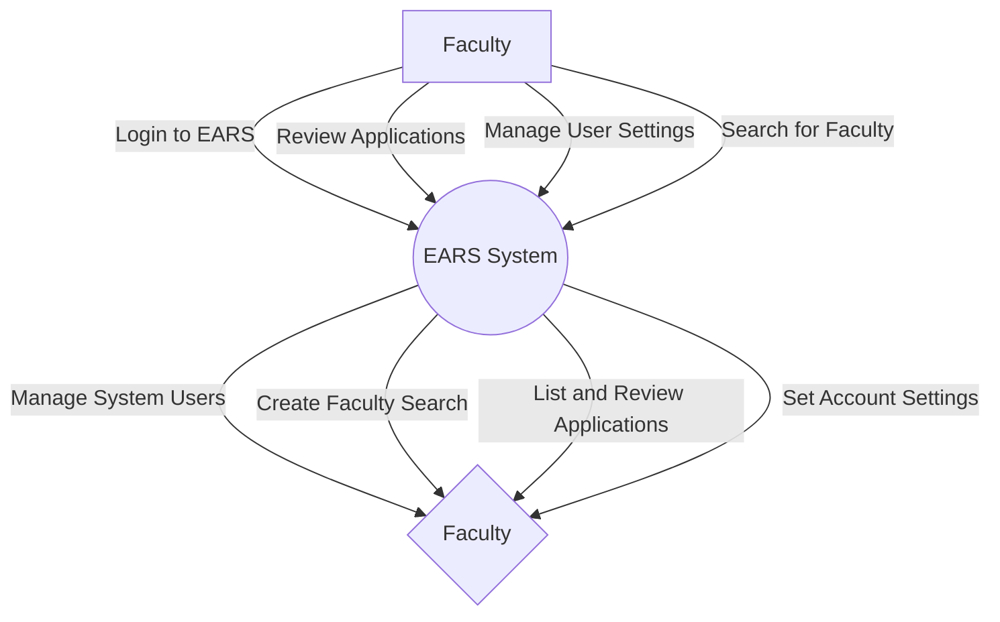
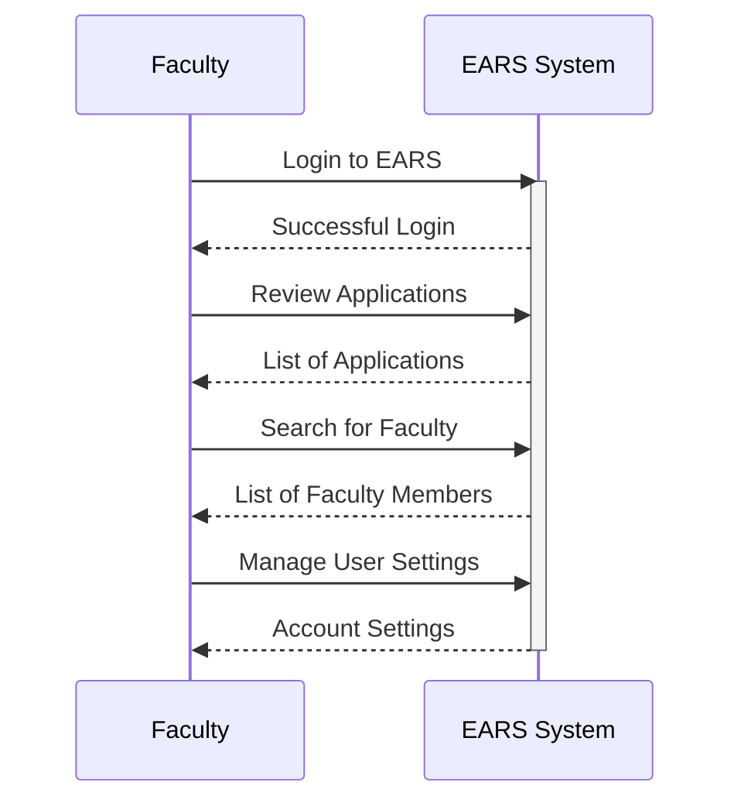
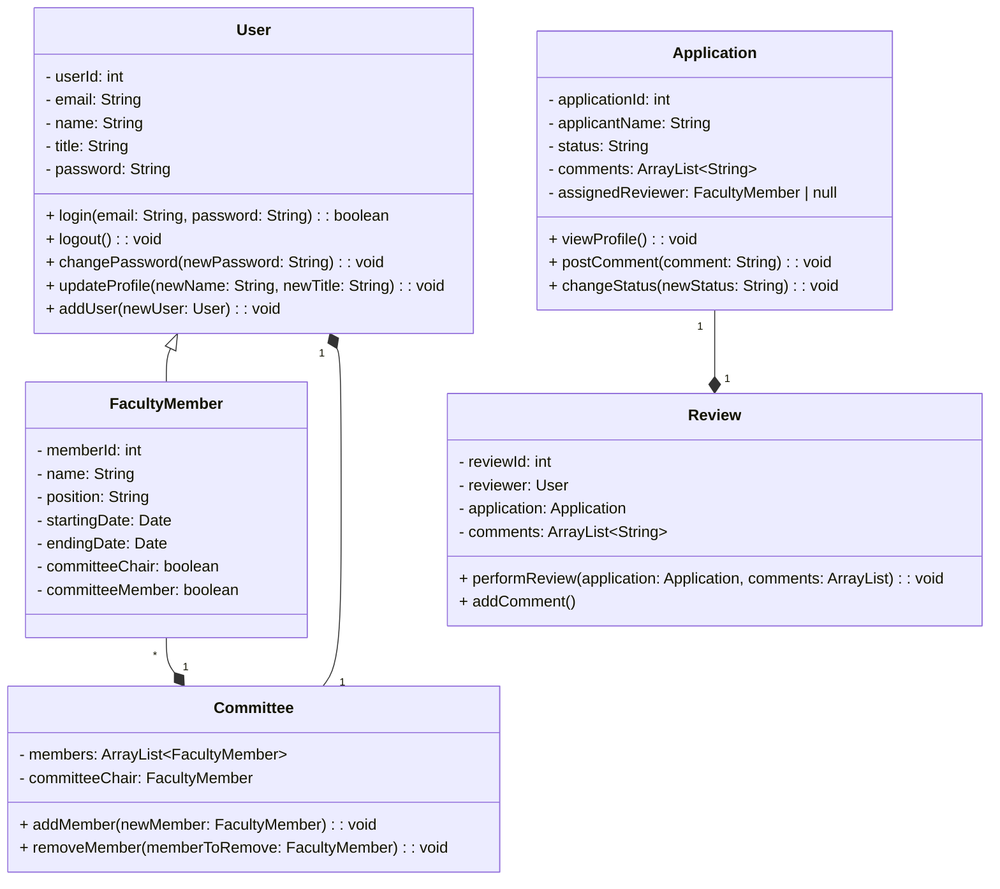

# Group Project

## Group Project Description
[[From course document]]

*[EARS]: Employment Application System 

**Group Number** 6
<b>EARS Project Assigned</b>

We are just using a document based **Waterfall** methodology

 Document Name | Deadline | Weight 
 -- | --
 [x]  <b>D1</b> Project Plan *do not hand in* | Optional   Feb 2| 0%
 [x]  <b>D2</b> Requirements and specification | Feb 9| 15%
 [x]  <b>D3</b> Architecture and User Interface Design |Feb 2~~3~~9 | 5%
 [x]  <b>D4</b> Detailed Design |Mar 13 | 25%
 [ ]  <b>D5</b> Implementation |Mar 29 |40%
 [ ]  <b>D6</b> Testing | Apr 5  | 5%
 [ ]  <b>Progress Presentation</b> *recorded* | Apr 5| 10%

 Projects wil be implemented using C++/Java for Windows
 Yikes, I use Linux so maybe I shouldn't do coding

### Project Progress Presentation and Final Demonstration

There will be <b>one project progress presentation</b> and <b>one final demonstration</b>. 

The progress presentation will be hold in XXX, 
which worth $5%$ of your project.

Towards the last week (<i>probably during the last week, but possibly earlier</i>),
each team will demonstrate the program they have developed to the "*client(s)*". 

These should be geared towards "*selling*" the product.
These presentations not only are assessed,
but also the products on which they are based will be assessed

### Official Project Description

<b>Project 4</b> **Employment Application Review System**

EARS is an intranet-based Employment Application Review System for the Department of Math and Computer Science in Algoma University.

The system is designed so that department faculty members can review applicants and collaborate asynchronously in order to find the best applicant for a given job opening.

This system reduces the overhead of the process and lightens the workload for the search chairperson.

The scope of this project will be to provide a system that allows the CCMT to:
1. log-in EARS system
2. manage system users (*add new accounts*)
3. add a new faculty search (*committee chair*, *members*, *position*,
search *starting date* and *ending date*, *add new committee members*)
4. List and review applications (*view profile*, *post comments on applicants*, *change applicants’ statues*, *perform a faculty review*, *assign faculty review*)
5. set account’s settings (*email*, *name*, *title*, *password*)

### D2 Requirements and Specification - Resources
*[SRS]: Software Requirements Specifications

Review following links (in no specific order) for writing an effective SRS

[Wikipedia ~ Software Requirements Specifications](https://en.wikipedia.org/wiki/Software_requirements_specification)

[Circle - Visual Paradigms ~ UML and Requirement Diagram](https://circle.visual-paradigm.com/docs/uml-and-requirement-diagram/)

#### SRS Templates

[exinfm.com - Training ~ SRS Template](https://exinfm.com/training/M2C3/srs_template.doc)

[gmu ~ SRS Template](https://cs.gmu.edu/~rpettit/files/project/SRS-template.doc)

[dal ~ SRS Template](https://web.cs.dal.ca/~hawkey/3130/srs_template-ieee.doc)

[uccs ~ SRS Doc](https://vast.uccs.edu/~tboult/CS330/DOCS/srs.doc)

#### SRS Articles

**Your 2023 Guide to Writing a Software Requirements Specification – SRS Document** by *Andrew Bura*k CEO at Relevant
[Blog Article](https://relevant.software/blog/software-requirements-specification-srs-document/)

**How to Write a Software Requirements Specification (SRS Document)**
by *Gerhard Krüger and Charles Lane*
[Blog Article](https://www.perforce.com/blog/alm/how-write-software-requirements-specification-srs-document)

How to Create Requirements Spec. in Minutes?
[Visual Paradigms ~ How to Create Software Requirements Spec with Doc Composer ](https://www.visual-paradigm.com/tutorials/how-to-create-software-requirements-spec-with-doc-composer.jsp)

Requirement Diagrams
[Visual Paradigms ](https://www.visual-paradigm.com/support/documents/vpuserguide/94/158_requirementd.html)

#### Software Requirement Specification 

<b>From [Wikipedia ~ Software Requirements Specifications](https://en.wikipedia.org/wiki/Software_requirements_specification)</b>

It may include *use cases*

##### Example Structure Outline

1. Purpose
    1. Definitions
    1. Background
    1. System overview
    1. References
1. Overall description
    1. Product perspective
        1. System Interfaces
        1. User interfaces
        1. Hardware interfaces
        1. Software interfaces
        1. Communication Interfaces
        1. Memory constraints
    1. Design constraints
        1. Operations
        1. Site adaptation requirements
    1. Product functions
    1. User characteristics
    1. Constraints, assumptions and dependencies
1. Specific requirements
    1. External interface requirements
    1. Performance requirements
    1. Logical database requirement
    1. Software system attributes
        1. Reliability
        1. Availability
        1. Security
        1. Maintainability
        1. Portability
    1. Functional requirements
        1. Functional partitioning
        1. Functional description
        1. Control description
    1. Environment characteristics
        1. Hardware
        1. Peripherals
        1. Users
    1. Other

###### Requirement Smell

Following the idea of *code smells*, the notion of requirements smell has been proposed to describe issues in requirements specification where the requirement is not necessarily wrong but could be problematic

**Examples of requirements smells** are 
- subjective language, 
- ambiguous 
- adverbs and adjectives, 
- superlatives
- negative statements

### Tasks

Lucas ~ Project Demo/Presentation
UML ~ 
Coding ~ Java

## SRS Draft

Prepared by Lucas Cekan

### Introduction

**Product**: Employment Application Review System

#### Purpose

This is a software requirements specification (SRS) document whose purpose is to define the requirements, purpose, limitations, features both functional and non-functional of this software product.

This document is prepared for a technical and non-technical audience alike for the purpose of laying out the features and requirements to start developing this software project.

#### Scope

This SRS is for the development of a Employment Application Review System (EARS)

The intended users of this system are the department faculty members at Algoma University at the Department of Math and Computer Science.

The software is meant to make the process of reviewing applications much easier and quicker. The costs in terms of overhead of effort, time and attention of reviewers should be reduced. 

The goal of the system is to allow
1. The review of applicants
2. Collaboration between reviewers

The final accumulation of this project is to create and showcase, a functional demonstration of this system. With this demo, by presenting a compelling demonstration, the product will engage external stakeholders and effectively communicate the value proposition of this solution.

#### Overall Description

This document will list the requirements and the features of this system. The features will divided into sub parts for example the login process and the faculty search listing the requirements for each sub-part.

This document will list a couple of intended use cases that should demonstrate how the software is intended to be used if the requirements are met.

The document will list the functional requirement, that is the basic requirements that must be met for this product to function and non-functional requirements, or the requirements that will add to the user experience but are not necessarily required for the product to function.

Software limitations will be listed based on the skills and experience of the developers assigned to this project. The use of Java and other development software from the Java ecosystem such as JavaFX will be discussed.

### Product Perspective

Here is a detailed description of the product and it's features

#### System's Categories

The system will be based on the following categories
1. System users
2. Applications
3. Faculty search feature

##### System Users

The users are defined as the committee members from the faculty department of maths and computer science tasked with reviewing employment applications at Algoma University 

Users of this system must be able to
1. Log-in to the system using their email and password
2. Be able to change their account details
    - email
    - name
    - title
    - password
3. Add other users into the system 
4. View and review applications
    - view a profile
    - post comments on specific applications
    - change applicants' status
    - perform a faculty review
    - assign a faculty review

##### Applications

Each applications should be represented in the system by a profile, with comments from reviewers and a status representing
1. Waiting to be assigned a review
2. Waiting for the assigned reviewer to do the review
3. Review completed

The profile should display the
- comments from reviewers
- the applicant's statuses

##### Faculty Search Feature

The system should allow users to perform a search of the department's faculty members. Which should find the members and display prominently their position, as well as their starting and ending dates.

The current committee chair should be displayed predominately and should be quickly found.

### System's User-Interfaces

The various views and the user-interfaces that a user would be confronted by are described here.

#### Login Screen

Users need to be able to login through a login screen when at the start of the applications.

Users should be able to go back to this view once if they choose to log off.

Users log in with their credentials that being their email and password.

#### Main User Interface

After the login process the users should be confronted with the main interface or landing page which should act as the main hub of this application.

Here divided into sections.

1) A list of applications awaiting review displayed as a series of panels
    - Applications that are requested and assigned for review for the specific user should be highlighted and at the top of the list
    - Followed by other applications that are need of a review
    - followed by applications that are completed and thus greyed out or similar by the user in question
    - followed by applications that were completed by other users

2) The header with information and icons for who is logged in and a attention icon that indicate that the user was assigned applications for review. The current committee chair should be displayed prominently.

3) A search bar or a link to a search page for a faculty search, to find a faculty member quickly, each search hit should display a starting date, ending date, position and a icon to add the member to the committee.

#### Profile Page

For each application there should be a profile displaying the applicant's typed application and list of their skills, proficiencies, education and so on. Followed by a comment thread below that users can discuss with each other about the application. 

There should be action icons so that user can request a faculty review. 
A icon or other visual element should display the statuses of the application such as accepted, rejected or pending review. The system should then record that this application has already been reviewed by the user.

### User Stories

In this section user stories are presented which demonstrate fictional users and interactions with the system, as if the system is properly developed according to the requirements and specifications mentions previously.

#### User Story One

Professor Minerva McGonagall is going to perform a review of the current applications for employment at the Hogwarts School of Witchcraft and Wizardry. She successfully logs in with her email and password, directing her to the landing or main page of the application.

She scans the page from top to bottom, in the header she sees Professor Aldus Dumbledore displayed predominantly as the committee chair. She also sees her self logged in. But her attention immediately focuses on a icon that informs her that she has pending applications assigned for review.

Her attention shifts to the section of the application which displays applications as a series of panels at the top of which she indeed finds a application that she was assigned for review. She sees that the application is for Hermoine Granger assigned for faculty review by Professor Severus Snape. She clicks on the panel which directs her to Hermoine's application page.

Hermoine's application is well thought out and lists many skills, qualifications and achievements. The status of the application is indeed displayed as pending review. After considering the application she scrolls to the bottom comment section to find that Professor Snape has of course left one of his signature snarky remarks. Regardless, the application is good and is accepted changing its status to accepted.

Having successfully performed the review she goes back the main page, Hermoine's application is no longer displayed at the top of the panels and is now displayed greyed out near the bottom. She just now remembers that she still has a task to do. She clicks back on the application to comment a reply to Professor Snape's snarky remark, chastising him for his lack of professionalism.

She goes back to the main page and because she has the time, she browses the panels for other applications that she can review, she sees one for Harry Potter and decides to conduct a review even though she wasn't specifically assigned for review. She finds the application acceptable but decides to assign Professor Snape for further review. Changing the status of Harry's application and informing Snape that he has to review this application.

She then considers the application for Lord Voldemort but rejects the application for a number of reasons.

In one of the applications she remembers that there was qualifications for gaining the trust of a magical beast called a Gryfyndor but doesn't remember who is charge of that department so she performs a faculty search and finds Rubeus Hagrid is assigned to the position of gamekeeper and Keeper of Keys and Grounds of Hogwarts with no ending date as he is still employed. She is surprised to find that he still hasn't been added as a committee member and thus she clicks a icon next to his listing to add him to the committee so he can review applications in his area of expertise.

Satisfied with her progress for the day, she finally decides to log out back to the log in screen, happy with the way the software performed.

### D3 - Architecture and User-Interface Design
[Wikipedia - <b>Software Architecture</b>](https://en.wikipedia.org/wiki/Software_architecture)
[Towards Data Science - <b>10 Common Software Architectural Patterns in a Nutshell</b>](https://towardsdatascience.com/10-common-software-architectural-patterns-in-a-nutshell-a0b47a1e9013)
[EdenCoding - <b>How to apply MVC in JavaFX</b>](https://edencoding.com/mvc-in-javafx/)
[CreativeBloq - <b>The best UI design tools in 2024</b>](https://www.creativebloq.com/how-to/20-best-ui-design-tools)
[Toptal - <b>Why Writing Software Design Documents Matters</b>](https://www.toptal.com/freelance/why-design-documents-matter)
[Figma - <b>Learn Design</b>](https://www.figma.com/resources/learn-design/)

MVC in JavaFX

Figma

Figma

Figma

### D4 - Detailed Design
Review following documents for writing effective Design Document:

[Design Doc Template](https://doit.maryland.gov/SDLC/Documents/sys_design_doc.doc)
[Online Design Doc Outline](https://www.cs.fsu.edu/~lacher/courses/COP3331/sdd.html)
[Example SDD](https://arxiv.org/pdf/1005.0169)
[Online SDD Template](http://www.cs.iit.edu/~oaldawud/CS487/project/software_design_specification.htm)
[Lots of Sample SDD Examples](https://www.sampletemplates.com/business-templates/design-document.html)
[~~SDD~~ - Doesn't work](http://www.spine-model.org/pdf/D2_1%20Software%20Design%20Document.pdf)

