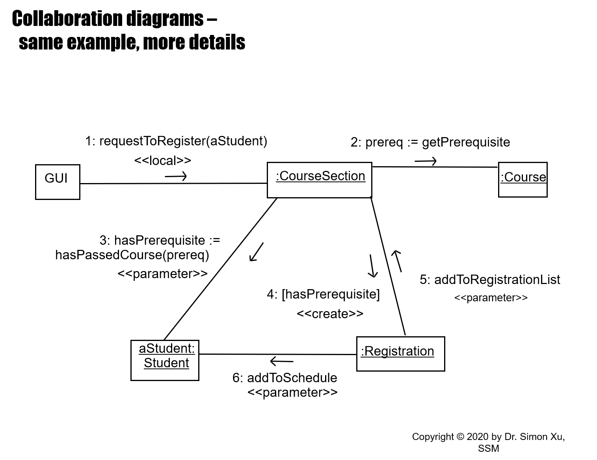

# Software Engineering

[[TOC]]

## Introduction to Software Engineering

> When dependency on software and computers became more important,
> software grew and became a necessity for businesses and users all over the world
> <br>
> In the last 30 years, we have seen an unparalleled explosion
> in the amount of software produced and used by our modern society

There is now a need to set <b>concrete objectives</b> (or <b>functional requirements</b>),
predict necessary resources (<i>like cost estimates</i>) to attain those objectives,
and manage customers' expectations
ery

software
: <i>More than just a program code</i>
A **program** is an executable code, which serves some computational purpose
<b class="text-red-300">Software is collection of executable programming code, associated libraries and documentations</b>
*Software, when made for a specific requirement is called **software product***

engineering
: is all about developing products, using well-defined, scientific principles and methods

software engineering
: an engineering branch associated with development of software product
using well-defined scientific principles, methods and procedures
The outcome of software engineering is an efficient and reliable software product.

: > **Definition**: <i>IEEE defines software engineering as</i>:
  >
  > <i class="text-green-300 font-bold">
  >
  >  The application of a **systematic**, **disciplined**, **quantifiable approach**
  >  to the *development*, *operation* and *maintenance* of software;
  >  that is, the application of engineering to software
</i>

### Software Evolution

<div class="flex">
<div class="w-1/2">

The process of developing a software product using software engineering principles and methods is referred to as <b>software evolution</b>

This includes the initial development of software and its maintenance and updates, till desired software product is developed, which satisfies the expected requirements

Evolution starts from the requirement gathering process
After which developers create a prototype of the intended software and show it to the users to get their feedback at the early stage of software product development
The users suggest changes, on which several consecutive updates and maintenance keep on changing too This process changes to the original software, till the desired software is accomplished</div>

<div class="w-1/2">


</div>
</div>

Even after the user has desired software in hand, the advancing technology and the changing requirements force the software product to change accordingly

Re-creating software from scratch and to go one-on-one with requirement is not feasible
The only feasible and economical solution is to update the existing software so that it matches the latest requirements

#### Why Do we Need Software Engineering

> Because of the higher rate of change in user requirements and environment on which the software is working

It is easier to build a wall than to a house or building, likewise,
as the size of software become large engineering has to step to give it a scientific process

scalability
: If the software process were not based on scientific and engineering concepts,
it would be easier to re-create new software than to scale an existing one

!!! Info Scalability
    As hardware industry has shown its skills and huge manufacturing has lower down the price of computer and electronic hardware 
    *cost goes down due to efficiency of scale*

#### Characteristics of Good Software

Software must satisfy on the following grounds
- **Operational**
  - This tells us <b>how well software works in operations</b>
    This can be measured on:
      - *Budget*
      - *Usability*
      - *Efficiency*
      - *Correctness*
      - *Functionality*
      - *Dependability*
      - *Security*
      - *Safety*
- **Transitional**
  - This aspect is important when the software is moved from one platform to another
    - *Portability*
    - *Interoperability*
    - *Reusability*
    - *Adaptability*
- **Maintenance**
  - This aspect briefs about how well a software has the capabilities to maintain itself in the ever-changing environment
    - *Modularity*
    - *Maintainability*
    - *Flexibility*
    - *Scalability*

        !!! Summary
          **Software engineering** is a branch of computer science, which uses well-defined engineering concepts required to produce <b>efficient</b>, <b>durable</b>, <b>scalable</b>, <b>in-budget</b> and <b>on-time</b> software products

## Software Development Models

### Waterfall Model


<div class="text-blue-400">

#### <span class="text-blue-400 text-xl">Requirements</span>
Determine what the client needs, <u>not what the client wants</u>
Information exchange between the programmer and the end-user

<b>Determine the constraints</b> Costs, deadline, reliability, size
</div>

<div class="text-yellow-400">

#### <span class="text-yellow-400 text-xl">Specifications</span>

<i>Describes the functionality explicitly</i>

What the product is supposed to do & and constraints
It is a <u>legal document</u> a <i>contract</i>
&nbsp;&nbsp;&starf; must not have words like ~~optimal~~ or ~~suitable~~

<b>Specification Document</b> the accumulated result of this phase
</div>

<div class="text-red-500">

#### <span class="text-red-500 text-xl">Design</span>

<i>The internal structure of the product</i>

<b>Architectural Design</b> Decompose products into modules

<b>Detailed Design</b> Design each module eg data structures, algorithms

<b>Design Document</b> the accumulated result of this phase
<small>By the software engineer</small>
</div>


<div class="text-blue-900 bg-blue-400 bg-opacity-70 p-2 rounded-lg">

#### <span class="text-blue-900 text text-xl">Coding</span>

<i>Implement detailed design in code</i>

<b>code reviews</b>Programmer guides review team through listing 

<b>Test Cases</b>
</div>

<div class="text-blue-300">

#### <span class="text-blue-300 text-xl">Testing</span>

<i>Combine modules & check product as a whole</i>

<b>Integration testing</b>
&nbsp;&nbsp;&dash; Product testing
&nbsp;&nbsp;&dash; Check against the specifications <i>is the response time short enough</i>
&nbsp;&nbsp;&dash; Check for <b>robustness</b> <i>can it handle erroneous data</i>
&nbsp;&nbsp;&dash; Acceptance testing <i>by the client with real data</i>
</div>

<div class="text-indigo-500">

#### <span class="text-indigo-500 text-xl">Maintenance</span>

<i>Any change once/after client has accepted the software</i>

<b>Documentation is important</b> Often out of date or non-existent

<b>Maintenance Testing</b>
Test the change itself
<i>Regression testing</i>
&dash; process of systematically re-executing code to make sure that changes in software
&nbsp; has not adversely affected existing functionalities
</div>

### Iterative Refinement Model

{ width=400} 

### Spiral Model

<div class="columns">
  <div class="column">

{width=400 class="bg-white"}
  </div>
  <div class="column">

Always some risks in software Development <br>
- people leave ... 
  other products not delivered on time ...
- the key idea is to minimize risk

Precede Each phase by <br>
- looking at alternative

- risk analysis
  
Follow Each phase by <br>
- evaluation
- planning of next phase

  </div>
</div>

#### Risk assessment
How is it known that the <i>proper</i> risks have been identified
<i>Experience</i> is a critical factor
What if a new software system is being attempted

<b>What about contract project</b> eg how do you cancel a contract right in the middle

<b>Risk assessment is mainly for <u>large</u> projects</b> because it could cost more than development

#### Summary

Assess risks at each step; do most critical action first 
:arrow_forward: Spiral

Build an initial small requirement spec, code it, then “evolve” the spec and code as needed
:arrow_forward: Evolutionary Prototyping

Build initial requirement specs for several releases, then design-and-code each in sequence.
:arrow_forward: Staged Delivery

Standard phases (requirements, design, code, test) in order [Evolutionary prototyping].
:arrow_forward: Waterfall

Write some code, debug it, repeat (i.e. ad-hoc) [Evolutionary prototyping].
:arrow_forward:Code-and-Fix

## Software Project Management

> A **software project** is the complete procedure from
> <i>requirement gathering</i> to <i>testing</i> and <i>maintenance</i>
> carried out according to the execution methodologies
> in a specified period of time
> to achieve and produce the intended software product

**Software project management** is the branch of project management dedicated to the
*planning*, *scheduling*, *resource allocation*, *execution*, *tracking* and *delivery*
of software and web projects 

Project management in software engineering <u>is distinct</u> from traditional project management
in that software projects have a unique lifecycle process that requires 
multiple rounds of *testing*, *updating*, and *customer feedback*

Most IT-related projects are managed in the <b>agile style</b>,
in order to keep up with the increasing pace of business,
and iterate based on customer and stakeholder feedback

### Why do we need Software Project Management?

Software is a <i>intangible product</i>
In software the change in technology is rapid

The triple constraint of <b class="text-blue-400">Time</b> <b class="text-yellow-500">Cost</b> <b class="text-purple-500">Quality</b> together comprise what we call the project's <b class="text-xl text-red-500">scope</b>

### The Role of the Software Project Manager

> A software project manager is a person who undertakes the responsibility of executing the software project

**A project manager closely**
- monitors the development process
- prepares and executes various plans
- arranges necessary and adequate resources
- maintains communication among all team members in order to address issues of 
  - cost

  - budget
  - resources
  - time
  - quality
  - customer satisfaction

#### Responsibilities of A Project Manager
Lets see some of the tasks that a project manager is responsible for

- #### Managing People
  - Act as project leader
  - Liaison with stakeholders
  - Managing human resources
  - Setting up reporting hierarchy etc.
- #### Managing Project
  - Defining and setting up project scope
  - Managing project management activities
  - Monitoring progress and performance
  - Risk analysis at every phase
  - Take necessary step to avoid or come out of problems
  - Act as project spokesperson

### Software Management Activities 

May include

- **Project Planning** task before production of software, which facilitates software production
- **Scope Management** define scope to keep scope within boundaries

### Project Estimation
*[KLOC]: Kilo Line of Code
*[WBS]: Work Breakthrough Structure

- #### Software Size Estimation
  - could be in terms of KLOC *depends on coding practices*
  - or calculating number of function points in the software *vary according to requirements*
- #### Effort Estimation
  - ***Personnel* or *man-hour* required to produce software**
  - Software size should be known to estimate effort
  - Based on <u>experience</u>, alternatively history
- #### Time Estimation
  Break the project into subtasks, activities or events to easier estimate project time
  Schedule the tasks using a calender
  Use a WBS 
- #### Cost Estimation
  <i class="text-red-300">This might be the most difficult</i>

  **For estimating project cost, it is required to consider:**

    - Size of software
    - Software quality
    - Hardware
    - Additional software or tools, licenses etc.
    - Skilled personnel with task-specific skills
    - Travel involved
    - Communication
    - Training and support

### Project Scheduling

**For scheduling a project, it is necessary to:**
- Break down the project tasks into smaller, manageable form
- Find out various tasks and correlate them
- Estimate time frame required for each task
- Divide time into work-units
- Assign adequate number of work-units for each task
- Calculate total time required for the project from start to finish

### Configuration Management

> The process of <b>tracking</b> and <b>controlling</b> the changes in software in terms of the requirements,
> <i>design</i>, <i>functions</i> and <i>development of the product</i>

  !!! Quote IEEE definition
    the process of identifying and defining the items in the system,
    controlling the change of these items throughout their life cycle,
    recording and reporting the status of items and change requests,
    and verifying the completeness and correctness of items

Generally, once the SRS is finalized there is less chance of requirement of changes from user
If they occur, the changes are addressed only with prior approval of higher management,
as there is a possibility of cost and time overrun

#### Baseline

*[SDLC]: Software Development Life Cycle

A phase of SDLC is assumed over if it <i>baselined</i>,
this is a measurement that defines completeness of a phase. 

A phase is baselined when all activities pertaining to it are finished and well documented
If it was not the final phase, its output would be used in next immediate phase

Configuration management is a discipline of organization administration,
which takes care of occurrence of any change (<i>process, requirement, technological, strategical etc.</i>) after a phase is baselined.

Control management keeps check on any changes done in software

#### Change Control
**This is a function of *configuration management***
which ensures that all changes made to software system are consistent
and made as per organizational rules and regulations

## Project Management Tools

What is a **project management tool**? 
Simply put, *it's software to help organize work and collaborate with colleagues on projects*

### Tool Features

#### Planning and Scheduling
Project management tools allow you to plan and delegate work all in one place with tasks, subtasks, folders, templates, workflows, and calendars

#### Collaboration
Email is no longer the only form of communication. Use project management tools to assign tasks, add comments, organize dashboards, and for proofing & approvals

#### Documentation
Avoid missing files with file management features: editing, versioning, & storage of all files

#### Evaluation
Track and assess productivity and growth through resource management & reporting


### Common Program Management Tools

#### Gantt Chart 
<div class="columns">
  <div class="column">
    Gantt charts was devised by Henry Gantt (1917)
  
  It represents project schedule with respect to time periods
  
  It is a horizontal bar chart
  with bars representing activities and
  time scheduled for the project activities
  
  </div>
  <div class="column">
  
  
  </div>
</div>

#### PERT Chart

*[PERT]: Program Evaluation & Review Technique

<div class="columns">
  <div class="column">
    Is a tool that depicts project as a network diagram
  
  It graphically represents <i>main events</i> of project in both parallel and consecutive way
  
  Events, which occur one after another, show dependency of the later event over the previous one
  
Events are shown as numbered nodes
They are connected by labeled arrows depicting sequence of tasks in the project
  
  </div>
  <div class="column">
  
  
  </div>
</div>

#### Resource Histogram
>This is a graphical tool that contains bar or chart representing number of resources (usually skilled staff) 
>required over time for a project event (or phase)
>
> ---
>
>This is an effective tool for staff planning and coordination


   

#### Critical Path Analysis
> This tool is useful in recognizing interdependent tasks in the project

It also helps to find out the shortest path or critical path to complete the project successfully

Like PERT diagram, each event is allotted a specific time frame

$$
PERT = \frac{Optimistic + 4\ \text{Most Likely} + Pessimistic}{6}
$$


This tool shows dependency of event assuming an event can proceed to next only if the previous one is completed

The events are arranged according to their earliest possible start time. Path between start and end node is critical path which cannot be further reduced, and all events require to be executed in same order

## Unified Modeling Language

*[UML]: Unified Modeling Language

UML
: Aims to define a way to *visually* to a way a system has been designed
similar to a blueprint in engineering
This is a *general purpose modeling language*

*[OMG]: Object Management Group
*[ISO]: International Organization of Standardization

> The Object Management Group (OMG) adopted Unified Modelling Language as a standard in 1997
> It’s been managed by OMG ever since
> International Organization for Standardization (ISO) published UML as an approved standard in 2005
> UML has been revised over the years and is reviewed periodically.

### Models

!!! info
    <span class="text-xl text-indigo-400 font-bold ">A simplification of reality</span>
    Its the blueprint of a system
    it may be <i>behavioral</i> emphasizing the dynamics of the system

#### 4 Aims of Modelling
1. Help us <b>visualize</b> a system as it is or as we want it to be
2. Permit us to <b>specify</b> the structure or behavior of a system
3. Gives us a <b>template</b> that guides in the construction of a system
4. <b>Document</b> the decisions we have made

#### 4 Basic Principles of a Model
1) The choice of model has a profound influence on
   <i>how a problem is attacked and how a solution is shaped</i>

2) Every model may be <i>expressed at differing levels of precisions</i>
3) <b>Best models connect to reality</b>
4) <b>No single model is sufficient</b>
   Every nontrivial system is best approached through
   a small set of nearly independent models

#### Do we Really Need UML?

UML became a way for programmers to communicate with non-programmers
but also for complex large teams of people to communicate with each other

> UML is linked with **object-oriented** design and analysis

#### Classification of UML diagrams

1. ##### Structural Diagrams 
   **Captures static aspects or structure of a system**

1. ##### Structural Diagrams 
   **Captures dynamic aspects or behavior of a system**
  


#### Object Oriented Concepts used in UML

*[OOAD]: Object-Oriented Analysis and Design


class
: defines the blueprint, or structure and function of an object

objects 
: Help us to decompose large systems
- Helps us to <i>modularize</i> our system
- Modularity helps to divide our system into understandable components 
  so that we can build our system piece by piece

- An object is the fundamental unit (<i>building block</i>) of a system
  which is used to depict an entity

inheritance
: A mechanism by which child classes derive properties from their parents classes as a child class

abstraction
: Mechanism by which implementation details are hidden from user

encapsulation 
: The binding of data together &
protecting it from the outer world

polymorphism
: Mechanism by which functions, or entities are able to exist in differing forms

#### Object Oriented Analysis and Design

*[OOA]: Object-Oriented Analysis
*[OOD]: Object-Oriented Design

> ##### Object Oriented Analysis
> Analysis means that you are describing and finding the objects or concepts in the problem domain

> ##### Object Oriented Design
> Design is about how you solve a problem so its about defining software objects and how they collaborate to fulfill the requirements

#### Use-Case Diagram & Modeling

Relate and describe use cases -*scenarios*

Identify **actors**, **systems**, **use-cases** & **relationships**

system
: whatever you are developing, *eg, app, system, module etc*
represented by a rectangle with name of system at the top as a label

actor
: someone or something that uses our system to achieve thier goal, *eg customer, stakeholder, other system*
represented by a stick figure
<u>2 types</u> **primary actor** initiates the use of the system & <i>left of system</i>
**secondary actor** reactionary <i>right of system</i>

use case
: represents a action that that accomplishes some sort of task within the system
represented by a oval
placed within the rectangle or system

relationship
: a association between a actor and a use case
represented by a solid line

Other types of relationships other than **association**
&rect; **Include** dependency between <i>base use case</i> and <i>included use case</i>
*base use case requires the included use case*
represented by a dashed line arrow  <b>base - - > included use case</b> 
we can label the relationship with `<<include>>`
&rect; **Extend** happens only when certain conditions are met *eg error*
represented by a dashed line arrow  <b>base - - > included use case</b> 
we can label the relationship with `<<extends>>`
&rect; **Generalization** also known as **inheritance** 
open arrow from children to parent

*we can use notes just like with normal uml diagrams*

#### Sequence Diagramming

We have <b>actors</b> represented by stick figures
and <b>objects</b> represented by boxes


The vertical lines are called **lifelines** representing a point in time

the sequence diagram shows **messages** being given some of these are classified as **return messages** which go in a opposite direction

**alternative frame** a choice between different choices and branches

notice the **activation boxes** that show how long a task is done


#### Class Modeling

<span class="text-xl text-purple-300">Analyze the written requirements</span>

<span class="font-bold text-green-300">Extract Nouns</span> these are **classes**
<span class="font-bold text-yellow-300">Extract Verbs</span> these are **associations**


#### Aggregation

<div class="flex">
  <div class="flex-2">


  </div>
  <div class="flex-1 m-3">

!!! example 
    *A car consists of a chassis, an engine, wheels and seats*
    open diamonds denote aggregation
    **Agregation** is a ==part-whole relationship==

We also give the multiplicity one-to-one many-to-many etc   

#### Composition

Composition is a stronger version of aggregation
If the whole is thrown away then the parts are destroyed
Represented with a solid diamond


  </div>
</div>

#### Generalization

represents inheritance
represented by a open triangle

The notation <i>investmentType</i> is a label called a **discriminator**
it means every instance of `Investment Class` or its subclasses has a attribute called `investmentType`
and this attribute can be used to distinguish between instances of bonds and instances of stocks


#### Association

represented by a solid triangle
may also be labelled as a class


## Use Case Modeling

### Requirement Analysis

We will go though the steps of requirement analysis

1. #### Inception
2. #### Elicitation
3. #### Elaboration
4. #### Validation


## Domain Modelling

<div class="flex">
  <div>
  
Domain model
: A <u>visual representation</u> of conceptual classes or 
real-situations objects in a domain
 illustrated with a **class diagram** in which
  <font color="red">no operations or method signatures are defined</font>

A domain model shows *real-situation conceptual classes* <u>not</u> software classes
with no software artifacts <i>such as windows or a database</i>
  </div>
  <div>


  </div>
</div>

<center>

**Examples of Domain Concepts or Entities**</center>

<div class="flex justify-evenly">

&bull; <b>Person</b>

&bull; <b>Place</b>

&bull; <b>Object</b>

&bull; <b>Event</b>

&bull; <b>Concept</b>
</div>
<div class="flex">
  <div>

 A **concept or entity** type name is a <b>singular noun</b>
A **entity** name should be <i>concise</i>

!!! Warning Event entity types should be named for the **result** of the event
    Not the activity or process of the event 
  </div>
  <div>

{width=500px}
  </div>
</div>

#### How to Find Conceptual Classes
##### Identifying Nouns

1. **Customer** arrives at a **POS checkout** with **goods** and/or **services** to purchase
2. **Cashier** starts a new **sale**
3. **Cashier** enters **item identifier**
4. System records **sale line item** and presents **item description**, **price**, and running **total**
   Price calculated from a set of price rules

Cashier repeats steps 2-3 until indicates done

5. System presents total with **taxes** calculated
6. Cashier tells Customer the total, and asks for **payment**
7. Customer pays and System handles payment
8. System logs the completed **sale** and sends sale and payment information to the external **Accounting** *for accounting and **commissions*** and **Inventory** systems *to update inventory*
9. System presents **receipts**
10. Customer leaves with receipt and goods if any

Now lets select and draw the conceptual classes

<div class="flex justify-evenly">

&bull; <b>Sale</b>
&bull; <b>SalesLineItem</b>

&bull; <b>Cashier</b>
&bull; <b>CashPayment</b>

&bull; <b>Customer</b>
&bull; <b>Store</b>

&bull; <b>Item</b>
&bull; <b>Register</b>
&bull; <b>Ledger</b>

&bull; <b>ProductDescription</b>
&bull; <b>ProductCatalog</b>
</div>

A common mistake is to represent something *as an attribute* when it should have been a **conceptual class**

<b>Rule of Thumb</b> If we do not think of some conceptual class X as a <i>number or text</i>
 in the real world, X is probably a conceptual class, not an attribute


Should **destination** be an attribute of **Flight**
or a separate conceptual class **Airport**
In the real world, a destination airport is <u>not</u> considered a number or text
it is a massive thing that occupies space
*Therefore, Airport should be a concept*

In the real world, a store is <u>not</u> considered a number or text
the term suggests a legal entity, an organization, and something that occupies space
*Therefore, Store should be a conceptual class*

##### Description Classes
description class
: contains information that describes something else
<b>
  eg a `ProductDescription` that records the price, picture, and text
  description of an `Item`
</b>
This was first named the `Item-Descriptor` pattern

{width=800px}

Add a description class (for example, ProductDescription) when:

- There needs to be a description about an item or service,
  independent of the current existence of any examples of those items or services

- Deleting instances of things, they describe (for example, Item) results in a loss of information
  that needs to be maintained but was incorrectly associated with the deleted thing

- It reduces *redundant or duplicated* information


###### Example Airline Company

**Worst**
<div class="flex justify-around">
  <div>


  </div>
  <div class="flex-1">

**Better**

  </div>
</div>

If flights are deleted *example aircraft crash grounds all flights* then without `FlightDescription` all flights are deleted

##### Domain Model for POS System (with Associations)

{style=filter:invert(1)}

#### Multiplicity

In the diagrams we use numbers like `1` or `*` to represent **1-to-mony** relations

#### Attributes

A **attribute** is a logical data value of an object

A domain model should include attributes for which the requirements (such as use cases) suggest or imply a need to remember information

For example, a receipt normally includes the `date` and `time` of sale


##### Guidelines for Identifying Attributes
The attributes in a domain model should be simple attributes or data types

**Examples of Attribute types**


    Boolean, Date, Number, String (Text), Time

    Colour, PhoneNumber, SocialSecurityNumber, UniversalProductCode, Postcode


## Module to Design

> We need to design ==Modules== with **high cohesion** & **low coupling**
> We need to understand the need for **information hiding**
> Software engineering implication of **inheritance**, **polymorphism** & **dynamic binding**
> **generalization**, **aggregation**, **association**

### Cohesion and Coupling
module
: "Lexically contiguous sequence of program statements, 
bounded by boundary elements, 
with aggregate identifier" *Stevens, Myers, Constantine, 1974*
<b>modules are smaller pieces that make up a program compared to a monolith structure</b>

**cohesion** the degree of interaction <i>within</i> a module
**coupling** the degree of interaction <i>between two modules</i>

#### Cohesion

Modules in themselves are not *good*
We must design them to have good properties

##### Seven Levels of Cohesion
From Best to Worst *would make more sense to go from worst to best*
<p class="flex justify-around font-bold"> <span> Informational </span> <span> Functional </span> <span> Communicational </span> <span> Procedural </span> <span> Temporal </span> <span> Logical </span> <span> Coincidental </span>  </p>

1. ###### Informational
    Modules perform a number of actions,
    each with its own entry point,
    with independent code for each action, all performed on the same data structure

    {width=500}

2. ###### Functional
    
    Module performs exactly <b>one action or achieve a single goal</b>

    Why is this <font color="springgreen">good</font>{style=font-weight:bold}

    &starf; more reusable
    &starf; corrective maintenance easier
    &starf; fault isolation
    &starf; reduced regression faults
    &starf; easier to extend product

3. ###### Communicational

    Module performs series of actions <i>related by procedure</i> to be followed by product,
    but <u>in addition</u> all the actions operate <i>on same data</i>

    Why is this <font color="red">bad</font>{style=font-weight:bold}

    &dash; still leads to less reusability &Rarr; break it up

4. ###### Procedural

    Module performs series of actions related by procedure or sequence of steps to be followed by product

    Why is this <font color="red">bad</font>{style=font-weight:bold}

    &dash; actions are related by being part of the same procedure but <u>still</u> weakly related to one another
    &dash; not reusable

5. ###### Temporal
    Module performs series of actions related in time *within the same limit time period*

    Why is this <font color="red">bad</font>{style=font-weight:bold}

    &dash; actions that are grouped together because of timing may actually not supposed to be related
    &dash; actions weakly related to one another, but strongly related to actions in other modules
    &dash; code spread out &rrarr; not maintainable or reusable

6. ###### Logical

    Logical cohesion occurs when elements within a module perform similar tasks or operations that are logically related,
    but <i>there is no specific relationship between them</i>.
    
    !!! TIP So usually when we are talking about modularity we want the modules to not be related between each other, but *within* the module we want the parts to be related

    While better than coincidental cohesion, logical cohesion still lacks a clear and well-defined purpose for the module

    Why is this <font color="red">bad</font> {style=font-weight:bold}

    &dash; interface difficult to understand
    &dash; code for more than one action may be intertwined
    &dash; difficult to reuse

7. ###### Coincidental

    Coincidental cohesion occurs when elements within a module are <i>unrelated and grouped together arbitrarily</i>
    This is considered the lowest level of cohesion and is generally undesirable,
    as it leads to confusion and difficulty in understanding and maintaining the module
    
    Why is this <font color="red">bad</font> {style=font-weight:bold}

    !!! quote From TextBook
        Why is coincidental cohesion so bad? Modules with coincidental cohesion suffer from two serious drawbacks. First, such modules degrade the maintainability of the product, both corrective maintenance and enhancement. From the viewpoint of trying to understand a product, modularization with coincidental cohesion is worse than no modularization at all [Shneiderman and Mayer, 1975]. Second, these modules are not reusable. It is extremely unlikely that the module with coincidental cohesion in the first paragraph of this section could be reused in any other product.

  *Always break into separate modules with each perform <u>one</u> task*

#### Coupling

Five Levels of coupling *in order of best to worst*
<p class="flex justify-around font-bold"> <span> Data </span> <span> Stamp </span> <span> Control </span> <span> Common </span> <span> Content </span> </p>

1. ##### Content
    One module directly references contents of the other

    !!! example **Examples** 
        <b>1:</b> module $a$ modifies statements of module $b$
        <b>2:</b> module $a$ refers to local data of module $b$ in terms of some numerical displacements within $b$

    Why is this <font color="red">bad</font> {style=font-weight:bold}
    
    almost any change to $b$ requires changes to $a$
2. ##### Common
   Two modules have written access to the same global data

    Why is this <font color="red">bad</font> {style=font-weight:bold}

    &bull; resulting code is unreadable
    &bull; modules can have side-effects
    &bull; must read entire module to understand
    &bull; difficult to reuse
    &bull; module exposed to more data than necessary


3. ##### Control
    One module passes an element of control to the other

    **Example** Control-Switch passes as an argument

    Why is this <font color="red">bad</font> {style=font-weight:bold}

    &bull; modules are not independent
    &bull; module $b$ must know the internal structure of module $a$
    &bull; affects reusability

4. ##### Stamp
   Data structure is passed as parameter,
   but called module operates on only some of individual components

    Why is this <font color="red">bad</font> {style=font-weight:bold}
  
    &bull; affects understanding
    &bull; not clear, without reading entire module, which fields of record are accessed or changed
    &bull; unlikely to be reusable
    &bull; other products have to use the same higher-level data structures
    &bull; passes more data than necessary
    e.g., uncontrolled data access can lead to computer crime

5. ##### Data
    Every argument is either a simple argument or a data structure in which all elements are used by the called module

    Why is this <font color="springgreen">good</font> {style=font-weight:bold}

    &bull; maintenance is easier
    &bull; good design has high cohesion & weak coupling

#### Abstract Data Types

Data type together with actions to be performed on instantiations of that data type

```java
class JobQueue {
  public int queueLength; // length of job queue
  public int queue = new int[25]; // up to 25 jobs
  
  // methods
  public void initializeJobQueue () {
    // body of method
  }
  public void addJobToQueue (int jobNumber) {
    // body of method
  }
} // JobQueue
```
#### Information Hiding

Really **details hiding**
hiding implementation details <font color="red">not information</font>

!!! Example Example
    - design modules so that items likely to change are hidden
    - future change localized
    - change cannot affect other modules
    - data abstraction
    - designers thinks at level of ADT

```java
class JobQueue {
  /* Now queue and queueLength are inaccessible*/
  private int queueLength; // length of job queue
  private int queue = new int[25]; // up to 25 jobs
  
  // methods
  public void initializeJobQueue () {
    // body of method
  }
  public void addJobToQueue (int jobNumber) {
    // body of method
  }
} // JobQueue
```

#### Conclusion

<i class="text-green-300">Good modules</i> have **strong cohesion** and **weak coupling**
*Data encapsulation*, *ADTs*, *information hiding*, & *objects* <i>ease maintenance & reuse</i>

### Design Principles and Classical Design

> **The process of Design**
> <b>Design is a problem-solving process, whose objective is to find and describe a way:</b>
> To implement the system's functional requirements,
> while respecting the constraints imposed by the non-functional requirements
> &nbsp;&nbsp;&nbsp; *eg the budget*

#### Data Flow Analysis 

*[DFA]:(Data Flow Analysis)

DFA is a classical design technique for achieving modules with <i>high cohesion</i>

{width=500}

### Top-down design
    First design the very high-level structure of the system
    Then gradually work down to detailed decisions about low-level constructs
    Finally arrive at detailed decisions such as:
        the format of particular data items
        the individual algorithms that will be used
### Bottom-up design
    Make decisions about reusable low-level utilities
    Then decide how these will be put together to create high-level constructs

### Principles of Good Design
&starf; Increasing profit by reducing cost and increasing revenue
&starf; Ensuring to conform with the requirement and specifications
&starf; Accelerating development
&starf; Increasing qualities

<i class="text-blue-400 hue-rotate-0 text-xl">Design Principle 1 <b style="font-style:normal;" class="m-4">Divide and conquer</b></i>
<i class="text-blue-400 filter -hue-rotate-15 text-xl">Design Principle 2 <b style="font-style:normal;" class="m-4">Increase cohesion where possible</b></i>
<i class="text-blue-400 filter -hue-rotate-30 text-xl">Design Principle 3 <b style="font-style:normal;" class="m-4">Reduce coupling where possible</b></i>
<i class="text-blue-400 filter -hue-rotate-60 text-xl">Design Principle 4 <b style="font-style:normal;" class="m-4">Keep the level of abstraction as high as possible</b></i>
<i class="text-blue-400 filter -hue-rotate-90 text-xl">Design Principle 5 <b style="font-style:normal;" class="m-4">Increase reusability where possible</b></i>
<i class="text-blue-400 filter -hue-rotate-180 text-xl">Design Principle 6 <b style="font-style:normal;" class="m-4">Reuse existing designs and code where possible</b></i>
<i class="text-blue-400 filter hue-rotate-15 text-xl">Design Principle 7 <b style="font-style:normal;" class="m-4">Design for flexibility</b></i>
<i class="text-blue-400 filter hue-rotate-30 text-xl">Design Principle 8 <b style="font-style:normal;" class="m-4">Anticipate obsolescence</b></i>
<i class="text-blue-400 filter hue-rotate-60 text-xl">Design Principle 9 <b style="font-style:normal;" class="m-4">Design for portability</b></i>
<i class="text-blue-400 filter hue-rotate-90 text-xl">Design Principle 10 <b style="font-style:normal;" class="m-1">Design for Testability</b></i>

## Design Modelling
We will go deeper into **Object Oriented Design**
and learn more about the interaction diagrams such as sequential and collaboration diagrams

### Object Oriented Design

Here we learn about **designing objects**

### Static & Dynamic Modeling

*[DCD]:(Design Class Diagram)

<b>Static Model</b> includes Design *Class Diagrams* and *Package Diagrams*
<b>Dynamic Model</b> includes UML interaction diagrams *sequence, communication or collaboration diagrams*

<div class="flex">
  <div class="flex-0">

{width=500, style="filter:invert(1)"}
  </div>
  <div class="flex-1">

<b>Static models</b>, such as UML class diagrams, help design the definition of packages, class names, attributes, and method signatures (but not method bodies)

<b>Dynamic models</b>, such as UML interaction diagrams help design the logic, the behavior of the code or the method bodies. Additionally, we apply responsibility-driven design and the GRASP principles.

<caption>

&larr; <b>Diagram</b>: Design Class Diagram (DCD)</caption>

  </div>
</div>

**When drawing a UML object diagram, we need to answer key questions**


<div class="flex justify-around">
  <div class="">

&squf; What are the responsibilities of the object?
&squf; Who does it collaborate with?
&squf; What design pattern should be applied?

<b>Things to keep in mind</b>
&rect; Design in terms of objects 
&rect; Instantiations of classes that were extracted during OOA

  </div>
  <div class="">

{width=400, style="filter:invert(1)"}  
  </div>

</div>

#### Example Process

**Four main steps**

1. <span class="font-normal">Construct <i>interaction diagrams</i> for each scenario</span>

    &nbsp;&nbsp; To model the dynamic aspects of a software system
    &nbsp;&nbsp; they show objects and messages passing between them
    &nbsp;&nbsp; often built from a use case
    &nbsp;&nbsp; <b>objective</b> show objects accomplishing the interactions with an actor
    &nbsp;&nbsp; messages could be method calls, messages sent over the network etc
2. <span class="font-normal">Construct the detailed <i>class diagrams</i></span>
3. <span class="font-normal">Design the product in terms of <i>clients of objects</i></span>
4. <span class="font-normal">Proceed to the <i>detailed design</i></span>


##### Elevator Problem
<b>Product to control <i>n</i> elevators over <i>m</i> floors</b>

###### Constraints
Each elevator has $m$ buttons, 1 per floor
&dash; illuminate when pressed & cause elevator to visit corresponding floor
&dash; illumination cancelled when the floor is visited

Each floor, except top & bottom, has 2 buttons
&bull; 1 to request <span class="text-blue-300 font-black">up-elevator</span> and another for <span class="text-red-300 font-black">down-elevator</span>

When elevator has no requests, it remains at its current floor with its doors closed

###### Normal Scenario

1. user A presses up button on floor 3. Wishes to go to floor 7
2. up floor button turned on an elevator arrives at floor 3. It contains user B who entered at floor 1 & pressed the button for 1. floor 9
3. up floor button turned off
{width=600, style="filter:invert(1);float:right"}
1. elevator doors open. timer starts
   User A enters elevator
2. user A presses button for floor 7
3. floor 7 button is turned on
4. elevator doors close after timeout
5. elevator travels to floor 7
6. floor 7 elevator button is turned off
7.  elevator doors open to allow user A to exit elevator
8.  timer starts. User A exits
9.  elevator doors close after timeout
10. elevator proceeds to floor 9 with user B

### Collaboration Diagram

<div class="flex">
  <div class="flex-1">

Can be seen as a projection a part of the class diagram

Might be preferred when you are
deriving an interaction diagram from a class diagram

Are also useful for validating class diagrams

#### Course Registration
{style=filter:invert(1)}
{style=filter:invert(1)}

  </div>
  <div class="flex-1">
  
 {style=filter:invert(1)}
  </div>
</div>

### Sequence Diagrams
Make explicit the time ordering og the interaction

Use cases make time ordering explicit too

Sequence diagrams are a natural choice when you build an interaction model from a use case

Make it easy to add details to messages

Collaboration diagrams have less space for this

<div class="flex justify-between">
  <div class="flex-1 m-4">

#### Sequence Diagram 1
{style=filter:invert(1)} </div>
  <div class="flex-1 m-4">

#### Sequence Diagram 2
{style=filter:invert(1)} </div>
</div>

## Implementation Model & Code Standard

**sequence of activities**

Identify a first set of candidate classes

Add associations and attributes

Find generalizations

List the main responsibilities of each class

Decide on specific operations

    Iterate over the entire process until the model is satisfactory

Add or delete classes, associations, attributes, generalizations, responsibilities or operations

Don’t be too disorganized

### Noun Extraction

!!! tip A simple technique for discovering domain classes

Look at a source material such as a description of requirements & use cases

Extract the nouns and noun phrases

Eliminate nouns that:
&cir; are redundant
&cir; represent instances

## Testing

Testing should be carried through the <u>entire</u> software life-cycle

!!! example Comparison with other engineering
    no clear standards for quality
    software maintenance
    software is malleable *it is modifiable*

Quality is generally agreed to be a good thing
Quality $=$ adherence to requirements/specifications
Quality $\ne$ excellence or luxurious

<div class="flex flex-wrap justify-evenly text-green-300 text-xl m-3">
<b>correctness</b> <b>reliability</b> <b>robustness</b> <b>performance</b> <b>user friendliness</b> <b>verifiability</b> <b>maintainability</b> <b>reusability</b> <b>portability</b> <b>understandability</b> <b>interoperability</b> <b>timeliness</b>
</div>

<span class="text-xl text-indigo-300 font-bold underline">Three P's Product People Process</span>
The user wants product to be reliable, efficient, easy to use
The producer wants it to be verifiable, maintainable, portable, extensible
The manager wants the process to be productive, predictable, easy to control

!!! quote Testing is the process of establishing confidence that a program or system <br>does what it is supposed to
    **by Hetzel 1973**

!!! quote Testing is the process of executing a program or system with the intent of finding errors
    **by Myers 1979**

!!! quote Testing is any activity aimed at evaluating an attribute or capability of a program or system <br>and determining that it meets its required results
    **by Hetzel 1983**


<span class="text-xl text-red-300 font-bold underline">Main Objectives of Software Testing</span>


Uncover as many as errors (or bugs) as possible in each timeline

Demonstrate a given software product matching its requirement specifications

Validate the quality of a software testing using the minimum cost and efforts

Generate high quality test cases, perform effective tests, and issue correct and helpful problem reports

What will be a good test?

<span class="text-xl text-red-300 font-bold underline">What is Software Testing</span>
**Validation** Are we building the right system? How?
Because it not only includes “narrow testing”, it is also called “Verification”
testing, math proofs, informal reasoning

**Verification** Are we building the system right?
*Two fundamental approaches to verification*
*1* <b class="m-6">Testing</b> <i>&nbsp; Execution-based</i>
    experimenting with the behaviour of the product to see whether the product performs as expected
*2* <b class="m-6">Analysis</b> <i>Non-execution based</i>
    analyzing the product or design document

<span class="text-xl text-purple-300 font-bold underline">Software Errors</span>
**What is a software error?**
*One common definition* its a mismatch between the program & its specification
<i>Failure/Fault/Error</i> How many kinds?

<span class="text-xl text-green-300 font-bold underline">Test Cases</span>
<b>What is a test case?</b> A significant test case is a test case that has a high potential to uncover the presence of an error
<b>What is a test?</b> A collection of test cases
<b>Dynamic Testing</b> 
*Testing in the Small* testing of individual module
*Testing in the Large* address the issue of decomposing and organizing the testing activity
according to the modular structure of complex program

Two Approaches in **testing in the small**

<b>Black box testing</b> <i>functional testing:</i>
operate s/w without relying on any knowledge of the way it has been designed and coded
test what the program is supposed to do
specification-based testing

<b>White box testing</b> <i>Glass Box testing, structural coverage testing:</i>
use info about the internal structure
test what the program does
implementation-based testing

### White-box Testing

#### Control Flow Testing 

> This is structural testing strategy that uses the program's control flow as a model
> based on selecting a set of test paths through a program
> *eg* <i>pick enough paths to assure that every source statement is executed as least once</i>
> control-flow testing is most applicable to a new software for unit testing
> By using *Structured* and *Object-Oriented* we can reduce the number of control-flow bugs

*Assumption*
\- specification are correct
\- data is defined and accessed properly
\- there are no bugs other than those that affect control flow

A control flowgraph is a graphical representation of a program's control structure


<div class="flex">
  <div class="flex-1">
  
        1.  scanf ("%d %d".&x, &y);
        2.  if (y < 0)
              pow = -y;
            else
              pow = y;
        3.  z = 1.0;
        4.  while (pow !=0){
              z = z*z
              pow = pow - 1
        5.  }
        6.  if (y < 0){
              z = 1.0/z
        7.  printf("%f", z)
  
  </div>

  {style=filter:invert(1) width=500}
</div>

1. A **decision** is a program point at which the control can diverge
   *eg* <i>if and case statements</i>
2. A **junction** is a program point where the control flow can merge
   *eg* <i>end if, end loop, goto label</i>
3. A **process block** is a sequence of program statements
   uninterrupted by either decisions or junction 
   *eg* <i>straight-line code</i>
   - a process has one entry and one exit
   - a program does not jump into or out of a process 


##### Paths

A path through a program is a sequence of statements that starts at an entry, junction or decision
and ends at another <i>possible the same</i>, junction, decision, or exit

Even a small routine can have a large number of paths

<b>Independent Path</b> Any path through the program that introduce at least 
one new set of processing statements or a new condition

### Black-Box Testing
Black-box testing is testing without having an insight into the details of the underlying code
<i>usually from the user perspective</i>
It is *dynamic* because the program is running
Black box, because testing is done without knowledge of how the program is implemented
<i>as supposed to white box</i>
Sometimes referred to as **behavioral testing**

#### Characteristics
&starf; Program is treated as a black box
&starf; Implementation details do not matter
&starf; Requires an end-user perspective
&starf; Criteria are not precise

#### Equivalent Partitioning
> A type of black box testing

An equivalence class is a set of test cases 
that test the same thing or reveal the same bug

Equivalence partition is to divide the input domain into several equivalence classes,
from which the test cases can be derived

**An equivalence class can be defined with following guidelines**

- If an input condition specifies a range, one valid and two invalid equivalence classes are defined
- If an input condition requires a specific value, one value and two invalid equivalence classes are defined
- If an input condition specifies a number of a set, one value and one invalid equivalence classes are defined
- If an input condition is Boolean, one value and one invalid equivalence classes are defined


## Testing and Maintenance 

### Types of Maintenance

Corrective Maintenance 
: a fault needs to be corrected post delivery

Perfective Maintenance
: improving the product post delivery

Adaptive Maintenance
: A change is made to adapt a product to its environment

Preventative Maintenance
: Prevent future problems

## Optional Videos
<div class="flex justify-around">

**Module 1**
[](https://www.youtube.com/watch?v=Z4beYZRnKyc) 
**Module 2**
[](https://www.youtube.com/watch?v=9LSnINglkQA)
[](https://www.youtube.com/watch?v=Y7sJwlyuoWw)
[](https://www.youtube.com/watch?v=qUuVnbuDrk8)

**Module 3** <br>
[](https://www.youtube.com/watch?v=4GcggYQYrXU)
[](https://www.youtube.com/watch?v=zid-MVo7M-E)
[](https://www.youtube.com/watch?v=UI6lqHOVHic)
[](https://www.youtube.com/watch?v=pCK6prSq8aw)

**Module 4** <br>
[](https://www.youtube.com/watch?v=j4WITZFLkUM)
[](https://www.youtube.com/watch?v=MCXi4KtRTG0)
[](https://www.youtube.com/watch?v=0xdHJ6hO-Cs)

**Module 5**
<b class="text-xs m-0">Domain Modelling</b>
[](https://www.youtube.com/watch?v=M1e2XwSADDE)
[](https://www.youtube.com/watch?v=Hv7twQ97AbQ)

**Module 6**
<b class="text-xs m-0">Module to Design</b>
[](https://www.youtube.com/watch?v=lt_USS_B-jg)
[](https://www.youtube.com/watch?v=jpqe8_CeMT4)
[](https://www.youtube.com/watch?v=sODGJPrT32Q)
[](https://www.youtube.com/watch?v=dXZ5xqG8pUY)


**Module 7**
<b class="text-xs m-0">Design Modelling</b>
[](https://www.youtube.com/watch?v=VnVHgj6OPrQ)
[](https://www.youtube.com/watch?v=18_kVlQMavE)
</div>


<div class="flex justify-around">

**Module 8**
<b class="text-xs m-0">Implementation</b>
[](https://www.youtube.com/watch?v=skpVpuB8VBY)
[](https://www.youtube.com/watch?v=gnZh0CqOCA0)

**Module 9**
<b class="text-xs m-0">Software Testing p1</b>
[](https://www.youtube.com/watch?v=SUmxnJA8ZHA)
[](https://www.youtube.com/watch?v=3bJcvBLJViQ)

**Module 10**
<b class="text-xs m-0">Software Testing p2</b>
[](https://www.youtube.com/watch?v=7T4DGEXht40)
[](https://www.youtube.com/watch?v=A9oBq8ZYv9A)
[](https://www.youtube.com/watch?v=SxXd60UNllA)
[](https://www.youtube.com/watch?v=3lOjtmsA2Kk)

**Module 11**
<b class="text-xs m-0">OO Testing </b>
[](https://www.youtube.com/watch?v=PrteinbnFMY)
[](https://www.youtube.com/watch?v=9VDAbFcq96Q)


**Module 12**
<b class="text-xs m-0">Software Evolution</b>
[](https://www.youtube.com/watch?v=ciTu06q3iW0)
[](https://www.youtube.com/watch?v=qf3fgFUBhFo)


</div>

