# GreenSpace App
### Gantt Chart

> You are tasked with creating a detailed Gantt Chart for the development of *GreenSpace*,
> an innovative mobile app by EcoTech Solutions, as outlined in the project story

#### Story

Lucas is the product manager at *EcoTech Solutions*,
a budding company passionate about the environment

The company aims to launch a mobile application, *GreenSpace*,
which allows users to identify plants by taking photos,
learn about their ecological benefits, 
and also find nearby parks and green spaces

In the initial team briefing,
Lucas and his team laid out a clear roadmap for the project

<b>Emily</b>, the app's UI/UX designer, mentioned that she'd first need **3 days**
to <i>research current design trends and user preferences</i>

After that, she'd spend **2 weeks** <i>creating wire-frames and mockups</i>

<b>Ben</b>, the mobile developer, emphasized that 
<i>setting up the primary framework</i> for the app would take **a week**
However, he'd need the initial design mockups from Emily before proceeding
with feature-specific developments Integrating the <i>plant identification feature</i>, he mentioned,
would be the most time-consuming, taking up to **3 weeks**,
while the <i>park locator</i> would only need about **a week**.

Lucas emphasized the importance of two major milestones: 
1. The completion of the app's prototype,
2. after which they'd collect initial user feedback, 
   and the end of the first beta version, which they'd test internally
  before making the app public

#### Objective
Develop a Gantt Chart that captures the project 
*timeline*, *tasks*, *dependencies*, and *milestones* 
using GanttProject or a similar tool. 
<i>Your submission should be a PDF document</i>

#### Project Details

**Company** EcoTech Solutions
**App** GreenSpace
**Team Members** 
&nbsp;&nbsp;&bullet; <b>Lucas</b> <i>Product Manager</i>
&nbsp;&nbsp;&bullet; <b>Emily</b> <i>UI/UX Designer</i>
&nbsp;&nbsp;&bullet; <b>Ben</b> <i>Mobile Developer</i>

##### Tasks & Milestones

<b>Emily</b>'s **design research** *3 days*, 
followed by **wire-frames and mockups creation** *2 weeks*

<b>Ben</b>'s **app framework setup** *1 week*,
**plant identification feature** *3 weeks*, 
and **park locator feature** *1 week*

**Key Milestones** <i>Prototype Completion</i>, <i>First Beta Version</i>

### Assignment Instruction

Assignment Instructions:
1. **Task Organization** Break down the project into
   specific tasks and subtasks, assigning appropriate durations
2. **Dependencies** Clearly indicate dependencies between tasks.
3. **Resource Assignment** Assign team members to tasks, showing their roles
4. **Milestone Marking** Identify key project milestones.
5. **Chart Clarity** Ensure your Gantt Chart is well-organized and easy to interpret

#### Submission Guidelines

**Format** Submit your Gantt Chart as a PDF file.
Refer to the [guide](https://www.youtube.com/watch?v=155D5VHtuZg) to learn how to export PDF from GanttProject

**Check Before Submission**
Ensure that all parts of your chart are visible and properly displayed in the PDF
<i>Incomplete or improperly formatted submissions will not be accepted</i>

**No Re-evaluation**
Your work have only one chance to be graded, so review your file carefully before submission

**Include a Report** &starf;
Attach a brief explanatory report within the PDF, discussing your approach and any assumptions

#### Evaluation Criteria

<b>Accuracy and Detail</b> Compliance with the provided project details and timeline
<b>Presentation</b> Clarity, readability, and professionalism of the Gantt Chart
<b>Completeness</b> Inclusion of all necessary elements - tasks, dependencies, milestones
<b>Rationale</b> Quality of the explanatory report

> Please ensure that your submission is thorough and complete as per the instructions
> This exercise is an opportunity to demonstrate your ability
> to translate project details into a clear and functional Gantt Chart

---

### Gantt Chart

Generated with [Mermaid JS](https://mermaid.js.org/syntax/gantt.html)

```mermaid
gantt
  title GreenSpace App - Gantt Diagram
  dateFormat X
  axisFormat Week %W
  todayMarker off
  tickInterval 1week
  %% excludes weekends
  section Emily <br> UI/UX Designer
      Research Current Design Trends & User Preferences :a1, 2024-01-01, 3d
      Creating Wire-Frames & Mockups    :a2, after a1, 2w
  section Ben <br> Mobile Developer
      Setting Up the Primary Framework :b1, 2024-01-01, 1w
      Plant Identification Feature    :b2, after a2, 3w
      Park Locator Feature : 1w
  section Milestones
    Completion of App Prototype : milestone, crit, 1d
    First Beta Version Release : milestone, crit, 1w
    Public Release : milestone, 1w
```

### Report

I assumed that Ben would work on his feature-specific tasks <i>sequentially</i> even though it wasn't specified. 

I assumed it would take <i>1 day</i> to finalize the completion of the app's development into a working prototype.

I assumed it would take <i>1 week</i> to take initial user feedback to create the first beta version.

I assumed it would take an additional <i>1 week</i> to internally test the app and to take the app out of beta, after which the app would be ready to be released to the public.

I divided the chart into weeks because it seems the most appropriate for this project.
The chart shows the entire project should take 8 weeks plus 3 days (<i>adding Emily's research</i>)

I added the milestone for when the app is ready for deployment after the testing of the beta phase, I highlighted the other milestone specified in the instructions as <i>critical</i>, in line with my interpretation of the instructions suggesting these as important

