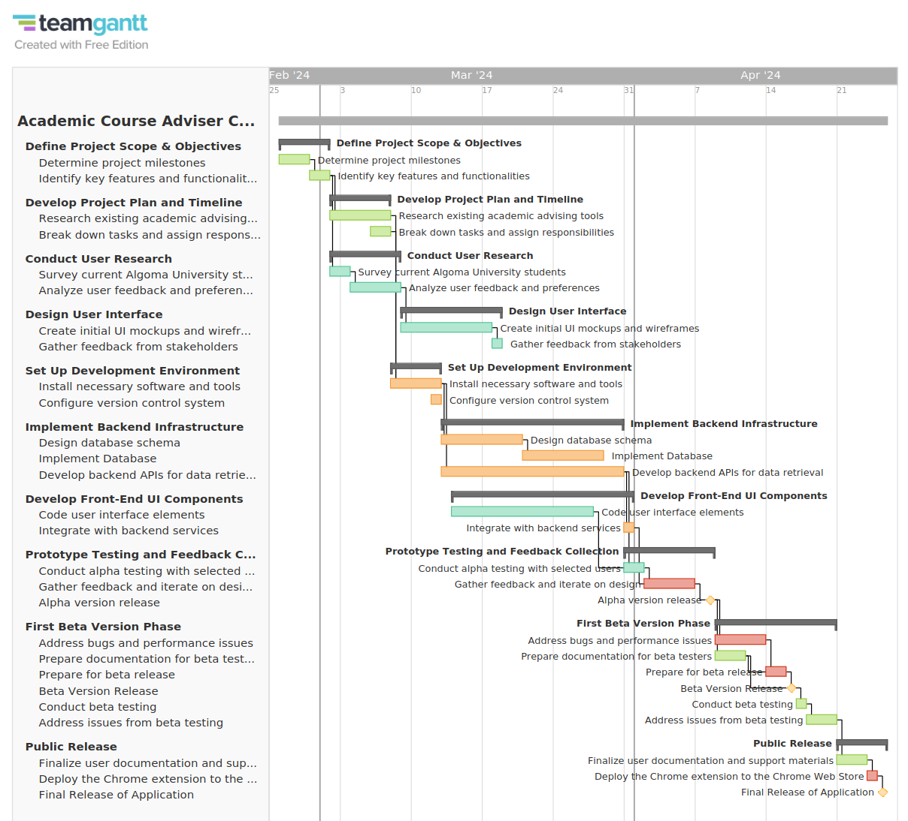

# Academic Course Adviser Chrome Extension
## Project Planning
**This is part 1**

!!! Author
    Dr. Randy Lin

!!! TODO Project
    <b>Academic Course Adviser Chrome Extension</b>

### Overview

> For your first assignment, you will embark on the development of an Academic Course Adviser Chrome Extension
>  
> This tool aims to assist students with academic planning by providing
> * *personalized course recommendations*
> * *tracking academic progress*
> * *offering insights based on their performance*
 
>Your task is to create a detailed project plan
that incorporates a **Gantt chart** to outline the project timeline
and<u> a report that elaborates on the planning strategy</u>,
specifically emphasizing the <i>iterative prototyping approach</i>

### Objectives

* Develop a detailed Gantt chart that visually represents the project timeline,
  including tasks, subtasks, dependencies, and milestones

* Write a comprehensive report that describes the *project scope*, *objectives*, *iterative prototyping strategy*,
and how you plan to collaborate with ChatGPT as a virtual team member

### Submission Requirements

#### Planning Report
<b>Format </b>PDF
<b>Length </b>1000-1500 words
<b>Naming Convention </b>*`[StudentLastName]_[StudentFirstName]_PlanningReport.pdf`*

### Content Outline & Submission

#### Introduction
> <b>Provide an overview of the Chrome Extension and its intended impact</b>

As a current student I find, I need to over-rely on course and academic advisors, when in fact, the information I need to make informed decisions <u>could</u> be given to me if it was in a convenient format. Why, do I have to go through pages of courses when I only need to consider the courses that I have pre-requisites for and are in the online format? Why do I have to log on to differing pages on the Algoma website and portal to get my course information, track academic progress, and why do I have to contact someone to get basic insights into my academic performance? All these problems can be solved by a convenient chrome extension. With this extension I can have relevant academic information in one place in my chrome browser.

>  Your introduction effectively highlights the need for the Chrome Extension by addressing common student challenges and the convenience that such a tool could provide. It sets a clear context for the project by explaining why this extension is necessary and the problems it aims to solve.

#### Project Scope
> <b>Define the boundaries, key features, and functionalities of the Chrome Extension</b>

This is chrome extension project

Key features
&dash; personalized course recommendations
&dash; track academic progress
&dash; offer insights based on academic performance

The extension must be able to provide relevant, accurate, actionable insights in a convenient way from a chrome browser.

#### Objectives
> <b>Detail the specific outcomes your project aims to achieve</b>

&cir; At the end of the project it is hoped to have at least a semi-working prototype of the extension.
&cir;The project is a success when that extension can be seen as useful from a current Algoma student's perspective.

If that student upon trying and reflecting on the extension wishes that he/her had this tool available during their time at Algoma and would have used the tool if it was available; then this project would have completely succeeded.

>  Your objectives are specific and measurable, which is excellent. You've outlined what success looks like for the project, making it easier to evaluate progress and outcomes.
>  

#### Iterative Prototyping Approach
> <b>Describe your strategy for employing iterative prototyping,
> including plans for incorporating feedback and refining the prototype across iterations</b>

In this project the plan is iterate constantly in most stages of development.
The wire-frames and mockups of the ui will be shared with outside stakeholders.
Students from Algoma university will be selected as the best people for user feedback.
There will be a alpha, beta and final stage with testing and user feedback, before final public release.

>  Your response partially conforms to the project's assignment requirements regarding the iterative prototyping approach. Let's break it down:
> Conformance:
> 
> - Strategy for Employing Iterative Prototyping:
>     You've mentioned that the plan is to iterate constantly in most stages of development, which aligns with the iterative prototyping approach. Iterative development involves incremental improvements based on feedback and testing, which is essential for refining the prototype.
> 
> - Plans for Incorporating Feedback and Refining the Prototype:
>     You've stated that wireframes and mockups will be shared with outside stakeholders, and students from Algoma University will provide user feedback. This demonstrates a commitment to gathering input from relevant stakeholders and incorporating their feedback into the prototype.
> 
> Non-Conformance:
> 
> - Lack of Detail on Iterative Process:
>     While you've mentioned sharing wireframes and mockups for feedback, there's limited detail on how feedback will be incorporated and how the prototype will be refined across iterations. Consider providing more specifics on how feedback will be collected, analyzed, and implemented in subsequent iterations.
> 
> - No Mention of Specific Iterative Phases or Milestones:
>     You've outlined alpha, beta, and final stages for testing and user feedback, but there's no clear delineation of iterative phases or milestones within each stage. Including specific milestones for each iteration can help track progress and ensure that feedback is systematically incorporated into the prototype.
> 
> Recommendations for Improvement:
> 
> - Detail the Iterative Process:
>     Provide a more detailed explanation of how feedback will be collected, analyzed, and integrated into the prototype at each iteration. Discuss mechanisms for prioritizing feedback and making decisions about which changes to implement.
> 
> - Define Iterative Phases and Milestones:
>     Break down the development process into distinct iterative phases, such as design iteration, development iteration, and testing iteration. Define specific milestones for each iteration, indicating when feedback will be solicited, when changes will be implemented, and when each iteration will be completed.
> 
> - Clarify Roles and Responsibilities:
>     Specify who will be responsible for managing the iterative process, collecting feedback, and coordinating changes across iterations. Clearly delineate roles and responsibilities to ensure accountability and effective collaboration.
> 
> By incorporating these recommendations, you can enhance the clarity and effectiveness of your iterative prototyping approach, ensuring that feedback is systematically incorporated into the development process and leading to a more refined and user-friendly final product.

**Incorporating ChatGPT's feedback**

In this project the plan is iterate constantly in most stages of development.
The wire-frames and mockups of the ui will be shared with outside stakeholders.
Students from Algoma university will be selected as the best people for user feedback.
There will be a alpha and beta versions and phases with testing and user feedback, before final public release.

In this project here are places where feedback is generated and iterated upon:
&starf; In the beginning of the project Emily would be conducting user research and thus incorporating this into the project plan
&starf; It is expected that the wire-frames need to be approved by some stakeholder probably the project lead
&starf; In the alpha stage selected users will provide feedback that is iterated upon
&starf; In the beta stage the app would be released in the app store so users would be able to provide feedback also another batch of selected users would be needed hence why there is a task to prepare beta documentation for beta testers

#### Gantt Chart
> Embed screenshots of your Gantt chart within the report.
> 
> Ensure the chart includes:
> - At least 3 team roles and their responsibilities
>
> - A minimum of 10 main tasks, each broken down into at least 2 subtasks.
> - At least 5 branches showing how tasks are interconnected
>   Branch means that two or more tasks cannot start before a common task is completed,
>   or one task have to wait until two or more tasks to complete before it can begin
> - At least 3 key milestones marking significant achievements
> - Duration estimates for each task and subtask, highlighting the critical path

**Team Members** 
&nbsp;&nbsp;&bullet; <b>Lucas</b> <i>Product Manager</i>
&nbsp;&nbsp;&bullet; <b>Emily</b> <i>UI/UX Designer</i>
&nbsp;&nbsp;&bullet; <b>Ben</b> <i>Mobile & Backend Developer</i> 

!!! Note Note: Color Coding
    Green: Lucas
    Cyan: Emily
    Orange: Ben
    Red: Everyone

**I've determined the critical path is fairly self-evident**

**Screen Shot below**
***Probably better to use the link instead*** 

!!! Warning Link doesn't work on free plan
    

#### Risk Management
> <b>Identify potential risks to the project and outline strategies to mitigate them</b>

The main risk is that none of the developers assigned to this project have experience with developing chrome extensions. Thus, there is a high chance that there will be deadlines run-offs due to developer inexperience.

There is a risk that there are more iterations than are anticipated than that of project plan represented by the Gantt chart. for example in the alpha version the alpha testers could reject the software and thus another alpha design, implement, test cycle would need to be implemented.

To address both of the above risks for this project there has to be flexibility in the deadlines and the release date should be able to be moved to guarantee project completion.

#### Resource Allocation
> <b>Discuss the allocation of resources <i>(human, technological, informational)</i></b>

For this project we have three people represented by the roles of ui/ux or frontend developer,backend developer and a project lead. Chrome extensions are built using a standard web development stack, so Javascript or Typescript, CSS, HTML as well as some backend tools like node and database such as with Postgress. This project must be completed by April when this semester ends thus there is a hard time limit. 

### ChatGPT Collaboration

!!!  example Link to the Chat for this Project with ChatGPT
    https://chat.openai.com/share/7de1cda5-f273-4be1-9c4f-45f1bc904a8a

> Describe how you utilized ChatGPT for planning and brainstorming
> Include examples of engagement and how you assessed and integrated the insights obtained
> - <b>Method of Collaboration</b>
>   Describe how you used ChatGPT as a virtual team member to 
>   <em>brainstorm, refine ideas, and co-develop your project plan</em>
>   Include at least <u>three</u> specific prompts you used and how you iterated on ChatGPT's responses
>   <i>Use screenshots to support your descriptions</i>
> 
> - <b>Verification of ChatGPT's Input</b>
>   Explain how you verified the accuracy and relevance of the information provided by ChatGPT
>   This could include 
>   &star; cross-referencing with credible sources
>   &star; applying personal knowledge
>   &star; consulting additional resources
>   <i>Provide one example for each verification method</i>
> - <b>Integration and Refinement</b> Discuss how you integrated ChatGPT's insights into your planning process and the steps taken to refine these insights into actionable parts of your project plan
>

<b>Method of Collaboration</b>
I use ChatGPT extensively. I used it to brainstorm for the Gantt chart I asked it to generate the 10 tasks which would take a long time to make up myself. Unfortunately, ChatGPT is not good enough, so there was a lot of work to make realistic estimates and generate more logically needed subtasks as for some reason ChatGPT kept the two subtasks per main task. For the Gantt chart ChatGPT was useful to quickly generate a outline, but the outline was not very good and needed to be iterated on by a human to be of any use.

I asked it to check my answers for the various subsection of this project. Some of which I displayed. As can be clearly seen ChatGPT is mostly simply approving of what was written and didn't give any useful feedback beyond that.

Also ChatGPT did not give good advice for technology. It was prompted that Mermaid JS was not a good Gantt charting tool as it could not show dependencies but when asked in another prompt to generate tasks for the Gantt chart it responded in Mermaid JS format.

All in all, ChatGPT is good at generating some very basic plan outline to start the planning process, but it is not very good at anything else and in the time it takes to prompt, a better plan could be generated by human creativity alone. Based on the experience of using ChatGPT; ChatGPT role, is probably best as a english language model for those whose english is not the best.

<b>Verification of ChatGPT's Input</b>
For the Gantt chart prompt I checked Mermaid's documentation to confirm that Mermaid can not show task dependencies. This is unfortunate as if I am already going through the documentation for Mermaid then there is no point in prompting ChatGPT about how to use Mermaid JS. Overall from this example it is better to rely on personal experience as I already knew Mermaid does not have the features needed from my previous experience using the tool. Cross referencing with the documentation is probably better than using ChatGPT as it often "hallucinates" features like in this case so other resources other than just ChatGPT is clearly needed.

<b>Integration and Refinement</b>
ChatGPT is good for iteration as it remembers the previous prompts, so once you give the project outline it will remember this for the other steps so it could incorporate the assignment requirements in the plan and design phases for example. It is also good at finding mistakes it will nudge the prompter if it sees the sections that are not filled and could recommend refinements. As it did for the Iterative Prototyping Approach section which I incorporated the feedback so that I specifically mentions where in the plan feedback is generated and iterated upon.

<b>Conclusion</b>
Me personally I was more annoyed at using ChatGPT, as my english is good and leveraging my own words and knowledge will usually be easier and faster than prompting. That said, there are areas where ChatGPT could be useful. For generating large amounts of tedious content, like the tasks, the speed at which can save the user a lot of time. It is also a good way to get feedback, although in this case it was only for when there needed to be more content. It was also very frustrating that for diagrams like the Gantt chart, being text only, there was no use possible. The time it takes to verify the information that ChatGPT generates is a major problem and with the example of Mermaid JS prompt following that advice would have been disastrous for this project.

Finally in a example that demonstrates all the discussion so far; I quickly checked what the technology stack for Chrome extensions are, from a stack-overflow answer; I realized that it is just a typical web development stack which I am familiar with. The fact that my instinct is not to ask ChatGpt on this simple question is indicative of the use of ChatGPT in general in my honest opinion. All in all, although ChatGPT is a amazing technical achievement, it would not be able to this assignment on its own and it is still up to humans and their creativity to do the vast majority of the work in software development.