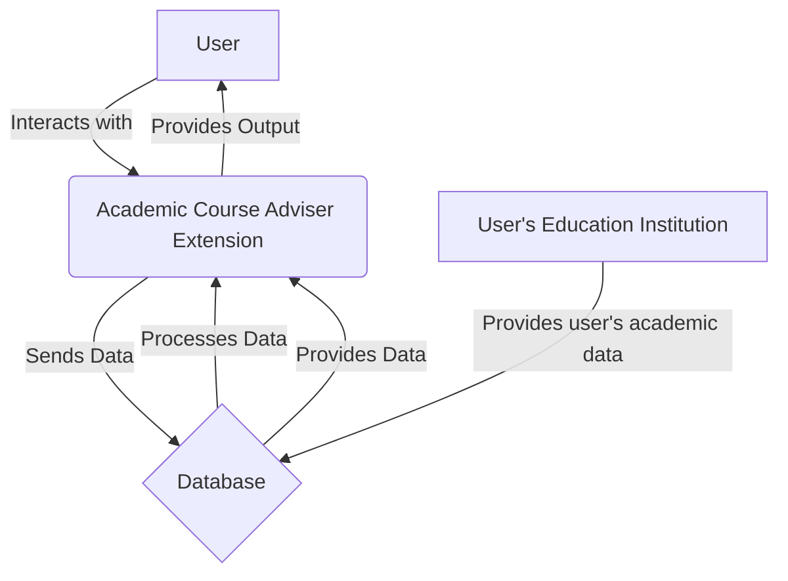
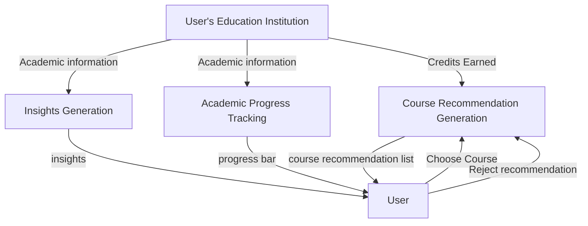
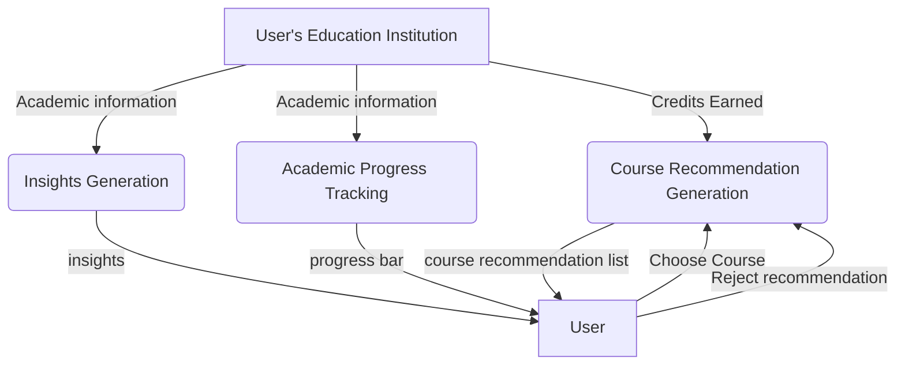
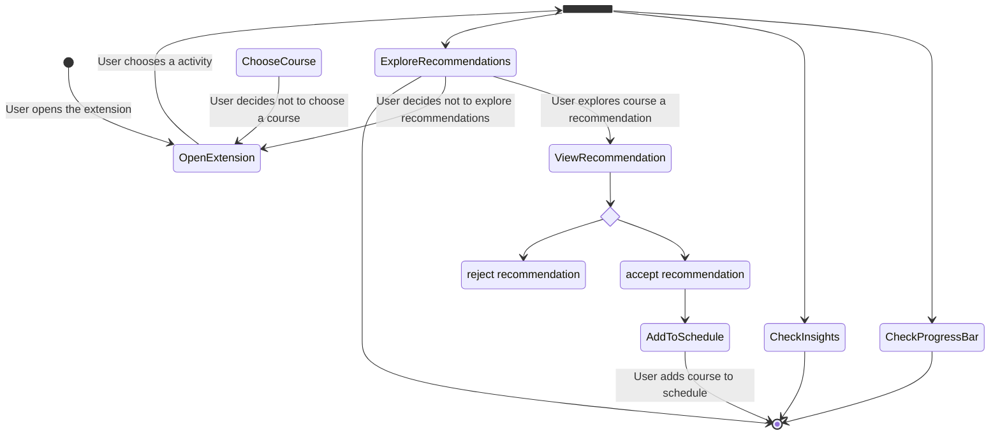
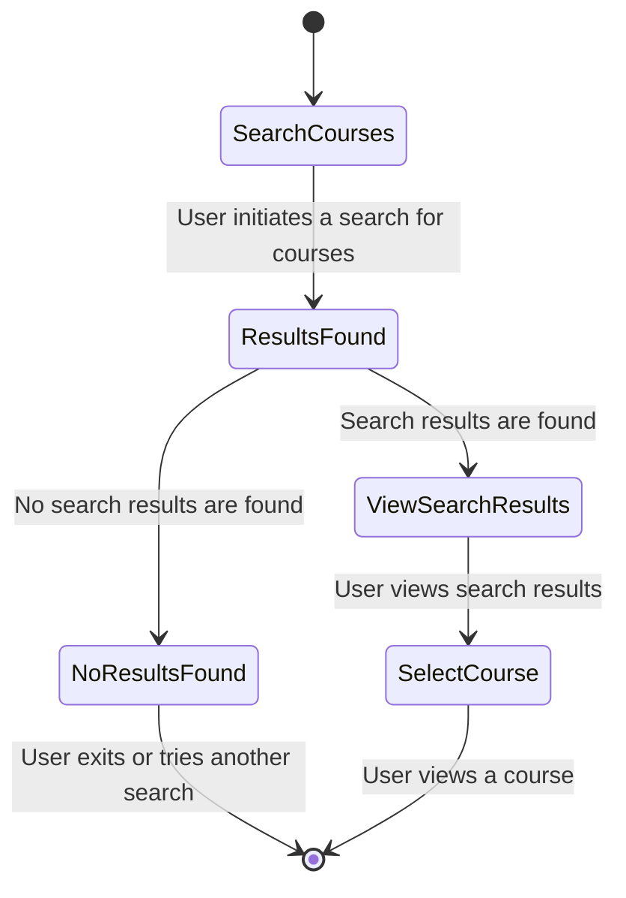

# Academic Course Adviser Chrome Extension
## System Analysis and Presentation for Academic
Course Adviser Chrome Extension
**This is part 4** System Analysis and Presentation for Academic
Course Adviser Chrome Extension{class="flex justify-between"}

!!! Author
    Dr. Randy Lin

!!! TODO Project
    <b>Academic Course Adviser Chrome Extension</b>

### Overview

> his final part of the assignment integrates the practical development
> work from earlier phases with *analytical methods* to provide a comprehensive view
> of the Academic Course Adviser Chrome Extension project
> Students will employ <b>Data Flow Diagrams</b> ***DFDs*** and <b>Activity Diagrams</b> to visually document and analyze the 
> <i>system's architecture</i>, <i>data processing</i>, and <i>user interactions</i>
> This analytical work will be complemented by a <i>detailed report</i> and a <i>video presentation</i>, offering both a reflective and demonstrative perspective on the project
> The assignment aims to bridge the gap between theoretical project management methodologies and practical application in software development,
> enhancing students' skills in system analysis, documentation, and communication.

### Objectives

Combine analytical and practical elements
of your Chrome Extension project into a <b>cohesive report</b> and <b>video presentation</b>

This assignment requires you to detail the 
<i>development process</i>, <i>key functionalities</i>, <i>user interface design</i> , and <i>system analysis</i>
through **Data Flow Diagrams** (**DFDs**) and **Activity Diagrams**, complemented by a <i>video explanation</i>

### Submission Requirements

<b>Format </b>PDF
<b>Length </b>1500-2000 words
<b>Naming Convention </b>*`[StudentLastName]_[StudentFirstName]_ChromeExtensionAnalysis.pdf`*
<b>Format</b> MP4 or MKV
<b>Length</b> 8-12 minutes
**submit the video link or include video directly**
<b>Naming Convention for video <i>if directly submitting</i></b>
*`[StudentLastName]_[StudentFirstName]_ChromeExtensionDemo.mp4`*

### Content Outline & Submission

#### Content Outline:
   1. **Project Overview**
   Briefly introduce the Chrome Extension, its purpose, and the target user base.
   2. **Review of Key Functionalities and UI Design**
   Breifly Describe the key functionalities developed, their significance, and how they meet
   user needs through UI.
   3. **Data Flow and Activity Diagrams**
   &bull; Include DFDs starting with a Context Diagram and 
   &nbsp;&nbsp;&nbsp;progressing through detailed levels to illustrate system data processing
   &bull; Present Activity Diagrams that map the user journey and specific actions for each functionality
   &bull; Accompany diagrams with descriptions explaining 
   &nbsp;&nbsp;&nbsp;their components, the interactions they represent, and insights gained
   4. **Reflections**
   Reflect on the development and diagramming process, highlighting challenges,
   learnings, and the impact on your understanding of the project

---
1. ##### Project Overview:
> Briefly introduce the Chrome Extension, its purpose, and the target user base

This is a chrome extension that can act as a brief academic advisor. Users of this extension are going to be students who would like relevant information to select their courses, without the need of a in-person academic advisor. Having information on courses they should consider and their progress will be helpful for them making informed decisions. Information will be conveniently delivered from the user's chrome browser. With this application students should be left with a strong basis to make informed decisions in regards to the important task regarding their course selections.

2. ##### Review of Key Functionalities and UI Design:
> Briefly Describe the key functionalities developed, their significance, and how they meet user needs through UI

*Offer personalized course recommendation* 
The app offers a list of courses for the user to review. These courses should be based on the current progress the student is at, meaning their previous courses. The courses should be exactly the next courses the student should pick having done their prerequisites and are the courses that would act as prerequisites for chosen future courses. This would be way better than going through a portal and going through all courses hoping to find relevant courses with this app only courses relevant to the user would be displayed.

*Should track the academic progress of the user in question*
The app quickly informs the user right away about their academic progress. This is achieved by the display of a fill bar, with the amount that the bar is filled showing their current progress through their academic program. Additionally the progress bar should display the actual credits as a percentage of required credit with the absolute values displayed when a user hovers over the taskbar.

*Useful insights should be conferred to the user based on their academic performance*
When the user logs into the application they will immediately have a color coded message which will inform them of their academic performance. Hopefully they will show a green message informing them that they are meeting their goals and progressing nicely through their program. Likewise, a red message will inform them that are not meeting their expectations and that they should talk with a advisor about their performance and seek solutions. As well as a quick message for recommendations based on the apps risk metrics the app will also display the current gpa as well as indicator on wether gpa is trending upward or downwards. This app makes it easy for a user to quickly gleam how their academic performance is currently from seconds of opening the application.

3. ##### Data Flow and Activity Diagrams:
> Include DFDs starting with a Context Diagram and 
> progressing through detailed levels to illustrate system data processing
> Present Activity Diagrams that map the user journey and specific actions for each functionality
> Accompany diagrams with descriptions explaining their components,
> the interactions they represent, and insights gained

##### Data Flow Diagrams

    

    
**Context Diagram**

This diagram provides an overview of the system from an external perspective.
It depicts the extension as a single process (rectangle) interacting with external entities (e.g., users, external systems) through data flows (arrows).
The main purpose is to show the scope and boundaries of the system without delving into internal details.

**Level 0**

This diagram expands upon the context diagram by breaking down the extension into more detailed processes.
It illustrates how data flows between processes and external entities.
The focus is on identifying the major processes within the extension and their interactions with external entities.

**Level 1**

This diagrams further decompose the processes identified in the Level 0 DFD into smaller subprocesses.
Each Level 1 DFD focuses on a specific process from the Level 0 DFD and provides more detail about its internal workings.
The purpose is to clarify the functionalities and data processing steps within each process.

###### Activity Diagrams

    

    
**User Interaction with Academic Course Adviser Extension**

**Course Search Functionality**

1. ##### Reflections:
> Reflect on the development and diagramming process, highlighting challenges, learnings, and the impact on your understanding of the project.

The diagramming process was hard. I was using mermaid js for diagraming but I was constantly looking up how to do things. This was especially the case for activity diagrams where finding the syntax was difficult. I found that Chatgpt was utterly bad at generating these diagrams so I had to do everything myself. 

Generating the diagrams was very taxing conceptually, I realized that I would need much more practice in generating DFDs and activity diagrams. I believe that with more practice I would be able to better conceptualize my application and be able to visualize the data flows and activities that my application would generate, this could make the process of software development much more quicker and efficient. 

I did gain useful insights for example when creating the dfd diagrams I realized that the academic information of the user using the app needed to generate the insights and information shouldn't come from the user but their academic institution. If the academic institutions could provide the information for the user to the application than it would be very convenient for all parties involved.

#### Video Outline

1. #### Introduction
> Brief introduction to the objectives of the interface design and the functionalities it aims to support

2. #### Functionalities and UI Demonstration

> \- Walk viewers through each key functionality, demonstrating how they are realized within the UI.
> \- Highlight design decisions, challenges encountered, and solutions implemented.

3. #### Diagram Explanation

> Present and explain the DFDs and Activity Diagrams created.
> Discuss how these diagrams aid in understanding the system’s architecture and user interactions

4. #### Integrated Insights
> Link the development work and diagram analysis, 
> discussing how each aspect of the project informs and enhances the other

5. #### Conclusion & Reflections

> Conclude with overall insights gained, the value of the 
> project management methodologies applied, and potential future developments

The development process was very fast with the LLM being able to code a basic outline, quickly. This "boilerplate" code would have been very tedious to code by hand and it was good that the LLM could generate this type of code so that the human developer can focus on the fun part of development in my opinion which is the design and creative solutions that a application is meant to solve. In other words it allows the developer to focus on the problem domain rather than the technical implementation.