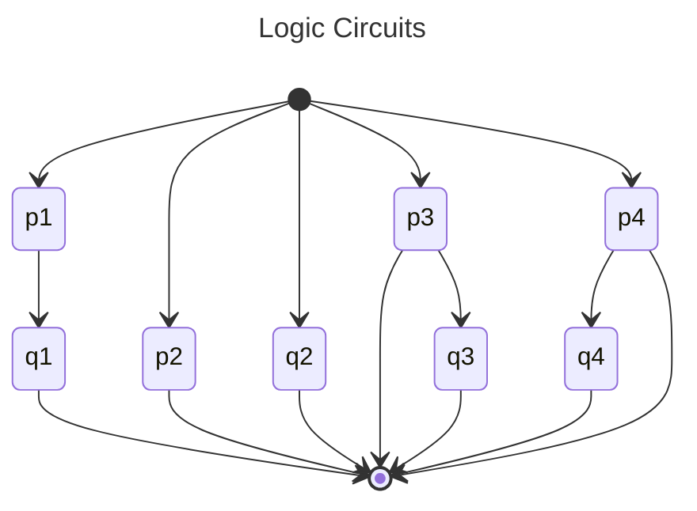

# Propositional Logic


## Number Sets

$\Bbb{R}=\Set{All\space decimal\space representations\space } = \Bbb{Q}\cup \Bbb{Q}^c$ = real numbers

$\Bbb{Z}=\{...,-2,-1,0,1,2,3...\}$ = integers

$\Bbb{N}=\Bbb{Z}^+=\{1,2,3...\}$ = positive integers

$\Bbb{Q}=\{f/q\mid  p, q\in\Bbb{Z},q\neq 0, p\space and\space q\space have\space no\space common\space factors \}$ = rational numbers

$\Bbb{Q}^c=\{x\in \Bbb{R}\mid x\notin\Bbb{Q}\}$ = irrational numbers

$\Bbb{C} =\set{x+ig\mid x,y\in \Bbb{R}\space and\space i^2=-1}$ = Complex numbers

Use the math directive
If $D\in\Bbb{Z}$ set of integers
```{math}
:label: my_label
w_{t+1} = (1 + r_{t+1}) s(w_t) + y_{t+1}
```
$$
  w_{t+1} = (1 + r_{t+1}) s(w_t) + y_{t+1}
$$ (my_other_label)

## Linking to equations
- A link to an equation directive: {eq}`my_label`
- A link to a dollar math block: {eq}`my_other_label`

## Prepositional Logic

A **proposition** is a declarative sentence that is either *true* or *false* but *not both*

```{tip}
Let *p* be a proposition. The *negation of p*, denoted by *$\neg p$* is the statement:
    
    It is not the case that p

*$\neg p$* is the <u>opposite</u> of *p*
``` 

A **<u>atomic</u>  proposition** is a simple statement, one that is not a combination of *simpler* statements

A **<u>compound</u>  proposition** is a proposition, made up of two or more proposition joined by *logical connective operators*

**logical connective operators**: $\neg \wedge \lor \rightarrow \leftrightarrow$

### Truth Table for the negation of a Proposition

*p* | *$\neg p$*
--- | ----------
T   | F
F   | T

### Truth Table for the Conjunction of Two Proposition

This is the **And** condition

*p* | *q* |*$p\wedge q$* |
--- | --- | ------------ |
T   |  T  |      T       |
F   |  T  |      F       |
T   |  F  |      F       |
F   |  F  |      F       |

### Truth Table for the Disjunction of Two Proposition

This is the inclusive **OR** condition

*p* | *q* |*$p  \lor q$* |
--- | --- | ------------ |
T   |  T  |      T       |
F   |  T  |      T       |
T   |  F  |      T       |
F   |  F  |      F       |

#### Exclusive OR

This is the exclusive **OR** condition

*p* | *q* |*$p\oplus q$* |
--- | --- | ------------ |
T   |  T  |      F       |
F   |  T  |      T       |
T   |  F  |      T       |
F   |  F  |      F       |

### Conditional Statements

> Let *p* and *q* be propositions. The conditional statement *$p\rightarrow  q$* is the proposition *if p, then q* The conditional statement *$p\rightarrow  q$* is false when *p* is true and *q* is false, and true otherwise.  In the conditional statement *$p\rightarrow  q$*, *p* is called the *hypothesis* (or *antecedent* or *premise*) and *q* is called the *conclusion* (or *consequence*).
>> *$p\rightarrow  q$* is a **conditional statement** or a **implication** *q* is true on the condition that *q* holds *to put more bluntly: **only when p is true, but q is false is the statement $p\rightarrow  q$ completely incorrect***
>>> "*if* it is raining, *then* the ground is wet."
>>>> "when it is *not* raining, *then* the state of the ground is doesn't matter we call this the *vacuous case*."

```{admonition} Truth Table for conditional statement
:class: info

*p* | *q* |*$p\rightarrow q$* |
--- |:---:|:-----------------:|
T   |  T  |           T       |
F   |  T  |           T       |
T   |  F  |           F       |
F   |  F  |           T       |

```
```{tip}
The concept of conditionals doesn't make much sense in terms of truth table. All that is important is that if $p \rightarrow q$, then it means that if *p* is true then it means that *q* can not be false otherwise, the statement is not just false but doesn't make sense

> think **if then**
```
##### Definitions

Proposition
: $p\rightarrow q$ A conditional statement
: **"*if* it is raining, *then* the ground is wet"**

Converse {bdg-danger}`not necessarily equivalent to the original proposition`
: $q\rightarrow p$ is the *converse* of $p\rightarrow q$
: > **"*if* the ground is wet, *then*  it is raining"**
: **"it could be wet for other reasons other than rain"**

Inverse {bdg-danger}`not necessarily equivalent to the original proposition`
: $\neg p\rightarrow\neg q$ is the *inverse* of $p\rightarrow q$
: > **"*if* it is not raining, *then* the ground is not wet"**
: **"ground could be either wet or dry without rain"**

Contrapositive {bdg-info}`equivalent to the original proposition`
: $\neg q\rightarrow\neg p$ is the *contrapositive* of $p\rightarrow q$
: > **" *if* the ground is not wet, *then*  it is not raining "**
: **"because if it were raining then the ground will be wet"**

Equivalent 
: When two propositional statement have the same truth value

```{note} 
Only *contrapositive* is equivalent to the original proposition but *inverse and converse* statements are 
<u>not necessarily equivalent</u>  
```
&nbsp;    |Conditional        |Converse           |Contrapositive              |Inverse                         |
---------:|:-----------------:|:-----------------:|:--------------------------:|:------------------------------:|
*pq*      |*$p\rightarrow q$* |*$q\rightarrow p$* |*$\neg q\rightarrow\neg p$* |*$\neg p\leftrightarrow\neg q$* |
**T T**   |        T          |         T         |T                           |T                               |
**T F**   |        F          |         T         |F                           |T                               |
**F T**   |        T          |         F         |T                           |F                               |
**F F**   |        T          |         T         |T                           | T                              |

```{note}
Thus from the truth tables we can say the following...

$$ p\rightarrow q\equiv\neg q\rightarrow\neg p $$
$$ q\rightarrow p\equiv\neg p\rightarrow\neg q $$

we'll learn about logical equivalence later
```

#### Biconditionals 

> The **biconditional statement** $p\leftrightarrow q$ is the statement *p if and only if* also called **bi-implication**

```{note}
$$ p \leftrightarrow q \equiv (p \rightarrow q) \wedge (q \rightarrow p)$$
```

*p* | *q* |*$p\leftrightarrow q$* |
--- |:---:|:---------------------:|
T   |  T  |           T           |
F   |  T  |           F           |
T   |  F  |           F           |
F   |  F  |           T           |

### Precedence of Logical Operators

In **compound propositions** the order of precedence that we calculate is from left to right below

$$\forall \exists \neg \wedge \lor \rightarrow \leftrightarrow$$(logical-operator-precedence)

#### Bitwise Operations

We can express true and false statements in terms of binary

*p* | *q* |*$p\wedge q$* |*$p\lor q$* |*$p\oplus q$* |*$p\rightarrow q$* |*$p\leftrightarrow q$* |
--- |:---:|:------------:|:----------:|:------------:|:-----------------:|:---------------------:|
1   |  1  |1             |1           |0             |1                  |1                      |
1   |  0  |0             |1           |1             |0                  |0                      |
0   |  1  |0             |1           |1             |1                  |0                      |
0   |  0  |0             |0           |0             |1                  |1                      |

#### Electronic Diagrams

Here is the logic propositions that the circuit is simulating:
1. $p1\wedge q1$
1. $p2\lor q2$
1. $p3\wedge (p3\lor q3)$
1. $p4\lor (p4\wedge q4)$


> We see that *AND* circuits are basically **serialized** and *OR* circuits are **parallel**


Note how $p\wedge (p\lor q)\equiv p\equiv p\lor(p\wedge q)$ this is called the **absorption law**
#### Fuzzy Logic

> Used in artificial intelligence

It means `1` for truth and `0` for false but there could be <u>degrees</u> between these two values for example `0.7` for *Bill is happy means that it is usually true*

## Propositional Equivalence

$pq\neg p\neg q$ |$p\rightarrow q$ |$\neg q\rightarrow \neg p$ |$(p\rightarrow q)\leftrightarrow(\neg p\rightarrow \neg q)$ 
----------------:|:-----------------:|:---------------------:|:---------------------:|
1 1 0 0          |1                  |1                      |1
1 0 0 1          |0                  |0                      |1
0 1 1 0          |1                  |1                      |1
0 0 0 1          |1                  |1                      |1

Note that $(p\rightarrow q)\leftrightarrow(\neg p\rightarrow \neg q)$ is true in all cases it's a *tautology*

This is becuase $(p\rightarrow q)\equiv(\neg p\rightarrow \neg q)$

```{admonition} Definitions
> A *compound proposition* that is ...

**tautology**
: always true no matter what the truth values of the propositional variables that occur in it

**contradiction**.
: always false

**contingency**
: - neither that is neither a tautology nor a contradiction 
  - sometimes true sometimes false it depends

##### Satisfiability
**satisfiable**
: if compound propositions is true for a assignment of truth values
> it't either a tautology or contingency

**unsatisfiable**
: compound propositions can't be true no matter the truth values 
> its a contradiction
```

$p \lor \neg p$ is always true hence *tautology* and $p \wedge \neg p$ is always false hence *contradiction*

````{admonition} Logical Equivalences
The compound proposition $p$ and $q$ are called **logically equivalent** if $p \leftrightarrow q$ is a tautology the notation $p \equiv q$ denotes that $p$ and $q$ are logically equivalent
  ```{note}
  $\equiv$ is *not* a conditional statement nor does it denote a compound proposition but rather that $p \leftrightarrow q$ is a tautology and alternative symbol is thus $\Leftrightarrow$
  ```
````

````{admonition} De Morgan's Laws
$$\neg(p\wedge q) \equiv \neg p \lor \neg q$$
$$\neg(p\lor q) \equiv \neg p \wedge \neg q$$

## Logical Equivalences 

Equivalence                                                           | Name                |                  
-----------                                                           | ----                |                  
$p\wedge T\equiv p$ <br> $p\lor   F\equiv p$                          | Identity laws       |                  
$p\lor T\equiv T$ <br> $p\wedge   F\equiv F$                          | Domination laws     |                  
$p\lor p\equiv p$ <br> $p\wedge   p\equiv p$                          | Idempotent laws     |                  
$\neg (\neg p ) \equiv p$                                             | Double negation law |              
$p\lor q\equiv q\lor p$ <br> $p\wedge q\equiv q\wedge p$              | Commutative laws    | 
$(p\lor q)\lor r\equiv p\lor (q \lor r)$<br>$(p\wedge q)\wedge r\equiv p\wedge (q\wedge r)$ |Associative laws|
$p\wedge(q\wedge r)\equiv(p\lor q)\wedge(p\lor r)$<br>$p\lor(q \lor r)\equiv(p \wedge q)\lor(p\wedge q)$|Distributive laws
$\neg(p\wedge q) \equiv \neg p \lor \neg q$<br>$\neg(p\lor q) \equiv \neg p \wedge \neg q$| De Morgan's Laws|
$p\lor (p\wedge q)\equiv p$<br>$p\lor (p\lor q)\equiv p$              | Absorption laws     |
$p\wedge \neg p\equiv T$<br>$p\lor \neg p\equiv F$                    | Negation laws       |

### Logical Equivalence - Conditional Statements 
$$p\rightarrow q\equiv\neg p\lor q$$
$$p\rightarrow q\equiv\neg q\rightarrow\neg p$$
$$p\lor q\equiv\neg p\rightarrow q$$
$$p\wedge q\equiv\neg (p\rightarrow\neg q)$$
$$(p\rightarrow q)\wedge(p\rightarrow r)\equiv p\rightarrow(q\wedge r)$$
$$(p\rightarrow r)\wedge(q\rightarrow r)\equiv (p\lor q)\rightarrow r$$
$$(p\rightarrow q)\lor(p\rightarrow r)\equiv p\rightarrow(q\lor r)$$
$$(p\rightarrow r)\lor(q\rightarrow r)\equiv (p\wedge q)\rightarrow r$$

### Logical Equivalence - Biconditional Statements 
$$p\leftrightarrow q\equiv(p\rightarrow q)\wedge(q\rightarrow p)$$
$$p\leftrightarrow q\equiv\neg p\leftrightarrow\neg q$$
$$p\leftrightarrow q\equiv(p\wedge q)\lor(\neg p\wedge\neg q)$$
$$\neg(p\leftrightarrow q)\equiv p\leftrightarrow\neg q$$

## Predicates and Quantifiers

**Predicate Calculus**
: The area of mathematics that deals with *predicates* and *quantifiers*

### Predicates 

Predicates
: These are statements involving **variables**

#### Examples

$x\gt 3$, $x = y + 3$, $x + y = z$ "Computer x is under attack by an intruder"

Take $x\gt 3$, $x$ is the variable; the subject of the statement. The **predicate** is the "is greater than 3". 

#### Notation
> The statement $x\gt 3$ can be denoted by $P(x)$ 
> - $P$ denotes the **predicate** the statement *is greater than 3*
> - $x$ is the variable 
>> **Overall:** $P(x)$  is said to be the value of the <u>propositional function</u> $P$ at $x$

##### example 

Let $P(x)$ denote the statement $x\gt3$. What are the truth values of $p(4)$ and $P(2)$?

If $D\in\Z$ set of integers

**ANSWER** 
- at $x = 4$, $P(4)$ becomes $4\gt3$ which is *true*
- at $x = 2$, $P(2)$ becomes $2\gt3$ which is *false*

```{note}
Predicate have no truth value <u>until</u> we assign values to the variables, it then has truth values *T* or *F*
```
```{note}
An assignment of values to the variables, turn a predicate/propositional function into a <u>proposition</u> 
```

### Quantifiers

**Precedence** Quantifiers have high precedence
Link to the precedence of logical operators {eq}`logical-operator-precedence`

**Quantification**
: In english these are words like *all*, *some*, *many*, *none* and *few*
- The use of quantifiers also can turn a predicate/propositional function into a <u>proposition</u>

2 types
1. *Universal Quantification*
: Tells us predicate is true <u>for every</u> element under consideration
2. *Existential Quantification*
: There is <u>one or more element</u> under consideration for which predicate is true

**Universe of Discourse**
: The allowable values to the variables **denoted:** $D=dom(P)$
> When we need to explicitly describe the domain
>> we write $\forall x\in dom(P), P(x)$ or $\forall x\in D, P(x)$

```{admonition} Definition **Universal Quantification**
The *universal quantification* of $P(x)$ is the statement
> $P(x)$ for all values of $x$ in the domain

$\forall xP(x)$ denotes the universal quantification of $P(x)$. 

$\forall$ is the universal quantifier with we read is as *for all*

When there is a element for which $P(x)$ is false this is called a **counterexample** to $\forall xP(x)$

A <u>single</u> counterexample makes $\forall xP(x)$ <u>false</u>
```
````{admonition} Definition **Existential Quantification**
The **existential quantification** of $P(x)$ is the proposition 
> There exists at least one element $x_0$ in the domain $x_0\in dom(P)$ such that $P(x_0)$ is true

**Notation:** $\exists xP(x)$, $\exists$ is called the **existential quantifier**
```{warning}
Remember the value of $\forall xP(x)$ depends on the domain
```
```{admonition} Definition **Uniqueness Quantification**
We looked at two of the most famous quantifiers but we can define others like "*there are exactly 2*", "*there are more than 3*", "*there are at least 100*" and so.

> **Notation:** $\exists !xP(x)$ "*There exists a unique $x$ such that $P(x)$ is true*"
```
````
#### Lecturer's example

Let $Q(x, y):x^2+y^2=1$

Let $D_1=\Bbb{R}^2=\set{(x,y)\mid x,y\in\Bbb{R}}$ all real numbers

$D_2=S^1=\set{(x,y)\in\Bbb{R}^2\mid x=\cos\theta,y=\sin\theta,0\leqslant\theta\lt 2\pi}$ <br>The unit circle in $\Bbb{R}^2$ centered at the origin

$D_3=\set{(n,n)\in\Bbb{Z}^2\mid n\in \Bbb{Z}}=diag(\Bbb{Z}^2)$ <br>
diagonal subspace of $\Bbb{Z}^2$

$$
\textcolor{hotpink}{\text{Then lets evaluate the three Domains}D_1,D_2,D_3}\\
\textcolor{Purple}{D_1:\ \text{for all real numbers there are some that don't work}}\\
\forall(x,y)\in D_1,Q(x,y)\space is\space F\\
\exists(x,y)\in D_1,Q(x,y)\space is\space T\\\\
\textcolor{Violet}{D_2:\ \text{this domain encompasses all values that work with unit circle}}\\
\forall(x,y)\in D_2,Q(x,y)\space is\space T\\
\exists(x,y)\in D_2,Q(x,y)\space is\space T\\\\
\textcolor{blueviolet}{D_3:\ \text{this domain encompasses all values that don't work}}\\
\forall(x,y)\in D_3,Q(x,y)\space is\space F\\
\exists(x,y)\in D_3,Q(x,y)\space is\space F\\\\
Q(n,n) = n^2+n^2=2n^2=1\\
iff\space n^2=1/2\therefore n=\pm 1/\sqrt{2}\\n\notin D_3
$$


#### Quantifiers Over Finite Domains

Say the elements of a domain are $x_1,x_2,...,x_n$ where $n$ is a positive integer then:

$$\forall xP(x)\equiv P(x_1)\wedge P(x_2)\wedge ...\wedge P(x_n)$$

Or in other words the universal quantification is the same as the **conjunction**

$$\exists xP(x)\equiv P(x_1)\lor P(x_2)\lor ...\lor P(x_n)$$

Or in other words the existential quantification is the same as the **disjunction**
#### Quantifiers Over Restricted Domains

The statement $\forall x\lt 0(x^2\gt 0)$ means "*That for every negative real number the square of the negative real number is positive*" 

```{note}
$$\forall x\lt 0(x^2\gt 0)\equiv \forall x(x\lt 0 \rightarrow x^2 \gt 0$$
```
#### Binding Variables

When a quantifier is used on a variable say on $x$, we say the occurrence of the variable is **bound** the converse is that the variable is **free**

**Scope**
: The part of a logical expression to which a quantifier is applied

```{note}
All variables in a proposition function (predicate) must be bound in order to make it a proposition
> So $\forall x\ Q(x,y)$ is still a propositional function, not a *proposition*
```

##### Example

**Statement**: $\exists x(x+1=1)$, so the variable $x$ is *bound* by the existential quantification $\exists x$ whilst the variable $y$ is *free* because it not bound by a quantifier and no value is assigned to this variable

**Statement**: $\exists x(P(x)\wedge Q(x))\lor \forall xR(x)$, all the variables are *bound* 
1. the *scope* of the first quantifier $\exists x$ is the expression $P(x)\wedge Q(x)$ because $\exists x$ is applied only to $P(x)\wedge Q(x)$ and not the rest of the statement 
2.  the *scope* of the second quantifier $\forall x$ is the expression $R(x)$ because $\forall x$ is applied only to $R(x)$ and not the rest of the statement

```{warning}
The same variable has different scope in different parts of the statement hence we could have used two variables $\exists x(P(x)\wedge Q(x))\lor \forall yR(y)$ because the scopes of the two quantifiers do not overlap. {bdg-warning}`you should be aware of the use of one variable bound by different quantifiers with scopes that do not overlap`
```
#### Logical Equivalence with Quantifiers

Show that $\forall x(P(x)\wedge Q(x))$ and $\forall xP(x)\wedge \forall xQ(x)$ are equivalent
*Assume the use of the same domain*

1) if $\forall x(P(x)\wedge Q(x))$ is true, then $\forall xP(x)\wedge \forall xQ(x)$ is true
   - Suppose that $\forall x(P(x)\wedge Q(x))$ is true
   - This means if $a$ is in domain then $P(a)\wedge Q(a)$ is true 
2) if $\forall xP(x)\wedge \forall xQ(x)$ is true, then $\forall x(P(x)\wedge Q(x))$ is true

{bdg-danger}`check textbook solution to this is very wordy` 

#### Negating Quantified Expressions

Take Statement *"Every student in class has taken a course in calculus"* we can denote this as $\forall P(x)$

Say there does exist a student that hasn't taken calculus then you see we get the statement that

$$\neg(\forall xP(x))\equiv\exists x\neg P(x)$$

````{admonition} Proof
:class: dropdown

$\forall xP(x)$ is true when $P(x)$ is true for every value of $x\in dom(P)$

thus, $\neg\forall xP(x)$ is true when  $\forall xP(x)$ is false

$\forall xP(x)$ is false when there is at least one $x_0, x_0\in D$ for which $P(x)$ is false

$P(x)$ is false when $\neg P(x)$ is true

$\therefore\neg(\forall xP(x))$ is true when $\exists x\neg P(x)$ is true

Similarly $\neg(\forall xP(x))$ is false when $\forall xP(x)$ is true, that is there is no $x_0$ for which $P(x_0)$ is false or no $x_0$ such that $\neg P(x_0)$ is true ie when $\exists x\neg P(x)$

$$\therefore\neg(\forall xP(x))\equiv\exists x\neg P(x)$$
````

Take the negation of the statement like *"Every student in class has not taken a course in calculus"*  denoted as $\forall x\ \neg P(x)$ this would be equivalent to statement *"There does not exist a student who has taken a course in calculus"* hence another get another equivalence

$$\neg(\exists x\ P(x))\equiv \forall x\ \neg P(x)$$

````{admonition} Proof
:class: dropdown

$\neg(\exists x\ P(x))$ is {bdg-white}`true` when $\exists x\ P(x)$ is {bdg-black}`false`\
This means there is {bdg-danger}`NO` $x_0$ st. $P(x_0)$ is {bdg-white}`true`\
hence $\forall x$ $P(x)$ is {bdg-black}`false` or conversely $\forall x$ $\neg P(x)$ is {bdg-white}`true`
```{admonition} Statement (1)
$If \neg(\exists x\ P(x))$ is {bdg-white}`true` then $\forall x\ \neg P(x)$ is also {bdg-white}`true`
```
**Conversely**\
$\neg(\exists x\ P(x))$ is {bdg-black}`false` when $\exists x\ P(x)$ is {bdg-white}`true`\
This means there {bdg-info}`IS` a $x_0$ st. $P(x_0)$ is {bdg-white}`true`\
$\forall x\neg P(x)$ is {bdg-black}`false` because not all $x$ make statement $\neg P(x)$ {bdg-white}`true`
```{admonition} Statement (2)
$If \neg(\exists x\ P(x))$ is {bdg-black}`false` then $\forall x\ \neg P(x)$ is also {bdg-black}`false`
```
```{admonition} Conclusion
:class: note
Combining statements (1) & (2) it means 

$$\neg(\exists x\ P(x))\equiv \forall x\ \neg P(x)$$
```

````

```{table} De Morgan's Laws for Quantifiers
:width: 100%
:widths: grid
:align: left

|Negation              | Equivalent Statement                   | When is Negation True?     | When False?
|-                     | -                                      | -                          | -
|$\neg\exists x\neg P(x)$|$\forall x\neg P(x)$|For every $x,P(x)$ is false |For every $x,P(x)$ is false|There is an $x$ for which $P(x)$ is true
|$\neg\forall xP(x)$|$\exists x\neg P(x)$| There is an $x$ for which $P(x)$ is false|$P(x)$ is true for every $x$
```
### Nested Quantifiers

$\forall x\exists y(x+y=0)$\
  which is the same thing as $\forall xQ(x)$,\
  where $Q(x)$ is $\exists yP(x,y)$,\
  where $P(x,y)\ is\ x+y=0$\

{bdg-white}`example 1` Assume that the domain for the variables $x$ and $y$ consists of all *real numbers*\
{bdg-secondary}`Statement` $\forall x\forall y(x+y=y+x)$\
{bdg-info}`says` $\forall x\forall y(x+y=y+x)$

```{tip}
Think of nested quantifiers as nested loops so for $\forall x\forall y$ we first loop for each $x$ then for each $x$ we loop through each $y$
```
```{important}
The order of nested quantifiers doesn't matter if all quantifiers are universal or all are existential else **it does matter**
```
#### Negating
{bdg-primary}`Negating Nested Quantifiers`

Let the universe of discourse be $\Bbb{R}$\
{bdg-secondary}`Consider Proposition` $\forall x\exists y(xy =1)$\
{bdg-info}`in words`*for all $x\in \Bbb{R}$, there is a $y\in\Bbb{R}$ such that $xy=1$*

{bdg-danger}`Negate Proposition`

Use De Morgan's Law

$$
\forall x\exists y(xy=1)&\equiv\exists x\neg\{\exists y(xy=1)\}\\
&\equiv\exists x\forall y\neg(xy=1) \\
&\equiv\exists x\forall y(xy\neq 1)
$$

{bdg-danger}`Counter-Example` when $x=0$ then $0\times y=0\neq 1,\forall y\in\Bbb{R}$ **proposition is false**

**Negated Proposition on the other hand is true**

##### Lecture Exercise 2 1.7
$$
\neg(&\forall x\exists y\forall z(Q(x,y)\lor P(y,z)))\\
&\equiv\exists x\neg(\exists y\forall z(Q(x,y)\lor P(y,z)))\\
&\equiv\exists x\forall y\neg(\forall z(Q(x,y)\lor P(y,z)))\\
&\equiv\exists x\forall y\exists z\neg(Q(x,y)\lor P(y,z))\\
&\equiv\exists x\forall y\exists z(\neg Q(x,y)\wedge\neg P(y,z))\\
$$

##### Exercises 1.5
1. Translate these statements into English, where the domain for each variable consists of all real numbers.\
a) ∀x∃y(x < y)\
*For all x there exists a y such that x < y*\
b) ∀x∀y(((x ≥ 0) ∧ (y ≥ 0)) → (xy ≥ 0))\
*For all x there are all y such that x greater or equal than 0 and y is greater or equal to 0 then the product of x and y is greater or equal than 0*\
c) ∀x∀y∃z(xy = z)\
*For all x and for all y there exists a z such that product of x and y is equal to z*\
\
7 Let T(x, y) mean that student x likes cuisine y, where the\
domain for x consists of all students at your school and\
the domain for y consists of all cuisines. Express each of\
these statements by a simple English sentence.\
a) ¬T(Abdallah Hussein, Japanese)\
*Abdullah Hussein does not like Japanese cuisine*\
b) ∃xT(x, Korean) ∧ ∀xT(x, Mexican)\
*There exists a student at my school who like Korean and all students at my school like Mexican*\
c) ∃y(T(Monique Arsenault, y) ∨ T(Jay Johnson, y))\
*There exists a cuisine that Monique Arsenault likes or Jay Johnson like a that cuisine*\
d) ∀x∀z∃y((x ≠ z) → ¬(T(x, y) ∧ T(z, y)))\
*For all students at my school and another group of people who are not students a my school there exists a cuisine where it is untrue That a student and a non-student loves*\
e) ∃x∃z∀y(T(x, y) ↔ T(z, y))\
*there exists a student at my school and a z proposition for all cuisines where th student and thier favourite cuisine is true if and only if the z condition has the likes*\
f ) ∀x∀z∃y(T(x, y) ↔ T(z, y))\
\
25 Translate each of these nested quantifications into an En-\
glish statement that expresses a mathematical fact. The\
domain in each case consists of all real numbers.\
a) ∃x∀y(xy = y)\
*There exists a x for every y such that the product of x and y is y* **x=1**\
b) ∀x∀y(((x < 0) ∧ (y < 0)) → (xy > 0))\
*for all x and all y if x is greater than 0 and y is negative then x times y is greater than 0*\
c) ∃x∃y((x^2 > y) ∧ (x < y))\
*there exists a x and there exists a y such that the square of x is greater than y and x is less than y*\
d) ∀x∀y∃z(x + y = z)\
*there exists a x and there exists a y and there exists a z such that x plus y is equal to z*\
\
27 Determine the truth value of each of these statements\
if the domain of each variable consists of all real num-\
bers.\
a) ∀x∃y(x^2 = y) **T**\
b) ∀x∃y(x = y^2 ) **T**\
c) ∃x∀y(xy = 0) **T** for y = 0\
d) ∃x∃y(x + y ≠ y + x) **F**\ supposed to be false
e) ∀x(x ≠ 0 → ∃y(xy = 1)) **T**\
f) ∃x∀y(y ≠ 0 → xy = 1) **T**\
g) ∀x∃y(x + y = 1) **T** for negative numbers\
h) ∃x∃y(x + 2y = 2 ∧ 2x + 4y = 5) **T**\
i) ∀x∃y(x + y = 2 ∧ 2x − y = 1) **T** \
x = 2 -y\
2(2 -y) − y = 1\
4 - 2y = 1\
j) ∀x∀y∃z(z = (x + y)∕2) **T**\
\
30 .Rewrite each of these statements so that negations ap-\
pear only within predicates (that is, so that no negation\
is outside a quantifier or an expression involving logical\
connectives).\
a) ¬∃y∃xP(x, y)\
b) ¬∀x∃yP(x, y)\
c) ¬∃y(Q(y) ∧ ∀x¬R(x, y))\
d) ¬∃y(∃xR(x, y) ∨ ∀xS(x, y))\
e) ¬∃y(∀x∃zT(x, y, z) ∨ ∃x∀zU(x, y, z))\
\
31 Express the negations of each of these statements so that\
all negation symbols immediately precede predicates.\
a) ∀x∃y∀zT(x, y, z)\
b) ∀x∃yP(x, y) ∨ ∀x∃yQ(x, y)\
c) ∀x∃y(P(x, y) ∧ ∃zR(x, y, z))\
d) ∀x∃y(P(x, y) → Q(x, y))\
\
32 Express the negations of each of these statements so that\
all negation symbols immediately precede predicates.\
a) ∃z∀y∀xT(x, y, z)\
b) ∃x∃yP(x, y) ∧ ∀x∀yQ(x, y)\
c) ∃x∃y(Q(x, y) ↔ Q(y, x))\
d) ∀y∃x∃z(T(x, y, z) ∨ Q(x, y))\
\
33 Rewrite each of these statements so that negations ap-\
pear only within predicates (that is, so that no negation\
is outside a quantifier or an expression involving logical\
connectives).\
a) ¬∀x∀yP(x, y)\
b) ¬∀y∃xP(x, y)\
c) ¬∀y∀x(P(x, y) ∨ Q(x, y))\
d) ¬(∃x∃y¬P(x, y) ∧ ∀x∀yQ(x, y))\
e) ¬∀x(∃y∀zP(x, y, z) ∧ ∃z∀yP(x, y, z))\
\
40 Find a counterexample, if possible, to these universally\
quantified statements, where the domain for all variables\
consists of all integers.\
a) ∀x∃y(x = 1∕y)\
b) ∀x∃y(y 2 − x < 100)\
c) ∀x∀y(x 2 ≠ y 3 )\
\
45 Determine the truth value of the statement ∀x∃y(xy = 1)\
if the domain for the variables consists of\
a) the nonzero real numbers.\
b) the nonzero integers.\
c) the positive real numbers.\
## Rules of Inference 

**Proofs**
: In mathematics these are *<u>valid</u>* *<u>arguments</u>* that establish the truth of a mathematical statement

**Arguments**
: A sequence of statements that end with a conclusion

**Valid**
: The conclusion or final statement of the arguments follows from the truth of the preceding statements or *premises* of the arguments

**Rules of Inferences**
: These are the templates or basic tools for establishing the truth of statements

**Fallacies**
: Incorrect reasoning that may lead to incorrect conclusions

**Lemma**
: a simple theorem

**Corollary**
: A direct result of the theorem (special case etc)

**Conjecture**
: A statement whose truth value is unknown

### Argument Form
Consider the following arguments **which by definition is a sequence of propositions**

*"If you have access to the internet, then you can change your grade"*\
*"You have access to the network"*\
*therefore*\
*"You can change your grade"*

$$(p\rightarrow q)\wedge p\rightarrow q\ \textcolor{Goldenrod}{\text{it's a tautology}}$$

````{grid}
```{grid-item}
$$
&p\rightarrow q\\
&p\\
\hline 
\therefore\ &q
$$
```
```{grid-item}
$$
&\text{If you have access to the internet, then you can change your grade}\\
&\text{You have access to the network}\\
\hline
\therefore\ &\text{You can change your grade}
$$
```
````

So a argument is a proposition of the form 

$$ p_1\wedge p_2\wedge p_3\wedge ... \wedge p_n \rightarrow q$$ 

**Propositions**
: are what $p_1\wedge p_2\wedge p_3\wedge ... \wedge p_n$ called 

**Hypothesis**
: is what $q$ is called 

Above is what defines being a **valid** argument meaning all the **premises are true** so the conclusion follows as well because it means the **hypothesis is true** or when the statement is a *tautology*

### Rules of Inference 

#### Modus Ponens

````{grid}
```{grid-item}
MP or *rule of detachment*

or $[(p\rightarrow q)\wedge p]\rightarrow q\equiv T$

$$
&p\rightarrow q\\
&p\\
\hline 
\therefore\ &q
$$
```
```{grid-item}
*p q* | $p\rightarrow q$
--- | -
T T | T
T F | F
F T | T
F F | T
```
````
#### Modus Tolens

````{grid}
```{grid-item}
MT

or $[(p\rightarrow q)\wedge(\neg p)]\rightarrow \neg q\equiv T$
```
```{grid-item}
$$
&p\rightarrow q\\
\neg &p\\
\hline 
\therefore\neg& q
$$
```
````

#### Hypothetical Syllogism
````{grid}
```{grid-item}
$$
&p\rightarrow q\\
&q\rightarrow r\\
\hline 
\therefore\ &q\rightarrow r
$$
```
```{grid-item}
HS

or $[(p\rightarrow q)\wedge(q\rightarrow r)]\rightarrow [q\rightarrow r]\equiv T$
```
````
```{tip}
This is also called the *transitivity* in other areas $a\lt b + b\lt c$ implies $a<c$
```
#### Disjunctive Syllogism
````{grid}
```{grid-item}
DS

or $[(p\lor q)\wedge(\neg p)]\rightarrow q\equiv T$
```
```{grid-item}
$$
&p\lor q\\
\neg &p\\
\hline 
\therefore\neg& q
$$
```
````
#### Resolution
`````{grid}
````{grid-item}
RES

or $[(p\lor q)\wedge(\neg p\lor r)]\rightarrow q\lor r\equiv T$
```{note}
$q\lor r$ is called the resolvent
```

````
````{grid-item}
$$
&p\lor q\\
\neg &p\lor r\\
\hline 
\therefore\ & q\lor r
$$
````
`````
```{tip}
Resolution is a very useful tool in programming especially when programming computer proofs of theorems
```
Let us examine it

$$
p\lor q\equiv\neg p\rightarrow q\\
\neg p\lor r\equiv\neg p\rightarrow r
$$

Start with proposition *p*\
if it is *true* then we conclude r\ 
if it is *false* then we conclude q\
**the proposition p leads to q or r**

`````{admonition} Other Inference Rules Derived from Resolution
If we take $r\equiv F$ then resolution takes form
````{grid}
```{grid-item}
$$
&p\lor q\\
\neg &p\lor F\\
\hline 
\therefore\ & q\lor F
$$
```
```{grid-item}
:margin: auto
$\equiv$
```
```{grid-item}
$$
&p\lor q\\
\neg &p\\
\hline 
\therefore\ & q
$$
```
````
Likewise, if we take $r=q$ then resolution takes form

$$
&p\lor q\\
\neg &p\lor q\\
\hline 
\therefore\ & q
$$
`````

#### Rules of Inference for Quantified Statements

##### Universal Instantiation

`````{grid}
````{grid-item}
If $P(x)$ is true for all the elements of the universe of discourse, it is true for any one particular element $
````
````{grid-item}
$$
\forall x&P(x)\\
\hline 
\therefore\ & P(c)
$$
````
`````
```{admonition} Example
:class: tip
All mathematicians are great people, I am a mathematician therefore I am a great person
```

##### Universal Generalization

`````{grid}
````{grid-item}
If we can show, that for an <u>arbitrary</u> choice of element $c$ in the universe of discourse that $P(c)$ is *true*, then $\forall x\ P(x)$ is *true* as well 
````
````{grid-item}
$$
&P(c)\ \text{for arbitrary c}\\
\hline 
\therefore\forall x\ & P(x)
$$
````
`````

##### Existential Instantiation

`````{grid}
````{grid-item}
If $\exists xP(x)$ is true then there is a $c$ such that $P(c) is true$ 
````
````{grid-item}
$$
\exists x&P(x)\\
\hline 
\therefore\ & P(c) \text{for some c}
$$
````
`````
```{admonition} Example
:class: tip
All mathematicians are great people, I am a mathematician therefore I am a great person
```

##### Existential Generalization

`````{grid}
````{grid-item}
If $P(c)$ is true for some $c$ then $\exists xP(x)$ is true
````
````{grid-item}
$$
&P(c)\ \text{for some c}\\
\hline 
\therefore\exists x\ & P(x)
$$
````
`````

## Mathematical Proofs

**Axioms** or **Postulates**
: statements that are assumed to be true used in proofs

We consider 5 types of proofs
1. **Direct Proof** - show $p\rightarrow q$ is *true*
1. **Indirect Proof** - prove that the contrapositive $\neg q\rightarrow\neg p$ is *true*
   - also called **proof by contra position**
1. **Proof by contradiction** - To prove $pt$ show $\neg p\rightarrow F$ is true
2. **Proof by cases**
3. **Proof of Equivalences**

### Direct Proof

The implication $p\rightarrow q$ can be proved to be *true* by showing that *if p is true then q is true*

This means the combination of $p\equiv T$ or $q\equiv F$ never occurs

#### Example

{bdg-primary-line}`theorem` **if n is an even integer, then $n^3$ is an even integer**

{bdg-secondary-line}`proof` {bdg-plain}`direct`\
Let $n$ be an *even integer*. Then by definition, $\exists k\in\Bbb{Z}$ such that $n=2k$
Now: $n^3=(2k)^3=2^3k^3=2(4k^3)$ Since, $4k^3\in\Bbb{Z}$, we have $n^3$ an even integer

{bdg-primary-line}`theorem` **if $n$ is an odd, then $n^2-n$ is an even**

{bdg-secondary-line}`proof` {bdg-plain}`direct`\
Let $n$ be an *odd*. Then by definition, $\exists k\in\Bbb{Z}$ such that $n=2k=1$
Now: $n^2-n=(2k+1)^2-(2k+1)=4k^2+4k+1-2k-1=4k^2+2k=2(2k^2+k)$ Since, $2k^2+k\in\Bbb{Z}$, we have $n^2-n$ is even

{bdg-danger-line}`axiom` Assume the fact that 3n is even iff n even\
{bdg-primary-line}`theorem` **n is an even integer iff 3n + 5 is odd**

{bdg-secondary-line}`proof` {bdg-plain}`direct`\
Let $n$ be an *odd*. Then by definition, $\exists k\in\Bbb{Z}$ such that $n=2k=1$
Now: $n^2-n=(2k+1)^2-(2k+1)=4k^2+4k+1-2k-1=4k^2+2k=2(2k^2+k)$ Since, $2k^2+k\in\Bbb{Z}$, we have $n^2-n$ is even

````{admonition} proof
<!-- :class: dropdown warning -->
Since we have a iff (biconditional) we need to prove two implications $p\rightarrow q$ & $q\rightarrow p$

$$
\text{where}\\
&p:\ \text{n is even}\\
&q:\ 3n + 5\ \text{is odd}\\
\\
p\rightarrow q,\\ 
\text{Assume n is even, then n = 2k for some k and }&\\
3n+5&= 3(2k)+5= 
$$

````


### Indirect Proof
### Proof by Contradiction
### Proof by Cases

> In this method proves theorems of the form 
> $P=(p_1\lor p_2\lor ...\lor p_n)\rightarrow q$

We prove that $p_i\rightarrow q,\forall i=1,2,3,...,n$ and use the *tautology*

$$(p_1\lor p_2\lor ...\lor p_n)\leftrightarrow[(p_1\rightarrow q)\lor ...\lor(p_n\rightarrow q)]$$

```{tip}
Proof by using truth tables is a proof by cases because every row is a case

This shows that if the number of cases is too large or infinite then proof by cases can not be used
```

### Proof of Equivalences

Here we show everything is equivalent we could use a **circle of implications**

$$p_1\rightarrow p_2\rightarrow ...\rightarrow p_2\rightarrow p_1$$