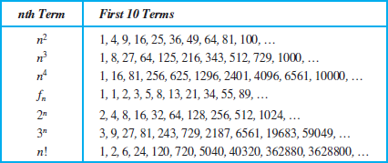

# Sequences and Summations
**Sets** are <b><u>unordered</u></b> collection of elements $S=\{a, b,\cdots\}$\
**Sequences** are <b><u>ordered</u></b> lists of elements

```{prf:definition} **Sequences**
A **Sequence** is a function from a subset of the set of integers\
We use notation $a_n$ to denote the image of the integer $n$\
We call $a_n$ a **term** of the sequence

{bdg-success}`Formal Definition`

Let $S \subseteq \mathbb{Z}$ and suppose $S$ has a least element\
A sequence of numbers is the range of a function\
$f: S \rightarrow\text{ some number set}$ 
```


$S$ is usually taken to be a set of the form $\{k, k+1, k+2, \cdots\} \subseteq \mathbb{Z}$

Here $k\text{ = initial index (usually 0,1 )}$  

The *set of numbers* is most often $\mathbb{R}=\text{ real numbers}$

a sequence then is $range(f)=\{f(k), f(k+1), f(k+2), \cdots\}$

We usually wite $a_{x}=f(n)$ for $n \geqslant k$ and $range(f)=\left\{a_{k}, a_{k+1}, \cdots, a_{n}, \cdots\right\}=\left\{a_{n}\right\}_{n=k}^{N}$ $a_{n}$ is called the **general term**

$(N \in Z$ or $N=+\infty)$ general term 

### $S=\text{ index set}$

If $S$ is a *finite subset* of $\mathbb{Z}$, then the sequence $range(f)$ is a *finite sequence*\
If $S$ is an *infinite subset* of $\mathbb{Z}$, then the resulting sequence is is an *infinite sequence*

There are some special sequences that often arise...

#### Geometric Progression

Here $S=\{0,1,2, \cdots\}=\mathbb{Z}^{+} \cup\{0\}$\
and $ f(n)=a_{n}=a r^{n}\quad where\quad a,r\in\mathbb{R}$

The sequence is

$$
\left\{a_{n}\right\}_{n=0}^{+\infty}=\left\{a, a \cdot r, a \cdot r^{2}, a \cdot r^{3}, a \cdot r^{4}, \cdots, a \cdot r^{n}, \cdots\right\}
$$

$a$ is called the **initial term** and $r$ is called the **common ratio**
````{prf:definition} **Geometric Progression**
This is a sequence of the form 
$ a, ar, ar^2, \cdots , ar^n, \cdots $
```{prf:remark} Analogue to exponential functions
A geometric progression is a discrete analogue of the exponential function $f(x)=ar^x$
```
````
##### Geometric Series (Finite)

$$
G_{n}&=a+a r+\cdots+a r^{n}\\
&=\sum_{k=0}^{n} a r^{k}= \begin{cases}\displaystyle{\frac{a\left(r^{n+1}-1\right)}{r-1}} &, r \neq 1 \\  (n+1)a &, r=1\end{cases}
$$

Poof Case i) $r=1$.

$$
\begin{aligned}
G_{n}=\sum_{k=0}^{n} a(1)^{k}=\sum_{k=0}^{n} a(1)=a \sum_{k=0}^{n}(1) & =a(\underbrace{1+1+\cdots+1}_{n+1} \text { terms } \\
& =a(n+1) .
\end{aligned}
$$

Case ii) $r \neq 1$

$$
\begin{aligned}
& G_{n}=a+a r+a r^{2}+\cdots+a r^{n} \\
& r G_{n}=a r+a r^{2}+\cdots+a r^{n}+a r^{n+1} \\
& \therefore r G_{n}-G_{n}=(r-1) G_{n}=a r^{n+1}-a=a\left(r^{n+1}-1\right) \text {. } \\
& \text { thus } G_{n}=\frac{a\left(r^{n+1}-1\right)}{r-1}
\end{aligned}
$$

````{prf:Theorem} Geometric Sequences in General
If $a$ and $r$ are real numbers and $r\ne 0$, then

$$
\displaystyle\sum^n_{j=0}ar^j = \begin{cases}
  \displaystyle\frac{ar^{n+1}-a}{r-1}\quad &if\quad r\ne 1\\
  \displaystyle(n+1)a\quad &if\quad r= 1\\
\end{cases}
$$

````
{bdg-secondary}`proof`

$$
Let\qquad S_n&=\sum^n_{j=m}ar^j\\
$$

To compute $S$, first multiply both sides of the equality by $r$ and then manipulate the resulting sum as follows:

$$
rS_n&=r\sum^n_{j=0}ar^j\qquad\textcolor{hotpink}{\textrm{multiply both sides by $r$}}\\
&=\sum^n_{j=0}ar^{j+1}\qquad\textcolor{hotpink}{\textrm{by the distributive property}}\\
&=\sum^{n+1}_{k=1}ar^{k}\qquad\textcolor{hotpink}{\textrm{Shifting the index by $k=j+1$}}\\
&=ar^1 + ar^2 + ar^3 + , \cdots , ar^n + ar^{n+1}\\
&=\left(\sum^{n+1}_{k=1}ar^{k}\right)+(ar^{n+1}-a)\qquad\textcolor{hotpink}{\textrm{Isolate $n+1$ term but add $k=0$ term}}\\
&=S_n+(ar^{n+1}-a)\qquad\textcolor{hotpink}{\textrm{Substitute back S for the summation formula}}\\
$$

We see thus that $rS_n = S_n + (ar^{n+1}-a)$ so solving for $S_n$ if $r\ne 1$, then\
$\displaystyle S_n = \frac{ar^{n+1} - a}{r - 1}$

For $r=1$ then the $S_n=\sum^n_{j=0}ar^j=\sum_{j=0}^na$

#### Arithmetic Progression

Here $S=\{0,1,2, \ldots\}=\mathbb{Z}^+ \cup\{0\}$\
and $ f(n)=a+n \cdot d $
where $a, d \in \mathbb{R}$\
the sequence is

$$
\left\{a_{n}\right\}_{n=0}^{+\infty}=\{a, a+d, a+2 d, \cdots, a+n d, \cdots\}
$$

a is called the **initial term** and $d$ is called the **common difference**

````{prf:definition} **Arithmetic Progression**
This is a sequence of the form 
$ a, a + d, a + 2d, \cdots , a + nd, \cdots$\
where the *initial term* $a$ and the *common difference* $d$ are *real numbers*
```{prf:remark} Analogue to linear functions
A arithmetic progression is a discrete analogue of the linear function $f(x)=dx + a$
```
````

Sequences of the form $a_1, a_2, ... , a_n$ are often used in computer science where these finite sequences are called **strings** denoted by $a_1 a_2 ...  a_n$ The *length* of a string is the number of terms in this string the *empty string* is denoted by $\lambda$ which of course has no terms and hence has length zero

$$
A_{n}=\sum_{k=0}^{n}(a+d k)=\frac{(n+1)(2 a+n d)}{2}
$$

Poof

$$
\begin{aligned}
A_{n} & =\sum_{k=0}^{n}(a+d k)=\sum_{k=0}^{n} a+\sum_{k=0}^{n} d k \\
& =a \sum_{k=0}^{n} i+d \sum_{k=1}^{n} k \\
& =(n+1) a+d\left(\sum_{k=1}^{n} k\right)
\end{aligned}
$$

Fact

$$
\sum_{k=1}^{n} k=1+2+\cdots+n=\frac{n(n+1)}{2}
$$

Thus

$$
\begin{aligned}
A_{n} & =(n+1) a+d \frac{n(n+1)}{2} \\
& =\frac{(n+1)(2 a+n d)}{2}
\end{aligned}
$$

#### Harmonic Progression

Here $S=\{1, 2, \cdots\}=\mathbb{Z}^+$ and $f(n)=\frac{1}{n}$\
The sequence is

$$
\left\{a_{n}\right\}_{n=1}^{\infty}=\left\{1, \frac{1}{2}, \frac{1}{3}, \cdots, \frac{1}{n}, \cdots\right\}
$$

```{prf:example} **Harmonic Set**
Consider the sequence $a_n$, where $a_n=1/n$\
The list of the of this sequence, beginning with $a_1$, namely\
$a_1, a_2, a_3, a_4,\cdots,$

$$
1,\frac{1}{2},\frac{1}{3},\frac{1}{4},\cdots,
$$
```

#### Recurrence Relation
Before we specified sequences by providing explicit formulas for their terms\
*but there are other ways to specify a sequence*

````{prf:definition} **Recurrence Relation**
A **recurrence relation** for the sequence $\Set{a+n}$ is an equation that expresses $a_n$ in terms of one or more of the previous terms of the sequences, namely for all integers $n\ge n_0$ where $n_0$ is a nonnegative integer.
> A sequence is called a **solution** of a recurrence relation if its terms satisfy the recurrence relation
````
#### Some useful Sequences 



## Summations
$a_m,a_(m+1),\cdots ,a_n$, from the sequence $\Set{a_n}$

We use the notation

$$
\displaystyle\sum^n_{j=m}a_j = \textstyle\sum^n_{j=m}a_j = \displaystyle\sum^n_{m\ \le j\ \le\ n}a_j
$$

reads as the $\textit{sum from j = m to j = n of }a_j$

Variable $j$ is called the **index of summation** or **dummy index** you can define it as any variable as below shows

$$
\sum^n_{j=m}a_j = \sum^n_{i=m}a_i = \sum^n_{k=m}a_k
$$

Variable $m$ is called the **lower limit** or the **initial index**\
Variable $n$ is called the **upper limit** or **terminal index**


(summation-formulae)=
### Some Useful Summation Formulae

Sum | Closed Form
--- | :---:
$\displaystyle{\sum^n_{k=0}ar^k\ (r\ne 0)}$ {ref}`proof<proof:special-finite-sum-1>` | $\displaystyle{\frac{ar_{n+1}-a}{r-1}}$
$\displaystyle{\sum^n_{k=1}k}$ | $\displaystyle{\frac{n(n+1)}{2}}$
$\displaystyle{\sum^n_{k=2}k^2}$ | $\displaystyle{\frac{n(n+1)(2n+1)}{6}}$
$\displaystyle{\sum^n_{k=2}k^3}$ | $\displaystyle{\frac{n^2(n+1)^2}{4}}$
$\displaystyle{\sum^\infty_{k=0}x^k, \mid x\mid \lt 1}$ | $\displaystyle{\frac{1}{1-x}}$
$\displaystyle{\sum^\infty_{k=1}x^k, \mid x\mid \lt 1}$ | $\displaystyle{\frac{1}{(1-x)^2}}$

### Double Sums
Sometimes we want to sum a matrix of numbers\
To do this we use a **double sum**

$$
\begin{pmatrix}
   a_{11} &a_{12} &\cdots& &a_{1n} \\
   \vdots &\vdots &\cdots& &\vdots \\
   a_{n1} &a_{n2} &\cdots& &a_{nn} \\
\end{pmatrix}\\
\newline
\sum^n_{k,l=1}a_{kl}\quad =\quad \sum^n_{k=1}\sum^n_{l=1}a_{kl}
\newline
\newline
\color{violet}{\text{So first sum all $l$ terms then sum all $k$ terms}}\\
\begin{aligned}
& \text { Ex } \quad \sum_{k=1}^3 \sum_{l=2}^4(k+1) l^2 \\
&=\sum_{k=1}^3\{(k+1) 4+(k+1) 9+(k+1) 16\} \\
&=\sum_{k=1}^3 29(k+1)=29\left(\sum_{k=1}^3(k+1)\right) \\
&=29[2+3+4]=29 \times 9=261
\end{aligned}
$$

```{note}
Sometimes we don't explicitly state s or sometimes $S$ is a *contiguous* set of integers, for example $S=\set{1,3,27,413,999,10^6,10^25}$\
**We can still us summation**

$$
\displaystyle\sum_{k\in S}a_k\quad or\quad \sum_{k\in S}f(k)
$$
```

### Special Finite Arithmetic Sequence

(1) $\displaystyle\sum_{k=1}^{n} k=\frac{n(n+1)}{2}=1+2+\cdots+n$

#### Proof: $\sum_{k=0}^{n}(a+dk)$ 
````{prf:theorem} Finite Arithmetic Sequences in General 

$$
A_n = \sum^n_{k=1}(a+dk) = \frac{(n+1)(2a+nd)}{2}
$$

----------
{bdg-secondary}`Proof`

$$
A_n &=\sum^n_{k=1}(a+dk)\\ 
&=\sum^n_{k=1}a + \sum^n_{k=1}dk\\
&=a\sum^n_{k=1}1 + d\sum^n_{k=1}k\\
&=(n+1)a + d\sum^n_{k=1}k\\
&=(n+1)a + d\left(\frac{2(n+1)}{2}\right)\\
&=\frac{(n+1)(2a+nd)}{2}
$$

```{note}
We will prove $\displaystyle \sum^n_{k=1}k = 1+2+3+\cdots+n = \frac{2(n+1)}{2}$ later 
```
````

(proof:special-finite-sum-1)=
#### Proof: $\sum_{k=1}^{n}k$ 
This is a **Arithmetic Sequence**

$$
S=\text{Let }\sum^n_{k=1} &= 1+2+3+\cdots+(n-1)+n\\
\text{(backwards) }S &= n + (n-1) + (n-2) + \cdots + 2 + 1\\
\newline
\therefore \quad 2 S &=(n+1)+(n+1)+\cdots+(n+1)(n \text { terms }) \\
& =n(n+1) \\
\newline
\therefore\ \quad S &=\frac{n(n+1)}{2}
$$

(2) $\displaystyle\sum_{k=1}^{n} k^{2}=\frac{n(n+1)(2 n+1)}{6}=1+4+9+\cdots+n^{2}$

(3) $\displaystyle\sum_{k=1}^{n} k^{3}=\left[\frac{n(n+1)}{2}\right]^{2}=1+8+27+\cdots+n^{3}$

{bdg-danger}`Later` We will prove (2) & (3) using *principle of mathematical induction*

## Infinite Series

Infinite series are important in many branches of mathematics, especially **mathematical analysis**

An infinite series is a *summation* of an infinite number of terms

Actually the sum of an infinite number of terms is not defined

However we can talk about these infinite sums in the context of wether or not they *converge* to a sum by looking at the **sequence of partial sums**

Let $\left\{a_{n}\right\}_{n=0}^{+\infty}$ be an infinite sequence of real numbers.

Let $\left\{S_{n}\right\}_{n=0}^{+\infty}$ be the sequence of partial sums of $\left\{a_{n}\right\}_{n=0}^{+\infty}$,

$$
s_{n}=\sum_{k=0}^{n} a_{k}=a_{0}+a_{1}+\cdots+a_{n}
$$

Before we go any further we must talk about the **limit of a sequence**

Let $\left\{S_{n}\right\}_{n=0}^{+\infty}$ be a sequence of real numbers (infinite).

We say $\left\{S_{n}\right\}_{n=0}^{+\infty}$ converges to $L$

or

$$
\begin{aligned}
& \displaystyle\lim _{n \rightarrow+\infty} S_{n}=L \quad \text { iff }\\
\newline
& \forall \varepsilon>0,\quad\exists N(\varepsilon) \in \mathbb{Z}^{+} \text { such that}\\
& \left|S_{n}-L\right|<\varepsilon,\quad \forall n \geqslant N
\end{aligned}
$$

What this means is that the larger that $n$ gets the chosen $s_{n}$ gets to $L$\
and we say that $S_{n} \rightarrow L$ as $x \rightarrow+\infty$

If there is no number $L$ such that $S_{x} \rightarrow L$ as $n \rightarrow+\infty$ we say that the sequence $\left\{S_{n}\right\}_{n=0}^{+\infty}$ diverges


$(12)$

Two important limits

(1) $\displaystyle\lim _{n \rightarrow+\infty} x^{n}=0$ if $|x|<1$

(2) $\displaystyle\lim _{n \rightarrow+\infty} \frac{1}{n}=0$

We have already discussed (2) before with the calculator if n becomes large enough the answer converges to 0

We prove (1) using **Bernoulli's inequality**

$$
\begin{gathered}
1+nh  \leqslant(1+h)^{n},\quad \forall n=0,1,2, \ldots,\quad h>-1
\end{gathered}
$$

We will see a proof of this inequality later by *proof by mathematical induction*

$\displaystyle\lim _{n \rightarrow+\infty} \frac{1}{n}=0$ if $|x|<1$\
**Proof by Cases**

case (i) $0<x<1$.

Write $x=\displaystyle\frac{1}{1+h}, h>0$

then $x^{n}=\displaystyle\frac{1}{(1+h)^{n}} \leqslant \frac{1}{1+x h} \quad \begin{array}{ll} & \rightarrow \frac{1}{a}>\frac{1}{b}\end{array}$

$$
<\frac{1}{n h}
$$

Thus $\left|x^{n}-0\right|=\left|x^{n}\right|=\frac{1}{(1+h)^{n}}<\frac{1}{n h}<\varepsilon$ if $n h>\frac{1}{\varepsilon}$, ie $x>\frac{1}{h \varepsilon}$ oR $x \geqslant\left\lceil\frac{1}{h \varepsilon}\right\rceil$ (13)

for any $\varepsilon>0$.

Thus $\forall \varepsilon>0, \quad x^{x} \mid<\varepsilon \quad$ whenever

$$
n \geqslant\left\lceil\frac{1}{n \varepsilon}\right\rceil \quad, x=\frac{1}{1+h}
$$

case (ii) $x=0, x^{n}=0 \rightarrow 0$ as $x \rightarrow+\infty$

case (iii) $-1<x<0$

then $0<-x<1$

and $-x=\frac{1}{1+h}, h>0$

so

$\left|x^{n}-0\right|=\left|x^{x}\right|=\frac{1}{(1+h)^{n}}<\frac{1}{x h}$ as before

Exevise Show $(1)$ is really "if" by showing $|x| \geqslant 1 \Rightarrow \lim _{n \rightarrow+\infty} x^{n} \neq 0$

Returning to infinite series,

We say $\sum_{n=0}^{+\infty} a_{n}$ converges to $L$

and wite $\sum_{n=0}^{+\infty} a_{n}=L$ if

$$
\lim _{n \rightarrow+\infty} S_{n}=\lim _{n \rightarrow+\infty}\left(\sum_{k=0}^{n} a_{k}\right)=L
$$

(14)

Thus an infinite series converges the sequence of partial sums converges to a limit.

If $\sum_{n=0}^{+\infty} a_{n}$ is not convergent,

ie, $\lim _{n \rightarrow+\infty} S_{n}$ does not exist,

we say $\sum_{n=0}^{+\infty} a_{n}$ is divergent.

### The Infinite Geometric Series

$$
\sum_{k=0}^{+\infty} a r^{k} \quad \text { is convergent if and only if }|r|<1
$$

Since $G_{n}=\displaystyle\sum_{k=0}^{n} a r^{k}=\frac{a\left(r^{n+1}-1\right)}{r-1}$

If $|r|<1$, then $\displaystyle\lim _{n \rightarrow+\infty} G_{n}=\lim _{n \rightarrow+\infty} \frac{a\left(r^{n+1}-1\right)}{r-1}$

$$
\begin{aligned}
& =\frac{a(0-1)}{r-1} \\
& =\frac{a}{1-r}
\end{aligned}
$$

Thus for $\displaystyle|r|<1, \sum_{k=0}^{+\infty} a r^{k}=\frac{a}{1-r}$

#### Exercise: $ 0.999 \cdots=1 $

**Exercise** use this result to show $ 0.999 \cdots=1 $

$$
\begin{aligned}
0.9999 \cdots = \frac{9}{10} + \frac{9}{100} + \cdots & =\sum_{k=1}^{\infty} \frac{9}{10^{k}} \\
& =9\left(\sum_{k=1}^{\infty}\left(\frac{1}{10}\right)^{k}\right) \\
& =9\left(\frac{1}{10}+\frac{1}{10^{2}}+\cdots+\frac{1}{10^{n}}+\frac{1}{10^{n+1}}+\cdots\right) \\
& =\frac{9}{10}\left(1+\frac{1}{10}+\frac{1}{10^{2}}+\cdots\right) \\
& =\frac{9}{10} \sum_{k=0}^{\infty}\left(\frac{1}{10}\right)^{k}=\frac{9}{10} \frac{1}{1-\frac{1}{10}} \\
& =\frac{9}{10} \cdot \frac{1}{\left(\frac{9}{10}\right)}=1
\end{aligned}
$$


We have shown only the "If" part of own statement.

To prove the "*only if*" part, we note

for $r=1, G_{n}=a(x+1) \rightarrow+\infty$ as $n \rightarrow+\infty$

so $\left\{G_{n}\right\}_{n=0}^{+\infty}$ does not have a limit (it diverges to $+\infty$ ) and $\sum_{k=0}^{+\infty} a(1)^{k}$ is divergent,

If $|r|>1$, one can show that $\lim _{n \rightarrow+\infty}\left(r^{n+1}\right)$ does not exist since if $r>1$, these terms get larger and larger positively, while if $r<-1, r^{n+1}$ gets larger and larger in absolute value and it switches from positive to negative and so cant have a limit 

EXERCISE: What happens when $r=-1$?

## Principle of Mathematical Induction

Consider a formal sequence of propositional functions $\{P(n)\}_{n=1}^{+\infty}$.

We want to be able to prove that the proposition $\forall n P(n)$ is True where the universe of discourse for the universal quantifier, $\forall$, is $\mathbb{Z}^{+}$.

As some examples of such a proposition we have the 3 summation formulae from before,

$$\sum_{k=1}^{n} k=\frac{n(n+1)}{2}, \forall n+\mathbb{Z}^{+}$$(induction-1)

$$\sum_{k=1}^{n} k^{2}=\frac{n(n+1)(2 n+1)}{6}, \forall n \in \mathbb{Z}^{+}$$(induction-2)

$$\sum_{k=1}^{n} k^{3}=\left[\frac{n(n+1)}{2}\right]^{2}, \forall n \in \mathbb{Z}^{+}$$(induction-3)

We prove such universally quantified propositions using the *principle of mathematical induction*

### Steps

*principle of mathematical induction* has 2 steps.

**Step 1** Basis step; prove $P(1)$ is true.

**Step 2** Inductive step; prove that the proposition\
$ \forall k(P(k) \rightarrow P(k+1)) \quad(k \geq 1)$ is true

We will prove the validity of PMI. later

>For now consider some examples. At the same time we will be proving useful and important results

#### Prove statement 1
**Exercise** Prove statement {eq}`induction-1` above. $\left[\begin{array}{c}\text { Note, we already gave a direct proof } \\ \text { by showing } P(n) \text { is } T \text {, for all } n\end{array}\right]$

Let $P(n)$ be the statement

$$
\sum_{k=1}^{n} k=\frac{n(n+1)}{2}=f(n)
$$

##### Basis Step 
$\displaystyle P(1): \sum_{k=1}^{1} k=1, f(1)=\frac{1(1+1)}{2}=1$

$\therefore P(1)$ is true

##### Inductive step
assume $P_{k}(k)$ is tue, $k \in \mathbb{Z}^{+}(k \geqslant 1)$

That is $\displaystyle\sum_{l=1}^{k} l=\frac{k(k+1)}{2}=f(k)$.

We show now that $P(k+1)$ is true,

ie, $\displaystyle\sum_{k=1}^{k+1} l=f(k+1) =\frac{(k+1)(k+2)}{2}$

But $ $

$$
\begin{aligned}
\sum_{l=1}^{k+1} l&=\sum_{\ell=1}^{k} l+(k+1) \\
& =\frac{k\cdot (k+1)}{2}+(k+1), \text { by hypothesis. } \\
& =(k+1)\left(\frac{k}{2}+1\right) \\
& =\frac{(k+1)(k+2)}{2}=f(k+1)
\end{aligned}
$$

Thus $P(k) \rightarrow P(k+1), \forall k \in \mathbb{Z}^{+}$

Hence by $\displaystyle P M I, \sum_{k=1}^{n} k=\frac{n(n+1)}{2}, \forall n \in \mathbb{Z}^{+}$

#### Prove Statement 2

Prove {eq}`induction-2` above: $\displaystyle\sum_{k=1}^{n} k^{2}=\frac{n(n+1)(2 n+1)}{6}, \forall n \in \mathbb{Z}$ $=f(x)$

##### Basis Step

$$
n=1 . \quad \sum_{k=1} k^{2}=1 ; f(1)=\frac{1(2)(3)}{6}=1
$$

Thus $P(1)$ is true

##### Inductive Step

Assume $P(k)$ is true, $k \in \mathbb{Z}^{+}(k \geqslant 1)$

$$
\begin{aligned}
Then\quad\sum_{l=1}^{k+1} l^{2}&=\sum_{l=1}^{k} l^{2}+(k+1)^{2}\\
\newline
& =\frac{k(k+1)(2k+1)}{6}+(k+1)^{2} \text {, by hypothesis} \\
\newline
& =(k+1)\left[\frac{k(2 k+1)}{6}+k+1\right] \\
\newline
& =(k+1)\left[\frac{2k^{2}+k+6(k+1)}{6}\right] \\
\newline
& =(k+1)\left[\frac{2k^{2}+7k+6}{6}\right] \\
\newline
& =\frac{(k+1)}{6}\left[2k^{2}+4k + 3k+6\right] \\
\newline
& =\frac{(k+1)}{6}[2 k(k+2)+3(k+2)] \\
\newline
& =\frac{(k+1)(k+2)(2k+3)}{6}=f(k+1)
\end{aligned}
$$

Thus $\forall k \in \mathbb{Z}^{+},\quad P(k) \rightarrow P(k+1)$ is true\
and by the *principle of mathematical induction*\
$P(n)$ is true, $\forall n+\mathbb{Z}^{+}$
### Common Errors

```{note}
1) A common error in proofs using *principle of mathematical induction* that lead to an invalid conclusion occurs in the inductive step when we prove $P(k) \rightarrow P(k+1)$ is true for $k=2,3,4, \ldots$, and **<u>not</u>** for $k=1$. Then there is no connection between the basis step and the inductive step. This will occur when we have to assume $k>1$ in a order to prove $P(k) \rightarrow P(k+1)$ If $P(2)$ is false, then we cant conclude $\forall n P(n)$

2) We may use $P M I$ to prove $\forall n \geqslant n_{0}, P(n)$ is true where $n_{0}>1$ by changing the basis step to $P\left(n_{0}\right)$ is True, and the inductive step to $\forall k \geqslant n_{0}, P(k) \rightarrow P(k+1)$
```

### The Harmonic Progression
Recall the Harmonic Progression  $\left\{a_{n}\right\}_{n=1}^{\infty}$ where $a_{n}=\frac{1}{n}$.

Even though,

$$
\lim _{n \rightarrow+\infty} a_{n}=\lim _{n \rightarrow+\infty} \frac{1}{n}=0 \text {, }
$$

the Harmonic series $\displaystyle\sum_{n=1}^{+\infty} \frac{1}{n}=1+\frac{1}{2}+\frac{1}{3}+\cdots+\frac{1}{n}+\cdots$ is divergent\
*The smaller and smaller bit added infinitely often add up to $+\infty$ !*

We will use the *principle of mathematical induction* to help prove this fact 

````{prf:lemma}
Lemma Let $H_{n}=\sum_{k=1}^{n} \frac{1}{k}$.

Then $H_{2^n} \geqslant 1+\frac{n}{2}=f(x), \forall n \in \mathbb{Z}^{+}$
````

{bdg-secondary}`Proof`

#### Basis step

$$
\begin{aligned}
& n=1 \\
& H_{2^{1}}=1+\frac{1}{2}=f(1) \quad \therefore H_{2^1} \geqslant f(1)
\end{aligned}
$$

#### Inductive Step

assume $H_{2^{k}} \geqslant 1+\frac{k}{2}, \forall k \in \mathbb{Z}^{+}$

Then

$$
\begin{aligned}
H_{2^{k+1}} & =\sum_{k=1}^{2^{k+1}} \frac{1}{k}=\sum_{r=1}^{2^{k}} \frac{1}{r}+\sum_{k=2^{k}+1}^{2^{k+1}} \frac{1}{r} \\
& \geqslant 1+\frac{k}{2}+\frac{1}{2^{k}+1}+\frac{1}{2^{k}+2}+\cdots+\frac{1}{2^{k+1}} \\
& =1+\frac{k}{2}+\frac{1}{2^{k}+1}+\frac{1}{2^{k}+2}+\cdots+\frac{1}{2^{k}+2^{k}}
\end{aligned}
$$

$$
\begin{aligned}
& \geqslant 1+\frac{k}{2}+\left\{\frac{1}{2^{k}+2^{k}}+\cdots+\frac{2^{k} \text { terms }}{2^{k}+2^{k}}\right\} \quad\left(\begin{array}{l}
\text { make the } \\
\text { bottom bigger } \\
\text { fraction get } \\
\text { smaller }
\end{array}\right) \\
& =1+\frac{k}{2}+2^{k} \cdot \frac{1}{2^{k+1}}=1+\frac{k}{2}+\frac{1}{2}=1+\frac{k+1}{2}=f(k+1)
\end{aligned}
$$


Thus by P,M.1. $H_{2} n \geqslant 1+\frac{n}{2}, \forall n \in \mathbb{Z}^{+}$

Now the sequence

$\left\{H_{n}\right\}_{n=1}^{\infty}$ is an "increasing" sequence

because $H_{n+1}=H_{n}+\frac{1}{n+1}>H_{n}$.

Also the subsequence

$\left\{H_{2^{n}}\right\}_{x=1}^{\infty}$ clearly, in view of

the lemma, has

$$
\lim _{x \rightarrow+\infty} H_{2 x}=+\infty
$$

These two facts allow us to assent that

$$
\lim _{n \rightarrow+\infty} H_{n}=+\infty \text { and the }
$$

hamonic series is divergent

Exerciser) Use PMI to prove that $3 / 2^{2 n}-1, \forall x \in \mathbb{Z}^{+}$

1) Prove summation formula (3)


P351 \#32 $3 \mid n^{3}+2 n \quad \forall n \geqslant 1$

23

$P(n): 3 \mid n^{3}+2 n \quad$ R.T.P. $\quad \forall n \geqslant 1 P(n)$ is the

1) Basis step

Let $n=1, n^{3}+2 n=1+2=3+3 / 3$

$\therefore P(1)$ is true

2) Inductive Step

want to show

$\forall k \geqslant 1 \quad P(k) \rightarrow P(k+1) \quad$ is tue

Assume $31 k^{3}+2 k$ ie assume $P(k)$ is the

Then $\left(k^{0}+1\right)^{3}+2(k+1)=k^{3}+3 k^{2}+3 k+1$

$$
\begin{aligned}
= & k^{3}+2 k+3 k+2 \\
= & \frac{k^{3}+2 k}{\text { divisible }_{\text {by }}}+\frac{3\left(k^{2}+k+1\right)}{\text { divisible by } 3}
\end{aligned}
$$

by hypothein

$\therefore P(k+1)$ is tue

- <compat>PMI gris the result.