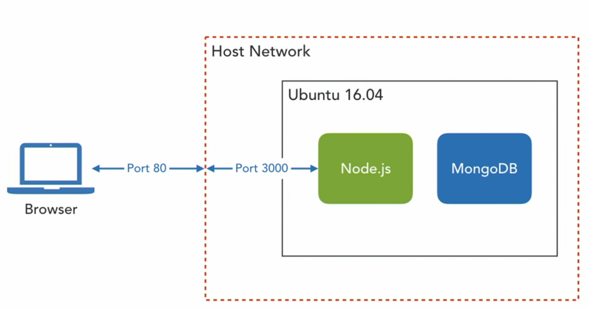
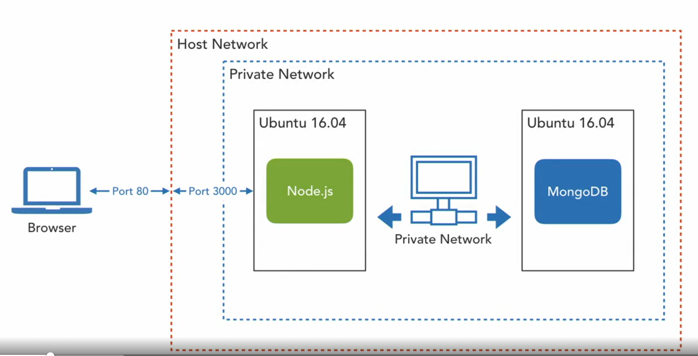

# Vagrant

> Need VirtualBox and Vagrant at the same time

`vagrant -v` test that vagrant is installed

**Features** Vagrant supports 
- *SSH connections* to connect to a running vagrant vm using the ssh protocol
- *folder synchronization* between your system or the host and a vagrant vm
- various networking options
- multiple hypervisor providers - providers are plugins that provide various services
- provisioners for initial setup -- which run during the first time vm is setup setting configuration and the such

## Components of Vagrant

### Command-Line Interface
Interface with Vagrant
### Vagrant Files
*[vm]:virtual machine
Configure Vagrant vm 

A single vagrant file could set up multiple vm 
### Vagrant Cloud


## Run your first box

A box is a general shorthand for a Vagrant vm
This is basically a compressed file that contains all the files needed to start a Vagrant vm

```fsh
Notes/vagrant on  main [!?] via 🐍 v3.10.8 (.venv) 
❯ vagrant init bento/ubuntu-16.04                                                                                               (base) 
A `Vagrantfile` has been placed in this directory. You are now
ready to `vagrant up` your first virtual environment! Please read
the comments in the Vagrantfile as well as documentation on
`vagrantup.com` for more information on using Vagrant.
```

Now we have a vagrant file in this directory

```vagrant
Notes/vagrant on  main [!?] via 🐍 v3.10.8 (.venv) via ⍱ v2.4.6 
❯ vagrant up                                                                                                                    (base) 
Bringing machine 'default' up with 'virtualbox' provider...
==> default: Box 'bento/ubuntu-16.04' could not be found. Attempting to find and install...
    default: Box Provider: virtualbox
    default: Box Version: >= 0
==> default: Loading metadata for box 'bento/ubuntu-16.04'
    default: URL: https://vagrantcloud.com/api/v2/vagrant/bento/ubuntu-16.04
==> default: Adding box 'bento/ubuntu-16.04' (v202212.11.0) for provider: virtualbox
    default: Downloading: https://vagrantcloud.com/bento/boxes/ubuntu-16.04/versions/202212.11.0/providers/virtualbox/unknown/vagrant.box
==> default: Successfully added box 'bento/ubuntu-16.04' (v202212.11.0) for 'virtualbox'!
==> default: Importing base box 'bento/ubuntu-16.04'...
==> default: Matching MAC address for NAT networking...
==> default: Checking if box 'bento/ubuntu-16.04' version '202212.11.0' is up to date...
==> default: Setting the name of the VM: vagrant_default_1749795709052_67810
==> default: Pruning invalid NFS exports. Administrator privileges will be required...
[sudo] password for dubi:             
==> default: Clearing any previously set network interfaces...
==> default: Preparing network interfaces based on configuration...
    default: Adapter 1: nat
==> default: Forwarding ports...
    default: 22 (guest) => 2222 (host) (adapter 1)
==> default: Booting VM...
==> default: Waiting for machine to boot. This may take a few minutes...
    default: SSH address: 127.0.0.1:2222
    default: SSH username: vagrant
    default: SSH auth method: private key
     default: 
    default: Vagrant insecure key detected. Vagrant will automatically replace
    default: this with a newly generated keypair for better security.
    default: 
    default: Inserting generated public key within guest...
    default: Removing insecure key from the guest if it's present...
    default: Key inserted! Disconnecting and reconnecting using new SSH key...
==> default: Machine booted and ready!
==> default: Checking for guest additions in VM...
    default: The guest additions on this VM do not match the installed version of
    default: VirtualBox! In most cases this is fine, but in rare cases it can
    default: prevent things such as shared folders from working properly. If you see
    default: shared folder errors, please make sure the guest additions within the
    default: virtual machine match the version of VirtualBox you have installed on
    default: your host and reload your VM.
    default: 
    default: Guest Additions Version: 6.1.40
    default: VirtualBox Version: 7.1
==> default: Mounting shared folders...
    default: /home/dubi/projects/Notes/vagrant => /vagrant
```

So we just with `vagrant init` and `vagrant up` we can run a Vagrant vm

The `vagrant up` command executes several steps

1. Set the name of the box *we set the name to **bento/ubuntu-16.04*** in the initial `vagrant init` command
   - **bento** is the organization name  
   - **ubuntu-16.04** is the Linux distribution and version that this uses
2. If this is the first time we use this Vagrant file than it would download the vm or box from Vagrant cloud, otherwise it would load everything from cache

## Running Boxes
### Box Status
We now have a box running, but you'll notice that this VM doesn't have its own window. It's running in **headless mode**, which means that it's running in the *background with no visible user interface*

> How can we check on the status of our virtual machine? 
> Execute the following command in your my first box Vagrant environment directory `Vagrant status` 

```bash
Notes/vagrant on  main [!?] via 🐍 v3.10.8 (.venv) via ⍱ v2.4.6 took 1m12s 
❯  vagrant status
Current machine states:

default                   running (virtualbox)

The VM is running. To stop this VM, you can run `vagrant halt` to
shut it down forcefully, or you can run `vagrant suspend` to simply
suspend the virtual machine. In either case, to restart it again,
simply run `vagrant up`.
```

The results of this command will display the current state of the Vagrant VM
We see that the current state is **running** 

To see the Vagrant boxes running from any directory use `vagrant global-status`

```
❯ vagrant global-status

id       name    provider   state   directory                           
------------------------------------------------------------------------
660e17c  default virtualbox running /home/dubi/projects/lighthouse      
c10369a  default virtualbox running /home/dubi/projects/Notes/vagrant   
 
The above shows information about all known Vagrant environments
on this machine. This data is cached and may not be completely
up-to-date (use "vagrant global-status --prune" to prune invalid
entries). To interact with any of the machines, you can go to that
directory and run Vagrant, or you can use the ID directly with
Vagrant commands from any directory. For example:
"vagrant destroy 1a2b3c4d"
```
This works well for a single Vagrant VM but someday you'll want to have several running on your system. 

Vagrant `global-status` This command can be executed from any directory and will list the status of all Vagrant VMs on your machine

You can also execute commands on any one of the Vagrant virtual machines on your machine <u>using its ID</u> rather than having to change to its environment directory 

`vagrant halt c10369a` This is the ID that was returned to us from the global status command that we ran previously. The halt command shuts down a Vagrant virtual machine. Using the ID, we can execute commands on any VM in the system without first having to change to its environment directory. 

```
❯ vagrant halt c10369a
==> default: Attempting graceful shutdown of VM...
```
> Halt command attempt to gracefully shutdown a machine 

### Connect to a Box 

The common method for connecting remotely to a LInux operating system is SSH which stands for Secure Socket Shell

Its a terminal interface that allows us to execute Linux commands in a remote CML environment

SSH uses cryptographic keys for authentication 

You can connect to a box using the SSH protocol

```
Notes/vagrant on  main [!?] via 🐍 v3.10.8 (.venv) via ⍱ v2.4.6 
❯ vagrant ssh
Welcome to Ubuntu 16.04.7 LTS (GNU/Linux 4.4.0-210-generic x86_64)

 * Documentation:  https://help.ubuntu.com
 * Management:     https://landscape.canonical.com
 * Support:        https://ubuntu.com/advantage


This system is built by the Bento project by Chef Software
More information can be found at https://github.com/chef/bento
```

Now you can interact with Ubuntu box from the CLI when your done to disconnect use `exit`

### Halting and Destroying Boxes

`vagrant halt` send a shutdown signal to the box, box will try to gracefully shutdown
&dash; you can always rerun the box with `vagrant up`

However, let's suppose you want to start over in your environment. 
You've made changes to the box that you want to discard, a
nd start from the initial state of the box as it was the first time you booted it. 

`vagrant destroy` This command will delete all of the resources associated with your box in this environment, but it will leave the Vagrant file intact. 

You can now run `vagrant up` to restart the box
The bento/ubuntu 16.04 box will be re-imported and started in its initial state

This box and all boxes on Vagrant Cloud are referred to as **base boxes** 
They're intended as *starting points*, including nothing more than a plain, vanilla operating system

> Most Vagrant use cases involve you as the user starting with the base box, 
> then adding software and configuration to create a box fit for a particular purpose

### Vagrant cloud

> Public boxes are stored on <u>Vagrant cloud</u> 
> website: [app.vagrantup.com]([app.vagrantup.com](portal.cloud.hashicorp.com/vagrant/discover))

With a account you can publish your own public boxes

## Vagrant Files

> Vagrant files are simple Ruby programs that configure a vm
> *eg CPU, memory, disk, and network configuration*

  !!! Tip Don't worry
    If you are not a Ruby developer than it is no problem the configuration is mostly one-liners and easy to read
  
  !!! Example  VSCode
    It is recommended to use VScode extensions that help with Vagrant files

## Networking with Vagrant

> Vagrant offers several networking options that allow guest VMs to communicate with the host, each other, and external networks

---

### Basics of Vagrant Networking

- Defined in the `Vagrantfile` using `config.vm.network`
- Vagrant abstracts provider-specific details (e.g., VirtualBox, VMware)
- Networks are configured during `vagrant up` or `vagrant reload`
```ruby
Vagrant.configure("2") do |config|
  config.vm.network "forwarded_port", guest: 80, host: 8080
end
```

### Network Types Overview
| Network Type                    | Description                                | Typical Use Case                  |
| ------------------------------- | ------------------------------------------ | --------------------------------- |
| `forwarded_port`                | Maps Host &rightarrow; Guest Port          | Access guest web serve via host   |
| `private_network` [[host-only]] | Maps VM and host are on an isolated subnet | Testing multi-VM setups securely  |
| `public_network`                | VM acts as a peer on the physical LAN      | Access VM from other LAN machines |

### Port Forwarding

&dash; Default SSH port [[22]] is auto-forwarded *usually to host port* [[2222]]
supports custom ports:
```ruby
config.vm.network "forwarded_port", guest: 3389, host: 33390, protocol: "tcp"
```

useful when you don't want the VM on the local network

### Private or Host-Only Network

Defines a local-only network between VM(s) and host 
requires a stic IP or DHCP:

```ruby
config.vm.network "private_network", ip: "192.168.33.10"
# or DHCP
config.vm.network "private_network", type: "dhcp"
```

enables inter-VM communication 
<b>Use Case</b> Isolated development/testing environments

### Public or Bridged Network

Bridges CM to the host's NIC appears like any other LAN device
Use DHCP or static IP:

```ruby
config.vm.network "public_network"
# or with static IP
config.vm.network "public_network", ip: "192.168.1.17"
```

useful for network-0wide access but exposes VM so <b>ensure security precautions</b>

### Route & Connectivity Tips 

You may need to manually add host routing for private networks *eg on Linux/Mac*

            sudo route add -net 10.11.12.0/24 dev vboxnet0

Check host routing: `netstat -rn` or  `ip route`

### Best Practices &amp; Gotchas
- Avoid overlapping IP ranges on host and VM
- Use high-level network config unless familiar with underliying provider setting 
- Bridged networks rely on DHCP/static allocation router/IP admin may be needed 
- Always secure bridges VMs *not for public exposure by default*

### Example Vagrant file

```ruby
Vagrant.configure("2") do |config|
  config.vm.box = "ubuntu/focal64"

  # SSH & custom forwarding
  config.vm.network "forwarded_port", guest: 80, host: 8080

  # Private network for host-VM access
  config.vm.network "private_network", ip: "192.168.50.4"

  # Public network on LAN (ask on vagrant up)
  config.vm.network "public_network"
end
```

Access http://127.0.0.1:8080 – serves from guest

Ping VM on private IP `192.168.50.4`

Bridged VM will appear on your LAN subnet

## Vagrant Providers 

Allow Vagrant to define a box for a particular hypervisor 
Vagrant includes <i>built-in providers</i> for <b>VirtualBox</b> *by Oracle* and <b>Hyper-V</b> *by Microsoft*
Vagrant includes support for building Docker containers
Providers section of a Vagrantfile is used to set provider-specific configurations

`vmstat -s` to see within the VM how resources are allocated

!!! Tip Run these diagnostic commands inside the vagrant box

### LSCPU

The `lscpu` command in Linux is used to display detailed information about the CPU architecture

**When you run this command, it provides various details such as:**
- **CPU(s)** The number of CPUs (or cores) available
- **Thread(s) per core** The number of threads per core
- **Core(s) per socket** The number of cores per socket
- **Socket(s)** The number of physical CPU sockets
- **Model name** The name of the CPU model
- **CPU MHz** The current speed of the CPU in MHz


!!! info `lscpu` is used to check how many virtual CPUs are allocated to the Vagrant box
    This helps in configuring and optimizing the virtual machine's performance based on your needs

### Vagrant Provisioners

Vagrant provisioners are scripts that can be defined in a Vagrantfile or externally in a separate file. 
By default, provisioners are executed thr first tim a  box runs

They are used to set uyo a base box for a particular purpose

Provisioners can install software, download application code and set configurations needed for a particular developer environment


!!! Example NGINX
    Lets say we want to add NGINX as part of a custom development box
    We will add the Nginx to the vagrantfile 
    We create a provisioner directory inside which we create a bash script

## Vagrant Use Cases

### Application Developer Environment

!!! Warning Learning Node 
    Lets Suppose we are learning <b>Node</b>
    We watched a few videos and are ready to start a new project
    So we go to <b>Github</b> where we find an existing Node application repository, clone it to our local system and run it
    But can you configure Node? <i>With Vagrant the application developer can set up the development environment for you</i>
    **This example will use Node but any tech can be used**


 We will be using a **synchronized folder** to share the project files between host and machine
 **Port forwarding** to expose the node application to the host browser
 **Provider** to tweak the provider settings to the right amount of memory for our application
 We will use a **provisioner** script to install all the necessary software and set configurations we need to run the Node application

> The Result: We will set up a custom box based on the Ubuntu 16.04 base box
> The custom box will include all the necessary software installation and setup configurations to run the Node Application

### Creating a Developer Environment

!!! Danger If you start including a vagrant file with the applications you write, you'll include the runtime definitions of your application along with the code. You then won't have to remember how to set up the environment for your applications because the environment is defined with the code. Even better, you won't have to set it up for anyone else as long as they're also using vagrant.

### Vagrant Multi-Machine Vagrantfile

Here we have what a typical box looks like with typical port forwarding


Here is a more production ready configuration with both the Node and MongoDB running on separate VMs

